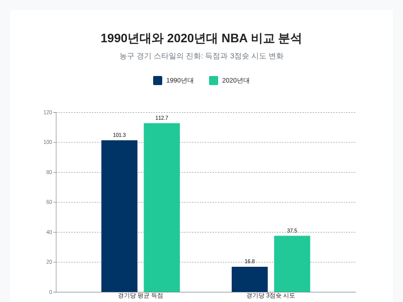
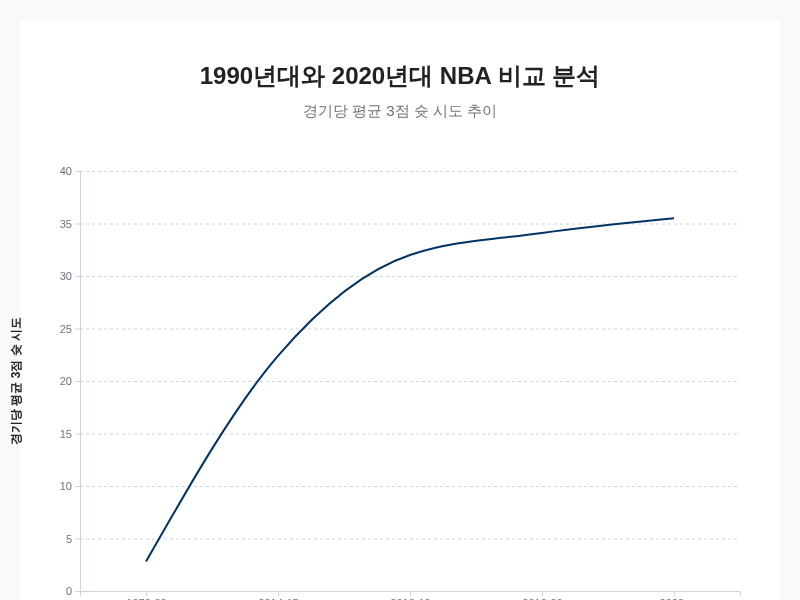
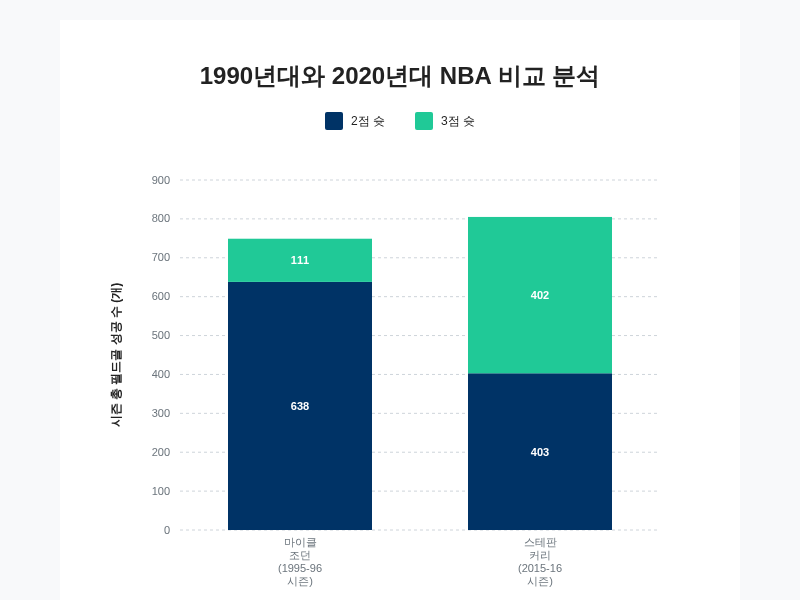
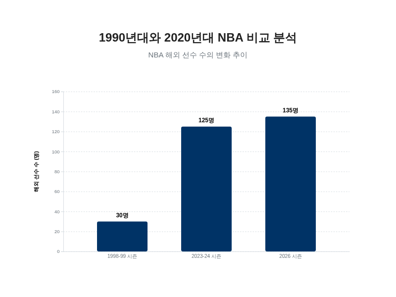
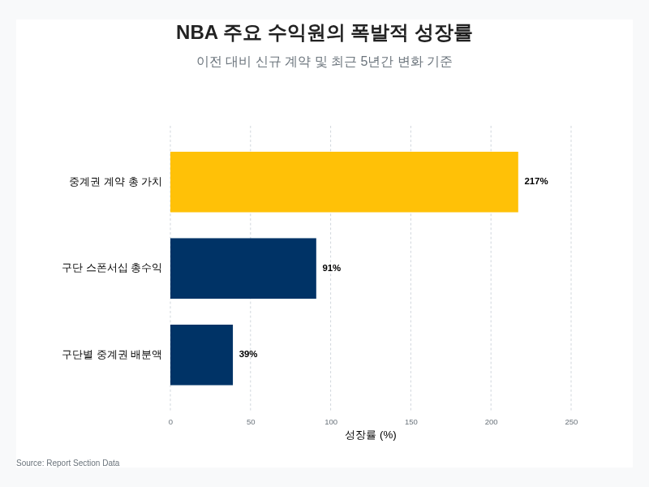
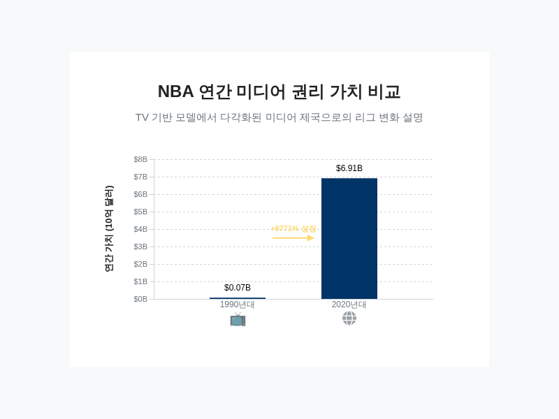

# 1990년대와 2020년대 NBA 비교 분석 보고서

## 서론: 두 시대의 코트를 조명하다

1990년대 미국 프로 농구(NBA) 코트가 묵직한 충돌음과 격렬한 몸싸움으로 가득 찬 전장이었다면, 2020년대의 코트는 쉴 새 없이 움직이는 선수들과 림을 향해 포물선을 그리는 수많은 공이 만들어내는 역동적인 공간으로 변모했습니다. 이 두 시대는 불과 30년의 간극을 두고 있지만, 농구라는 스포츠의 철학, 전술, 그리고 선수들의 역할에 있어 근본적인 차이를 보입니다. 1990년대는 강력한 피지컬을 앞세운 포스트 플레이와 거친 수비가 경기를 지배했으며, 핸드체킹과 같은 규정은 일대일 수비의 중요성을 극대화했습니다 [[40](https://www.bruinsportsanalytics.com/post/nba-era-comparisons)]. 반면, 2020년대의 NBA는 3점 슛의 가치를 극대화하고 코트 전체를 넓게 활용하는 '스페이싱' 개념을 중심으로 재편되었습니다. 이러한 변화는 단순히 경기 스타일의 유행이 바뀐 것을 넘어, 규칙의 개정, 데이터 분석의 도입, 스포츠 과학의 발전 등 복합적인 요인이 작용한 결과입니다 [[3](https://mania.kr/g2/bbs/board.php?bo_table=nbatalk&wr_id=10479804)]. 따라서 두 시대를 직접적으로 비교하는 것은 경기 규칙과 스타일의 급격한 변화로 인해 매우 복잡한 과제이며, 단순한 우열을 가리기보다는 각 시대가 가진 고유한 특성과 그 진화의 과정을 이해하는 것이 중요합니다 [[3](https://mania.kr/g2/bbs/board.php?bo_table=nbatalk&wr_id=10479804)], [[40](https://www.bruinsportsanalytics.com/post/nba-era-comparisons)].

이러한 극적인 변화는 통계 수치에서도 명확하게 드러납니다. 1990년대 리그의 평균 득점은 경기당 약 101.3점이었으나, 2020년대에는 리그 역사상 두 번째로 높은 수치인 112.7점으로 급증했습니다 [[29](https://m.blog.naver.com/PostView.naver?blogId=kukgyo&logNo=223009739952)], [[37](https://www.facebook.com/groups/1755569031222596/posts/8052210071558429/)]. 이러한 득점 증가는 경기 페이스의 상승과 함께 공격 효율성의 극대화를 추구한 결과이며, 그 중심에는 3점 슛의 폭발적인 증가가 있습니다. 1990년대에 경기당 평균 16.8개에 불과했던 3점 슛 시도는 오늘날 37.5개 이상으로 두 배 넘게 증가하며 공격의 핵심 옵션으로 자리 잡았습니다 [[39](https://fhspost.com/10641/sports/was-the-nba-really-harder-in-the-90s/)]. 이러한 변화는 선수들의 역할에도 지대한 영향을 미쳤습니다. 과거 골밑을 지키는 역할에 국한되었던 센터들은 이제 3점 슛 능력을 갖춘 다재다능한 '스트레치 빅맨'으로 진화했으며 [[3](https://mania.kr/g2/bbs/board.php?bo_table=nbatalk&wr_id=10479804)], 포인트가드, 윙, 빅맨으로 명확히 구분되던 포지션의 경계는 점차 허물어지고 모든 선수가 다양한 역할을 수행하는 '포지션리스' 농구가 대세가 되었습니다 [[38](https://m.blog.naver.com/PostView.naver?blogId=upennsolution&logNo=222552367094&categoryNo=23&proxyReferer=&noTrackingCode=true)].

1990년대와 2020년대 NBA의 경기당 평균 득점 및 3점슛 시도 비교.

본 보고서는 1990년대와 2020년대 NBA의 차이점을 다각적으로 분석하여 지난 30년간 리그가 겪은 혁신적인 변화의 본질을 규명하는 것을 목표로 합니다. 이를 위해 먼저 두 시대의 경기 스타일과 전술적 패러다임의 전환을 통계적 데이터를 기반으로 심층 분석할 것입니다. 이어서 각 시대를 대표하는 아이콘인 마이클 조던과 스테판 커리의 플레이 스타일을 비교하며 시대정신이 선수 개개인에게 어떻게 투영되었는지 살펴볼 것입니다. 또한, 리그의 외연을 확장시킨 글로벌 선수들의 유입 증가와 그 영향력을 조명하고, 마지막으로 전통적인 방송 매체에서 소셜 미디어와 스트리밍 서비스로의 전환이 NBA의 비즈니스 모델과 팬덤 문화에 미친 경제적, 문화적 파급 효과를 분석하고자 합니다. 이러한 종합적인 접근을 통해 본 보고서는 NBA가 어떻게 끊임없이 진화하며 세계 최고의 스포츠 리그로서의 위상을 공고히 했는지에 대한 깊이 있는 통찰을 제공할 것입니다.

## 경기 스타일과 전술의 진화: 격돌의 90년대 vs 스페이싱의 2020년대

1990년대 NBA가 묵직한 수비와 격렬한 몸싸움으로 대표되는 저득점 시대였다면, 2020년대는 3점 슛과 코트 전체를 활용하는 스페이싱, 그리고 분석적 효율성을 극대화하는 고효율 공격의 시대로 정의될 수 있습니다 [[6](https://phscharge.com/4401/arts-and-entertainment/why-the-nba-has-moved-past-the-90s-era/)], [[8](https://www.reddit.com/r/NBAConvo/comments/1no113r/thinking_back_on_90s_basketball_vs_the_modern/)]. 두 시대의 가장 근본적인 차이는 경기를 지배하는 철학에서 비롯됩니다. 1990년대 농구는 강력한 피지컬을 바탕으로 한 포스트업 공격과 상대 에이스를 억제하는 일대일 수비에 중점을 두었습니다 [[2](https://www.reddit.com/r/nbadiscussion/comments/11wj97e/what_is_your_response_to_people_who_claim_that/?tl=ko)]. 반면 현대 농구는 ‘3점은 2점보다 가치가 높다’는 단순하지만 강력한 수학적 명제를 기반으로 재구성되었습니다 [[15](https://sportshistorynetwork.com/basketball/evolution-of-basketball-strategy-through-data-analysis/)]. 이러한 패러다임의 전환은 단순한 유행의 변화가 아니라, 규칙 개정, 데이터 분석의 발달, 그리고 선수들의 기술적 진화가 복합적으로 작용한 필연적인 결과물입니다 [[3](https://mania.kr/g2/bbs/board.php?bo_table=nbatalk&wr_id=10479804)].

이러한 변화를 가장 극명하게 보여주는 지표는 단연 3점 슛 시도의 폭발적인 증가입니다. 3점슛 라인이 도입된 1979-80 시즌 경기당 평균 2.8개에 불과했던 3점 슛 시도는 2018-19 시즌에는 32.0개로 1000% 이상 증가했으며 [[9](https://pmc.ncbi.nlm.nih.gov/articles/PMC9915101/)], 2020년대에 들어서는 경기당 평균 35개를 훌쩍 넘어섰습니다 [[1](https://www.reddit.com/r/bostonceltics/comments/1hz65gg/interesting_80s_vs_2020s_contrast_play_style_vs/?tl=ko)]. 특히 2014-15 시즌 경기당 22.4개였던 3점 슛 시도가 불과 5년 만인 2019-20 시즌 34.1개로 50% 이상 급증한 것은 이 변화가 얼마나 빠르고 전면적으로 리그를 장악했는지를 보여줍니다 [[5](https://www.reddit.com/r/nbadiscussion/comments/1b50zdh/why_wasnt_3-point_shooting_more_prevalent_in_the/?tl=ko)]. 이로 인해 공격의 중심축은 골밑에서 외곽으로 이동했으며, 과거 비효율적인 공격 옵션으로 여겨졌던 중거리 슛의 비중은 2010-11 시즌 31%에서 10년 만에 13%로 급감했습니다 [[4](https://www.reddit.com/r/NBATalk/comments/1jl2gzm/the_current_nba_is_better_at_basketball_than_any/?tl=ko)].

시즌별 NBA 경기당 평균 3점 슛 시도 변화.

이러한 ‘3점 슛 혁명’을 촉발한 동력은 크게 두 가지로 분석할 수 있습니다. 첫째는 경기 흐름을 바꾼 규칙의 개정입니다. 2000년대 초반 핸드체킹(hand-checking) 규칙의 엄격한 적용과 수비자 3초 규정의 도입은 공격수에게 신체 접촉을 가하며 수비하는 것을 어렵게 만들었습니다 [[6](https://phscharge.com/4401/arts-and-entertainment/why-the-nba-has-moved-past-the-90s-era/)]. 이로 인해 수비의 물리적 압박이 줄어들고 코트 위에 더 넓은 공간이 창출되었으며, 이는 돌파와 외곽 패스를 통한 3점 슛 기회 증가로 직접 이어졌습니다. 둘째는 데이터 분석, 즉 애널리틱스의 도입입니다. 과거 감독의 직관이나 전통적인 스카우팅에 의존했던 전략 수립은 이제 데이터를 기반으로 효율성을 극대화하는 방향으로 전환되었습니다 [[2](https://www.reddit.com/r/nbadiscussion/comments/11wj97e/what_is_your_response_to_people_who_claim_that/?tl=ko)]. 특히 3점 슛의 가치를 보정하는 eFG%(Effective Field Goal Percentage)와 같은 고급 통계 지표는 3점 슛과 골밑 공격이 중거리 슛보다 훨씬 효율적인 득점 수단임을 수학적으로 증명했습니다 [[9](https://pmc.ncbi.nlm.nih.gov/articles/PMC9915101/)]. eFG%가 높은 팀이 정규 시즌 경기의 약 81%, 플레이오프 경기의 약 90%를 승리한다는 데이터는 각 구단이 3점 슛 중심의 공격 철학을 채택하는 결정적인 근거가 되었습니다 [[9](https://pmc.ncbi.nlm.nih.gov/articles/PMC9915101/)].

전술적 패러다임의 변화는 공격과 수비 양면에서 새로운 전략의 등장을 이끌었습니다. 공격에서는 '페이스 앤 스페이스(pace-and-space)'와 '파이브 아웃(five-out)' 오펜스가 주류로 자리 잡았습니다 [[12](https://namu.wiki/w/%ED%8F%AC%EC%8A%A4%ED%8A%B8%EC%97%85)]. 이 시스템들은 빠른 공수 전환을 통해 상대 수비가 정돈되기 전에 공격하고, 5명의 선수가 모두 3점 라인 밖에 위치하여 코트를 최대한 넓게 사용함으로써 돌파를 위한 공간을 창출하거나 외곽슛 기회를 노립니다. 전통적인 포스트업 플레이는 높은 기술 숙련도를 요구하고 현대 농구의 빠른 템포와 맞지 않아 그 빈도가 현저히 줄어들었습니다 [[12](https://namu.wiki/w/%ED%8F%AC%EC%8A%A4%ED%8A%B8%EC%97%85)]. 대신, 덴버 너기츠가 니콜라 요키치를 중심으로 선보이는 볼 무브먼트 중심의 공격이나 새크라멘토 킹스의 모션 오펜스처럼, 과거의 기본 원칙과 현대적인 스페이싱 개념을 융합하여 NBA 역사상 가장 효율적인 공격력을 만들어내고 있습니다 [[11](https://www.youtube.com/watch?v=1i9F9qcYSBc)]. 이에 맞서 수비 전술 역시 진화했습니다. 상대의 3점 슛을 억제하기 위해 모든 포지션의 선수가 스크린에 맞춰 수비수를 바꾸는 '스위치' 전략, 특정 구역을 유기적으로 방어하는 '지역 방어', 그리고 외곽 라인에 강한 압박을 가하는 수비가 보편화되었습니다 [[12](https://namu.wiki/w/%ED%8F%AC%EC%8A%A4%ED%8A%B8%EC%97%85)].

궁극적으로 이러한 경기 스타일과 전술의 변화는 선수들에게 요구되는 역할과 기술의 기준을 완전히 바꾸어 놓았습니다. 1990년대에는 각 포지션별 역할이 명확히 구분되었지만, 현대 농구에서는 포지션의 경계가 허물어지는 '포지션리스' 현상이 가속화되었습니다. 3점 슛 능력을 갖춘 빅맨인 '스트레치 4번' 또는 '스트레치 5번'의 등장은 이러한 변화의 상징입니다 [[12](https://namu.wiki/w/%ED%8F%AC%EC%8A%A4%ED%8A%B8%EC%97%85)]. 이제 센터 포지션의 선수들도 외곽 수비와 3점 슛 능력을 갖추지 못하면 현대 농구의 빠른 템포에서 살아남기 어려워졌으며, 조엘 엠비드나 니콜라 요키치와 같이 내외곽을 오가는 다재다능함을 갖춘 선수들이 리그를 지배하게 되었습니다 [[3](https://mania.kr/g2/bbs/board.php?bo_table=nbatalk&wr_id=10479804)]. 이는 곧 1990년대의 농구가 피지컬과 힘을 바탕으로 한 전문가들의 시대였다면, 2020년대의 농구는 슈팅을 포함한 다차원적인 기술 세트를 갖춘 다재다능한 선수들의 시대임을 의미합니다 [[2](https://www.reddit.com/r/nbadiscussion/comments/11wj97e/what_is_your_response_to_people_who_claim_that/?tl=ko)].

## 시대의 아이콘: 마이클 조던과 스테판 커리 비교 분석

각 시대의 농구 철학은 코트 위를 지배했던 단 한 명의 아이콘을 통해 가장 선명하게 드러납니다. 1990년대가 마이클 조던의 시대였다면, 2020년대는 스테판 커리가 일으킨 혁명의 시대라고 할 수 있습니다. 두 선수는 단순히 뛰어난 기량을 가진 슈퍼스타를 넘어, 각 시대가 요구하는 이상적인 선수상을 구현하고 리그의 전술적 패러다임을 이끈 상징적 존재입니다. 조던이 물리적 한계를 초월하는 운동 능력과 완벽한 미드레인지 게임으로 90년대의 거친 수비를 정복했다면, 커리는 농구 코트의 기하학 자체를 바꾼 3점 슛 능력으로 현대 농구의 스페이싱과 효율성 개념을 재정립했습니다. 따라서 이 두 선수의 플레이 스타일과 통계를 비교 분석하는 것은 지난 30년간 NBA가 겪은 진화의 과정을 압축적으로 이해하는 가장 효과적인 방법입니다.

마이클 조던은 1990년대 농구가 추구했던 개인 기량의 정점이었습니다. 그는 통산 32,292점을 기록하며 역대 득점 5위에 올랐으며 [[34](https://cafe.daum.net/ilovenba/7n/278432)], 한 플레이오프 시리즈에서는 평균 32.3점이라는 경이로운 득점력을 과시했습니다 [[30](https://www.joongang.co.kr/article/3279020)]. 한 시즌에는 평균 32.5점, 8리바운드, 8어시스트라는 전방위적인 활약을 펼치기도 했습니다 [[3](https://mania.kr/g2/bbs/board.php?bo_table=nbatalk&wr_id=10479804)]. 그러나 조던의 위대함은 단순한 통계 수치를 넘어섭니다. 그는 최소 45인치에 달하는 것으로 알려진 수직 점프력, 유려한 풋워크, 그리고 폭발적인 돌파 능력을 바탕으로 상대 수비를 무력화시키는 '일대일 공격'의 화신이었습니다 [[31](https://blog.naver.com/kukgyo/223460994091)]. 당시 리그를 지배했던 핸드체킹과 강력한 몸싸움 속에서도 조던은 자신만의 공간을 창출하고, 가장 효율적인 공격 옵션으로 여겨졌던 미드레인지 점퍼를 완벽하게 구사했습니다. 특히 승부처에서 보여준 그의 집중력은 전설적이었습니다. 눈을 감고 자유투를 성공시키거나, 1997년 클리퍼스를 상대로 클러치 상황에서 15번의 슛 중 11개를 성공시키며 49점을 기록한 일화는 그의 지배력을 상징적으로 보여줍니다 [[31](https://blog.naver.com/kukgyo/223460994091)]. 시카고 불스에 여섯 번째 우승을 안긴 '더 라스트 샷(The Last Shot)'은 고립된 상황에서 개인의 능력으로 경기를 결정짓는 90년대 '영웅 농구'의 완벽한 마침표였습니다 [[31](https://blog.naver.com/kukgyo/223460994091)]. 칼 말론의 꾸준한 득점력이나 하킴 올라주원의 압도적인 골밑 존재감 역시 90년대를 대표하는 위대한 업적이지만 [[29](https://m.blog.naver.com/PostView.naver?blogId=kukgyo&logNo=223009739952)], [[32](https://sportsrecord.tistory.com/entry/NBA-%EB%88%84%EC%A0%81-%EC%8A%A4%ED%83%AF-%EC%88%9C%EC%9C%84)], 시대의 정신을 가장 완벽하게 체화한 선수는 단연 마이클 조던이었습니다.

반면, 스테판 커리는 2020년대 농구의 패러다임 전환을 이끈 혁명가입니다. 그는 NBA 역사상 최고의 슈터로 평가받으며, 3점 슛을 보조 무기에서 핵심 전략 무기로 격상시켰습니다 [[36](https://ko.wikipedia.org/wiki/%EC%8A%A4%ED%85%8C%ED%94%88_%EC%BB%A4%EB%A6%AC)]. 통산 3,000개의 3점 슛을 최초로 돌파한 선수이며 [[36](https://ko.wikipedia.org/wiki/%EC%8A%A4%ED%85%8C%ED%94%88_%EC%BB%A4%EB%A6%AC)], 826경기 만에 3,117개를 성공시키는 등 전례 없는 기록을 쌓아가고 있습니다 [[32](https://sportsrecord.tistory.com/entry/NBA-%EB%88%84%EC%A0%81-%EC%8A%A4%ED%83%AF-%EC%88%9C%EC%9C%84)]. 특히 2015-16시즌, 그는 리그 1위에 해당하는 66.9%의 TS%(True Shooting Percentage)를 기록하며 단일 시즌 402개의 3점 슛을 성공시키는 기염을 토했습니다 [[33](https://namu.wiki/w/%EC%8A%A4%ED%85%8C%ED%8C%90%20%EC%BB%A4%EB%A6%AC/%EC%84%A0%EC%88%98%20%EA%B2%BD%EB%A0%A5)]. 커리의 진정한 영향력은 그의 슛이 팀 전체의 공격 시스템에 미치는 '중력(gravity)' 효과에서 비롯됩니다. 상대 팀은 하프 라인을 넘어서부터 시작되는 그의 슛 거리를 의식해 극단적인 수비 전략을 구사할 수밖에 없으며, 이는 동료 선수들에게 더 넓은 공간과 쉬운 득점 기회를 제공하는 결과로 이어집니다. 한 경기에서 3점 슛 8개를 100% 성공률로 기록하며 30점 10어시스트를 달성한 사례는 그가 단순한 득점원을 넘어 팀 공격을 조율하는 플레이메이커임을 증명합니다 [[35](https://basketkorea.com/news/newsview.php?ncode=1065543055029759)]. 르브론 제임스가 역대 통산 득점 1위에 오르며 보여준 경이로운 꾸준함과 다재다능함 [[29](https://m.blog.naver.com/PostView.naver?blogId=kukgyo&logNo=223009739952)], [[33](https://namu.wiki/w/%EC%8A%A4%ED%85%8C%ED%8C%90%20%EC%BB%A4%EB%A6%AC/%EC%84%A0%EC%88%98%20%EA%B2%BD%EB%A0%A5)], 루카 돈치치가 선보이는 압도적인 볼 소유 기반의 플레이메이킹 역시 현대 농구의 특징을 보여주지만 [[31](https://blog.naver.com/kukgyo/223460994091)], 리그의 공격 철학 자체를 근본적으로 바꾼 인물은 바로 스테판 커리입니다.

마이클 조던과 스테판 커리의 전성기 시즌 필드골 구성 비교.

이처럼 조던과 커리는 각기 다른 방식으로 코트를 지배했습니다. 조던의 지배력이 개인의 운동 능력과 기술을 극한으로 끌어올려 상대를 압도하는 방식이었다면, 커리의 지배력은 코트의 공간 개념을 재편하고 팀 전체의 공격 효율을 극대화하는 시스템적인 방식입니다. 이들의 차이는 두 시대의 농구가 근본적으로 다른 게임이었음을 시사하며, 이는 단순한 통계 비교를 무의미하게 만듭니다. 경기 템포, 리그 전체의 공격 효율성, 수비 규칙 등 변수가 너무나도 다르기 때문에, 두 선수의 기록을 직접적으로 비교하는 것은 시대적 맥락을 무시한 단편적인 분석에 그칠 위험이 있습니다. 따라서 시대 간 선수 비교를 위해서는 보다 정교한 통계적 보정 방법론이 요구됩니다. 예를 들어, 모든 선수의 출전 시간을 동일하게 가정하여 '75 포제션 당 스탯'으로 환산하거나, 리그 평균 대비 선수의 기록이 얼마나 뛰어난지를 나타내는 '표준 편차'를 계산하는 방식이 활용될 수 있습니다 [[40](https://www.bruinsportsanalytics.com/post/nba-era-comparisons)]. 이러한 방법론은 각 선수가 자신의 시대에서 얼마나 압도적인 존재였는지를 보다 객관적으로 평가하고, 시대의 차이를 넘어선 의미 있는 비교를 가능하게 합니다 [[40](https://www.bruinsportsanalytics.com/post/nba-era-comparisons)]. 결국 마이클 조던은 90년대 농구의 완성형이었고, 스테판 커리는 2020년대 농구의 개척자였으며, 이 두 아이콘의 존재 자체가 NBA의 끊임없는 진화를 증명하는 가장 강력한 증거입니다.

## 글로벌 리그로의 도약: 해외 선수의 유입과 영향력

1990년대 NBA가 주로 미국 선수들을 중심으로 한 국내 리그의 성격이 강했다면, 2020년대의 NBA는 국경을 초월한 재능의 용광로이자 명실상부한 글로벌 리그로 자리매김했습니다. 이러한 변화는 단순히 외국인 선수의 수가 늘어난 양적 팽창을 넘어, 리그의 정체성, 전술적 다양성, 그리고 경제적 지평을 근본적으로 재편하는 질적 전환을 의미합니다. 1980년대에 시작되어 1990년대 데이비드 스턴 총재의 주도하에 가속화된 NBA의 세계화 전략은 지난 30년간 리그를 가장 성공적인 스포츠 콘텐츠로 만든 핵심 동력이었습니다 [[58](https://www.the-generation.net/basketball-diplomacy-the-international-impact-of-the-nba/)].

이 거대한 변화의 기폭제는 1992년 바르셀로나 올림픽에 참가했던 미국 남자 농구 대표팀, 이른바 '드림팀'이었습니다 [[58](https://www.the-generation.net/basketball-diplomacy-the-international-impact-of-the-nba/)]. 마이클 조던, 매직 존슨, 래리 버드 등 당대 최고의 슈퍼스타들로 구성된 드림팀은 압도적인 기량으로 전 세계 농구 팬들에게 NBA가 도달한 경지를 각인시켰습니다. 이는 단순한 스포츠 이벤트를 넘어, NBA라는 브랜드를 전 세계에 알리는 강력한 소프트 파워로 작용했습니다 [[58](https://www.the-generation.net/basketball-diplomacy-the-international-impact-of-the-nba/)]. 당시 10대 소년이었던 독일의 덕 노비츠키는 "90년, 91년에 막 농구를 시작했을 때... 나는 12, 13살이었고 NBA 팬이 되기 시작했다... 그것은 엄청난 순간이었다"고 회상하며 드림팀이 자신과 같은 해외 유망주들에게 얼마나 큰 영감을 주었는지를 증명했습니다 [[58](https://www.the-generation.net/basketball-diplomacy-the-international-impact-of-the-nba/)]. 드림팀이 뿌린 씨앗은 이후 수십 년에 걸쳐 NBA 코트 위에서 풍성한 결실을 맺게 됩니다.

수치적 변화는 이러한 글로벌화의 흐름을 명확하게 보여줍니다. 1998-99 시즌 NBA에는 30명의 해외 선수가 있었지만 [[58](https://www.the-generation.net/basketball-diplomacy-the-international-impact-of-the-nba/)], 2023-24 시즌에는 그 수가 40개 국가 및 자치령 출신의 125명으로 4배 이상 급증했습니다 [[58](https://www.the-generation.net/basketball-diplomacy-the-international-impact-of-the-nba/)], [[63](https://www.forbes.com/sites/esfandiarbaraheni/2024/05/21/nbas-international-efforts-bearing-fruit-as-viewership-skyrockets/)]. 이러한 증가세는 멈추지 않아 2026년에는 43개국 출신 135명으로 더욱 늘어났으며 [[55](https://maroontigermedia.com/2026/02/international-rising-stars-reflect-nbas-global-growth/)], 이는 더 이상 해외 선수가 리그의 보조적인 역할에 머무르지 않고 핵심적인 구성원으로 자리 잡았음을 시사합니다. 2026년 NBA 라이징 스타 게임에 바하마, 프랑스, 러시아, 중국 등 다양한 국적의 선수들이 참여한 것은 이러한 구조적 정체성 변화를 상징적으로 보여주는 장면입니다 [[55](https://maroontigermedia.com/2026/02/international-rising-stars-reflect-nbas-global-growth/)].

NBA 시즌별 해외 선수 수 변화 추이.

해외 선수들의 유입은 리그의 경기 스타일과 전술적 깊이를 한층 더 풍부하게 만들었습니다. 유럽, 아프리카, 아시아 등 각기 다른 농구 시스템에서 성장한 선수들은 NBA에 새로운 기술과 전략적 아이디어를 불어넣었습니다. 덕 노비츠키의 '학다리 페이드어웨이'나 야니스 아데토쿤보의 압도적인 피지컬을 활용한 플레이처럼, 이들의 독창적인 스타일은 리그에 다양성을 더했으며, 이는 전 세계 팬들을 끌어들이는 강력한 매력으로 작용했습니다 [[57](https://sportsepreneur.com/nba-global-takeover/)], [[55](https://maroontigermedia.com/2026/02/international-rising-stars-reflect-nbas-global-growth/)]. 특히 이들 슈퍼스타의 성공은 출신 국가 및 지역에 폭발적인 팬덤을 형성하는 기폭제가 되었습니다 [[55](https://maroontigermedia.com/2026/02/international-rising-stars-reflect-nbas-global-growth/)]. 니콜라 요키치(세르비아), 루카 돈치치(슬로베니아), 조엘 엠비드(카메룬)와 같은 선수들이 연이어 MVP를 수상하며 리그의 최상위 계층을 점령한 것은 이제 NBA의 패권이 더 이상 미국 선수들만의 전유물이 아님을 명백히 증명하는 사건입니다.

이러한 성공은 우연이 아닌, 리그 차원의 치밀한 장기 전략의 결과였습니다. 데이비드 스턴 전 총재는 "미국에는 2억 5천만 명의 잠재적 NBA 팬이 있고, 미국 밖에는 50억 명이 있다... 우리는 그 숫자가 마음에 든다"고 말하며 일찌감치 세계 시장의 잠재력에 주목했습니다 [[58](https://www.the-generation.net/basketball-diplomacy-the-international-impact-of-the-nba/)]. NBA는 중국, 아프리카 등 주요 시장에 전략적 파트너십을 구축하고 [[55](https://maroontigermedia.com/2026/02/international-rising-stars-reflect-nbas-global-growth/)], 200개 이상의 국가에 프리시즌 및 정규 시즌 경기를 개최하며 전 세계 팬들과의 접점을 적극적으로 늘려왔습니다 [[68](https://www.linkedin.com/pulse/nbas-business-model-how-basketball-brings-billions-kayiranga-juoef)]. 이러한 노력 덕분에 NBA는 미국 외 지역에서 연간 약 6억 5천만 달러의 중계권 수익을 올리는, 미국 주요 스포츠 리그 중 가장 성공적인 국제적 자산이 되었습니다 [[60](https://longgame.sportbusiness.com/americas-game-the-nbas-struggle-to-reach-its-global-potential/)]. 물론 여전히 전체 중계권 수익의 90% 이상이 미국과 캐나다 국내 시장에서 발생하고, 유럽 시청자들을 위한 경기 시간 조정이 미미하다는 한계도 존재하지만 [[60](https://longgame.sportbusiness.com/americas-game-the-nbas-struggle-to-reach-its-global-potential/)], 글로벌 시장의 성장 잠재력은 여전히 무궁무진합니다. 2027년경 출범을 목표로 FIBA와 함께 유럽 기반의 신규 리그 창설을 추진하고 [[57](https://sportsepreneur.com/nba-global-takeover/)], 2030년까지 상품 판매액이 75억 달러를 넘어설 것으로 예측되는 등 [[57](https://sportsepreneur.com/nba-global-takeover/)], NBA의 글로벌화는 현재진행형이며 미래 성장의 가장 중요한 동력으로 기능하고 있습니다.

## 미디어 환경의 변화와 NBA의 경제적 성장

1990년대 NBA의 경제적 성공이 주로 케이블 TV와 지상파 방송이라는 전통적인 미디어 플랫폼에 기반했다면, 2020년대의 NBA는 스트리밍 서비스, 소셜 미디어, 직접 소비자(D2C) 앱 등 다변화된 디지털 환경 속에서 기하급수적인 성장을 이루고 있습니다. 이러한 미디어 환경의 근본적인 변화는 단순히 경기를 시청하는 방식을 바꾼 것을 넘어, 리그의 수익 구조, 스폰서십 모델, 그리고 팬과의 소통 방식을 완전히 재정의했습니다. 특히 전 세계적으로 확장된 팬덤을 수익으로 연결하는 과정에서 디지털 플랫폼은 과거와 비교할 수 없는 규모의 경제적 가치를 창출하는 핵심 동력으로 작용하고 있습니다.

이러한 변화의 정점은 2024년 7월에 발표된 NBA의 새로운 중계권 계약에서 명확하게 드러납니다. 2025-26 시즌부터 11년간 총 760억에서 770억 달러에 달하는 이 계약은 이전 계약 가치의 약 세 배에 달하는 혁신적인 규모를 자랑합니다 [[67](https://sportsepreneur.com/nba-media-rights-deal-details/)], [[68](https://www.linkedin.com/pulse/nbas-business-model-how-basketball-brings-billions-kayiranga-juoef)]. 이 계약은 디즈니(ABC/ESPN), NBC유니버설(NBC/피콕), 그리고 아마존(프라임 비디오)과 같은 전통적인 방송사와 거대 스트리밍 기업을 아우르는 파트너십으로 구성되어 있으며, 이는 NBA가 더 이상 단일 플랫폼에 의존하지 않고 다각화된 미디어 포트폴리오를 통해 콘텐츠의 가치를 극대화하고 있음을 보여줍니다 [[67](https://sportsepreneur.com/nba-media-rights-deal-details/)]. 이 계약으로 인해 리그는 연평균 약 69억 달러의 수익을 확보하게 되며 [[62](https://sporthiatus.com/how-much-does-the-nba-make-a-year-revenue-breakdown/)], [[68](https://www.linkedin.com/pulse/nbas-business-model-how-basketball-brings-billions-kayiranga-juoef)], 각 구단은 2025-26 시즌부터 중계권료로 약 1억 4,256만 달러를 분배받게 되는데, 이는 이전의 1억 3백만 달러에서 39%나 증가한 수치입니다 [[57](https://sportsepreneur.com/nba-global-takeover/)]. 이러한 막대한 자금 유입은 각 구단이 투자 목적으로 차입할 수 있는 부채 한도를 2억 7,500만 달러에서 4억 2,500만 달러로 상향 조정하는 효과를 낳았고, 이는 구단 운영과 선수단 구성에 더 큰 재정적 유연성을 부여합니다 [[57](https://sportsepreneur.com/nba-global-takeover/)], [[61](https://entertainmentstrategyguy.com/2024/08/07/why-the-nba-media-rights-deal-is-a-big-win-if-we-ignore-the-pending-local-media-disaster/)].

NBA의 새로운 중계권 계약 가치, 스폰서십 수익, 구단별 배분액의 성장률 비교.

흥미로운 점은 이러한 천문학적인 중계권 계약이 전통적인 TV 시청률의 하락세 속에서 체결되었다는 사실입니다. 1989년 이래로 지상파 방송의 NBA 시청률은 73% 감소했으며, 1995년 이후 케이블을 포함한 전체 시청률 역시 48% 하락했습니다 [[61](https://entertainmentstrategyguy.com/2024/08/07/why-the-nba-media-rights-deal-is-a-big-win-if-we-ignore-the-pending-local-media-disaster/)]. ABC의 NBA 경기 시청률은 2011-12 시즌부터 2019-20 시즌 사이에 45%나 감소하는 등 [[56](https://econreview.studentorg.berkeley.edu/the-nbas-paradox-fewer-viewers-bigger-paydays/)], TV 앞에 앉아 경기를 시청하는 전통적인 팬층은 꾸준히 줄어들고 있습니다. 그러나 2020년대의 미디어 가치는 더 이상 단일 시청률 지표로만 평가되지 않습니다. 리그의 가치는 전 세계 21억 명에 달하는 소셜 미디어 팔로워와 [[57](https://sportsepreneur.com/nba-global-takeover/)], 2023-24 시즌에만 320억 회의 동영상 조회수를 기록한 디지털 영향력에 기반합니다 [[57](https://sportsepreneur.com/nba-global-takeover/)]. NBA는 인스타그램, 틱톡 등 다양한 플랫폼을 통해 시각적으로 풍부한 콘텐츠를 실시간으로 제공하며 젊은 세대와 소통하고 있으며 [[66](https://hbem.org/index.php/OJS/article/download/608/560/1152)], 증강현실(AR)과 가상현실(VR) 같은 신기술을 활용해 지리적 장벽을 넘어선 몰입형 팬 경험을 제공하고 있습니다 [[66](https://hbem.org/index.php/OJS/article/download/608/560/1152)]. 아마존 프라임 비디오나 피콕 같은 스트리밍 파트너의 참여는 이러한 디지털 네이티브 팬층을 공략하기 위한 전략적 선택이며, 전통적인 방송의 시청률 감소를 상쇄하고도 남을 새로운 가치를 창출하고 있습니다.

미디어 권리 외에도 스폰서십 시장의 폭발적인 성장은 NBA의 경제적 체력이 얼마나 견고해졌는지를 증명합니다. 2024-25 시즌 NBA 구단들의 스폰서십 총수익은 16억 2천만 달러에 달했는데, 이는 불과 5년 전과 비교해 91%나 증가한 수치입니다 [[64](https://insidersport.com/2025/06/06/nba-team-sponsorship-revenue-up-91-in-five-years/)], [[65](https://www.marketingbrew.com/stories/2025/06/11/nba-team-sponsorship-revenue-report)], [[67](https://sportsepreneur.com/nba-media-rights-deal-details/)], [[68](https://www.linkedin.com/pulse/nbas-business-model-how-basketball-brings-billions-kayiranga-juoef)]. 이러한 성장은 기록적인 수의 신인 선수 계약, 새로운 저지 패치 스폰서, 그리고 약 450개에 달하는 신규 스폰서 유입에 힘입은 결과입니다 [[65](https://www.marketingbrew.com/stories/2025/06/11/nba-team-sponsorship-revenue-report)], [[68](https://www.linkedin.com/pulse/nbas-business-model-how-basketball-brings-billions-kayiranga-juoef)]. 특히 유니폼에 기업 로고를 부착하는 저지 패치 계약은 전년 대비 두 배로 증가하여 약 2억 5천만 달러의 수익을 창출했으며 [[68](https://www.linkedin.com/pulse/nbas-business-model-how-basketball-brings-billions-kayiranga-juoef)], 나이키와의 12년간 연간 10억 달러 규모의 용품 계약은 리그의 상업적 매력을 상징적으로 보여줍니다 [[68](https://www.linkedin.com/pulse/nbas-business-model-how-basketball-brings-billions-kayiranga-juoef)]. 골든스테이트 워리어스와 같은 구단은 스폰서십 가치만으로 2억 달러를 넘어설 것으로 예상되며 [[65](https://www.marketingbrew.com/stories/2025/06/11/nba-team-sponsorship-revenue-report)], 신인 선수인 자레드 맥케인이 한 시즌에 30개의 개인 광고 계약을 체결한 사례는 선수 개개인의 브랜드 가치가 리그의 경제적 자산으로 직결되는 현대 미디어 환경의 특징을 잘 보여줍니다 [[65](https://www.marketingbrew.com/stories/2025/06/11/nba-team-sponsorship-revenue-report)], [[67](https://sportsepreneur.com/nba-media-rights-deal-details/)].

결론적으로, 1990년대의 NBA가 TV라는 단일 엔진으로 움직였다면, 2020년대의 NBA는 글로벌 스트리밍, 소셜 미디어, 디지털 콘텐츠, 그리고 전략적 스폰서십이라는 여러 개의 강력한 엔진을 장착한 거대한 경제 플랫폼으로 진화했습니다. 리그의 총수익은 2023-24 시즌에 약 113억 달러를 기록했으며, 2026년에는 143억 달러에 이를 것으로 전망됩니다 [[62](https://sporthiatus.com/how-much-does-the-nba-make-a-year-revenue-breakdown/)]. 이는 미디어 환경의 변화에 수동적으로 대응하는 것을 넘어, 변화를 주도하고 새로운 수익 모델을 창출하며 스포츠 비즈니스의 미래를 개척해 온 결과입니다. 전 세계 팬들이 언제 어디서든 원하는 방식으로 NBA 콘텐츠를 소비할 수 있게 된 오늘날, 리그의 경제적 성장은 그 한계를 가늠하기 어려울 정도로 무한한 가능성을 향해 나아가고 있습니다.

## 결론: 끊임없이 진화하는 NBA

지난 30년의 세월 동안 NBA는 단순한 스포츠 리그를 넘어, 경기 스타일, 선수 구성, 그리고 비즈니스 모델에 이르기까지 모든 측면에서 근본적인 질적 변화를 겪었습니다. 본 보고서에서 심층적으로 분석한 바와 같이, 1990년대의 NBA와 2020년대의 NBA는 같은 농구공을 사용하지만 사실상 다른 스포츠라고 보아도 무방할 정도로 극적인 진화를 이루었습니다. 1990년대가 거친 몸싸움과 포스트 플레이를 중심으로 한 물리적 힘의 격전장이었다면, 2020년대의 코트는 3점 슛과 스페이싱, 그리고 데이터 분석에 기반한 전술적 효율성을 극대화하는 지능의 경연장으로 변모했습니다 [[2](https://www.reddit.com/r/nbadiscussion/comments/11wj97e/what_is_your_response_to_people_who_claim_that/?tl=ko)], [[8](https://www.reddit.com/r/NBAConvo/comments/1no113r/thinking_back_on_90s_basketball_vs_the_modern/)]. 이러한 변화는 단순히 트렌드의 변화가 아니라, 규칙의 개정, 스포츠 과학의 발전, 그리고 리그를 둘러싼 거시적 환경의 변혁이 복합적으로 작용한 필연적인 결과입니다.

이러한 진화의 중심에는 선수의 역할과 능력에 대한 패러다임 전환이 자리 잡고 있습니다. 1990년대에는 마이클 조던과 같이 압도적인 개인 기량으로 미드레인지와 골밑을 지배하는 선수가 시대의 아이콘이었다면, 2020년대에는 스테판 커리와 같이 코트 전역을 공격 범위로 삼는 혁신적인 슈터가 게임의 양상을 바꾸었습니다 [[6](https://phscharge.com/4401/arts-and-entertainment/why-the-nba-has-moved-past-the-90s-era/)]. 3점 슛 시도 횟수가 10배 이상 폭증하고 [[1](https://www.reddit.com/r/bostonceltics/comments/1hz65gg/interesting_80s_vs_2020s_contrast_play_style_vs/?tl=ko)], 핸드체킹 금지와 같은 규칙 변화가 수비의 물리적 압박을 줄이면서 [[6](https://phscharge.com/4401/arts-and-entertainment/why-the-nba-has-moved-past-the-90s-era/)], 리그는 자연스럽게 외곽 공격과 빠른 템포를 선호하는 방향으로 나아갔습니다. 이와 더불어, 리그의 인적 구성 역시 극적으로 변화했습니다. 1990년대의 코트가 대부분 미국 선수들의 무대였다면, 2020년대에는 니콜라 요키치, 루카 돈치치, 야니스 아데토쿤보와 같은 해외 선수들이 리그의 최정상에 서서 MVP 트로피를 다투고 있습니다 [[57](https://sportsepreneur.com/nba-global-takeover/)], [[55](https://maroontigermedia.com/2026/02/international-rising-stars-reflect-nbas-global-growth/)]. 이는 1992년 '드림팀'이 뿌린 글로벌화의 씨앗이 30년 만에 풍성한 결실을 맺은 것으로, NBA가 국경을 초월한 재능의 집결지이자 진정한 의미의 글로벌 리그로 거듭났음을 증명합니다 [[58](https://www.the-generation.net/basketball-diplomacy-the-international-impact-of-the-nba/)].

경기장 밖에서 일어난 변화는 코트 위의 변화만큼이나, 혹은 그 이상으로 혁명적이었습니다. 1990년대 NBA의 경제적 성장이 주로 전통적인 TV 중계권에 의존했다면, 2020년대의 NBA는 스트리밍 서비스, 소셜 미디어, 글로벌 스폰서십을 아우르는 다각화된 미디어 제국을 건설했습니다. 11년간 760억 달러에 달하는 새로운 중계권 계약은 전통적인 TV 시청률 하락세에도 불구하고 리그의 콘텐츠 가치가 얼마나 폭발적으로 증가했는지를 명백히 보여줍니다 [[67](https://sportsepreneur.com/nba-media-rights-deal-details/)], [[68](https://www.linkedin.com/pulse/nbas-business-model-how-basketball-brings-billions-kayiranga-juoef)]. 이는 리그의 가치가 더 이상 실시간 시청자 수라는 단일 지표에 얽매이지 않고, 전 세계 21억 명에 달하는 소셜 미디어 팔로워와 연간 320억 회의 동영상 조회수와 같은 디지털 영향력을 기반으로 재평가되고 있음을 의미합니다 [[57](https://sportsepreneur.com/nba-global-takeover/)]. 미디어 환경의 변화는 NBA가 전 세계 팬들과 직접 소통하고 새로운 수익원을 창출하는 방식을 근본적으로 바꾸었으며, 이는 리그의 경제적 규모를 전례 없는 수준으로 끌어올리는 핵심 동력이 되었습니다.

1990년대와 2020년대 NBA의 연간 평균 중계권료 규모 비교.

결론적으로 1990년대와 2020년대의 NBA를 비교하는 것은 두 개의 다른 시대를 비교하는 것을 넘어, 하나의 스포츠 리그가 기술 발전, 글로벌화, 미디어 환경 변화라는 거대한 시대적 흐름에 어떻게 적응하고 스스로를 혁신해 왔는지를 보여주는 생생한 사례 연구입니다. 90년대의 격렬함과 낭만은 2020년대의 정교함과 글로벌 스케일로 대체되었으며, 이 과정에서 NBA는 단순한 스포츠 콘텐츠 제공자를 넘어 전 세계적인 문화 현상이자 거대한 경제 플랫폼으로 진화했습니다. 앞으로도 NBA는 끊임없이 새로운 기술과 전략, 그리고 비즈니스 모델을 받아들이며 계속해서 진화할 것이며, 이러한 역동성 이야말로 지난 30년간 변하지 않은 NBA의 가장 중요한 본질이라 할 수 있습니다.

## 출처

[1] [흥미로운 80년대 vs 2020년대 비교 -- 플레이 스타일 vs 결과](https://www.reddit.com/r/bostonceltics/comments/1hz65gg/interesting_80s_vs_2020s_contrast_play_style_vs/?tl=ko)  
[2] [NBA 농구가 "옛날" (특히 90년대)에 더 좋았다고 주장하는 ...](https://www.reddit.com/r/nbadiscussion/comments/11wj97e/what_is_your_response_to_people_who_claim_that/?tl=ko)  
[3] [90년대 NBA수준 vs 2020년대 NBA수준 - 매니아 커뮤니티 NBA-Talk 게시판](https://mania.kr/g2/bbs/board.php?bo_table=nbatalk&wr_id=10479804)  
[4] [지금 NBA가 다른 시대보다 농구를 더 잘해. 옛날 ...](https://www.reddit.com/r/NBATalk/comments/1jl2gzm/the_current_nba_is_better_at_basketball_than_any/?tl=ko)  
[5] [왜 90년대랑 2000년대에는 3점 슛이 그렇게 흔하지 않았을까?](https://www.reddit.com/r/nbadiscussion/comments/1b50zdh/why_wasnt_3-point_shooting_more_prevalent_in_the/?tl=ko)  
[6] [Why the NBA Has Moved Past the 90’s Era – The Charge](https://phscharge.com/4401/arts-and-entertainment/why-the-nba-has-moved-past-the-90s-era/)  
[7] [Physicality in Old vs New NBA Eras - Facebook](https://www.facebook.com/groups/205905269249138/posts/493628050476857/)  
[8] [Thinking back on '90s basketball vs the modern game, it's ... - Reddit](https://www.reddit.com/r/NBAConvo/comments/1no113r/thinking_back_on_90s_basketball_vs_the_modern/)  
[9] [Long-Term Trends in Shooting Performance in the NBA: An Analysis of Two- and Three-Point Shooting across 40 Consecutive Seasons - PMC](https://pmc.ncbi.nlm.nih.gov/articles/PMC9915101/)  
[10] [The 90's WERE MUCH BETTER Than The 2020's - YouTube](https://www.youtube.com/watch?v=6uvPG073tFo)  
[11] [안정적인 2점슛을 놔두고 3점슛을 왜 이렇게 많이 던지게 됐을까 ...](https://www.youtube.com/watch?v=1i9F9qcYSBc)  
[12] [포스트업 - 나무위키](https://namu.wiki/w/%ED%8F%AC%EC%8A%A4%ED%8A%B8%EC%97%85)  
[13] [3점슛의 새역사을 쓴 커리, 그 시작은? | 이승용 NBA - YouTube](https://www.youtube.com/watch?v=oKEV9o_J2Ew)  
[14] [Was there a singular moment or event that spurred the NBA into the ...](https://www.reddit.com/r/nbadiscussion/comments/11dzegi/was_there_a_singular_moment_or_event_that_spurred/)  
[15] [The Evolution of Basketball Strategy: How Data Analysis is Changing the Game](https://sportshistorynetwork.com/basketball/evolution-of-basketball-strategy-through-data-analysis/)  
[16] [Instagram](https://www.instagram.com/p/DTgtILuif2W/)  
[17] [NBA's 3-point revolution: How 1 shot is changing the game | NBA.com](https://www.nba.com/news/3-point-era-nba-75)  
[18] [Instagram](https://www.instagram.com/reel/DT6tb8QjFxL/)  
[19] [NBA STATS | Effective Field Goal Percentage eFG% Explained](https://www.nbastuffer.com/analytics101/effective-field-goal-percentage-efg/)  
[20] [Effective field goal percentage - Wikipedia](https://en.wikipedia.org/wiki/Effective_field_goal_percentage)  
[21] [What is NBA effective field goal %? - YouTube](https://www.youtube.com/watch?v=wVVSkLtOayA)  
[22] [What is Effective Field Goal Percentage? (eFG% Explained)](https://www.basketballforcoaches.com/effective-field-goal-percentage/)  
[23] [Advanced Stats: eFG% | Milwaukee Bucks - NBA](https://www.nba.com/bucks/features/boeder-120917)  
[24] [How modern offenses blend old-school tactics with new-age skills | theScore.com](https://www.thescore.com/nba/news/2883055/how-modern-offenses-blend-old-school-tactics-with-new-age-skills)  
[25] [Basketball Tactical Trends: Complete Expert Guide – Hoop Mentality](https://hoopmentality.com/blogs/basketball/basketball-tactical-trends-guide?srsltid=AfmBOoojIZ32AbswqBJvTI8zMCawDh7va-rrCpflDR0-LI-CdCr3DYSA)  
[26] [How the OKC Thunder are Transforming the Pick and Roll – HoopsKing](https://hoopsking.com/blogs/hoopsking-com/how-the-okc-thunder-are-transforming-the-pick-and-roll?srsltid=AfmBOopA_XwvD_Abm2yw1-ln5HFXg6IqZ4qwXIVpRzMN4JIWWKDrBcDT)  
[27] [\[Thinking Basketball\] Breaking Down the Miami Heat's New Offense](https://www.reddit.com/r/nba/comments/1p6gkef/thinking_basketball_breaking_down_the_miami_heats/)  
[28] [What was the argument behind moving away from traditional 5 ...](https://www.reddit.com/r/nbadiscussion/comments/1lkndo8/what_was_the_argument_behind_moving_away_from/)  
[29] [NBA 통산 득점 1위가 바뀌다(NBA 역대 득점 순위 Top 10) : 네이버 블로그](https://m.blog.naver.com/PostView.naver?blogId=kukgyo&logNo=223009739952)  
[30] [마이클 조던 득점왕-NBA플레이오프 기록 | 중앙일보](https://www.joongang.co.kr/article/3279020)  
[31] [영천소년의 자기 혁명 : 네이버 블로그](https://blog.naver.com/kukgyo/223460994091)  
[32] [NBA 누적 스탯 순위 :: 스포츠 기록실 by 캣츠비](https://sportsrecord.tistory.com/entry/NBA-%EB%88%84%EC%A0%81-%EC%8A%A4%ED%83%AF-%EC%88%9C%EC%9C%84)  
[33] [스테판 커리/선수 경력 - 나무위키](https://namu.wiki/w/%EC%8A%A4%ED%85%8C%ED%8C%90%20%EC%BB%A4%EB%A6%AC/%EC%84%A0%EC%88%98%20%EA%B2%BD%EB%A0%A5)  
[34] [시대가 다른 선수들의 스탯 비교, 스탯 비교의 맹점 - I Love NBA](https://cafe.daum.net/ilovenba/7n/278432)  
[35] [3점슛 성공률 100%(8/8)를 기록한 커리, ′영혼의 파트너 - 바스켓코리아](https://basketkorea.com/news/newsview.php?ncode=1065543055029759)  
[36] [스테픈 커리 - 위키백과, 우리 모두의 백과사전](https://ko.wikipedia.org/wiki/%EC%8A%A4%ED%85%8C%ED%94%88_%EC%BB%A4%EB%A6%AC)  
[37] [NBA Players' Skills Comparison Between 1990s and 2020s](https://www.facebook.com/groups/1755569031222596/posts/8052210071558429/)  
[38] [\[데이터 분석\] 스테판 커리 출전! NBA에서의 3점슛이 팀 성공에 어떤 영향을 미칠까? : 네이버 블로그](https://m.blog.naver.com/PostView.naver?blogId=upennsolution&logNo=222552367094&categoryNo=23&proxyReferer=&noTrackingCode=true)  
[39] [Was the NBA really harder in the '90s? – The Franklin Post](https://fhspost.com/10641/sports/was-the-nba-really-harder-in-the-90s/)  
[40] [How Can We Accurately Compare NBA Players Across Different Eras?](https://www.bruinsportsanalytics.com/post/nba-era-comparisons)  
[41] [Big Data Management in Sports Science: Transforming the Game - Kumaraguru College of Liberal Arts & Science (KCLAS)](https://www.kclas.ac.in/boldechoes/big-data-management-in-sports-science-transforming-the-game/)  
[42] [A Data Science and Sports Analytics Approach to Decode Clutch Dynamics in the Last Minutes of NBA Games - MDPI](https://www.mdpi.com/2504-4990/6/3/102)  
[43] [The Evolution of Three-Point Shooting in the NBA | History](https://vocal.media/history/the-evolution-of-three-point-shooting-in-the-nba)  
[44] [How Analytics Is Changing Sports | American University, Washington, D.C.](https://www.american.edu/online/online-program/online-master-of-science-in-sports-analytics-and-management/how-analytics-is-changing-sports.cfm)  
[45] [Basketball analytics investment is key to NBA wins and other successes | MIT News](https://news.mit.edu/2025/basketball-analytics-investment-nba-wins-and-other-successes-0325)  
[46] [Evolution of NBA Statistics: From Basic Metrics to Advanced Analytics - Ask.com](https://www.ask.com/lifestyle/evolution-nba-statistics-basic-metrics-advanced-analytics)  
[47] [NBA Play-by-Play Data - NBATStuffer](https://www.nbastuffer.com/analytics101/playbyplay-data/)  
[48] [How NBA Players Adapt to the Digital Era Through Data and Lifestyle Changes - NBAstuffer](https://www.nbastuffer.com/how-nba-players-adapt-digital/)  
[49] [NBA Analytics: Definitive Guide to Moneyball in Basketball](https://www.nbastuffer.com/analytics101/nba-analytics-movement/)  
[50] [Moneyball to Moreyball: How Analytics Have Shaped the NBA Today (PDF)](https://fisherpub.sjf.edu/cgi/viewcontent.cgi?article=1106&context=sport_undergrad)  
[51] [Machine Learning in the NBA: Player Tracking and Injury Prevention - Machine Learning Advocate](https://www.mladvocate.com/machine-learning-in-the-nba/)  
[52] [Load Management-NBA Style- Expanding To Other Sports | KINEXON SPORTS](https://kinexon-sports.com/blog/nba-load-management)  
[53] [NBA Shot Selection: How Have Players Changed Their Shooting in the Last Twenty-Five Years? – Dartmouth Sports Analytics](https://sites.dartmouth.edu/sportsanalytics/2022/01/25/nba-shot-selection-how-have-players-changed-their-shooting-in-the-last-twenty-five-years/)  
[54] [Comparing NBA Eras: 1990s vs 2020s - Facebook](https://www.facebook.com/groups/1073883926129889/posts/2899229070262023/)  
[55] [International rising stars reflect NBA’s global growth - The Maroon Tiger](https://maroontigermedia.com/2026/02/international-rising-stars-reflect-nbas-global-growth/)  
[56] [The NBA’s Paradox: Fewer Viewers, Bigger Paydays – Berkeley Economic Review](https://econreview.studentorg.berkeley.edu/the-nbas-paradox-fewer-viewers-bigger-paydays/)  
[57] [NBA Global Takeover (2026 Update): NBA Europe Plans, Strategy, Why U.S. Ratings Aren’t the Whole Story](https://sportsepreneur.com/nba-global-takeover/)  
[58] [Basketball Diplomacy: The International Impact of the NBA | The Generation](https://www.the-generation.net/basketball-diplomacy-the-international-impact-of-the-nba/)  
[59] [There's been a growing divide among the generations of NBA stars ...](https://www.facebook.com/awfulannouncing/posts/theres-been-a-growing-divide-among-the-generations-of-nba-stars-with-different-e/1345771847585609/)  
[60] [America’s game: The NBA’s struggle to reach its global potential » The Long Game](https://longgame.sportbusiness.com/americas-game-the-nbas-struggle-to-reach-its-global-potential/)  
[61] [Why the NBA Media Rights Deal is a Big Win...If We Ignore the Pending Local Media Disaster - Entertainment Strategy Guy](https://entertainmentstrategyguy.com/2024/08/07/why-the-nba-media-rights-deal-is-a-big-win-if-we-ignore-the-pending-local-media-disaster/)  
[62] [How Much Does the NBA Make a Year? Revenue Breakdown - Sporthiatus](https://sporthiatus.com/how-much-does-the-nba-make-a-year-revenue-breakdown/)  
[63] [NBA's International Efforts Bearing Fruit As Viewership Skyrockets](https://www.forbes.com/sites/esfandiarbaraheni/2024/05/21/nbas-international-efforts-bearing-fruit-as-viewership-skyrockets/)  
[64] [NBA team sponsorship revenue up 91% in five years - Insider Sport](https://insidersport.com/2025/06/06/nba-team-sponsorship-revenue-up-91-in-five-years/)  
[65] [NBA team sponsorship revenue nearly doubled in past five years: report](https://www.marketingbrew.com/stories/2025/06/11/nba-team-sponsorship-revenue-report)  
[66] [How the NBA Leverages Digital Marketing for Global Brand Expansion](https://hbem.org/index.php/OJS/article/download/608/560/1152)  
[67] [NBA Media Rights Deal (2024): Original $77B Announcement & What It Meant](https://sportsepreneur.com/nba-media-rights-deal-details/)  
[68] [The NBA’s Business Model: How Basketball Brings in Billions](https://www.linkedin.com/pulse/nbas-business-model-how-basketball-brings-billions-kayiranga-juoef)  