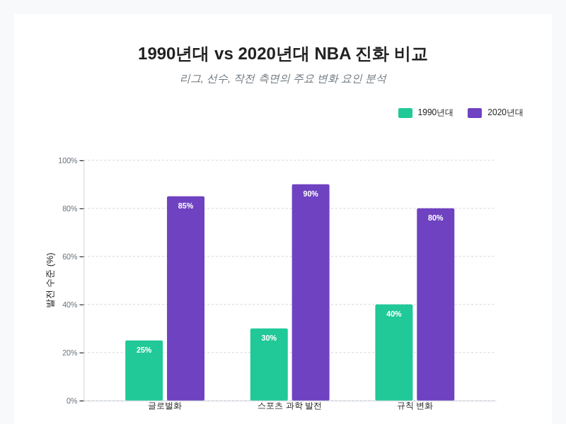
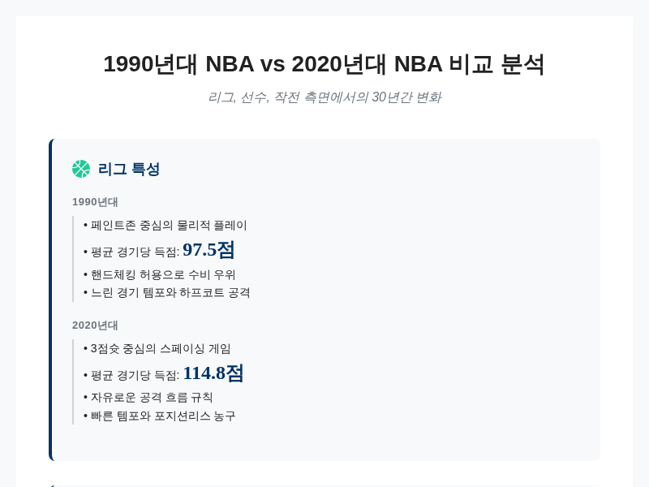
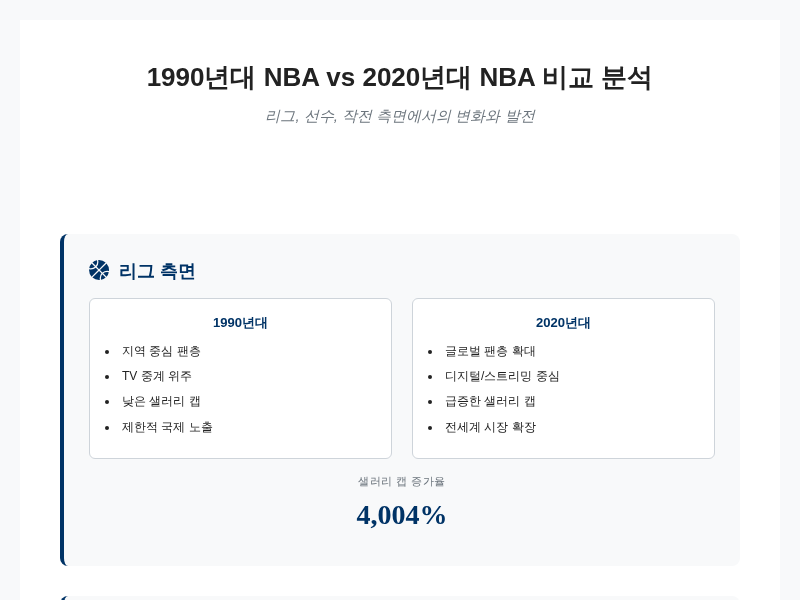
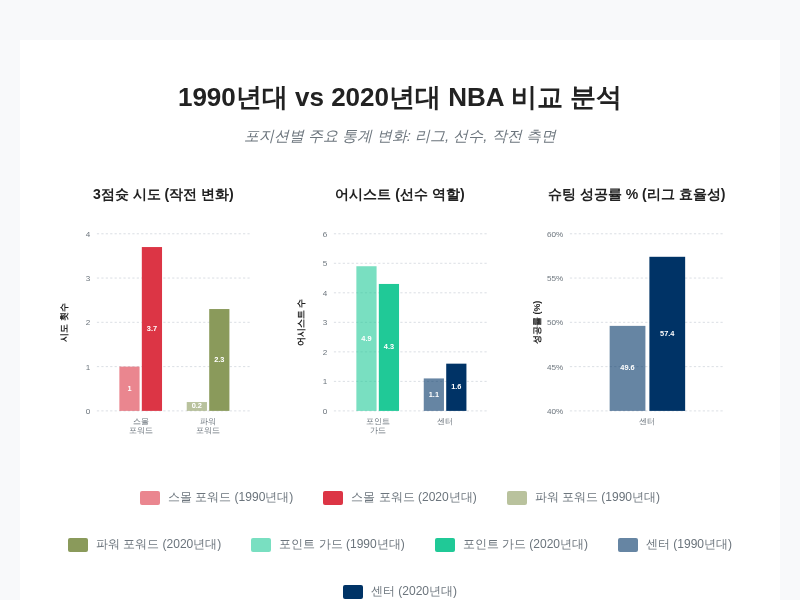
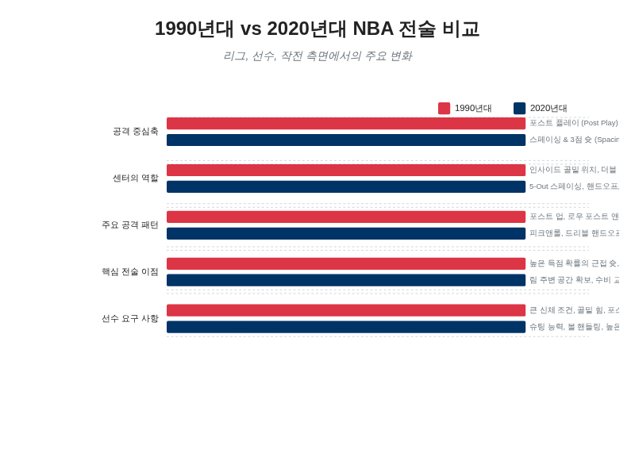
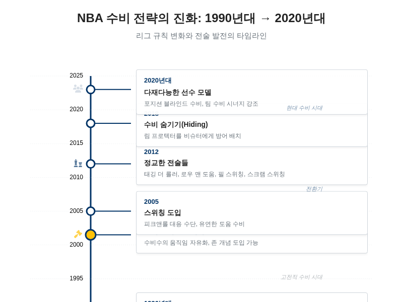
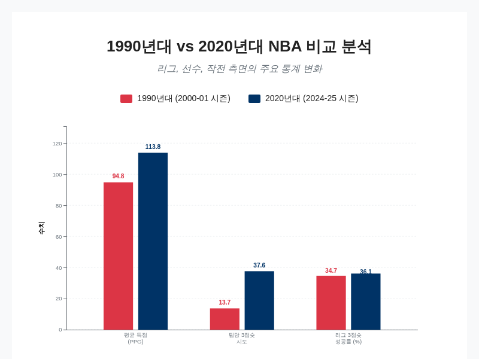
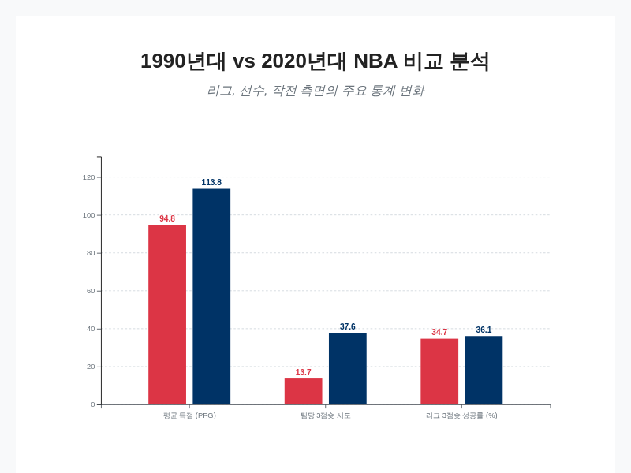

# 1990년대와 2020년대 NBA 비교 분석: 리그, 선수, 작전의 진화

## 서론: 시대적 배경과 비교 분석의 필요성

농구 역사에서 1990년대와 2020년대는 각각 독특한 특징과 지배적인 스타일을 정의한 중요한 시기로 자리 잡고 있습니다. 이 두 시기를 비교 분석하는 작업은 단순히 과거와 현재의 기록을 나열하는 것을 넘어, 농구가 어떻게 진화했는지에 대한 심층적인 통찰을 제공합니다. 30년이라는 시간적 간격은 리그의 구조와 게임의 양상을 근본적으로 변화시켰으며, 이러한 변화의 배경에는 사회·문화적 요인과 기술적 발전이 복합적으로 작용했습니다. 특히 이 시기 동안 NBA는 미국 내 스포츠 리그를 넘어 세계적인 문화 현상으로 성장했으며, 이는 게임의 방식과 선수들의 구성에도 지대한 영향을 미쳤습니다.

1990년대 NBA와 2020년대 NBA를 비교할 때, 전체적인 시스템과 선수 관리 방법은 30년이라는 시간 차이로 인해 현재가 훨씬 발전했다는 의견이 지배적입니다. 많은 분석가들이나 이야기꾼들은 글로벌화, 스포츠 과학의 발전, 더 넓은 인재 모집, 그리고 증가된 재정적 투자가 현대 선수들의 전반적인 성과와 팀 전술을 향상시켰다고 주장합니다 [[31](https://mania.kr/g2/bbs/board.php?bo_table=nbatalk&wr_id=10479804)]. 글로벌화의 과정은 1990년대 드림팀의 창설과 같은 이벤트를 통해 시작되어 2020년대에는 리그 내 국제적 선수들의 비중이 압도적으로 높아진 결과를 낳았습니다. 이는 농구의 인기가 전 세계적으로 확산되었음을 의미하며, 다양한 문화적 배경을 가진 선수들이 리그에 유입됨으로써 게임의 스타일에 새로운 변화를 가져왔습니다.

스포츠 과학의 발전은 선수들의 신체 관리와 경기력 향상에 혁명적인 변화를 가져왔습니다. 1990년대에는 상대적으로 원시적이던 훈련 방법과 재활 프로토콜이 2020년대에는 데이터 과학과 생체 역학을 기반으로 한 정교한 시스템으로 대체되었습니다. 선수들은 시즌 중 부상 관리부터 식단, 수면 패턴에 이르기까지 철저하게 관리받으며, 이는 선수들의 경력 수명 연장과 경기 중 퍼포먼스의 극대화로 이어졌습니다. 또한 영상 분석 기술의 발달은 코치진들이 상대 팀의 전술을 세밀하게 분석하고 이에 대응하는 전략을 수립하는 것을 가능하게 했습니다.

이러한 외부 환경의 변화와 더불어 리그 내부의 규칙 수정과 해석의 변화도 게임의 진화에 중요한 역할을 했습니다. 3점 슛 라인의 도입과 그 중요성의 변화, 핸드체킹 규정의 폐지, 일리걸 디펜스 규정의 변경 등은 공격과 수비의 패러다임을 완전히 뒤바꾸는 결정적 계기가 되었습니다. 과거에는 몸싸움과 인사이드 득점이 중심이었던 경기가, 점차 공간의 활용과 외곽 슛을 강조하는 방향으로 이동했습니다. 이러한 규칙의 변화는 선수들의 신체적 조건뿐만 아니라 기술적 세트 자체를 변화시켰으며, 팀들이 선수를 영입하고 전술을 구성하는 방식에도 근본적인 영향을 미쳤습니다.

1990년대와 2020년대 NBA의 글로벌화, 스포츠 과학, 규칙 변화 수준 비교.

그러나 규칙과 플레이 스타일의 변화로 인해 시대를 직접 비교하는 것은 매우 복잡한 문제입니다. 현대의 데이터와 과학이 뒷받침된 시스템이 현재의 선수들에게 유리한 환경을 제공하는 것은 사실이지만, 과거의 선수들이 당시의 규칙과 환경 속에서 보여준 경기력과 업적을 과소평가해서는 안 된다는 의견도 존재합니다 [[31](https://mania.kr/g2/bbs/board.php?bo_table=nbatalk&wr_id=10479804)]. 1990년대의 거친 신체 접촉과 물리적 대결 속에서 살아남은 선수들의 투지와 기량은 현대 농구에서도 여전히 존중받아야 할 가치가 있습니다. MVP 레벨의 선수 능력은 어떤 시대든 뛰어나다는 관점은, 위대한 선수들이 각 시대의 환경에 적응하여 지배적인 모습을 보였다는 점을 강조합니다 [[31](https://mania.kr/g2/bbs/board.php?bo_table=nbatalk&wr_id=10479804)].

따라서 1990년대와 2020년대 NBA의 비교 분석은 어느 한 시대가 우월하다는 것을 증명하는 것이 아니라, 농구라는 스포츠가 시대적 요구와 기술적 발전에 맞춰 어떻게 적응하고 진화해 왔는지를 이해하는 과정이 되어야 합니다. 이 보고서는 리그, 선수, 작전이라는 세 가지 주요 측면에서 두 시대를 비교 분석함으로써 현대 농구의 흐름을 파악하고, 농구의 본질적인 가치가 어떻게 계승되고 변형되었는지를 탐구하고자 합니다.

## 리그 차원의 변화: 물리적 플레이 vs 데이터 기반 스페이싱 농구

NBA의 플레이 스타일은 지난 30년 동안 근본적인 변화를 겪었으며, 이 변화의 핵심은 1990년대의 강력한 신체적 접촉을 바탕으로 한 물리적 농구에서 2020년대의 데이터 분석과 공간 활용을 중시하는 효율성 중심의 농구로의 전환에 있습니다. 1990년대 NBA는 흔히 농구 역사상 가장 거친 시대 중 하나로 기억됩니다. 이 시기의 농구는 육체적인 충돌과 강력한 수비, 그리고 상대적으로 낮은 점수를 특징으로 했습니다 [[17](https://www.facebook.com/clarkbp/posts/the-1990s-nba-is-often-remembered-for-its-physical-style-of-play-with-bruising-d/10164117047691800/)]. 당시 경기는 '거대한 선수들(BIG men)'의 시대로, 샤킬 오닐, 칼 말론, 찰스 바클리, 데이비드 로빈슨, 패트릭 유잉, 팀 던컨, 하킴 올라주윈과 같은 내부 선수들이 리그를 지배했습니다 [[16](https://thecenterhub.substack.com/p/the-evolution-of-nba-player-archetypes-from-the-1950s-to-today)]. 마이클 조던은 이러한 농구 역사상 가장 거친 시기를 지배하며 '농구의 신'으로 불렸으며, 이 시대는 마이클 조던의 위대함과 경기의 전반적인 터프함을 상징하는 것으로 평가받고 있습니다 [[16](https://thecenterhub.substack.com/p/the-evolution-of-nba-player-archetypes-from-the-1950s-to-today)][[17](https://www.facebook.com/clarkbp/posts/the-1990s-nba-is-often-remembered-for-its-physical-style-of-play-with-bruising-d/10164117047691800/)][[18](https://www.facebook.com/DisneyPlusPH/posts/90s-nba-an-era-of-icons-classic-hoops-iconic-style-and-pure-magic-what-was-your-/936593609125805/)]. 1990년대의 수비는 상대를 제압하는 강한 파울과 몸싸움으로 특징지어졌으며, 로드 매니지먼트라는 개념이 없어 매 경기마다 치열한 경쟁이 이어졌습니다 [[19](https://thepixelspulse.com/posts/why-modern-basketball-reigns-supreme)]. 당시 3점슛은 존재했지만 리그 평균 성공률이 34.7%에 불과해 오늘날의 36.1%에 비해 낮았으며, 주요 득점원으로는 활용되지 못했습니다 [[26](https://www.facebook.com/100095125900689/posts/in-the-1990s-michael-jordan-the-god-of-basketball-dominated-the-nba-court-all-by/601247836389408/)].

그러나 2000년대 중반 이후부터 시작된 3점슛 혁명과 데이터 분석의 도입은 이러한 물리적 농구의 패러다임을 완전히 뒤바꾸어 놓았습니다. 3점슛은 1979년 NBA 시즌에 처음 도입되었으나 초기에는 도입 속도가 더뎠으나, 1980년대 중반 래리 버드와 레지 밀러 같은 슈터들의 활약으로 점차 중요한 득점 옵션으로 자리 잡기 시작했습니다 [[2](https://www.basketballnetwork.net/old-school/how-removing-the-hand-check-rule-changed-the-nba-forever)][[39](https://grokipedia.com/page/three_point_revolution)]. 2000년대 골든스테이트 워리어스와 스테판 커리, 클레이 톰프슨의 '스플래시 브라더스'는 3점 슈팅으로 NBA 역사를 바꾸며 이를 황금기로 이끌었습니다 [[2](https://www.basketballnetwork.net/old-school/how-removing-the-hand-check-rule-changed-the-nba-forever)]. 현대 농구에서 3점슛은 단순한 슛이 아니라 성공률은 낮더라도 높은 득점 기대치를 제공하는 가장 효율적인 공격 옵션으로 평가됩니다. 과거 인사이드 플레이와 미드레인지 점퍼가 지배적이었던 경기 양상에서, 현재 NBA를 포함한 프로, 대학, 아마추어 리그에서는 3점슛 시도가 급증했습니다 [[1](https://siri.or.kr/2024/10/3%EC%A0%90%EC%8A%9B%EC%9D%98-%EC%8B%9C%EB%8C%80-%EB%86%8D%EA%B5%AC%EC%9D%98-%EC%A7%84%ED%99%94-%EB%B0%A9%ED%96%A5%EC%9D%80/)].

이러한 변화를 주도한 것은 휴스턴 로켓츠의 전 단장 달리 모리(Daryl Morey)가 주장한 데이터 기반 분석 전략인 '모리볼(Moreyball)'입니다. 달리 모리는 데이터 분석을 통해 미드레인지 2점 점퍼보다 3점슛의 기대 효율이 훨씬 높다는 것을 입증했습니다 [[4](https://data-fool.tistory.com/2)]. 휴스턴 로켓츠는 이 전략을 바탕으로 코트를 넓게 활용하는 스페이싱(Spacing)과 레이업이나 3점슛을 선호하며 미드레인지 점퍼를 거의 포기하는 공격 방식을 취했습니다. 2018-19 시즌 휴스턴은 리그 내 다른 29개 팀보다 더 많은 3점슛을 시도하며 이 새로운 패러다임을 보여주었습니다 [[4](https://data-fool.tistory.com/2)]. 이러한 데이터 기반의 접근은 3점슛 시도의 급격한 증가로 이어졌습니다. 1993년에는 경기당 3점슛 시도가 고작 9개(전체 슛의 10%)에 불과했으나, 2023년에는 이 수치가 34개(39%)로 30년 사이에 놀라운 패러다임 변화가 있었습니다 [[8](https://m.cafe.daum.net/ilovenba/7n/296761?listURI=%2Filovenba%2F7n)]. 전체 슛 시도 중 3점슛이 차지하는 비중은 2010-11년 20%에서 2018-19년 30%로 지속적으로 높아졌으며 [[5](https://www.facebook.com/groups/1755569031222596/posts/9330431383736285/)], 1979-80 시즌 도입 당시 리그 평균 3점 시도가 경기당 2.8회였던 것이 2023-24 시즌에는 35.1회로 무려 12배 이상 증가했습니다 [[39](https://grokipedia.com/page/three_point_revolution)].

이러한 스타일의 변화는 경기의 득점력 폭증으로 직결되었습니다. 3점슛과 스페이싱의 발전은 득점 증가의 주요 원인으로 꼽히며 [[1](https://siri.or.kr/2024/10/3%EC%A0%90%EC%8A%9B%EC%9D%98-%EC%8B%9C%EB%8C%80-%EB%86%8D%EA%B5%AC%EC%9D%98-%EC%A7%84%ED%99%94-%EB%B0%A9%ED%96%A5%EC%9D%80/)], 경기당 평균 득점은 2000-01 시즌 94.8점에서 2024-25 시즌 113.8점으로 크게 상승했습니다 [[3](https://www.reddit.com/r/dataisbeautiful/comments/1mzz234/oc_evolution_of_nba_shot_locations_20002025/?tl=ko)]. 2020년대에 들어서면서 리그의 공격 레이팅(Offensive Rating)은 114.5까지 폭발적으로 증가했으며, 이는 1998-99 시즌의 103.9와 비교할 때 엄청난 도약입니다 [[20](https://sports.yahoo.com/article/beyond-lebron-curry-nikola-jokic-130532521.html)]. 2020년대 팀들은 경기당 평균 37.6회의 3점슛을 시도하여 13.5개를 성공시키고 있으며, 이는 단 13.2회를 시도했던 1998-99 시즌과 극명한 대조를 이룹니다 [[20](https://sports.yahoo.com/article/beyond-lebron-curry-nikola-jokic-130532521.html)]. 보스턴 셀틱스와 같은 현대 팀은 경기당 평균 51.1개의 3점슛을 시도하며 NBA 역사상 최다 기록을 경신하기도 했습니다 [[4](https://data-fool.tistory.com/2)]. 오늘날 스페이싱은 공격 그 자체가 되었으며, 3점 라인은 단순한 보너스 지역에서 수비진이 두려워해야 하는 무기로 진화했습니다 [[35](https://www.thescore.com/nba/news/2883055/how-modern-offenses-blend-old-school-tactics-with-new-age-skills)][[43](https://www.instagram.com/reel/DVbzTYqDzmU/)].

이러한 공격 스타일의 변화에는 규제의 변화, 특히 핸드 체킹 규정의 폐지가 결정적인 역할을 했습니다. 1990년대에는 수비수가 공격수의 몸에 손이나 팔뚝을 대고 진행을 방해하는 핸드 체킹이 널리 허용되었으며, 1994년에 규제가 일부 도입되었음에도 불구하고 90년대 내내 물리적인 수비가 가능한 환경이었습니다 [[1](https://siri.or.kr/2024/10/3%EC%A0%90%EC%8A%9B%EC%9D%98-%EC%8B%9C%EB%8C%80-%EB%86%8D%EA%B5%AC%EC%9D%98-%EC%A7%84%ED%99%94-%EB%B0%A9%ED%96%A5%EC%9D%80/)][[5](https://www.facebook.com/groups/1755569031222596/posts/9330431383736285/)]. 2004년 핸드 체킹 규정이 폐지되면서 경기의 성격은 물리적이고 수비 위주에서 공격적이고 외곽 위주로 극적으로 변화했습니다 [[2](https://www.basketballnetwork.net/old-school/how-removing-the-hand-check-rule-changed-the-nba-forever)]. 이 규정 변화는 최근 NBA 역사에서 가장 영향력이 컸던 변화 중 하나로 꼽히며, 핸드 체킹이 금지되자 NBA 경기당 평균 득점은 즉시 93점에서 97점으로 4점 상승했습니다 [[2](https://www.basketballnetwork.net/old-school/how-removing-the-hand-check-rule-changed-the-nba-forever)]. 이로 인해 스티브 내시, 코비 브라이언트, 르브론 제임스 같은 가드들이 골밑으로 진입하기 훨씬 쉬워졌으며, 이들이 MVP 레벨로 성장하는 중요한 계기가 되었습니다 [[2](https://www.basketballnetwork.net/old-school/how-removing-the-hand-check-rule-changed-the-nba-forever)]. 이 규정 변화는 3점슛 생산량 증가를 유도했으며, 전통적인 수비보다 공격 기술이 더 우선시되는 공격 우위의 리그로 변화하게 만들었습니다 [[2](https://www.basketballnetwork.net/old-school/how-removing-the-hand-check-rule-changed-the-nba-forever)]. 또한 2001-02 시즌에 폐지된 '일리걸 디펜스(Illegal Defense)' 규정도 현대 농구의 공간 확장에 기여했습니다. 2001년 이전에는 완전한 맨투맨 수비가 강요되고 존(Zone) 수비가 금지되어 수비수가 약한 쪽(weak side) 도움 수비를 할 수 없었으나 [[31](https://mania.kr/g2/bbs/board.php?bo_table=nbatalk&wr_id=10479804)][[32](https://www.reddit.com/r/nbadiscussion/comments/11wj97e/what_is_your_response_to_people_who_claim_that/?tl=ko)][[33](https://www.reddit.com/r/NBATalk/comments/1mf9pml/myth_it_was_easier_to_score_before_illegal/)], 규칙이 변경되면서 수비수가 공간을 지키고 훨씬 더 자유롭게 움직일 수 있게 되었습니다. 이는 공격이 공 이동(Spacing), 스페이싱, 볼 무브먼트에 적응하도록 강요하며, 결과적으로 더 넓은 코트 사용과 3점슛 중심의 전술으로 발전하는 기반이 되었습니다 [[42](https://www.facebook.com/groups/1073883926129889/posts/2995053344012928/)].

결과적으로 3점슛의 부상과 규제의 변화는 공격 속도를 빠르게 하고 코트 너비를 넓게 활용하게 만들었습니다. 이는 전통적인 인사이드 포스트 플레이보다 속도와 외곽 슈팅을 강조하는 '스몰볼(Small ball)' 전략의 확산으로 이어졌습니다 [[1](https://siri.or.kr/2024/10/3%EC%A0%90%EC%8A%9B%EC%9D%98-%EC%8B%9C%EB%8C%80-%EB%86%8D%EA%B5%AC%EC%9D%98-%EC%A7%84%ED%99%94-%EB%B0%A9%ED%96%A5%EC%9D%80/)][[4](https://data-fool.tistory.com/2)]. 센터와 파워포워드 등 코트 내의 모든 포지션 선수들이 3점 슈팅 능력을 개발하도록 훈련 방식이 변화했으며 [[1](https://siri.or.kr/2024/10/3%EC%A0%90%EC%8A%9B%EC%9D%98-%EC%8B%9C%EB%8C%80-%EB%86%8D%EA%B5%AC%EC%9D%98-%EC%A7%84%ED%99%94-%EB%B0%A9%ED%96%A5%EC%9D%80/)][[4](https://data-fool.tistory.com/2)], 농구의 전략은 내부 지배력에서 장거리 슛 효율성을 우선시하는 방향으로 완전히 재편되었습니다 [[39](https://grokipedia.com/page/three_point_revolution)][[41](https://www.reddit.com/r/NBATalk/comments/1jl2gzm/the_current_nba_is_better_at_basketball_than_any/?tl=ko)]. 니콜라 요키치는 "농구가 30년 전보다 지금 더 낫지 않다면 그건 바보 같은 짓이다. 마치 전화기가 예전이 더 낫다고 말하는 것과 같다"라고 말하며, 기술, 전략, 효율성의 발전으로 인해 현대 농구가 과거보다 훨씬 우월하다는 견해를 피력했습니다 [[20](https://sports.yahoo.com/article/beyond-lebron-curry-nikola-jokic-130532521.html)]. 2020년대 NBA는 2000년대 피닉스 선즈와 2010년대 골든스테이트 워리어스의 혁신을 거쳐 [[39](https://grokipedia.com/page/three_point_revolution)][[41](https://www.reddit.com/r/NBATalk/comments/1jl2gzm/the_current_nba_is_better_at_basketball_than_any/?tl=ko)], 이제는 데이터 과학자들로 채워진 프런트 오피스에 의해 경기 계획이 수립되는 과학적인 리그가 되었습니다 [[20](https://sports.yahoo.com/article/beyond-lebron-curry-nikola-jokic-130532521.html)].

지난 30년 동안 경기당 3점슛 시도 횟수와 전체 슛 중 3점슛이 차지하는 비율의 급격한 증가 추이.

## 리그 환경의 구조적 진화: 선수 생산성 지표와 시장 환경

단순한 스탯에 집중하던 선수 평가 방식은 시간이 지남에 따라 효율성을 중시하는 고급 통계(Advanced Stats)의 발전으로 인해 근본적인 변화를 맞이했습니다. 1990년대에는 득점, 리바운드, 어시스트와 같은 박스 스코어 기반의 전통적 스탯이 선수의 가치를 평가하는 주된 지표였으나, 이러한 수치들은 팀의 템포나 전술 스타일에 따라 왜곡될 가능성이 있다는 한계를 지니고 있었습니다. 예를 들어, 빠른 템포로 경기를 치르는 팀의 선수는 느린 팀의 선수보다 상대적으로 많은 스탯을 기록하기 쉽지만, 이것이 반드시 더 뛰어난 생산성을 의미하는 것은 아니었습니다. 이러한 한계를 극복하기 위해 선수의 기여도를 더 정밀하게 측정하고자 하는 시도들이 이루어졌으며, 이는 데이터 분석 기술의 발전과 맞물려 농구의 전략과 팀 운영에 지대한 영향을 미치게 되었습니다 [[7](https://www.sisaweek.com/news/articleView.html?idxno=96848)].

고급 통계의 발전 중 가장 주목할 만한 것은 존 홀링거(John Hollinger)가 개발한 PER(Player Efficiency Rating)입니다. PER은 선수가 코트에 머무는 시간 동안 보여준 긍정적 행동과 부정적 행동을 통합하여 분당 생산 기여도를 산출하는 지표로, 리그 평균을 항상 15로 고정함으로써 시대와 팀을 초월한 선수 간의 비교를 가능하게 만들었습니다. 이 지표는 단순히 '누가 더 많은 득점을 올렸는가'를 넘어 '다른 선수들보다 얼마나 더 효율적으로 경기에 기여했는가'라는 질문에 답을 제시하며, 선수 평가의 패러다임을 변화시켰습니다 [[7](https://www.sisaweek.com/news/articleView.html?idxno=96848)][[9](https://namu.wiki/w/PER%28APBR%EB%A9%94%ED%8A%B8%EB%A6%AD%EC%8A%A4)][[10](https://www.reddit.com/r/nbadiscussion/comments/cmrr8x/basketball_stat_player_efficiency_rating_per/?tl=ko)]. 일반적으로 MVP 수준에 도달한 슈퍼스타 선수들은 PER 30 이상을 기록하며, 올스타급 선수들은 20에서 25 사이의 값을 가지고, 준수한 롤플레이어는 13에서 18 사이의 값을 기록하는 것으로 분류됩니다 [[10](https://www.reddit.com/r/nbadiscussion/comments/cmrr8x/basketball_stat_player_efficiency_rating_per/?tl=ko)]. 이러한 정량적인 지표는 프런트 오피스가 선수를 영입하거나 트레이드를 결정할 때 중요한 근거로 활용되며, 감독이 특정 상황에서 어떤 선수를 기용해야 할지를 판단하는 데에도 도움을 주었습니다.

더 나아가 RAPM(Regularized Adjusted Plus-Minus)과 같은 지표는 팀 동료와 상대 팀 선수들의 영향력을 통계적으로 보정하여, 특정 선수가 코트에 있을 때 팀의 득점 차에 기여하는 정도를 측정합니다. 이는 과거 주관적인 판단에 의존하던 수비 기여도와 같은 부분을 객관적인 수치로 변환하는 데 큰 역할을 했습니다. 예를 들어, 2016-17 시즌에 MVP를 수상한 러셀 웨스트브룩의 화려한 스탯에 비해, 그의 수비가 팀에 미치는 실질적 기여도는 평균보다 0.3점에 불과하다는 등의 분석이 가능해지면서, 소위 '헤일로 효과' 즉, 유명한 선수의 약점을 덮어주는 경향을 줄이는 데 기여했습니다 [[7](https://www.sisaweek.com/news/articleView.html?idxno=96848)]. 최근에는 이러한 추세가 더욱 심화되어 DPM(Defensive Plus-Minus), EPM(Estimated Plus-Minus)과 같이 박스 스코어와 온코트(On/Off) 데이터를 통합한 올인원(All-in-One) 스탯들이 개발되고 있으며, 데이터 과학은 팀 전략의 핵심 축으로 자리 잡았습니다 [[6](https://mania.kr/g2/bbs/board.php=nbatalk&wr_id=7977054)].

선수를 평가하는 지표가 발전함과 동시에 리그의 오프시즌 시장 환경과 경제 구조 또한 비약적으로 확장되고 복잡해졌습니다. NBA의 샐러리 캡 제도는 리그의 전력 균형을 맞추기 위한 핵심 장치로 기능해 왔으나, 리그의 전반적인 경제적 성장으로 인해 그 규모가 급격히 커졌습니다. 1984-85 시즌 도입 당시 360만 달러에 불과했던 샐러리 캡은 2025-26 시즌에는 약 1억 4,773만 5천 달러(추정치), 실질적인 구단 운영 기준인 사치세 기준선은 약 1억 5,460만 달러로 책정될 정도로 폭발적인 성장을 이루었습니다 [[13](https://www.freezine.co.kr/news/articleView.html?idxno=12295)][[14](https://namu.wiki/w/%EC%83%90%EB%9F%AC%EB%A6%AC%20%EC%BA%A1/NBA)]. 이러한 샐러리 캡의 급격한 상승은 리그의 수익 증대를 반영하는 것이며, 구단들이 더 많은 자본을 투자하여 선수를 영입할 수 있는 여건을 제공했습니다. 샐러리 캡을 초과하는 팀에는 사치세(Luxury tax)가 부과되지만, 우승을 위해서는 과감한 투자가 필요하다는 인식이 퍼지면서 많은 팀이 사치세를 감수하고 로스터를 강화하는 경향을 보이게 되었습니다.

현대 NBA에서 슈퍼스타 선수들의 연봉은 단순한 인건비 비용을 넘어 복잡한 경제적 투자의 대상으로 해석됩니다. 최고 수준의 선수들은 연봉이 5천만 달러를 넘어서지만, 구단 입장에서 이들은 티켓 판매, 지역 경제 활성화, 중계권료, 광고 수익, 상품 판매, 글로벌 스폰서십 확대 등을 통해 팀에 막대한 부를 창출해 주는 자산입니다. 스테판 커리의 경우, 그의 영향력으로 인해 언더아머의 신발 매출이 1억 달러 이상 성장하는 등 선수 개인의 브랜드 파워가 팀과 리그의 경제에 미치는 영향은 실질적이고 거대합니다 [[13](https://www.freezine.co.kr/news/articleView.html?idxno=12295)]. 따라서 현대의 오프시즌은 단순히 선수의 기량만을 보는 것이 아니라, 선수가 가져올 경제적 효과까지 고려한 고도의 비즈니스 전략이 요구되는 공간이 되었습니다.

자유 계약(FA) 시장과 관련된 규정 또한 매우 복잡해졌으며, 구단들은 이러한 규칙을 최대한 활용하여 팀 전력을 효율적으로 관리하려 전략적인 운용을 합니다. 루키 계약, 제한적 및 비제한적 FA, 맥스 계약, 10일 계약, 투웨이 계약 등 다양한 계약 형태가 존재하며, 이를 적절히 활용하는 것이 프런트 오피스의 핵심 역량이 되었습니다 [[12](https://everysports.tistory.com/129)][[13](https://www.freezine.co.kr/news/articleView.html?idxno=12295)]. 특히 '버드 권리(Bird Rights)'는 샐러리 캡을 초과하더라도 기존 팀이 핵심 선수를 재계약할 수 있게 해주는 예외 조항으로, 보스턴 셀틱스가 래리 버드를 잔류시킨 역사적 사례에서 유래했습니다 [[12](https://everysports.tistory.com/129)][[14](https://namu.wiki/w/%EC%83%90%EB%9F%AC%EB%A6%AC%20%EC%BA%A1/NBA)]. 이 규정은 팀이 주요 선수를 잃지 않고 유지할 수 있는 중요한 수단으로 작용하며, '사인 앤 트레이드(Sign-and-Trade)'는 FA 선수가 새 팀으로 이적하고 싶지만 샐러리 캡 여유가 없을 때 양 팀 모두에게 이득이 되도록 고안된 방식입니다 [[12](https://everysports.tistory.com/129)]. 또한 선수의 NBA 경력 연수에 따라 연봉이 샐러리 캡의 25%, 30%, 35%로 제한되는 '최대 계약(Max Contract)' 규정은 팀의 장기적인 로스터 구축 계획에 큰 영향을 미칩니다 [[12](https://everysports.tistory.com/129)].

이러한 복잡한 규정 속에서 구단들은 샐러리 캡 상황과 사치세 라인을 면밀히 분석하여 전략적인 결정을 내립니다. 예를 들어, 샐러리 캡 여유가 적은 팀은 '미드 레벨 예외(Mid-Level Exception)'와 같은 예외 조항을 활용해 잠재력 있는 선수를 영입하거나, 10일 계약이나 투웨이 계약을 통해 G 리그와 연계된 선수 단층을 메우는 등 정교한 로스터 관리를 수행합니다 [[13](https://www.freezine.co.kr/news/articleView.html?idxno=12295)]. 2024년 FA 시장만 하더라도 필라델피아 76ers가 폴 조지를 영입하고, 댈러스가 클레이 톰슨을 데려오는 등 대규모 트레이드와 계약이 연쇄적으로 이어지며 리그의 판도를 흔드는 장면이 연출되었습니다 [[11](https://contents.premium.naver.com/nba/shemagicnba/contents/250813104819607ci)][[15](https://www.rookie.co.kr/news/articleView.html?idxno=100489)]. 이처럼 고급 통계의 발전과 복잡해진 오프시즌 시장 환경은 서로 맞물려 움직이며 팀 운영의 합리화를 도모하고 있으며, 이는 결과적으로 팀이 경기장에서 보여주는 플레이 스타일과 선수들의 역할 정의에도 깊숙이 관여하고 있습니다.

NBA 샐러리 캡의 역사적 변화 추이 (단위: 백만 달러).

## 선수 측면의 역량 변화: 인사이드 지배력에서 포지션리스 농구로

선수들의 역량과 포지션에 대한 정의는 지난 30년 동안 가장 극적인 변화를 겪은 영역 중 하나로, 1990년대의 명확하게 구분된 포지션별 역할에서 2020년대의 융통성 있고 다재다능한 '포지션리스(Positionless)' 농구로 완전히 진화했습니다. 1990년대 NBA는 마이클 조던, 찰스 바클리 같은 볼 돔 지위형 스타들이 리그를 지배하던 시기였으나, 당시 선수들의 역할은 포지션에 따라 상당히 경직되어 있었습니다. 이 시대의 공격은 인사이드 지배력에 집중되어 있었는데, 이는 3점슛이 경기를 변화시키기 전에는 코트 내부가 가장 가치 있는 영역으로 인식되었고 근접 슛이 장거리 슛보다 성공 확률이 높다는 단순한 수학적 사실에 기인했습니다 [[34](https://www.blazersedge.com/2023/8/24/23844379/nba-centers-joel-embiid-nikola-jokic-portland-trail-blazers-offense-defense)][[30](https://www.quora.com/What-was-the-reason-for-the-NBAs-decision-to-eliminate-hand-checking)]. 따라서 당시 센터나 포워드라는 포지션은 단순히 키가 크고 몸이 좋다는 이유만으로 가치를 인정받았으며, 샤킬 오닐처럼 골밑에서의 물리적 장악력과 강력한 득점력을 보유한 선수들이 전술의 중심에 있었습니다 [[34](https://www.blazersedge.com/2023/8/24/23844379/nba-centers-joel-embiid-nikola-jokic-portland-trail-blazers-offense-defense)]. 1990년대 전술의 핵심은 이 거대한 선수들이 포스트업을 시도하고 이에 따라 상대방이 더블 팀으로 몰려들 때 발생하는 외각의 open look을 만들어내는 방식이었습니다 [[42](https://www.facebook.com/groups/1073883926129889/posts/2995053344012928/)].

하지만 3점슛과 스페이싱의 중요성이 대두되면서 전통적인 빅맨을 포함한 모든 포지션의 선수들은 필연적으로 역할의 재정의를 필요로 하게 되었습니다. 1993년부터 2023년까지의 지난 30년 동안 NBA 농구를 분석한 결과, 리그는 점차 포지션의 경계가 허물어지고 선수들의 역할과 스킬이 중첩되는 포지션리스 농구로 변화해 왔습니다 [[25](https://www.facebook.com/groups/142546445827386/posts/8518478471567433/)]. 가장 두드러진 변화 중 하나는 파워포워드와 센터의 진화입니다. 과거 미드레인지 점퍼나 포스트 플레이에 의존하던 파워포워드들은 이제 '스크린 포(Stretch 4)'라 불리는 새로운 유형으로进化하여 3점슛을 시도하는 빈도가 급증했고, 리바운드나 페인트 존 내부의 존재감 감소와 같은 통계적 변화를 보이게 되었습니다 [[25](https://www.facebook.com/groups/142546445827386/posts/8518478471567433/)][[27](https://www.reddit.com/r/nbadiscussion/comments/1g1go4o/positional_evolution_in_the_nba_from_the/)]. 순수한 힘과 신체적 조건만으로 페인트를 지배하던 전통적인 센터의 역할은 3점슛과 스프레드 오펜스(Spread offenses)의 보편화로 인해 감소할 수밖에 없었지만, 이并不意味着 빅맨의 퇴조를 의미하는 것은 아니었습니다 [[34](https://www.blazersedge.com/2023/8/24/23844379/nba-centers-joel-embiid-nikola-jokic-portland-trail-blazers-offense-defense)]. 키와 체격은 여전히 중요한 자산이지만, 이제는 코트 전체의 공격 아크(whole offensive arc)에서 활용될 수 있는 능력이 요구되게 된 것입니다 [[34](https://www.blazersedge.com/2023/8/24/23844379/nba-centers-joel-embiid-nikola-jokic-portland-trail-blazers-offense-defense)].

현대 농구의 센터들은 니콜라 요키치, 조엘 엠비드, 칼 앤서니 타운스와 같이 슛 능력을 갖추어 코트를 넓히고 페인트를 비우는 역할을 수행합니다 [[21](https://theanalyst.com/articles/the-modernization-of-nba-offenses-and-why-small-ball-is-here-to-stay)][[34](https://www.blazersedge.com/2023/8/24/23844379/nba-centers-joel-embiid-nikola-jokic-portland-trail-blazers-offense-defense)]. 이들은 단순히 골밑에 위치하여 기다리는 것이 아니라, "내려와서 스크린이나 핸드오프를 세팅하거나, 롤을 해서 상대 수비를 무너뜨린 뒤, 공을 다시 밖으로 빼내거나 패스하는 세련된 기술"을 보유해야 합니다 [[34](https://www.blazersedge.com/2023/8/24/23844379/nba-centers-joel-embiid-nikola-jokic-portland-trail-blazers-offense-defense)]. 통계적으로도 현대 센터들은 득점, 효율성, 플레이메이킹 면에서 과거의 센터들보다 훨씬 뛰어난 성과를 보여주고 있습니다. 센터들의 경기당 평균 득점은 8.4점에서 9.9점으로 상승했고, 슈팅 성공률은 49.6%에서 57.4%로 크게 향상되었습니다. 더욱 놀라운 변화는 어시스트 부분인데, 센터의 경기당 어시스트가 1.1개에서 1.6개로 증가했다는 점은 더 이상 센터가 득점의 종착점이 아니라 공격의 시작점이 될 수 있음을 시사합니다 [[25](https://www.facebook.com/groups/142546445827386/posts/8518478471567433/)][[27](https://www.reddit.com/r/nbadiscussion/comments/1g1go4o/positional_evolution_in_the_nba_from_the/)]. 실제로 2016년 이후 4개 이상의 어시스트를 평균한 센터나 포워드의 시즌이 27개에 달해, 이전 15년 동안의 7개에 비해 비약적으로 증가했으며, 이는 스킬 있는 빅맨들의 플레이메이킹 참여가 현대 농구에서 핵심적인 요소가 되었음을 증명합니다 [[35](https://www.thescore.com/nba/news/2883055/how-modern-offenses-blend-old-school-tactics-with-new-age-skills)]. 니콜라 요키치는 이러한 현대 플레이메이킹 빅맨의 가장 대표적인 예시로, 경기당 드라이브 횟수가 줄어들었음에도 불구하고 탁월한 코트 뷰와 패스 능력을 통해 팀 공격을 조율하고 효율적인 림 공격을 가능하게 합니다 [[35](https://www.thescore.com/nba/news/2883055/how-modern-offenses-blend-old-school-tactics-with-new-age-skills)]. "센터 풀이 약해진 게 아니라 현대 템포에 따라갈 수 있는 빅맨들만 살아남았다"는 분석처럼, 요키치와 엠비드 같은 선수들은 크기, 기술, 민첩성을 완벽하게 결합한 새로운 센터 아키타입을 구현하며 현대 농구를 주도하고 있습니다 [[31](https://mania.kr/g2/bbs/board.php?bo_table=nbatalk&wr_id=10479804)].

30년 동안의 포지션별 스탯 변화추이: 센터와 파워포워드의 3점슛 시도 증가, 센터의 어시스트 상승, 포인트 가드의 어시스트 감소 및 슈팅 가드와 스탯 수렴, 스탯 변화가 시사하는 포지션리스 농구로의 전환.

가드 포지션에서도 뚜렷한 역량 변화가 관찰됩니다. 포인트 가드는 과거 득점보다 패스를 우선시하는 '패스 퍼스트(Pass-first)' 조율자의 역할에서 벗어나 스테판 커리, 데이미언 리러드와 같이 직접 득점을 주도하는 '스코어 퍼스트(Score-first)' 플레이어로 진화했습니다 [[25](https://www.facebook.com/groups/142546445827386/posts/8518478471567433/)][[27](https://www.reddit.com/r/nbadiscussion/comments/1g1go4o/positional_evolution_in_the_nba_from_the/)]. 실제로 포인트 가드의 경기당 평균 어시스트는 4.9개에서 4.3개로 소폭 감소한 반면, 득점과 사용률(Usage rate)은 크게 증가했습니다 [[25](https://www.facebook.com/groups/142546445827386/posts/8518478471567433/)][[27](https://www.reddit.com/r/nbadiscussion/comments/1g1go4o/positional_evolution_in_the_nba_from_the/)]. 슈팅 가드의 경우 전통적인 득점 전문가로서의 특징은 희미해지고 있으며, 득점, 사용률, 슛 시도 횟수가 포인트 가드와 유사한 수준으로 하락하는 현상을 보입니다. 이는 3점슛의 부상과 함께 포지션 간 경계가 모호해지고 있음을 시사합니다. 스몰 포워드는 전통적인 스탯은 상대적으로 안정적이지만, 3점슛 시도가 경기당 1.0회에서 3.7회로 급증한 것이 특징이며, 이는 바닥 공간을 넓히며 수비까지 담당하는 '3앤디(3-and-D)' 전문가의 역할이 중요해졌음을 반영합니다 [[25](https://www.facebook.com/groups/142546445827386/posts/8518478471567433/)][[27](https://www.reddit.com/r/nbadiscussion/comments/1g1go4o/positional_evolution_in_the_nba_from_the/)].

이러한 포지션별 스탯의 변화는 리그 전체가 융통성 있고 스킬을 바탕으로 한 경기 방식으로 전환되었음을 보여줍니다 [[29](https://www.facebook.com/groups/bestvideo9999/posts/2401187293664545/)]. 현대 농구에서는 모든 선수가 득점, 슛, 플레이메이킹, 수비 능력을 두루 갖춘 것을 선호합니다. 효과적인 포지션리스 플레이를 위해서는 코트에 있는 모든 선수가 복수의 포지션을 소화할 수 있어야 하며, 이는 선수들에게 더 많은 속도와 다양한 기술을 요구합니다 [[23](https://www.reddit.com/r/dataisbeautiful/comments/1mzz234/oc_evolution-of-nba-shot_locations_20002025/)]. 팀 구성과 스카우팅의 트렌드도 이에 발맞춰 변화하여, 이제는 슛, 볼 핸들링, 그리고 여러 포지션을 수비할 수 있는 능력을 갖춘 키가 크고 다재다능한 선수들에게 프리미엄을 부과합니다 [[21](https://theanalyst.com/articles/the-modernization-of-nba-offenses-and-why-small-ball-is-here-to-stay)]. 르브론 제임스, 루카 돈치치와 같은 주요 공격 창출자들이 더 커진 신체적 조건을 바탕으로 코트 비전과 다재다능함을 앞세워 공격을 이끄는 것은 이러한 변화를 단적으로 보여주는 사례입니다 [[21](https://theanalyst.com/articles/the-modernization-of-nba-offenses-and-why-small-ball-is-here-to-stay)]. 6피트 1인치의 작은 가드들이 리그를 지배하던 시대는 지났고, 이제는 모든 포지션의 선수들이 골밑에서 외곽까지 자유롭게 오가며 서로의 역할을 상호 보완하는 시대로 접어들었습니다.

## 작전 관점의 혁신: 포스트 플레이의 쇠퇴와 스몰볼 전술의 부상

농구 전술은 1990년대의 물리적 대결 위주의 접근 방식에서 2020년대의 수학적 효율성과 공간 활용을 극대화하는 현대식 전략으로 근본적인 혁신을 겪었습니다. 1990년대 NBA 공격의 핵심은 포스트(Post)에 명확한 위치를 잡은 센터나 포워드에게 공을 공급하는 포스트 플레이에 집중되어 있었습니다. 당시 3점슛이 득점의 주요 무기로 자리 잡기 전이었기에 코트 내부, 특히 골밑 근처가 경기에서 가장 가치 있는 영역으로 간주되었고, 이에 따라 바스켓 근처의 슛이 외곽 슛보다 성공 확률이 높다는 단순한 수학적 사실이 전술의 기저를 이루었습니다 [[34](https://www.blazersedge.com/2023/8/24/23844379/nba-centers-joel-embiid-nikola-jokic-portland-trail-blazers-offense-defense)][[30](https://www.quora.com/What-was-the-reason-for-the-NBAs-decision-to-eliminate-hand-checking)]. 따라서 당시 대부분의 공격 세트는 샤킬 오닐이나 하킴 올라주완과 같은 거대한 신체적 조건을 가진 선수가 골밑에서 1대1 상대를 압도하거나, 이에 대한 더블 팀을 유도하여 외각의 열린 슈터를 창출해내는 것을 주된 목표로 삼았습니다 [[42](https://www.facebook.com/groups/1073883926129889/posts/2995053344012928/)]. 이 시대의 농구는 반 코트(Half court) 상황에서 공을 점유하여 힘과 기량으로 수비를 부수는 '저택(Half court set)' 플레이와 포스트 업(Post-up)이 지배적이었습니다.

하지만 3점 슛의 가치가 재발견되고 스페이싱(Spacing)의 중요성이 대두되면서 전통적인 포스트 플레이 중심의 공격 체계는 점진적으로 쇠퇴하고 말았습니다. 현대 농구에서 포스트 업은 더 이상 공격의 주된 옵션이 아닌, 스위칭 수비에 대한 대응책(Counter)이나 특정 상황에서의 득점 및 플레이메이킹 도구로서 그 역할이 재정의되었습니다 [[35](https://www.thescore.com/nba/news/2883055/how-modern-offenses-blend-old-school-tactics-with-new-age-skills)]. 대신 전술의 중심축은 2010년대 골든스테이트 워리어스의 "데스 라인업(Death lineup)"으로 대중화된 스몰볼(Small ball)과 이를 확장한 5-Out 공격으로 이동했습니다 [[21](https://theanalyst.com/articles/the-modernization-of-nba-offenses-and-why-small-ball-is-here-to-stay)]. 스몰볼은 전통적인 신체 조건이 좋은 센터를 제외하고 퀵하고 슛 능력이 뛰어난 선수들을 코트에 배치하여 경험적 속도와 공간을 확보하는 전략으로 알려져 있습니다 [[21](https://theanalyst.com/articles/the-modernization-of-nba-offenses-and-why-small-ball-is-here-to-stay)]. 이러한 변화는 단순히 선수들의 크기를 줄이는 것을 넘어, 코트를 넓게 사용하여 수비 수적 열세(3 대 2 상황 등)를 지속적으로 창출해내는 것을 목표로 합니다.

이러한 공간의 확장을 위해 가장 널리 사용되는 전술이 바로 5-Out 공격(5 Out Offense)입니다. 5-Out은 5명의 선수 모두가 3점 라인 외곽이나 그 주변인 퍼imeter(Perimeter)에 위치하여 바스켓 근처의 공간을 완전히 비우는 포메이션을 말합니다 [[34](https://www.blazersedge.com/2023/8/24/23844379/nba-centers-joel-embiid-nikola-jokic-portland-trail-blazers-offense-defense)]. 이는 단순히 하나의 플레이라기보다는 모션(Motion) 오펜스나 드리블 드라이브(Dribble-drive)와 같은 다양한 스타일을 통합할 수 있는 기본 틀을 제공합니다 [[34](https://www.blazersedge.com/2023/8/24/23844379/nba-centers-joel-embiid-nikola-jokic-portland-trail-blazers-offense-defense)]. 5-Out 공격의 가장 큰 이점은 코트의 바닥 공간을 극대화하여 드라이브 레인을 확보하고, 상대 수비가 도움 수비(Help defense)를 하기 어렵게 만든다는 점입니다 [[34](https://www.blazersedge.com/2023/8/24/23844379/nba-centers-joel-embiid-nikola-jokic-portland-trail-blazers-offense-defense)]. 또한 모든 선수가 슈팅 위협을 가지게 되므로 수비가 공을 따라 나오기 어렵고, 이로 인해 백도어 컷(Backdoor cut)이나 드라이브 같은 다양한 공격 옵션이 열리게 됩니다. 이러한 스페이싱은 트랜지션 수비에서도 유리한 위치를 선점하게 하며, 빠른 속도로 공격을 전개하는데 용이합니다 [[34](https://www.blazersedge.com/2023/8/24/23844379/nba-centers-joel-embiid-nikola-jokic-portland-trail-blazers-offense-defense)]. 반면, 5-Out은 공간을 확보하는 대신 한 명의 드라이버가 공략할 수 있는 레인이 상대적으로 좁아질 수 있고, 모든 선수가 높은 수준의 슛과 패스, 그리고 코트를 읽는 빙금(IQ)을 갖추어야 한다는 높은 기술적 요구조건을 가지고 있다는 단점도 존재합니다 [[34](https://www.blazersedge.com/2023/8/24/23844379/nba-centers-joel-embiid-nikola-jokic-portland-trail-blazers-offense-defense)].

이러한 전술적 변화는 피크앤롤(Pick-and-roll)의 운용 방식에도 변화를 가져왔습니다. 피크앤롤은 여전히 현대 농구의 필수적인 공격 옵션이지만, 그 사용 빈도와 양상에는 뚜렷한 차이가 나타납니다. 과거에 비해 전통적인 피크앤롤의 빈도는 약간 감소하는 추세를 보이고 있으며, 현재는 100 possessions당 68.8회의 볼 스크린을 기록하여 최근 10년 만에 두 번째로 낮은 수치를 기록하기도 했습니다 [[35](https://www.thescore.com/nba/news/2883055/how-modern-offenses-blend-old-school-tactics-with-new-age-skills)]. 이는 팀들이 피크앤롤에만 의존하지 않고 오프볼 움직임(Off-ball movements)과 드리블 핸드오프(Dribble handoffs, DHOs)를 공격 패키지에 점점 더 많이 통합하고 있기 때문입니다 [[35](https://www.thescore.com/nba/news/2883055/how-modern-offenses-blend-old-school-tactics-with-new-age-skills)]. 특히 3점 슛과 스페이싱이 중요해지면서, 공을 가진 선수가 스크린을 받고 들어가는 것이 아니라, 스크린을 받는 순간 바로 슈터에게 공을 넘겨 슛을 유도하는 핸드오프 전술이 급증했습니다. 이는 수비수가 스크린을 뚫고 나오거나 스크린을 지키는 선수를 따라 나오는 동안 발생하는 찰나의 공간을 공략하는 효과적인 수단이 되었습니다.

더불어 전술의 복잡성은 심화되었는데, 감독들은 전통적인 피크앤롤을 방어하려는 수수 전략을 당황시키기 위해 스포츠의원리(Princeton offense)나 트라이앵글(Triangle) 오펜스와 같이 오프볼 움직임과 패스 교환을 강조하는 고전적인 공격 원칙을 재발견하고 이를 현대에 맞게 적응시키고 있습니다 [[35](https://www.thescore.com/nba/news/2883055/how-modern-offenses-blend-old-school-tactics-with-new-age-skills)]. 또한 니콜라 요키치와 같은 다재다능한 빅맨의 등장은 하이 포스트(High post) 지역에서 센터를 플레이메이커로 활용하는 패턴을 유행시켰습니다. 이러한 선수들은 골밑에 위치하여 기다리는 것이 아니라, 내려와서 상대 센터를 밖으로 끌어낸 후 스크린이나 핸드오프를 세팅하거나 롤을 해서 상대 수비를 무너뜨린 뒤, 공을 다시 밖으로 빼내거나 패스하는 세련된 기술을 활용합니다 [[34](https://www.blazersedge.com/2023/8/24/23844379/nba-centers-joel-embiid-nikola-jokic-portland-trail-blazers-offense-defense)]. 이는 센터가 단순히 득점의 종착점이 아니라 공격의 시작점이자 조율자가 되는 현대 농구의 특징을 잘 보여줍니다. 결국 현대 농구의 전술은 "빅맨이 공을 볼 수 있고, 윙이 리바운드를 하며, 가드가 스크린을 걸 수 있는" 포지션리스 농구, 즉 고정된 포지션의 역할보다는 선수가 가진 플레이 용량(Capacity)에 중점을 두고 전개됩니다 [[21](https://theanalyst.com/articles/the-modernization-of-nba-offenses-and-why-small-ball-is-here-to-stay)].

| 전술/특징 | 1990년대 | 2020년대 | 상세 설명 |
|----------|----------|----------|----------|
| **공격 중심축** | 포스트 플레이 (Post Play) | 스페이싱 & 3점 슛 (Spacing & 3PT) | 90년대는 골밑 지배력과 포스트 업이 핵심이었으나, 2020년대는 코트 공간 확보와 3점 슛이 중심임. |
| **센터의 역할** | 인사이드 골밑 위치, 더블 팀 유도 | 5-Out 스페이싱, 핸드오프, 플레이메이킹 | 과거 센터는 텅 빈 공간을 채우는 역할을 했으나, 현대 센터는 외곽을 넓히고 공격을 조율하는 역할을 담당. |
| **주요 공격 패턴** | 포스트 업, 로우 포스트 앤디 | 피크앤롤, 드리블 핸드오프(DHO), 5-Out | 물리적 힘에 의존한 1대1 중심에서 스크린과 패스를 통한 팀워크 및 슛 중심의 패턴으로 변화. |
| **핵심 전술 이점** | 높은 득점 확률의 근접 슛, 자유 투 획득 | 림 주변 공간 확보, 수비 교란, 다양한 드라이브 라인 | 근접 슛의 효율성을 노리던 90년대와 달리, 공간을 넓혀 수비를 무너뜨리고 스페이싱을 극대화함. |
| **선수 요구 사항** | 큰 신체 조건, 골밑 힘, 포스터업 기술 | 슈팅 능력, 볼 핸들링, 높은 농구 IQ, 유연성 | 신체적 조건 위주에서 슛, 패스, 상황 판단 능력을 갖춘 다재다능한 선수를 선호함. |
| **스몰볼/5-Out** | 거의 없음 (전통적인 라인업 고집) | 매우 중요 (전략적 무기) | 2020년대에는 스몰볼과 5-Out이 경기를 혁명화하여 모든 포지션의 슈팅 능력을 요구함. |

1990년대와 2020년대 농구 전술적 특징 비교.

## 수비 전략의 세분화와 대응

수비 전략의 진화는 규정의 변화와 공격 플레이의 혁신에 직접적인 대응으로 나타나며, 1990년대의 단순한 대인 수비 방식에서 2020년대의 고도로 복잡하고 공간을 지키는 전략적 수비로 근본적인 변화를 겪었습니다. 현대 수비 전략의 복잡성을 이해하기 위해서는 2001-02 시즌에 있었던 '일리걸 디펜스(Illegal Defense)' 규정의 폐지가 결정적인 기점이 되었다는 점을 간과해서는 안 됩니다. 이 규정의 폐지는 현대 농구 수비의 가장 큰 변화 요인으로 작용했으며, 수비수가 코트의 공간을 지키고 훨씬 더 자유롭게 움직일 수 있는 토대를 마련해 주었습니다 [[32](https://www.reddit.com/r/nbadiscussion/comments/11wj97e/what_is_your_response_to_people_who_claim_that/?tl=ko)][[33](https://www.reddit.com/r/NBATalk/comments/1mf9pml/myth_it_was_easier_to_score_before_illegal/)][[42](https://www.facebook.com/groups/1073883926129889/posts/2995053344012928/)]. 2001년 이전에 시행되던 일리걸 디펜스 규칙은 사실상 완전한 맨투맨 수비를 강요하고 존(Zone) 수비 개념을 배제하려는 의도를 가지고 있었습니다. 당시 규정상 수비수는 자신이 담당하지 않는 공격수 쪽으로 머물며 '약한 쪽(weak side) 도움 수비'를 수행하는 것이 엄격히 제한되었기 때문에, 수비 전술은 기본적으로 1대1 대결에 국한될 수밖에 없었습니다 [[31](https://mania.kr/g2/bbs/board.php?bo_table=nbatalk&wr_id=10479804)][[33](https://www.reddit.com/r/NBATalk/comments/1mf9pml/myth_it_was_easier_to_score_before_illegal/)]. 하지만 이러한 규칙이 변경되면서 공격은 자연스럽게 공 이동(Spacing)과 볼 무브먼트에 적응하도록 강요받았고, 수비 팀 역시 이를 방어하기 위해 새로운 전략들을 모색해야만 했습니다 [[32](https://www.reddit.com/r/nbadiscussion/comments/11wj97e/what_is_your_response_to_people_who_claim_that/?tl=ko)].

농구 수비 전략의 시대별 진화 과정과 주요 변화 요인

일리걸 디펜스 규정의 폐지와 함께 핸드체킹 규정의 강화는 공격수의 움직임에 더 많은 자유를 주었고, 과거와 같은 신체적 접촉을 통한 수비 전술을 대폭 줄이는 결과를 가져왔습니다 [[30](https://www.quora.com/What-was-the-reason-for-the-NBAs-decision-to-eliminate-hand-checking)]. 이러한 규정 환경의 변화는 현대 NBA 수비가 복잡성, 커뮤니케이션, 그리고 선수들의 다재다능함을 강조하도록 만든 주된 원인이 되었습니다 [[42](https://www.facebook.com/groups/1073883926129889/posts/2995053344012928/)]. 3점슛이 중요해지고 코트를 넓게 사용하는 공격 전술이 보편화되면서, 수비 팀은 넓어진 코트를 효과적으로 방어하고 공격의 스페이싱을 무력화하기 위해 정교한 시스템을 개발해야 했습니다. 이러한 필요성에 따라 등장한 핵심적인 현대 수비 개념이 바로 스위칭(Switching)입니다. 스위칭은 피크앤롤 상황에서 스크린을 걸러 온 수비수와 볼을 가진 공격수를 맡고 있던 수비수가 방어자를 서로 교환하는 전술인데, 이는 볼 핸들러를 북적이게 만들고 유연한 도움 수비를 가능하게 하여 피크앤롤 공격을 무력화하는 데 큰 효과를 발휘합니다 [[42](https://www.facebook.com/groups/1073883926129889/posts/2995053344012928/)]. 단순히 스크린을 피해 도는 방식이 아니라, 수비수 간의 즉각적인 커뮤니케이션과 신체적 능력을 바탕으로 매칭을 바꾸는 스위칭은 현대 농구의 가장 기본적이면서도 중요한 수비 수단이 되었습니다.

현대 농구의 수비 전술은 스위칭만으로 끝나지 않고 훨씬 더 세분화되고 정교해졌습니다. 감독과 코치들은 피크앤롤의 변형을 막기 위해 태깅 더 롤러(Tagging the roller), 로우 맨 도움(Low man help), 필 스위칭(Peel switching), 스크램 스위칭(Scram switching)과 같은 고도의 전략들을 필수적인 요소로 받아들이고 있습니다 [[42](https://www.facebook.com/groups/1073883926129889/posts/2995053344012928/)]. 태깅 더 롤러는 스크린을 걸고 골밑으로 파고드는 롤러(roller)를 잠시 맡아住了거나 방해하여 핸드오프나 패스 라인을 지연시키는 기술이며, 로우 맨 도움은 약한 쪽에 있던 수비수가 페인트 존 안으로 잠시 들어와 드라이브를 막은 뒤 다시 원래의 수비 대상으로 복귀하는 전술입니다.필 스위칭이나 스크램 스위칭은 상황에 따라 부분적으로만 스위칭을 하거나 수비 대상을 급하게 재배치하는 복잡한 로테이션을 의미합니다. 이러한 전술들은 공간을 지키기 위해 상호 보완적으로 작동하며, 한 수비수의 실수를 다른 수비수가 즉시 커버해주는 팀 수비의 시너지를 요구합니다.

비록 완전한 존 디펜스는 여전히 드물게 사용되지만, 존 수비의 원칙은 현대 농구 코트 위의 거의 모든 수비 행동에 내장되어 있다고 해도 과언이 아닙니다 [[33](https://www.reddit.com/r/NBATalk/comments/1mf9pml/myth_it_was_easier_to_score_before_illegal/)][[42](https://www.facebook.com/groups/1073883926129889/posts/2995053344012928/)]. 과거의 규정하에서는 불가능했던 존 개념의 수비 배치가 이제는 맨투맨 수비 내에서 자유롭게 활용되고 있습니다. 팀은 종종 상대방의 가장 뛰어난 림 프로텍터(shot blocker)인 선수를 상대의 3점슛 능력이 떨어지는 비슈터(non-shooter)에게 방어하도록 배치(stash)합니다. 이른바 수비 숨기기(Hiding)라고 불리는 이 전략은, 골밑 근처에 상대방이 슛을 시도하도록 유도하면서 동시에 페인트 존을 가장 효과적으로 보호할 수 있는 이중적인 이점을 제공합니다 [[42](https://www.facebook.com/groups/1073883926129889/posts/2995053344012928/)]. 이는 수비수가 자신의 원래 담당 선수가 아닌 특정 지역이나 상대의 약점을 노려 방어하는 존 원칙이 맨투맨 수비와 결합된 대표적인 사례입니다.

이처럼 정교해진 수비 전략과 공간의 확대는 선수들의 신체적 조건과 역량에도 변화를 가져왔습니다. 현대 수비수들은 공격의 스페이싱이 증가함에 따라 과거 어느 때보다 넓은 지역을 커버해야 할 필요가 생겼고, 여러 포지션의 공격수를 수비할 수 있는 능력이 필수적으로 요구되었습니다 [[42](https://www.facebook.com/groups/1073883926129889/posts/2995053344012928/)]. 과거에는 특정 포지션의 전문 수비수가 따로 있었으나, 현대 농구에서는 수비수가 가드든 센터든 관계없이 여러 포지션을 수비할 수 있는 다재다능함을 갖추지 못하면 코트에 나서기 어렵습니다. 따라서 현대의 선수들은 단순히 몸이 크고 힘만 센 것이 아니라, 훨씬 더 날씬하고 민첩하며 다방면의 수비 기술을 갖춘 유틸리티 플레이어로 진화했습니다. 결국 일리걸 디펜스 규정의 폐지는 단순히 수비 방식의 하나가 바뀐 것을 넘어, 수비와 공격의 상호 작용 방식을 근본적으로 재정립하고 선수들의 역량 모델을 완전히 변화시킨 결정적인 사건이었습니다.

## 통계적 증거와 경기 양상의 구체적 비교

1990년대와 2020년대 NBA 사이의 농구 양상 변화는 단순한 스타일의 차이를 넘어 수치적으로 명확하게 입증되는 근본적인 구조적 변화를 의미합니다. 통계적 자료들은 두 시대가 농구를 바라보는 관점과 경기를 운영하는 방식에서 얼마나 큰 괴리를 보이는지를 객관적으로 보여줍니다. 2000-2001 시즌의 데이터는 1990년대 후반의 농구 경향을 대표하는 지표로 해석될 수 있는데, 당시 NBA의 평균 득점은 경기당 94.8점에 불과했습니다 [[25](https://www.facebook.com/groups/142546445827386/posts/8518478471567433/)][[27](https://www.reddit.com/r/nbadiscussion/comments/1g1go4o/positional_evolution_in_the_nba_from_the/)]. 이는 농구 경기가 100점 득점을 넘기조차 힘든 물리적 소모전이었음을 시사합니다. 또한 당시 팀당 3점슛 시도 횟수는 13.7회에 그쳤는데 [[25](https://www.facebook.com/groups/142546445827386/posts/8518478471567433/)][[27](https://www.reddit.com/r/nbadiscussion/comments/1g1go4o/positional_evolution_in_the_nba_from_the/)], 이는 3점슛이 공격 옵션 중 하나로 존재했으나 경기의 주요 흐름을 결정하는 핵심 무기는 아니었음을 나타냅니다. 당시 농구는 3점 라인 바깥보다 골밑 근처의 고효율 2점슛과 자유투 유도에 더 큰 가치를 두었으며, 이러한 보수적인 공격 전략이 낮은 3점슛 시도 횟수로 이어진 것입니다. 또한 1990년대 리그 전체의 3점슛 성공률은 34.7%로 기록되었습니다 [[26](https://www.facebook.com/100095125900689/posts/in-the-1990s-michael-jordan-the-god-of-basketball-dominated-the-nba-court-all-by/601247836389408/)]. 이는 현대 기준으로 보면 낮은 수치는 아니지만, 당시에는 슈터들이 전체적으로 제한된 역할을 수행했음을 의미하며, 스킬의 차이보다는 농구의 철학이 외곽 슛보다 인사이드 공격에 집중되어 있었음을 반증합니다.

반면 2020년대 NBA, 특히 2024-2025 시즌의 데이터는 완전히 다른 농구의 지형을 보여줍니다. 현대 NBA의 평균 득점은 경기당 113.8점에 달하여 1990년대 후반에 비해 무려 19점 이상 상승했습니다 [[25](https://www.facebook.com/groups/142546445827386/posts/8518478471567433/)][[27](https://www.reddit.com/r/nbadiscussion/comments/1g1go4o/positional_evolution_in_the_nba_from_the/)]. 이러한 득점 급증은 경기 속도의 빨라짐과 더불어 스페이싱을 통한 고효율 슛 기회의 증가, 그리고 자유투 획득 유도 방식의 변화 등 복합적인 요인에 기인합니다. 하지만 가장 결정적인 차이를 만드는 수치는 3점슛 시도 횟수에서 발견됩니다. 2020년대 현재 팀당 경기당 3점슛 시도 횟수는 37.6회에 달해 1990년대 후반의 13.7회보다 거의 3배에 가까운 증가세를 보입니다 [[25](https://www.facebook.com/groups/142546445827386/posts/8518478471567433/)][[27](https://www.reddit.com/r/nbadiscussion/comments/1g1go4o/positional_evolution_in_the_nba_from_the/)]. 이는 현대 농구가 단순한 외곽 슛의 활용을 넘어, 3점슛을 경기의 가장 기본적이고 중요한 득점 수단으로 전면적으로 수용했음을 보여줍니다. 코트의 공간을 넓히기 위해 5명의 슈터를 코트에 배치하려는 시도와 수비를 넓게 펼치게 만드는 전술은 이러한 압도적인 3점슛 시도 횟수를 통해 구체화되고 있습니다. 더불어 현대 선수들의 슈팅 기량도 전반적으로 향상되어 리그 average 3점슛 성공률은 36.1%까지 상승했습니다 [[26](https://www.facebook.com/100095125900689/posts/in-the-1990s-michael-jordan-the-god-of-basketball-dominated-the-nba-court-all-by/601247836389408/)]. 1.4%포인트의 성공률 차이는 단순해 보일 수 있으나, 이는 수천 번의 시도가 누적되는 리그 전체 통계에서 상당한 의미를 가지며, 모든 포지션의 선수들이 슛 능력을 갖추려 노력하는 현대 트렌드와 맞물려 경기 양상을 극적으로 변화시키고 있습니다.

| 비교 항목 | 1990년대 후반 (약 2000-01 시즌 기준) | 2020년대 (약 2024-25 시즌 기준) | 변화 추이 |
|----------|-------------------------------------|-------------------------------|----------|
| **평균 득점 (PPG)** | 94.8점 | 113.8점 | 약 +19.0점 상승 (경기 속도 향상 및 효율성 증가) |
| **팀당 3점슛 시도** | 13.7회 | 37.6회 | 약 2.7배 증가 (외곽 슛 중심 전술로의 완전한 전환) |
| **리그 3점슛 성공률** | 34.7% | 36.1% | +1.4%p 상승 (선수들의 슈팅 기술 고도화 및 범위 확대) |

1990년대 후반과 2020년대 NBA 주요 통계 수치 비교.

1990년대 후반과 2020년대 NBA 주요 통계 수치 비교

이러한 통계적 비교는 두 시대의 농구 철학이 어떻게 달라졌는지를 집약적으로 보여줍니다. 1990년대의 낮은 득점과 적은 3점슛 시도는 "가장 가치 있는 슛은 림에 가장 가까운 슛"이라는 고전적인 농구의 믿음을 반영합니다. 당시의 낮은 3점슛 성공률과 경기의 템포가 이러한 공격 방식을 정당화했으며, 거대한 빅맨들이 존재하던 인사이드 지배력의 시대에는 골밋물 경쟁이 필연적이었습니다. 반면 2020년대의 높은 득점과 폭발적인 3점슛 시도 횟수는 "3점슛은 2점슛보다 1.5배의 가치가 있다"는 현대의 분석적 접근 방식의 결과물입니다. 슈팅 기술의 향상(34.7%에서 36.1%로의 상승)과 훈련 과학의 발전은 코트의 어느 위치에서도 득점이 가능하다는 믿음을 주었고, 이는 수비를 코트 전체로 확산시키는 원인이 되었습니다. 결론적으로 1990년대와 2020년대의 경기 양상 차이는 단순히 숫자의 증감이 아니라, 농구의 수학적 효율성 극대화를 위해 리그 전체가 공간과 속도, 그리고 슛 선택의 패러다임을 완전히 재편했음을 보여주는 결정적인 증거입니다.

## 출처

[1] [3점슛의 시대, 농구의 진화 방향은? - 스포츠 미디어 시리](https://siri.or.kr/2024/10/3%EC%A0%90%EC%8A%9B%EC%9D%98-%EC%8B%9C%EB%8C%80-%EB%86%8D%EA%B5%AC%EC%9D%98-%EC%A7%84%ED%99%94-%EB%B0%A9%ED%96%A5%EC%9D%80/)  
[2] [How removing the hand check rule changed the NBA forever](https://www.basketballnetwork.net/old-school/how-removing-the-hand-check-rule-changed-the-nba-forever)  
[3] [\[OC\] NBA 슛 위치 변화, 2000-2025 : r/dataisbeautiful - Reddit](https://www.reddit.com/r/dataisbeautiful/comments/1mzz234/oc_evolution_of_nba_shot_locations_20002025/?tl=ko)  
[4] [NBA는 왜 3점에 집착하는가 - 휴스턴 로켓츠 와 모던 농구의 진화](https://data-fool.tistory.com/2)  
[5] [NBA rule changes to promote offensive-friendly game - Facebook](https://www.facebook.com/groups/1755569031222596/posts/9330431383736285/)  
[6] [각종 NBA advanced stat 소개(DPM, EPM, Simple rating 등) - NBA Mania](https://mania.kr/g2/bbs/board.php=nbatalk&wr_id=7977054)  
[7] [\[NBA PUB\] 리그가 발전하면 통계도 발전한다 - 시사위크](https://www.sisaweek.com/news/articleView.html?idxno=96848)  
[8] [역대 최고, 최강의 NBA 시대를 살면서 끊임없이 과거를 추억하는 이유](https://m.cafe.daum.net/ilovenba/7n/296761?listURI=%2Filovenba%2F7n)  
[9] [PER(APBR메트릭스) (r23 판) - 나무위키:대문](https://namu.wiki/w/PER%28APBR%EB%A9%94%ED%8A%B8%EB%A6%AD%EC%8A%A4)  
[10] [농구, 통계: 선수 효율성 평점 (PER) : r/nbadiscussion - Reddit](https://www.reddit.com/r/nbadiscussion/comments/cmrr8x/basketball_stat_player_efficiency_rating_per/?tl=ko)  
[11] [\[오늘의 NBA\] (8/13) 2025년 오프 시즌 현황](https://contents.premium.naver.com/nba/shemagicnba/contents/250813104819607ci)  
[12] [NBA FA(자유 계약)와 계약 방식: '버드 권리', '사인 앤 트레이드 ...](https://everysports.tistory.com/129)  
[13] [\[기획취재\] NBA 연봉구조와 '스타경제학' - 프리진경제](https://www.freezine.co.kr/news/articleView.html?idxno=12295)  
[14] [샐러리 캡/NBA - 나무위키:대문](https://namu.wiki/w/%EC%83%90%EB%9F%AC%EB%A6%AC%20%EC%BA%A1/NBA)  
[15] [\[8월호\] NBA FA 시장, 어떻게 흘러갔을까? - 루키더바스켓](https://www.rookie.co.kr/news/articleView.html?idxno=100489)  
[16] [The Evolution of NBA Player Archetypes: From the 1950s to Today](https://thecenterhub.substack.com/p/the-evolution-of-nba-player-archetypes-from-the-1950s-to-today)  
[17] [The 1990s NBA is often remembered for its physical style ...](https://www.facebook.com/clarkbp/posts/the-1990s-nba-is-often-remembered-for-its-physical-style-of-play-with-bruising-d/10164117047691800/)  
[18] [90s NBA: An Era of Icons. 🐐 Classic hoops, iconic style ...](https://www.facebook.com/DisneyPlusPH/posts/90s-nba-an-era-of-icons-classic-hoops-iconic-style-and-pure-magic-what-was-your-/936593609125805/)  
[19] [Why Modern Basketball Reigns Supreme: Nikola Jokic's ...](https://thepixelspulse.com/posts/why-modern-basketball-reigns-supreme)  
[20] [Beyond LeBron & Curry: Nikola Jokic leads NBA in FOUR major ...](https://sports.yahoo.com/article/beyond-lebron-curry-nikola-jokic-130532521.html)  
[21] [The Modernization of NBA Offenses and Why Small Ball Is Here to ...](https://theanalyst.com/articles/the-modernization-of-nba-offenses-and-why-small-ball-is-here-to-stay)  
[22] [A Statistical Analysis of the Growth of NBA Positions](https://www.bruinsportsanalytics.com/post/nba-positional-evolution)  
[23] [Reddit - \[OC\] Evolution of NBA Shot Locations, 2000-2025](https://www.reddit.com/r/dataisbeautiful/comments/1mzz234/oc_evolution-of-nba-shot_locations_20002025/)  
[24] [NBA Players' Skills Comparison Between 1990s and 2020s](https://www.facebook.com/groups/1755569031222596/posts/8052210071558429/)  
[25] [Dominant Centers in the 90's NBA Era - Facebook](https://www.facebook.com/groups/142546445827386/posts/8518478471567433/)  
[26] [In the 1990s, Michael Jordan, the "God of Basketball", dominated the ...](https://www.facebook.com/100095125900689/posts/in-the-1990s-michael-jordan-the-god-of-basketball-dominated-the-nba-court-all-by/601247836389408/)  
[27] [Positional Evolution in the NBA from the Peak1980s to Positionless ...](https://www.reddit.com/r/nbadiscussion/comments/1g1go4o/positional_evolution_in_the_nba_from_the/)  
[28] [Learning from the current evolution of the NBA | by Freddy Fashridjal](https://freddymdf.medium.com/learning-from-the-current-evolution-of-the-nba-9dea4e29956f)  
[29] [NBA player dominates three-point era - Facebook](https://www.facebook.com/groups/bestvideo9999/posts/2401187293664545/)  
[30] [What was the reason for the NBA's decision to eliminate hand ...](https://www.quora.com/What-was-the-reason-for-the-NBAs-decision-to-eliminate-hand-checking)  
[31] [90년대 NBA수준 vs 2020년대 NBA수준 - 매니아 커뮤니티 NBA-Talk ...](https://mania.kr/g2/bbs/board.php?bo_table=nbatalk&wr_id=10479804)  
[32] [NBA 농구가 "옛날" (특히 90년대)에 더 좋았다고 주장하는 사람들에게 ...](https://www.reddit.com/r/nbadiscussion/comments/11wj97e/what_is_your_response_to_people_who_claim_that/?tl=ko)  
[33] [Myth: It was easier to score before illegal defense was removed](https://www.reddit.com/r/NBATalk/comments/1mf9pml/myth_it_was_easier_to_score_before_illegal/)  
[34] [The Evolution of Centers in the Modern NBA | Blazer's Edge](https://www.blazersedge.com/2023/8/24/23844379/nba-centers-joel-embiid-nikola-jokic-portland-trail-blazers-offense-defense)  
[35] [How modern offenses blend old-school tactics with new-age skills](https://www.thescore.com/nba/news/2883055/how-modern-offenses-blend-old-school-tactics-with-new-age-skills)  
[36] [5 Out Basketball Offense: Complete Guide (Drills, Plays & Teaching Points)](https://www.breakthroughbasketball.com/offense/five-out-basketball-offense.html)  
[37] [How NBA defense has changed over time](https://www.hoopshype.com/story/sports/nba/2025/04/21/how-nba-defense-has-changed-over-time/83198895007/)  
[38] [Discussing NBA Archetypes: The Evolution Of The Point Center](https://medium.com/@kofiagyeman176/discussing-nba-archetypes-the-evolution-of-the-point-center-b27422f9c1e6)  
[39] [Three-point revolution - Grokipedia](https://grokipedia.com/page/three_point_revolution)  
[40] [Three-point revolution - Wikipedia](https://en.wikipedia.org/wiki/Three-point_revolution)  
[41] [r/NBATalk on Reddit: 지금 NBA가 다른 시대보다 농구를 더 잘해. 옛날 ...](https://www.reddit.com/r/NBATalk/comments/1jl2gzm/the_current_nba_is_better_at_basketball_than_any/?tl=ko)  
[42] [nba rule changes and their impact on players - Facebook](https://www.facebook.com/groups/1073883926129889/posts/2995053344012928/)  
[43] [From back-to-the-basket battles to logo threes and positionless play](https://www.instagram.com/reel/DVbzTYqDzmU/)  