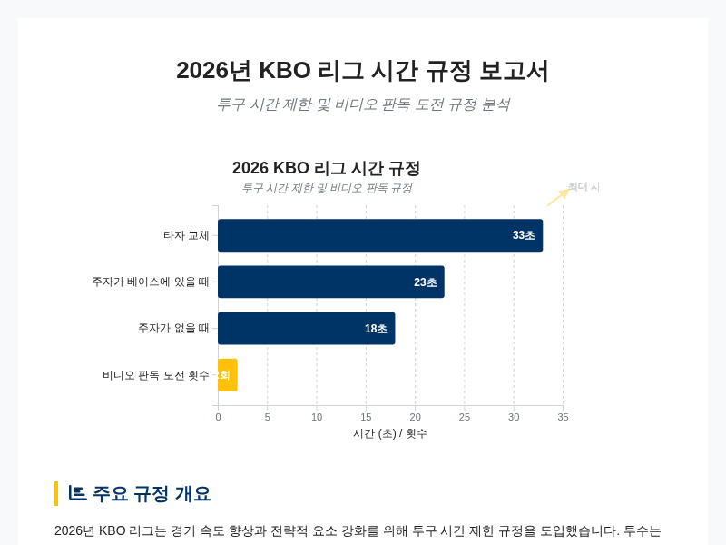
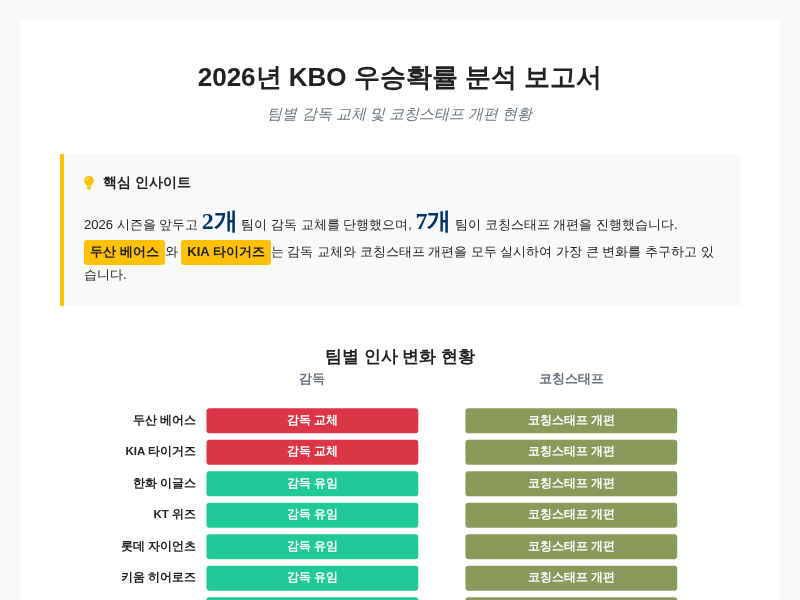
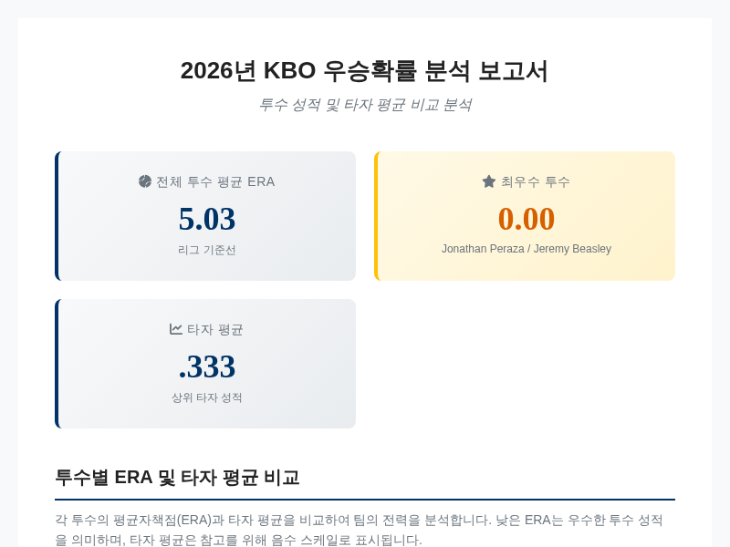
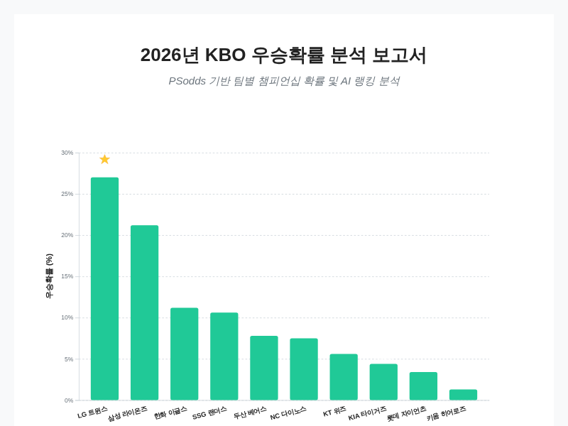
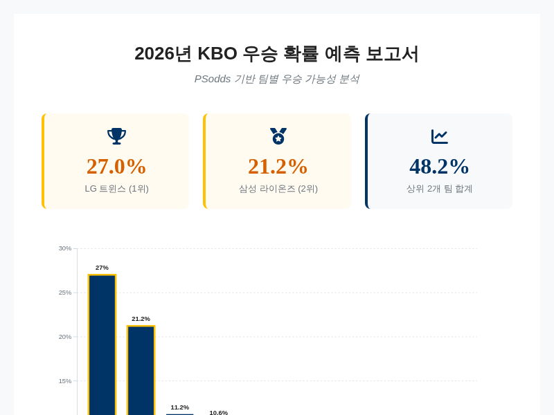
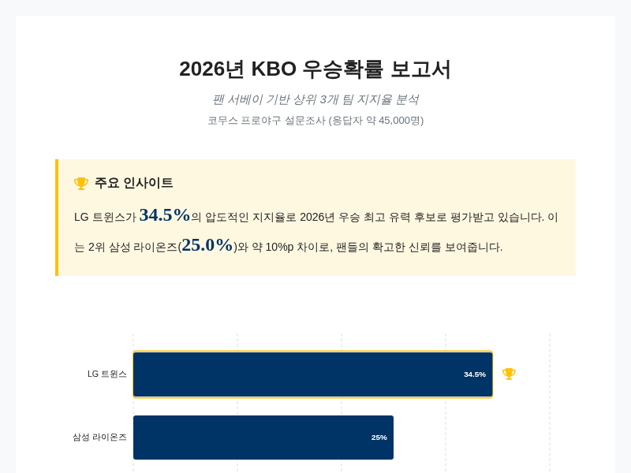
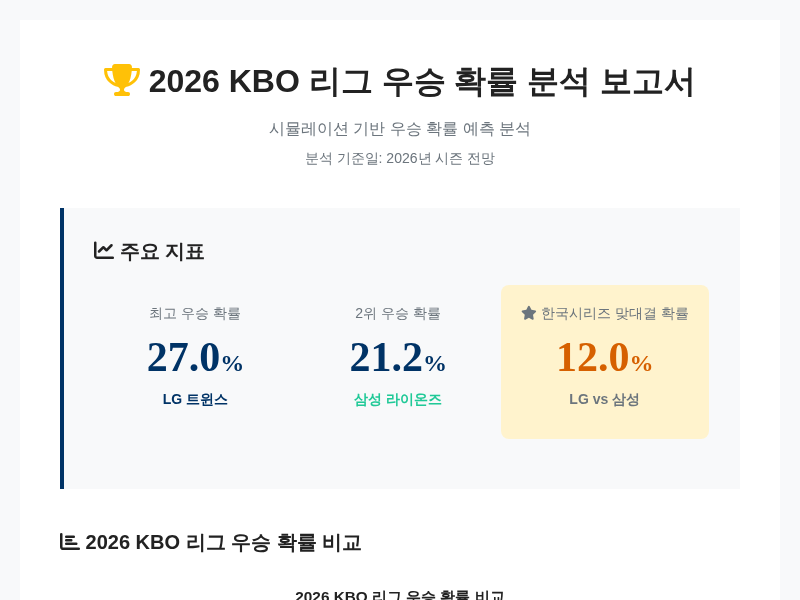

# 2026년 KBO 리그 우승 확률 및 전력 분석 종합 보고서

## 2026년 KBO 리그 개요 및 리그 환경 변화

2026년 신한 SOL KBO 리그 시즌은 3월 12일부터 3월 24일까지 실시되는 시범 경기를 통해 막을 올리며, 정규 시즌은 2026년 3월 28일부터 개시된다. 이번 대회에는 기존의 10개 KBO 리그 구단이 모두 참가하여 리그의 지속적인 운영과 팽팽한 경쟁 구도를 이어갈 예정이다. 리그 개막을 앞두고 다수의 구단에서 코칭스태프의 대폭적인 개편이 이루어졌으며, 이는 승진, 신규 영입, 은퇴 등 다양한 형태로 단장되었다. 이러한 코칭스태프의 변화는 각 팀의 전술적 방향성과 시즌 운용에 중대한 변수로 작용할 것으로 예상된다. 또한 리그 사무국은 트레이드, 외국인 선수 계약, 드래프트, 대회 규정 등 시즌 운영에 필수적인 제반 사항에 대한 광범위한 문서화와 관리 체계를 유지하고 있다. 더불어 유료 방송, 라디오, 지상파 TV 등을 아우르는 중계 권한 조정 계획이 수립되어 팬들의 시청 환경과 미디어 접근성에도 변화가 예상되는 시점이다 [[27](https://en.namu.wiki/w/2026%20%EC%8B%A0%ED%95%9C%20SOL%20KBO%20%EB%A6%AC%EA%B7%B8)].

2026년 시즌의 가장 획기적인 변화 중 하나는 ABS(자동 투구 판정 시스템)의 도입이다. 해당 시스템은 2026년 스프링 캠프부터 리그 전체 경기에 적용되기 시작하며, 스트라이크 존은 타자 신장의 비율에 따라 결정된다. 구체적으로는 타자 키의 55.75%를 상한선으로, 27.04%를 하한선으로 설정하며, 가로 방향으로는 홈플레이트 너비에서 양쪽 각각 2cm씩 확장된 범위를 스트라이크 존으로 인정한다. 이는 기존 심판의 주관적 판정에 의존하던 볼 판정 방식을 객관적인 데이터 기반으로 전환하여 경기의 정확성을 높이는 한편, 타자와 투수 모두에게 새로운 스트라이크 존 적응을 요구하는 중요한 과제가 될 것이다 [[40](https://www.koreabaseball.com/Kbo/League/GameManage2026.aspx)].

경기 속도를 높이고 경기 흐름을 원활하게 하기 위해 피치클럭 규정 또한 강화되었다. 타자 간 교체 시에는 33초, 주자가 베이스에 있을 때는 23초, 주자가 없을 때는 18초 내에 투구해야 하며, 이를 위반할 경우 자동으로 볼 또는 스트라이크가 선언된다. 또한 번트를 제외한 체크 스윙 상황에 대해서는 비디오 판독을 도입하였으며, 각 팀은 경기당 두 번의 도전 기회를 부여받는다. 판정 번복이 이루어질 경우 도전 기회는 소진되지 않고 유지되어 전략적인 활용이 가능하다. 이 외에도 주자의 주로를 명확히 하기 위해 1루베이스 3피트 러닝 레인이 파울 라인 내부의 흙 구간을 포함하도록 폭 24인치까지 확장되었으며, 내야 잔디를 밟아 송구를 방해할 경우 여전히 인터피어런스로 판정된다. 수비 시프트 규정을 위반할 경우 타자에게 1루가 주어지고 주자들은 진루하게 되는 등 수비 위치 제한도 구체화되었다 [[40](https://www.koreabaseball.com/Kbo/League/GameManage2026.aspx)].

2026년 KBO 리그에 적용된 피치클럽과 비디오 판독 관련 주요 시간 제한 규정을 비교한 도표.

선수 단 운용과 관련해서도 KBO는 팀 로스터 인원을 기존의 65명에서 68명으로 확대하여 구단의 선수 관리 폭을 넓혔다. 또한 아시아 쿼터 제도를 도입하여 아시아 야구 연맹 소속 국가 또는 호주 출신 선수 중 한 명을 추가로 등록하고 경기에 출전할 수 있도록 허용하였다. 다만 비아시아 국적의 이중국적자는 이 제도의 대상에서 제외된다. 이는 팀 전력 보강의 폭을 넓히고 리그의 다양성을 증진시키는 조치로 평가받고 있다. 이러한 일련의 규정 변경과 시스템 도입은 2026년 KBO 리그의 경기 양상과 전략을 크게 변화시키는 핵심 요인이 될 것이며, 각 구단은 이러한 환경 변화에 신속하게 적응하는 것이 시즌 성적의 변수가 될 것으로 전망된다 [[40](https://www.koreabaseball.com/Kbo/League/GameManage2026.aspx)].

## 구단별 전력 변화 및 감독/코칭스태프 전술 분석

2026년 시즌을 앞두고 KBO 리그 구단들은 각 팀의 전력 보강과 전술적 변화를 꾀하기 위해 감독 교체와 코칭스태프 대폭 개편이라는 과감한 투자를 단행했다. 이러한 변화의 중심에 있는 두산 베어스는 2026년 1월 15일, 2022년 SSG 랜더스의 한국시리즈 우승을 이끌었던 경험력 있는 지휘관 김원형을 새 사령탑으로 선임하며 강한 의지를 보였다. 두산의 1군 코칭스태프는 김원형 감독을 정점으로 홍원기 수석코치, 손시헌 퀄리티컨트롤 코치를 비롯해 투수, 타격, 수비, 주루, 배터리, 트레이닝 등 각 분야의 전문 코치들로 보강되어 체계적인 지도 체계를 갖췄다. 특히 두산은 지난 시즌 타율 2할 8할 7푼을 기록한 베테랑 유격수 박찬호와 4년 총 80억 원이라는 거액의 계약을 체결하여 내야 진을 안정시키는 큰 손 영입을 단행했다. 박찬호의 영입은 단순히 공격력의 보강을 넘어 팀 내 리더십 강화와 유망주 육성에도 긍정적인 영향을 미칠 것으로 기대되며, 포수 양의지는 박찬호를 중심으로 한 내야 수비의 안정성을 확보하고 선수단의 분위기를 조율하겠다는 포부를 밝혔다. 또한 두산은 2군 팀을 이원 도루 감독이 이끌게 하고, 전 두산 선수였던 윤명준 등이 코치진에 합류하여 팜 시스템의 강화에도 힘쓰고 있어 [[1](https://namu.wiki/w/KBO%20%EB%A6%AC%EA%B7%B8/%EC%97%AD%EB%8C%80%20FA/2026), [2](https://kka3seb.tistory.com/2072), [4](https://aj0083.tistory.com/44)], 김원형 감독의 지도 방침이 1군뿐만 아니라 육성 단계까지 투영될 것으로 보인다.

전년도 챔피언인 LG 트윈스는 염경엽 감독 체제를 유지하며 10년 만에 KBO 역사상 최초로 2연패를 달성한다는 명확한 목표를 세우고 시즌을 준비했다. 트윈스는 특정 스타 선수 의존도를 낮추고 공수 주루의 기본기에 집중하는 야구를 지향하며, 타석, 수비, 주루 등 경기의 모든 디테일에서 다른 팀보다 앞서나가기 위한 전술적 접근을 취하고 있다. 염경엽 감독은 전년 10월 우승을 확정 짓고 쉬지 않고 11월부터 바로 다음 시즌을 위한 준비에 착수하는 등 승부 근성을 드러냈으며 [[16](https://seungbusa-sports.tistory.com/14), [19](https://www.maniareport.com/view.php?ud=2026031418401994476cf2d78c68_19), [32](https://v.daum.net/v/Gn3dqJmjdG)], 이러한 태도는 선수단 전체에 긴장감과 집중력을 불어넣어 리그 최강팀으로서의 저력을 유지하는 원동력이 될 것이다.

한화 이글스는 김경문 감독이 이끄는 1군 코칭스태프가 전년도와 같은 포지션 구조를 유지하며 안정감을 꾀한 반면, 2군 팀에서는 변화를 시도했다. 북부리그 4연패를 달성한 2군 팀의 경쟁력을 더욱 높이기 위해 이대진 2군 감독을 선임하고, 전 KIA 타이거즈 코치였던 김기태를 배터리 총괄코치로 영입하는 등 지휘부를 개편했다 [[29](https://www.starnewskorea.com/en/sports/2026/01/15/2026011515344540317)]. 특히 한화는 지난 시즌 핵심 투수였던 코디 폰스와 라이언 바이스가 메이저 리그로 떠나면서 투수력의 공백이 크게 발생한 상황이다. 이에 따라 김경문 감독은 시즌 초반 타선이 투수진이 부여해온 이승 부담을 떠안고 공격적으로 나설 필요가 있다고 강조했다. 외야수 심우준은 2025년 시즌 부진을 면치 못했으나 2026년 시즌 초반 기량이 회복되는 모습을 보이며 팀 공격력의 핵심 변수로 떠오르고 있어 [[16](https://seungbusa-sports.tistory.com/14), [19](https://www.maniareport.com/view.php?ud=2026031418401994476cf2d78c68_19), [41](https://www.mk.co.kr/en/sports/12005667)], 한화의 이번 시즌은 투수력 약화를 타선의 집중력으로 극복해야 하는 과제를 안고 있다.

KT 위즈는 이강철 감독의 지휘 아래 '빅이닝(Big Inning)'이라는 올 시즌 출사표를 내걸고 공격적인 야구를 표방했다. 이강철 감독은 야구 용어인 '빅이닝'과 새로운 시작을 의미하는 '비기닝(Beginning)'의 합성어를 통해 팀의 공격력 재건과 시즌 초반부터의 터짐을 강조했으며 [[32](https://v.daum.net/v/Gn3dqJmjdG)], 김태균 2군 감독과의 호흡을 통해 선수 단 전체의 타격 기량 향상에 주력할 것으로 보인다. KT의 이러한 전술적 변화는 기대 이상의 득점력을 통해 경기 흐름을 장악하겠다는 강력한 의지로 해석된다.

KIA 타이거즈는 2025년 시즌 잦은 부상으로 인한 성적 부진(8위)을 만회하기 위해 코칭스태프의 대대적인 개편을 단행했다. 이범호 감독을 필두로 새로운 1군 코칙스태프가 구성되었으며, 두산에서 활동했던 정재훈 투수코치가 떠난 자리는 박정배와 김지영 등이 채우는 등 인력 교체가 있었다. 롯데와는 주루코치 교환 방식으로 조재영 대신 고영민을 영입하며 외야 수비 및 주루 코칭을 강화했고, 전 KT 소속 김연훈 코치를 합류시켜 수비 및 베이스러닝의 전문성을 높였다 [[13](https://www.cctoday.co.kr/news/articleView.html?idxno=2218885), [14](https://m.blog.naver.com/thebenzecl/224123572876), [15](https://haneulroutine.tistory.com/entry/%F0%9F%94%A5-2026-KBO-%ED%8C%80%EC%88%9C%EC%9C%84-%EC%A0%84%EB%A7%9D-%EC%B4%9D%EC%A0%95%EB%A6%AC%E2%80%94-%EC%A0%84%EB%A0%A5-%EB%B3%80%ED%99%94-FA-%EC%9D%B4%EC%A0%81-%EC%9A%A9%EB%B3%91-%EA%B5%AC%EC%84%B1%EA%B9%8C%EC%A7%80-%EC%99%84%EC%A0%84-%EB%B6%84%EC%84%9D%EF%BC%81)]. 2군 지휘부 역시 진갑용 감독 하에 새로운 코칭스태프로 교체되어 팜 시스템의 젊은 피를 수혈하는 등 선수단 체질 개선에 박차를 가하고 있다.

롯데 자이언츠는 김태형 감독이 체제를 이끌며 불법 해외 도박으로 인한 선수들의 징계라는 외부적인 변수에도 불구하고 강한 멘탈리티를 유지하고 있다. 팀은 시범 경기에서 선전하여 긍정적인 기대감을 모으고 있으며, KIA와의 코치 교환을 통해 영입한 고영민 주루코치의 풍부한 경험을 바탕으로 주루 전술의 다양화를 도모하고 있다 [[36](https://v.daum.net/v/20251030114715689)]. 비록 코칭스태프의 구체적인 전체 변화는 명확히 드러나지 않았으나, 김태형 감독의 노련한 지도력과 코치진의 인원 보강을 통해 시즌 전력의 안정화를 꾀하고 있는 것으로 전해졌다 [[42](https://www.koreatimes.co.kr/sports/20260326/twins-determined-to-augment-strengths-in-kbo-title-defense)].

삼성 라이온즈는 박진만 감독의 지도 하에 베테랑 선수단과 유망주들의 조화를 이루며 우승을 노리는 강한 집념을 보이고 있다. 박진만 감독은 선수들이 우승 트로피를 들어 올릴 준비가 되어 있으며, 선배들이 만들어 놓은 훌륭한 팀 문화가 후배들에게 긍정적인 영향을 미치고 있다고 언급하며 [[32](https://v.daum.net/v/Gn3dqJmjdG), [42](https://www.koreatimes.co.kr/sports/20260326/twins-determined-to-augment-strengths-in-kbo-title-defense)], 조직력과 팀워크를 바탕으로 한 점진적인 성장과 우승 도전을 시즌의 슬로건으로 삼고 있다.

SSG 랜더스는 이숭용 감독이 이끄는 가운데 지난 시즌 전문가들의 예상을 뒤엎고 3위를 차지한 저력을 바탕으로 2026년 시즌을 준비했다. 이숭용 감독은 포스트시즌에서의 아쉬움을 남기긴 했으나, 시즌 중 보여준 팀의 기량을 바탕으로 이번 시즌에는 최종 우승을 위해 끝까지 남겠다는 다짐을 밝혔다 [[16](https://seungbusa-sports.tistory.com/14), [19](https://www.maniareport.com/view.php?ud=2026031418401994476cf2d78c68_19), [32](https://v.daum.net/v/Gn3dqJmjdG)]. 지난 시즌의 성공을 발판으로 삼아 팀 전력을 최적화하고 시즌 후반 경쟁력을 극대화하는 전술적 운용에 주력할 것으로 보인다.

NC 다이노스는 2026년 시즌 슬로건인 '거침없이 가자 위풍당당'을 걸고 시즌을 시작하여 4월 초반 8경기 중 6승을 거두며 2위를 기록하는 등 선전하고 있다. 팀은 구창모, 커티스 테일러, 도다 나쓰키, 드류 버르해이건, 신민혁으로 구성된 5인 선발 로테이션을 구축하여 투수력의 안정을 꾀했고 [[33](https://namu.wiki/w/NC%20%EB%8B%A4%EC%9D%B4%EB%85%B8%EC%8A%A4/2026%EB%85%84)], 이를 바탕으로 공격과 수비의 균형을 맞추며 리그 상위권을 향해 과감한 도전을 이어가고 있다.

2026년 시즌 KBO 10개 구단의 감독 교체 및 코칭스태프 개편 현황 비교.

키움 히어로즈는 설종진 감독의 지휘 아래 '놀라운 야구'를 구현한다는 목표로 1월 22일부터 3월 7일까지 대만 가오슝에서 스프링 캠프를 진행했다. 선수단은 대만 프로팀과의 연습 경기 등을 통해 강화된 기량을 다졌으며, 네이던 와일스, 라울 알칸타라, 트렌턴 브룩스 등 외국인 선수들의 합류와 함께 베테랑 박병호, 유재신의 조력을 받아 팀 전력을 높였다 [[30](https://www.stnsports.co.kr/news/articleView.html?idxno=310917)]. 설종진 감독은 전 시즌의 아쉬움을 딛고 새로운 도전을 수행하는 팀으로 거듭나겠다는 의지를 보이며 [[32](https://v.daum.net/v/Gn3dqJmjdG)], 유망주들의 성장과 외국인 선수들의 적응 여부가 팀의 성적을 가를 중요한 변수가 될 것으로 전망된다.

## 외국인 선수 영입 및 기대 피트고 분석

2026년 KBO 리그의 각 구단 외국인 선수 영입은 총액과 과거 성적 면에서 매우 파격적인 양상을 보이며, 이는 곧 팀 전력의 승패를 가르는 가장 중요한 변수로 작용하고 있다. 특히 10개 구단 모두 최고 수준의 자금을 투자하여 외국인 선수를 영입하거나 재계약을 성사시켰으며, 아시아 쿼터제도의 도입으로 호주 및 아시아 국적 선수들의 영입이 활발해졌다. LG 트윈스는 지난 시즌 158 타점을 기록하며 타점 신기록을 세운 외야수 오스틴 딘과 재계약하는 데 성공했으며, 170만 달러라는 거액을 투자하여 그의 공격력을 그대로 유지했다. 오스틴 딘은 2024년 타점왕에 오르는 등 이미 KBO 리그에서 증명된 실력을 갖추고 있어, LG 트윈스의 우승 도전 행진에서 핵심적인 역할을 수행할 것으로 기대되며 [[44](https://simplelife100.tistory.com/1982), [48](https://www.koreaherald.com/article/10646003), [54](https://mlbpark.donga.com/mp/b.php?id=202512110111464376&p=1&b=kbotown&m=view&select=spf&query=KBO&subselect=&subquery=&user=&site=donga.com)], 팀의 4番 타자로서 중심타선을 이끌어갈 것이다. LG는 또한 베네수엘라 출신의 우완 투수 요니 치리노스를 영입하여 선발진을 보강했는데, 치리노스는 로우볼 제구력에 강점이 있으며 싱커와 스플리터를 바탕으로 땅볼 유도에 특화된 투수로 알려져 있다. 그는 KBO에서 다년간의 경험을 축적한 선수로서, 안정적인 피칭을 통해 팀의 선발진 에이스 역할을 수행하며 [[44](https://simplelife100.tistory.com/1982), [55](https://en.yna.co.kr/view/AEN20260326006700315)], 한국 시리즈 우승을 목표로 하는 LG의 투수력 든든한 버팀목이 될 것이다.

KIA 타이거즈는 외국인 투수 영입에 가장 공격적인 투자를 감행하며 투수력 강화에 주력했다. KIA는 미국인 투수 제임스 네일과 200만 달러에 1년 재계약을 체결했다. 제임스 네일은 지난 시즌 8승 4패 평균자책점 2.25를 기록했으며, 최근 두 시즌 동안 리그 선발 투수 중 가장 낮은 평균자책점인 2.38을 기록하는 등 압도적인 피칭을 선보였다. 그는 KIA의 한국시리즈 우승에 크게 기여한 바 있으며, 이러한 성과를 바탕으로 2026년 시즌 외국인 선수 중 최고 연봉을 기록하게 되었다 [[48](https://www.koreaherald.com/article/10646003), [55](https://en.yna.co.kr/view/AEN20260326006700315)]. KIA는 또한 아시아 쿼터를 활용하여 호주 출신 내야수 제리드 데일을 영입하여 타선의 다양성을 꾀했다. 제리드 데일은 새로 도입된 쿼터 제도의 혜택을 입어 KIA의 전력 보강에 일조할 것으로 보이며 [[48](https://www.koreaherald.com/article/10646003)], 팀은 이러한 외국인 선수들의 기대 피트고를 바탕으로 전 시즌 8위라는 부진 성적을 만회하고 상위권 진입을 노리고 있다. 이와 더불어 KIA는 100만 달러에 영입한 해럴드 카스트로가 시즌 초반부터 맹활약하고 있다. 해럴드 카스트로는 3경기에서 타율 5할 3푼 8리, 1홈런, 4타점, 장타율 1.600이라는 놀라운 성적을 기록하며 팀 타선을 이끌고 있으며, 삼진을 피하고 컨택 위주의 타격을 지향하는 스타일은 KBO 리그의 환경과 매우 잘 맞아떨어지는 것으로 평가받고 있다 [[53](https://v.daum.net/v/20260401175710009)].

삼성 라이온즈는 선발진의 핵심인 아리엘 후라도와 부상으로 공백이 생긴 투수진을 보강하기 위해 잭 오로린을 영입하며 투수 운용의 폭을 넓혔다. 파나마 출신 우완 투수 아리엘 후라도는 최대 170만 달러의 조건으로 영입되었으며, 지난 시즌 197.1이닝을 던지며 리그 최다 이닝을 기록했고 23회의 퀄리티 스타트와 3완투승을 기록하는 등 '먹건 투수'로서의 가치를 입증했다. 그는 삼성 선발진의 에이스로서 시즌 전체를 책임질 수 있는 든든한 자원으로 평가된다 [[48](https://www.koreaherald.com/article/10646003), [55](https://en.yna.co.kr/view/AEN20260326006700315)]. 한편 잭 오로린은 호주 출신 좌투수로 2026년 WBC 무대에서 훌륭한 투구 내용을 보여주며 삼성에 합류했다. 디트로이트 타이거즈 산하에서 마이너 리그 경력을 쌓았고 메이저 리그 출전 경험도 있는 그는, 당초 부상 공백을 메우기 위해 영입되었으나 WBC에서의 뛰어난 활약으로 인해 팀 내 필승 조합의 일원으로서 기대감을 모으고 있다. 그는 직구의 구속이 평균적인 편이나 새로운 횡 sweeping 슬라이더와 변화구의 개선을 이룩했다면 가치가 매우 높을 것으로 분석된다 [[46](https://yagongso.com/jack-te-haki-oloughlin/)].

KT 위즈는 메이저 리그 경험이 있는 외야수 샘 힐리어드와 100만 달러에 계약을 체결하며 외야 공격력을 강화했다 [[48](https://www.koreaherald.com/article/10646003)]. 또한 투수진 보강을 위해 케일러 부시리를 영입했다. 그는 32세의 우완 투수로 100만 달러에 계약했으며, 메이저 리그에서 6.02의 평균자책점을 기록했으나 마이너 리그에서는 선발로서 꾸준한 이닝을 소화한 경력이 있다. 91~92마일의 직구를 주 무기로 삼으며 커터와 슬라이더 등 다양한 구질을 구사하고, 뛰어난 제구력과 체력 장점을 가지고 있다. 다만 구속의 한계와 상대적으로 낮은 삼진율이 약점으로 지적되나, KBO 리그에 적합한 구질 사용과 구속 유지가 성공의 열쇠가 될 것으로 보인다 [[46](https://yagongso.com/jack-te-haki-oloughlin/)].

두산 베어스는 메이저 리그 출신의 외야수 다즈 카메론을 영입하며 새로운 외국인 타자를 실험하고 있다 [[48](https://www.koreaherald.com/article/10646003)]. 다즈 카메론은 타격 기량뿐만 아니라 수비력에서도 높은 평가를 받는 선수로 알려져 있으며, 새로운 환경에서의 적응 능력이 두산 타선의 변수가 될 것이다.

NC 다이노스는 외국인 선수의 이탈에 대비하고 선발진의 안정성을 확보하기 위해 커티스 테일러와 드류 버르해이건을 투수진의 핵심으로 구성했다. 캐나다 출신인 커티스 테일러는 신장 198cm의 장신 투수로 90만 달러의 연봉을 받고 입단했다. 그는 평균 구속 150.6km/h의 빠른 직구와 우타자 상대로 38.2%의 헛스윙을 유발하는 강력한 슬라이더를 주무기로 삼고 있다. 과거 부상으로 어려움을 겪었으나 2025년 AAA 리그에서 10승 4패 평균자책점 3.21을 기록하며 완전한 회복세를 보였다. 낮은 릴리스 포인트에서 커브볼과 같은 수평 움직임이 뛰어난 투구로 선발 전환에 성공하였으며, 현재 NC 선발 로테이션의 핵심 축으로 평가된다 [[52](https://yagongso.com/curtis-taylor/)]. 드류 버르해이건은 엘보우 부상으로 이탈한 라일리 톰슨을 대신해 영입된 35세의 베테랑 우완 투수이다. 그는 일본 프로야구와 메이저 리그 경험을 모두 보유하고 있으며, 휘스윙율이 좋은 sweeping 슬라이더를 주무기로 삼고 직구 구속 역시 150km/h에 육박하는 힘을 유지하고 있다. 다만 과거 홈런 허용에 취약한 면이 있었으나, 타자 친화적인 구장에서의 경험이 투수력 보강에 도움이 될 것으로 기대된다. SSG 랜더스에서의 입단 팀 검진 시 의학적 우려가 제기되었으나, 강력한 구속과 뛰어난 제구력은 여전히 NC가 그를 영입한 가장 큰 이유이다 [[47](https://yagongso.com/drew-edward-verhage/)].

외국인 선수들의 시즌 초반 성적은 기대와 우려를 교차시키고 있다. 시즌 시작 직후 10경기도 채 되지 않아 4개 팀의 외국인 에이스 투수가 동시에 이탈하는 이변이 발생했으며 [[44](https://simplelife100.tistory.com/1982)], 이는 해당 팀들의 선발진 운용에 큰 차질을 빚게 만들었다. 실제로 외국인 투수들의 시즌 초반 평균 자책점은 5.03, WHIP은 1.54로 다소 불안정한 모습을 보이고 있으며, 179이닝을 던지는 동안 안정감을 찾지 못하고 있다. 반면 외국인 타자들은 평균 타율 3할 3푼 8리, OPS 0.988을 기록하며(약 65경 기준) [[50](https://mykbostats.com/players/foreign)], 공격 부문에서는 기대 이상의 파괴력을 보여주고 있다. 특히 한화 이글스의 조나단 페라자는 외국인 타자 중 가장 돋보이는 활약을 펼치고 있다. 그는 5할 2리의 맹 타율, 5타점, 6할 5푼 4리의 장타율, 출루율 5할 4푼 8리, 7득점을 기록하며 리그 전체 3위에 올랐다. 마이너 리그에서의 강력한 시즌을 보낸 뒤 한화에 복귀한 그는 일본 프로야구 팀들에서도 영입 제안이 있었을 정도로 기량이 좋아졌으며, 수비력과 라인 드라이브 타격이 특징인 선수로 평가받고 있다 [[49](https://www.todaymild.com/news/articleView.html?idxno=29959), [50](https://mykbostats.com/players/foreign), [51](https://koreajoongangdaily.joins.com/news/2026-01-01/sports/Baseball/KBO-welcomes-back-16-foreign-players-as-all-clubs-fill-designated-slots/2490958)]. 이 외에도 키움 히어로즈의 라울 알칸타라는 11.2이닝 동안 3.09의 평균자책점과 12개의 삼진을 잡아내며 선발진의 든든한 한 축을 맡고 있으며 [[50](https://mykbostats.com/players/foreign)], 같은 팀의 트렌턴 브룩스는 4할 4푼 4리의 타율과 4할 6푼 7리의 출루율을 기록하며 팀 공격력을 이끌고 있다. 롯데 자이언츠의 제레미 비슬리는 초반 5이닝 무실점으로 평균자책점 0.00을 기록하는 등 놀라운투구를 선보이며 팀의 불펜을 지키고 있다 [[50](https://mykbostats.com/players/foreign)].

| 선수 이름 | 소속 팀 | 포지션 | 연봉/계약 | 주요 성적 및 기대 피트고 |
|----------|----------|----------|----------|--------------------------|
| Austin Dean | LG 트윈스 | 외야수 | $1.7M (재계약) | 2024년 158타점 신기록, 50홈런, 컨택 위주 타격 [[44](https://simplelife100.tistory.com/1982)][[48](https://www.koreaherald.com/article/10646003)][[54](https://mlbpark.donga.com/mp/b.php?id=202512110111464376&p=1&b=kbotown&m=view&select=spf&query=KBO&subselect=&subquery=&user=&site=donga.com)] |
| James Naile | KIA 타이거즈 | 투수 | $2M (재계약) | 2025년 8-4 2.25 ERA, 최근 2시즌 리그 최저 ERA [[48](https://www.koreaherald.com/article/10646003)][[55](https://en.yna.co.kr/view/AEN20260326006700315)] |
| Yonny Chirinos | LG 트윈스 | 투수 | 재계약 | 로우볼/싱커/스플리터 위주 땅볼 유도, 선발 안정화 [[44](https://simplelife100.tistory.com/1982)][[55](https://en.yna.co.kr/view/AEN20260326006700315)] |
| Ariel Jurado | 삼성 라이온즈 | 투수 | 최대 $1.7M | 2025년 197.1이닝 리그 1위, 23QS, 3CG [[48](https://www.koreaherald.com/article/10646003)][[55](https://en.yna.co.kr/view/AEN20260326006700315)] |
| Jack O'Loughlin | 삼성 라이온즈 | 투수 | (부상 대체) | 2026 WBC 선전, 신장 198.6cm의 장신 좌투수, 슬라이더/체인지업 [[46](https://yagongso.com/jack-te-haki-oloughlin/)] |
| Jonathan Peraza | 한화 이글스 | 내야수 | 재계약 | 초반 타율 .462, 수비력과 라인 드라이브 타격 특화 [[49](https://www.todaymild.com/news/articleView.html?idxno=29959)][[50](https://mykbostats.com/players/foreign)][[51](https://koreajoongangdaily.joins.com/news/2026-01-01/sports/Baseball/KBO-welcomes-back-16-foreign-players-as-all-clubs-fill-designated-slots/2490958)] |
| Harold Castro | KIA 타이거즈 | 내야수 | $1M | 초반 타율 .538, OPS 1.600, 삼진 회피 및 컨택 중심 [[53](https://v.daum.net/v/20260401175710009)] |
| Curtis Taylor | NC 다이노스 | 투수 | $900k | 평균 구속 150.6km/h, 강력한 슬라이더, 2025년 AAA 10-4 3.21 ERA [[52](https://yagongso.com/curtis-taylor/)] |
| Drew VerHagen | NC 다이노스 | 투수 | (대체 영입) | sweeping 슬라이더, 35세 베테랑, NPB/MLB 경험, 구속 유지 [[47](https://yagongso.com/drew-edward-verhage/)] |
| Caleb Boushley | KT 위즈 | 투수 | $1M | 91-92mph 직구, 커터/슬라이더 다양한 구질, 제구력 중심 [[46](https://yagongso.com/jack-te-haki-oloughlin/)] |
| Sam Hilliard | KT 위즈 | 외야수 | $1M | MLB 경험, 외야 수비 및 공격력 보강 [[48](https://www.koreaherald.com/article/10646003)] |
| Daz Cameron | 두산 베어스 | 외야수 | (신규) | MLB 출신, 수비력과 타격 기량 겸비 [[48](https://www.koreaherald.com/article/10646003)] |
| Raul Alcantara | 키움 히어로즈 | 투수 | (재계약) | 초반 11.2이닝 3.09 ERA, 12K, 선발진 핵심 [[30](https://www.stnsports.co.kr/news/articleView.html?idxno=310917)][[50](https://mykbostats.com/players/foreign)] |
| Trenton Brooks | 키움 히어로즈 | 외야수 | (재계약) | 초반 타율 .444, 출루율 .467, 중심타자 역할 [[30](https://www.stnsports.co.kr/news/articleView.html?idxno=310917)][[50](https://mykbostats.com/players/foreign)] |
| Jeremy Beasley | 롯데 자이언츠 | 투수 | (신규) | 초반 5이닝 무실점 ERA 0.00, 불펜 안정화 [[50](https://mykbostats.com/players/foreign)] |

이처럼 외국인 선수들의 성과는 팀 성적의 승패를 가르는 중요한 잣대가 되고 있다. 특히 외국인 투수들의 부상과 적응 문제는 시즌 중반 이후 팀 운용에 큰 영향을 미칠 수 있는 요소이다. 메이닝의 경우 팔꿈치 부상으로 인해 팀에서 방출되는 등 [[45](https://ko.wikipedia.org/wiki/%ED%8B%80:2026%EB%85%84_KBO_%EB%A6%AC%EA%B7%B8_%EC%99%B8%EA%B5%AD%EC%9D%B8_%EC%84%A0%EC%88%98)], 부상 변수는 언제든지 발생할 수 있는 위험 요소이다. 스카우터와 전문가들은 외국인 선수들의 KBO 리그 적응에 있어 단순한 물리적 능력 외에도 선수들의 구질 조합, 컨디션 조절 능력, 그리고 아시안 스타일의 소극적인 야구, 즉 장타력보다는 컨택과 제구를 중시하는 야구 스타일에 얼마나 빨리 적응하느냐가 성공의 관건이라고 분석한다. 해럴드 카스트로의 경우 홈런에 대한 욕심보다는 삼진을 피하는 타격 철학이 아시안 야구와 잘 맞는다는 평가를 받는 사례이다 [[53](https://v.daum.net/v/20260401175710009)]. 결국 2026년 KBO 리그에서 외국인 선수들은 각 팀의 목표인 우승과 포스트시즌 진출을 위해 전력의 핵심을 이룰 것이며, 이들의 시즌 초반 적응 속도와 부상 관리가 팀 전력의 승패를 가르는 결정적인 변수로 작용할 것이다.

투수들의 개별 ERA와 리그 평균, 타자들의 성과 대비 비교.

## 시뮬레이션 모델에 기반한 우승 확률 및 승률 예측

최근 발전한 인공지능 기술과 정교한 통계적 시뮬레이션 모델들은 2026년 KBO 리그의 전력을 분석하고 우승 확률을 예측하는 데 있어 중요한 지표를 제공하고 있다. 특히 PSodds와 같은 전문 시뮬레이션 모델은 복잡한 수학적 알고리즘을 활용하여 시즌의 불확실성을 정량화하고 각 팀의 예상 성적을 도출해내고 있다. 이러한 모델들은 단순히 전년도 성적을 반복하는 것이 아니라, 팀의 장기적인 평균 승률로 회귀하려는 성향과 시즌 중 발생할 수 있는 랜덤한 변수들을 결합하여 예측치를 산출한다. 예를 들어, 오른슈타인-우렌벡 과정(Ornstein-Uhlenbeck Process)을 적용한 시뮬레이션 모델은 팀의 승률이 특정한 평균값으로 수렴하려는 복원력과 시즌 중 발생하는 무작위성을 함께 고려한다. 이 과정에서 2000년부터 2025년까지의 KBO 데이터를 분석한 결과, 팀마다 승률 변동성에 대한 저항 정도가 다름이 밝혀졌는데, 삼성 라이온즈는 상대적으로 낮은 복원 계수를 보여 변동성이 큰 반면, KIA 타이거즈는 높은 복원 계수를 기록해 자신의 평균 성적으로 강하게 회귀하는 특성을 보였다[[56](https://mlbpark.donga.com/mp/b.php?b=kbotown&id=202601050111843471&m=view)]. 이러한 통계적 특성들은 시뮬레이션의 정확도를 높이기 위해 크레디빌리티 모델(Bühlmann's model)과 결합되어 사용되며, 팀별 고유 파라미터와 리그 평균값 사이의 적절한 가중치를 적용함으로써 예측의 신뢰성을 강화하고 있다[[56](https://mlbpark.donga.com/mp/b.php?b=kbotown&id=202601050111843471&m=view)].

PSodds가 발표한 시뮬레이션 결과에 따르면 2026년 시즌의 우승 경쟁은 소수의 상위팀 중심으로 전개될 것으로 예상된다. 가장 눈에 띄는 예측은 전년도 챔피언인 LG 트윈스가 최고의 우승 후보로 분석되었다는 점이다. LG 트윈스는 시뮬레이션 모델상에서 27.0%라는 압도적인 우승 확률을 기록하며 1위를 차지했고, 예상 승률 역시 0.553으로 리그 최고 수치를 기록했다[[57](https://psodds.com/blog/2026/03/kbo-preseason-report-result.html), [64](https://www.facebook.com/groups/978747995496996/posts/26384352544509858/)]. 이는 안정적인 팀 전력과 지난 시즌 우승으로 인한 파괴력이 수치적으로도 입증된 결과로 해석된다. LG의 뒤를 이어 삼성 라이온즈가 21.2%의 우승 확률로 2위를 기록했으며, 예상 승률 역시 0.542에 달해 투톱 체제를 구축할 것으로 전망되었다[[57](https://psodds.com/blog/2026/03/kbo-preseason-report-result.html)]. 이 두 팀의 우승 합계 확률만 48%에 육박하며, 시뮬레이션 모델은 2026년 시즌이 LG와 삼성 중심의 양강 구도로 형성될 가능성이 높음을 시사하고 있다. 특히 시뮬레이션은 가장 가능성 높은 한국시리즈 매치업으로 삼성 라이온즈 대 LG 트윈스를 꼽았으며, 이 두 팀이 한국시리즈에서 맞붙을 확률은 12.0%로 집계되었다[[57](https://psodds.com/blog/2026/03/kbo-preseason-report-result.html)]. 이는 다른 어떤 조합보다 높은 확률로, 두 팀의 리그 내 독보적인 전력을 수치적으로 뒷받침하고 있다.

우승 경쟁의 3번째 권역으로는 한화 이글스와 SSG 랜더스가 각각 11.2%와 10.6%의 우승 확률을 기록며 그 뒤를 잇고 있다[[64](https://www.facebook.com/groups/978747995496996/posts/26384352544509858/)]. 한화 이글스는 전력 분석에서 투수진의 공백이 우려되었음에도 불구하고, 시뮬레이션 모델에서는 리그 상위권에 위치해 있어 흥미로운 변수로 작용할 것으로 보인다. 이는 타선의 초반 기량 회복이나 팀 전체의 시너지 효과를 모델이 긍정적으로 반영했을 가능성을 시사한다. SSG 랜더스 또한 10%가 넘는 우승 확률을 보이며 저력을 증명했는데, 이는 지난 시즌 리그 순위와는 별개로 시뮬레이션이 평가한 팀의 밸런스와 기대 승률이 상당히 높음을 의미한다[[64](https://www.facebook.com/groups/978747995496996/posts/26384352544509858/)]. 그러나 이 두 팀과 선두 두 팀 사이에는 확률적 격차가 존재하여, 우승을 위해서는 시즌 초중반의 변수 관리와 LG, 삼성을 상대로 한 직접 상대 전적에서의 우세가 필수적일 것으로 보인다.

그 외의 팀들에 대한 시뮬레이션 결과는 우승 확률 분포가 상당히 좁게 형성되어 중하위권의 치열한 경쟁이 예상된다. NC 다이노스(7.5%), 두산 베어스(7.8%), KT 위즈(5.6%)가 비슷한 구간에 위치하며[[64](https://www.facebook.com/groups/978747995496996/posts/26384352544509858/)], 전력 보강에 공을 들인 두산과 KT가 예상 외로 낮은 확률을 기록한 것은 주목할 만하다. 특히 AI 모델들의 예측에서는 두산 베어스를 최상위권으로 평가한 사례도 있었으나[[56](https://mlbpark.donga.com/mp/b.php?b=kbotown&id=202601050111843471&m=view)], PSodds의 통계적 시뮬레이션에서는 7.8%의 우승 확률을 기록하며 중위권 전력으로 평가되어 모델 간의 견해 차이를 보였고, KT 위즈 역시 5.6%로 투자에 비해 낮은 기대치를 받았다. KIA 타이거즈(4.4%), 롯데 자이언츠(3.4%)가 그 뒤를 이었으며[[64](https://www.facebook.com/groups/978747995496996/posts/26384352544509858/)], 키움 히어로즈는 대부분의 AI 모델과 시뮬레이션에서 10위로 예측되며 리그 꼴찌의 확률이 가장 높은 것으로 집계되었다[[62](https://www.youtube.com/watch?v=IwVdVtA0fXk)]. PSodds 시뮬레이션은 예상 승률 면에서도 상위권과 하위권의 격차를 뚜렷이 보여주었는데, 리그 선두 팀의 승률은 약 0.613 수준으로 예상된 반면, 꼴찌 팀의 승률은 약 0.387에 그칠 것으로 분석되어 팀 간 전력 차이가 승률로 이어질 것으로 전망했다[[57](https://psodds.com/blog/2026/03/kbo-preseason-report-result.html)].

최근 소개된 다양한 AI 모델들의 예측 결과 또한 시뮬레이션 데이터와 비교해 볼 때 흥미로운 시사점을 제공한다. 챗GPT, 마이크로소프트의 AI Copilot, 구글의 제미니 AI 등 세 가지 주요 AI 시스템의 예측을 종합한 결과, LG 트윈스와 두산 베어스가 평균 순위 2.33위로 공동 1위를 차지했다[[56](https://mlbpark.donga.com/mp/b.php?b=kbotown&id=202601050111843471&m=view), [62](https://www.youtube.com/watch?v=IwVdVtA0fXk)]. 이는 PSodds가 LG를 1위로 예측한 것과 일관성을 보이나, 두산 베어스를 상당히 높게 평가했다는 점에서 차별화된다. 한편, 제미니 AI는 가장 보수적인 관점에서 LG 트윈스를 1위로 예측했으며, '3강-4중-3약' 구도를 제시하며 리그의 양상을 체계적으로 분류했다[[61](https://blog.naver.com/seorihana/224131023305)]. 마이크로소프트의 AI Copilot은 독특하게 한화 이글스와 삼성 라이온즈를 1, 2위로 꼽았으며, 전년도 챔피언인 LG 트윈스를 4위로 예측해 AI 모델 간의 편차가 명확히 드러났다[[56](https://mlbpark.donga.com/mp/b.php?b=kbotown&id=202601050111843471&m=view)]. 이러한 AI 예측들의 평균 순위를 살펴보면, 삼성 라이온즈(3.33위), KT 위즈(4.33위), 한화 이글스(4.67위) 순으로 중위권을 형성하고 있어[[56](https://mlbpark.donga.com/mp/b.php?b=kbotown&id=202601050111843471&m=view), [62](https://www.youtube.com/watch?v=IwVdVtA0fXk)], PSodds 시뮬레이션의 순위와 유사한 패턴을 보이고 있다. NC 다이노스(6.67위), SSG 랜더스(7.00위), 롯데 자이언츠(7.00위), KIA 타이거즈(7.33위)가 중하위권으로 예상되었고[[62](https://www.youtube.com/watch?v=IwVdVtA0fXk)], 세 AI 모델 모두 키움 히어로즈를 10위로 예측하여[[62](https://www.youtube.com/watch?v=IwVdVtA0fXk)], 키움의 리그 최약체 전력에 대한 시장의 인식이 통계적으로도 고스란히 반영되었음을 알 수 있다.

시즌 초반 실전 성적은 이러한 시뮬레이션 및 AI 예측 모델을 검증하는 중요한 지표로 작용하고 있다. 2026년 시즌 시작 직후인 4월 7일 시점의 데이터에 따르면, 외국인 선수들의 성과가 팀 전력에 미치는 영향이 지대함을 확인할 수 있다. 특히 외국인 타자들은 이른 시점부터 맹활약하여 평균 타율 3할 3푼 8리, OPS 0.988이라는 놀라운 성적을 기록하며 팀 공격력을 이끌고 있다[[50](https://mykbostats.com/players/foreign)]. 한화 이글스의 조나단 페라자는 이러한 외국인 타자들의 활약을 대표하는 사례로, 시즌 초반 3할 6푼 2리의 타율을 기록하며 리그 전체 3위에 이름을 올리고 5타점, 7득점을 기록하는 등 맹활약했다[[49](https://www.todaymild.com/news/articleView.html?idxno=29959), [50](https://mykbostats.com/players/foreign), [51](https://koreajoongangdaily.joins.com/news/2026-01-01/sports/Baseball/KBO-welcomes-back-16-foreign-players-as-all-clubs-fill-designated-slots/2490958)]. KIA 타이거즈의 해럴드 카스트로 역시 3경기 만에 타율 5할 3푼 8리, 1홈런, 4타점, OPS 1.600이라는 경이적인 성적으로 팀 초반 기세를 올렸다[[53](https://v.daum.net/v/20260401175710009)]. 키움 히어로즈의 트렌턴 브룩스 또한 4할 4푼 4리의 타율과 4할 6푼 7리의 출루율을 기록하며[[50](https://mykbostats.com/players/foreign)], 외국인 타자들의 적응력이 빠르고 파괴력이 높음을 입증했다. 반면 외국인 투수진은 초반에 큰 고전을 면치 못했다. 시즌 시작 10경기도 채 지나지 않아 4개 팀의 외국인 에이스가 동시에 이탈하는 이변이 발생했으며[[44](https://simplelife100.tistory.com/1982)], 179이닝 동안 계산된 외국인 투수들의 평균 자책점은 5.03, WHIP은 1.54로 매우 불안정한 수치를 기록했다[[50](https://mykbostats.com/players/foreign)]. 삼성 라이온즈의 에이스 아리엘 후라도나 KIA 타이거즈의 제임스 네일과 같이 시뮬레이션 모델이나 전문가들의 기대를 한몸에 받았던 선수들마저 초반 평균자책점이 5점대 이상으로 치솟는 등[[50](https://mykbostats.com/players/foreign)], 예상치 못한 난조를 보였다. 이러한 초반 성적 지표의 괴리는 시뮬레이션 모델이 예측한 정규 분포상의 승률 변동폭을 실제 경기에서 더욱 가속화할 수 있는 변수로 작용한다.

PSodds 시뮬레이션 모델에 따른 2026년 KBO 구단별 우승 확률 예측.

베팅 시장의 흐름 역시 시뮬레이션 모델의 예측과 전문가들의 분석을 유사하게 반영하고 있다. 영국의 유명 스포츠 베팅사인 'bet365'가 발표한 2026년 KBO 리그 우승 배당률을 보면, 시뮬레이션 모델처럼 LG 트윈스가 가장 높은 인기를 끌고 있음을 알 수 있다. LG 트윈스는 3.50의 배당 배율을 기록하며 우승 1순위 후보로 자리매김했는데[[58](https://www.threads.com/@baseballkorea_official/post/DUsyoZLk0wu/%EC%98%81%EA%B5%AD%EC%9D%98-%EC%8A%A4%ED%8F%AC%EC%B8%A0-%EB%B2%A0%ED%8C%85-%EC%97%85%EC%B2%B4-bet365%EA%B0%80-2026-kbo%EB%A6%AC%EA%B7%B8-%EC%9A%B0%EC%8A%B9%ED%8C%80%EC%9D%84-%EC%98%88%EC%B8%A1%ED%96%88%EC%8A%B5%EB%8B%88%EB%8B%A4-%EB%94%94%ED%8E%9C%EB%94%A9-%EC%B1%94%ED%94%BC%EC%96%B8-lg%EC%97%90-%EC%B1%85%EC%A0%95%EB%90%9C-%EB%B0%B0%EB%8B%B9%EC%9D%80-350-1%EB%A7%8C-%EC%9B%90%EC%9D%84-%EB%B2%A0%ED%8C%85%ED%95%A0-%EA%B2%BD)], 이는 1만 원을 베팅할 경우 3만 5천 원의 배당금을 받을 수 있는 수치로, 단연 가장 높은 기대치를 반영하고 있다. 시장에서의 베팅 비율은 단순한 우승 예측을 넘어 일반 대중과 전문 투자자들이 팀 전력을 어떻게 평가하는지를 보여주는 중요한 척도이다. LG 트윈스에 대한 높은 베팅 비율과 낮은 배당률은 시뮬레이션 모델의 27.0% 우승 확률과 일맥상통하며, 일반적인 예상과 통계적 예측이 맞아떨어지는 부분이다[[57](https://psodds.com/blog/2026/03/kbo-preseason-report-result.html)]. 반면 우승 확률이 낮게 예측된 팀들일수록 배당률이 높게 형성되어 리스크와 리턴이 조화를 이루고 있다.

종합적으로 볼 때 PSodds 시뮬레이션 모델과 AI 시뮬레이션 분석, 그리고 베팅 시장의 데이터들은 2026년 KBO 리그가 LG 트윈스와 삼성 라이온즈 양강체제 위에 한화와 SSG 등이 도전하는 구도로 전개될 가능성이 가장 높음을 시사한다. 시뮬레이션 모델의 체계적인 접근 방식은 지난 시즌 데이터와 통계적 확률 분포를 기반으로 예측치를 산출하지만, 시즌 초반 외국인 투수들의 난조와 같은 돌발 변수는 시뮬레이션 상의 예측 경로를 바꿀 수 있는 잠재력을 가지고 있다[[44](https://simplelife100.tistory.com/1982), [50](https://mykbostats.com/players/foreign)]. 특히 한화 이글스와 KIA 타이거즈와 같이 외국인 타자들의 초반 폭발적인 기량이 팀 성적을 견인하고 있는 경우, 시즌이 진행됨에 따라 실제 성적이 시뮬레이션 예측치보다 상향 조정될 가능성이 있다. 따라서 제시된 우승 확률과 승률 예측은 철저한 수학적 근거를 바탕으로 하고 있지만, 시즌 중 부상, 선수들의 컨디션 난조, 새로운 감독의 전술 적용 성공 여부와 같은 질적 변수들을 완전히 통제하지는 못한다[[56](https://mlbpark.donga.com/mp/b.php?b=kbotown&id=202601050111843471&m=view), [57](https://psodds.com/blog/2026/03/kbo-preseason-report-result.html)]. 결국 2026년 시즌의 우승을 위해서는 LG 트윈스와 삼성 라이온즈에 대한 통계적 우위를 유지하면서도, 이러한 돌발 변수를 관리하고 시즌 초반 생존을 넘어 중반까지 상승세를 이어가는 팀이 최종적인 승자가 될 것으로 전망된다. 특히 시뮬레이션 모델이 예측한 우승 확률이 실제 시즌 결과와 얼마나 일치할지를 확인하는 과정 자체가 앞으로의 KBO 리그 프리뷰와 데이터 분석 모델 발전에 있어 중요한 기준점이 될 것이다.

PSodds 시뮬레이션 모델에 따른 2026년 KBO 구단별 우승 확률 예측.

## 전문가 전망, 팬 투표 및 시장 동향 종합

야구 전문가들의 시즌 전망, 팬 투표 결과, 그리고 베팅 시장의 데이터는 2026년 KBO 리그의 우승 경쟁 구도가 LG 트윈스와 삼성 라이온즈를 중심으로 재편되고 있음을 보여준다. 다양한 계층의 의견과 통계를 종합해 보면, 시장은 이 두 팀을 타 구단과 구별되는 '양강(Two-Strong)'으로 평가하고 있으며, 그 뒤를 한화 이글스와 SSG 랜더스 등이 추격하는 형세를 예상하고 있다. 콤투스가 운영하는 '콤투스 프로야구(컴파)' 이용자 약 45,000명을 대상으로 실시한 대규모 팬 투표 결과에 따르면, LG 트윈스가 34.5%의 압도적인 지지율을 기록하며 우승 1순위로 꼽혔다. LG 트윈스는 강력한 타선을 보유하고 있으며, 특히 외국인 선수 오스틴 딘과 국내 선수 홍창기 등을 필두로 한 공격력, 그리고 염경엽 감독의 리드하에 펼쳐질 안정적인 팀 운영이 높은 기대감을 형성한 것으로 분석된다 [[49](https://www.todaymild.com/news/articleView.html?idxno=29959), [51](https://koreajoongangdaily.joins.com/news/2026-01-01/sports/Baseball/KBO-welcomes-back-16-foreign-players-as-all-clubs-fill-designated-slots/2490958), [59](https://m.ruliweb.com/news/read/222960)].

2026년 KBO 리그 우승 예상 팀 팬 지지율 순위.

삼성 라이온즈는 전망 조사와 전문가 의견 모두에서 2위 자리를 차지하며 우승 유력 후보로 손꼽혔다. 콤투스 프로야구 설문조사에서 삼성은 25%의 지지율을 기록했으며 [[59](https://m.ruliweb.com/news/read/222960)], 이는 팀의 공격력과 베테랑 리더십에 대한 기대에서 비롯되었다. 삼성은 장타력 있는 타자인 르윈 디아스(Lewin Diaz)를 비롯하여 최정의 공백을 메울 Choi Hyung-woo와 같은 베테랑 선수들의 존재감, 그리고 김성윤과 같은 유망주의 성장세가 결합된 타선을 보유하고 있다. 전문가들은 삼성 라이온즈가 막강한 공격력과 수비력을 바탕으로 LG 트윈스에 도전할 것으로 전망하지만, 투수진의 깊이와 부상 선수들의 복귀 시기 등이 변수로 작용할 수 있다고 분석했다 [[62](https://www.youtube.com/watch?v=IwVdVtA0fXk)]. 야구 전문가들과 기자들의 토론 역시 "LG-삼성 양강 구도"라는 의견에 힘을 싣고 있으며, LG 트윈스가 깊고 균형 잡힌 라인업과 주요 선수들의 컨디션 회복으로 인해 절대적인 1위 후보로 평가받는 반면, 삼성 라이온즈가 강력한 공수 밸런스로 2위 도전을 노릴 것이라는 시각이 지배적이다 [[62](https://www.youtube.com/watch?v=IwVdVtA0fXk)].

한화 이글스는 팬 투표와 전문가 분석에서 3권역을 형성하고 있으며, 독특한 팀 컬러로 주목받고 있다. 한화는 이번 시즌 '슬러거 라인업'이라는 별칭이 붙을 만큼 강력한 타자들을 보유하고 있는데, 강백호와 노시환 같은 국내 타거 뿐만 아니라 외국인 외야수 조나단 페라자까지 합세하여 타선의 위력을 극대화했다. 콤투스 프로야구 설문조사에서 한화는 12.7%의 지지율을 기록하며 3위를 차지했고 [[49](https://www.todaymild.com/news/articleView.html?idxno=29959), [51](https://koreajoongangdaily.joins.com/news/2026-01-01/sports/Baseball/KBO-welcomes-back-16-foreign-players-as-all-clubs-fill-designated-slots/2490958), [59](https://m.ruliweb.com/news/read/222960)], 투수진으로는 류현진과 문동주가 에이스로 나선다는 점이 팀 승리의 중요한 요인으로 꼽혔다. 전문가들은 한화가 타선의 파괴력을 바탕으로 시즌 중반까지 상위권을 유지할 가능성이 높다고 보았으나, 투수진 운용의 안정성이 시즌 후반까지 유지될지가 우승을 결정짓는 핵심 관건이 될 것이라고 내다봤다 [[62](https://www.youtube.com/watch?v=IwVdVtA0fXk)]. 이 외에도 SSG 랜더스와 KT 위즈가 포스트시즌 진출을 위한 강력한 도전자로 분류되었으며, 새로 도입된 아시아 및 호주 국적 선수 쿼터제를 통해 보강된 외국인 선수들의 활약과 기존 전력의 조화가 이들의 성적을 가를 것으로 전망되었다 [[48](https://www.koreaherald.com/article/10646003), [53](https://v.daum.net/v/20260401175710009)].

베팅 시장 역시 이러한 팬 및 전문가들의 전망과 대체적으로 일치하는 흐름을 보이고 있다. 글로벌 스포츠 베팅사인 'bet365'가 공개한 2026년 KBO 리그 우승 배당률을 살펴보면, 전년도 챔피언인 LG 트윈스가 3.50이라는 가장 낮은 배당률을 기록하여 우승 1순위 후보임을 시사했다 [[50](https://mykbostats.com/players/foreign)]. 3.50의 배당률은 투자자들과 팬들이 LG 트윈스의 우승 가능성을 가장 높게 평가하고 있음을 나타내며, 이는 콤투스 설문조사의 34.5% 지지율과 시뮬레이션 모델의 예측과도 맥락을 같이한다 [[49](https://www.todaymild.com/news/articleView.html?idxno=29959), [51](https://koreajoongangdaily.joins.com/news/2026-01-01/sports/Baseball/KBO-welcomes-back-16-foreign-players-as-all-clubs-fill-designated-slots/2490958), [58](https://www.threads.com/@baseballkorea_official/post/DUsyoZLk0wu/%EC%98%81%EA%B5%AD%EC%9D%98-%EC%8A%A4%ED%8F%AC%EC%B8%A0-%EB%B2%A0%ED%8C%85-%EC%97%85%EC%B2%B4-bet365%EA%B0%80-2026-kbo%EB%A6%AC%EA%B7%B8-%EC%9A%B0%EC%8A%B9%ED%8C%80%EC%9D%84-%EC%98%88%EC%B8%A1%ED%96%88%EC%8A%B5%EB%8B%88%EB%8B%A4-%EB%94%94%ED%8E%9C%EB%94%A9-%EC%B1%94%ED%94%BC%EC%96%B8-lg%EC%97%90-%EC%B1%85%EC%A0%95%EB%90%9C-%EB%B0%B0%EB%8B%B9%EC%9D%80-350-1%EB%A7%8C-%EC%9B%90%EC%9D%84-%EB%B2%A0%ED%8C%85%ED%95%A0-%EA%B2%BD)]. 베팅 시장의 배당률은 단순한 대중의 인기를 넘어 복잡한 확률 계산과 전력 분석을 반영한 결과물로, LG 트윈스가 가장 안정적인 우승 후보로 인식되고 있음을 수치적으로 뒷받침한다.

2026년 시즌의 규정 변화 또한 팀 전력과 우승 확률에 대한 전문가들의 분석에 중요한 변수로 작용하고 있다. 이번 시즌부터 도입된 '아시아 쿼터 선수' 제도는 각 팀이 아시아 야구 연맹 소속이나 호주 국적 선수 한 명을 추가로 20만 불 한도 내에 영입할 수 있는 것을 허용한다 [[13](https://www.cctoday.co.kr/news/articleView.html?idxno=2218885), [53](https://v.daum.net/v/20260401175710009), [55](https://en.yna.co.kr/view/AEN20260326006700315)]. 이 제도는 전력이 약한 팀들이 상대적으로 저렴한 비용으로 외국인 선수를 추가로 확보하여 전력 격차를 줄이는 기회를 제공하며, 팀 전략의 다변화를 꾀할 수 있게 했다. 전문가들은 이 규정이 리그의 경쟁 균형을 이루는 데 긍정적인 영향을 미칠 수 있으나, 아시안 쿼터 자원을 어떻게 활용하느냐에 따라 구단 간의 격차가 더 벌어질 수도 있다고 지적했다. 특히 선수들의 적응 문제와 구단의 스카우팅 역량이 승패를 가를 중요한 요소가 될 것으로 보인다 [[45](https://ko.wikipedia.org/wiki/%ED%8B%80:2026%EB%85%84_KBO_%EB%A6%AC%EA%B7%B8_%EC%99%B8%EA%B5%AD%EC%9D%B8_%EC%84%A0%EC%88%98)].

전문가들은 팀 전력과 규정 변화 외에도 주요 선수의 이적이 시즌의 흐름을 크게 변경할 수 있다고 분석했다. 2026년 시즌을 앞두고 한국시리즈 MVP 출신인 김현수가 LG 트윈스에서 KT 위즈로 이적했으며, 베테랑 타자 최형우가 삼성 라이온즈로 이동하는 등 대형 FA 이적이 발생했다. 전문가들은 이러한 선수 이적이 각 팀의 전력 보강에 중요한 기여를 했으나, 동시에 기존 팀 조직력의 변화와 새로운 팀 내 적응 문제를 야기할 수 있는 변수라고 평가했다. 특히 김현수의 KT 위즈 이적은 KT의 공격력 강화에 기여하면서도 LG 트윈스의 외야 수비와 경험에 공백을 남길 수 있는 요인으로 분석되었으며, 최형우의 삼성 합류는 삼성 중심타선의 완성도를 높이는 동시에 선수 노화에 따른 관리 부담이 될 수 있다는 의견도 제기되었다 [[13](https://www.cctoday.co.kr/news/articleView.html?idxno=2218885)].

시장의 기대치를 종합해 볼 때, 키움 히어로즈는 모든 분석에서 리그의 하위권으로 평가되고 있어 시즌 운영의 난이도가 높을 것으로 예상된다. 전문가들은 키움 히어로즈가 재정적인 제약과 뚜렷한 전력 보강 실패로 인해 어려운 시즌을 보낼 것으로 전망했고 [[62](https://www.youtube.com/watch?v=IwVdVtA0fXk)], 팬 투표와 AI 모델 예측에서도 대부분 10위를 차지하며 리그의 최약체로 인식되었다. 베팅 시장에서도 키움의 우승 배당률은 가장 높게 형성되어 있어, 시스템적으로도 낮은 승산을 반영하고 있다. 키움의 성적은 젊은 선수들의 성장세와 부상당한 주요 선수들의 복귀 속도에 따라 중하위권 경쟁에 뛰어들 수 있는지, 혹은 시즌 전체의 꼴찌를 면치 못할지를 결정지을 가장 큰 변수가 될 것이다.

결론적으로 2026년 KBO 리그에 대한 전문가 전망, 팬 투표, 베팅 시장의 흐름은 LG 트윈스와 삼성 라이온즈의 우승 경쟁을 중심으로 이야기가 전개되고 있음을 보여준다. 팬들은 LG의 깊은 전력과 삼성의 막강한 타선에 높은 점수를 부여했고, 전문가들은 이 두 팀의 안정적인 프런트 운영과 선수들의 기량을 바탕으로 '2강' 구도를 예측했다. 베팅 시장 역시 이러한 기대를 배당률에 반영하여 LG 트윈스를 우승의 가장 큰 유력 후보로 평가했다. 그러나 아시아 쿼터제 도입과 같은 리그 규정의 변화, 외국인 선수들의 초반 적응력, 그리고 대형 FA 이적 선수들의 영향력이 실제 시즌 흐름을 어떻게 변화시킬지 주목해야 한다. 특히 한화와 같이 강력한 타선으로 도전장을 내미는 팀이나, SSG와 KT처럼 보강을 통해 변수를 만들어내는 팀들이 예상치 못한 파이를 일으킬 가능성이 열려 있다. 따라서 2026년 시즌은 예상대로 LG와 삼성의 양강 체제가 굳어질지, 아니면 외부 변수와 팀 전력의 균형이 깨지며 새로운 우승팀이 탄생할지를 확인하는 흥미로운 시즌이 될 것으로 전망된다.

## 종합 분석 및 투자 관점 제언

지금까지 분석한 팀 전력, 외국인 선수 변수, 시뮬레이션 데이터 및 전문가 의견을 종합하여 결론을 도출하면, 2026년 KBO 리그의 우승 경쟁은 LG 트윈스와 삼성 라이온즈 중심의 양강 구도가 확실하게 형성되어 있음이 드러난다. PSodds 같은 정교한 통계 시뮬레이션 모델이 LG 트윈스에 27.0%의 우승 확률을 부여하고 삼성 라이온즈에 21.2%를 부여한 것은[[57](https://psodds.com/blog/2026/03/kbo-preseason-report-result.html)], 이 두 팀이 타 구단과 비교할 수 없는 안정적인 전력을 보유하고 있음을 수치적으로 입증한다. 예상 승률에서도 이 두 팀은 각각 0.553과 0.542를 기록하여 리그 최고 수준에 달하는데[[57](https://psodds.com/blog/2026/03/kbo-preseason-report-result.html)], 이는 투타 밸런스와 불펜 depth에서의 우위가 시즌 전체를 관통할 강력한 무기가 될 것임을 시사한다. 특히 시뮬레이션 모델이 Korean Series의 가장 유력한 매치업으로 삼성 대 LG를 점찍고 그 확률을 12.0%로 예측했다는 점[[57](https://psodds.com/blog/2026/03/kbo-preseason-report-result.html)]은, 2026년 시즌이 사실상 이 두 팀의 대결로 귀결될 가능성이 높다는 시장의 합의된 의견을 반영하고 있다.

LG 트윈스는 통계적 모델, 팬 투표, 전문가 의견, 베팅 시장 배당률 등 모든 지표에서 가장 높은 순위를 차지하며 2026년 시즌의 종합 우승 1순위로 확정 지을 수 있다. 4만 5천 명 이상을 대상으로 한 팬 투표에서 34.5%라는 압도적인 지지율을 얻은 점[[49](https://www.todaymild.com/news/articleView.html?idxno=29959), [51](https://koreajoongangdaily.joins.com/news/2026-01-01/sports/Baseball/KBO-welcomes-back-16-foreign-players-as-all-clubs-fill-designated-slots/2490958)]과 영국의 주요 베팅사인 bet365가 우승 배당률 3.50을 제시하며 최고의 우승 후보로 평가한 점[[58](https://www.threads.com/@baseballkorea_official/post/DUsyoZLk0wu/%EC%98%81%EA%B5%AD%EC%9D%98-%EC%8A%A4%ED%8F%AC%EC%B8%A0-%EB%B2%A0%ED%8C%85-%EC%97%85%EC%B2%B4-bet365%EA%B0%80-2026-kbo%EB%A6%AC%EA%B7%B8-%EC%9A%B0%EC%8A%B9%ED%8C%80%EC%9D%84-%EC%98%88%EC%B8%A1%ED%96%88%EC%8A%B5%EB%8B%88%EB%8B%A4-%EB%94%94%ED%8E%9C%EB%94%A9-%EC%B1%94%ED%94%BC%EC%96%B8-lg%EC%97%90-%EC%B1%85%EC%A0%95%EB%90%9C-%EB%B0%B0%EB%8B%B9%EC%9D%80-350-1%EB%A7%8C-%EC%9B%90%EC%9D%84-%EB%B2%A0%ED%8C%85%ED%95%A0-%EA%B2%BD)]은 대중과 전문 투자자 모두가 LG 트윈스의 전력을 신뢰하고 있음을 보여준다. 오스틴 딘과 홍창기를 중심으로 한 강력한 타선, 염경엽 감독의 안정적인 지휘력, 그리고 전 시즌 우승팀으로서의 정체성은 LG 트윈스가 시즌 초반의 변수에서 흔들리지 않고 선두권을 유지할 수 있는 근본적인 힘이다. 시뮬레이션 모델이 분석한 팀의 높은 복원 계수와 안정적인 승률 회귀 성향은 LG 트윈스가 시즌 중간에 부상이나 일시적인 부진에 빠지더라도 다시 원래의 페이스를 찾아 올 것이라는 점을 예고하며, 이는 우승 팀으로서 필수적인 요건을 갖추고 있음을 의미한다.

시뮬레이션 모델에 따른 2026년 KBO 리그 구단별 우승 확률 비교.

삼성 라이온즈는 LG 트윈스의 가장 강력한 경쟁자로 분석된다. 시뮬레이션에서 2위의 우승 확률을 기록한 삼성은 르윈 디아스와 같은 장타력 있는 외국인 선수와 최정의 공백을 메울 베테랑 최형우, 그리고 김성윤 같은 유망주가 조화를 이룬 타선이 최고의 무기이다[[49](https://www.todaymild.com/news/articleView.html?idxno=29959), [51](https://koreajoongangdaily.joins.com/news/2026-01-01/sports/Baseball/KBO-welcomes-back-16-foreign-players-as-all-clubs-fill-designated-slots/2490958), [62](https://www.youtube.com/watch?v=IwVdVtA0fXk)]. 팬 투표에서 25%의 지지율을 얻어 LG에 이은 2위를 차지한 것[[59](https://m.ruliweb.com/news/read/222960)]은 팬들 역시 삼성의 공격력이 우승을 견인할 수 있음을 기대하고 있음을 보여준다. 그러나 삼성이 우승을 차지하기 위해서는 투수진의 운용이 중요한 관건이 된다. 아리엘 후라도와 같은 외국인 에이스가 초반 시즌 난조를 보이는 등[[50](https://mykbostats.com/players/foreign)] 불안한 모습을 보였는데, 투수진의 안정적인 기용과 5선발의 확보가 시즌 후반 한국시리즈 진출의 열쇠가 될 것이다. 삼성은 시뮬레이션 모델상에서도 높은 기대 승률을 보였으나, 실제 시즌에서는 LG 대비 불안 요인이 더 많기에 감독의 전술적 운영 능력과 티어탑 투수들의 시즌 긴 합이 필수적일 것이다.

한화 이글스와 SSG 랜더스는 '양강'에 이은 상위권을 장악할 잠재력을 가진 팀들이다. 시뮬레이션에서 각각 11.2%와 10.6%의 우승 확률을 기록한 이 두 팀[[57](https://psodds.com/blog/2026/03/kbo-preseason-report-result.html)]은 전통적인 강팀의 입지를 다시금 확고히 하고 있다. 특히 한화 이글스는 강백호, 노시환, 그리고 맹활약 중인 외국인 선수 조나단 페라자로 이어지는 '슬러거 라인업'이 리그 최고의 화력을 자랑한다[[49](https://www.todaymild.com/news/articleView.html?idxno=29959), [51](https://koreajoongangdaily.joins.com/news/2026-01-01/sports/Baseball/KBO-welcomes-back-16-foreign-players-as-all-clubs-fill-designated-slots/2490958), [62](https://www.youtube.com/watch?v=IwVdVtA0fXk)]. 페라자의 시즌 초반 3할 6푼 2리의 타율과 폭발적인 공격력[[50](https://mykbostats.com/players/foreign)]은 한화가 투수진의 빈곤을 타력으로 극복할 수 있는 팀임을 증명한다. 하지만 류현진과 문동주를 필두로 한 투수진이 시즌 긴 합을 유지하며 ERA 3점대 대를 형성할 수 있는지가 우승을 향한 결정적인 분수령이 될 것이다. SSG 랜더스는 지난 시즌의 부진을 극복하고 다시 상위권으로 도약할 전력을 갖추고 있다. 시뮬레이션 모델이 SSG를 상위권에 배치한 이유는 팀의 균형 잡힌 전력과 외국인 선수들의 적응 가능성을 높게 평가했기 때문일 것이다. 이 두 팀은 시즌 초반 선두권을 유지하며 LG와 삼성을 압박하는 흐름이 필요하며, 특히 직접 상대 전적에서 우위를 점하는 것이 포스트시즌 진출과 우승 확률을 높이는 데 중요하다.

중위권 팀들인 두산 베어스, NC 다이노스, KT 위즈는 전력 보강에도 불구하고 예상 외로 낮은 우승 확률을 기록하였다. 두산 베어스는 일부 AI 모델에서 최상위권으로 평가받기도 했으나, 전반적인 시뮬레이션과 시장 전망에서는 7.8%의 우승 확률에 그쳤다[[56](https://mlbpark.donga.com/mp/b.php?b=kbotown&id=202601050111843471&m=view), [64](https://www.facebook.com/groups/978747995496996/posts/26384352544509858/)]. KT 위즈는 5.6%의 확률을 기록했는데[[64](https://www.facebook.com/groups/978747995496996/posts/26384352544509858/)], 김현수의 이적과 같은 보강이 팀 전력을 상승시켰지만 투수진의 깊이와 기존 주전선수들의 부상 변수가 아직 완전히 해결되지 않았음을 시사한다. NC 다이노스 역시 7.5%의 확률을 기록하며[[64](https://www.facebook.com/groups/978747995496996/posts/26384352544509858/)] 중위권 경쟁에 맞설 것으로 예상된다. 이들 팀은 아시아 쿼터 선수 제도를 적극적으로 활용하여 전력 보강을 시도하고 있으나[[45](https://ko.wikipedia.org/wiki/%ED%8B%80:2026%EB%85%84_KBO_%EB%A6%AC%EA%B7%B8_%EC%99%B8%EA%B5%AD%EC%9D%B8_%EC%84%A0%EC%88%98), [55](https://en.yna.co.kr/view/AEN20260326006700315)], 추가된 외국인 선수들의 적응 문제와 기존 선수들과의 조화가 성적을 가를 중요 변수이다. 이들 팀은 시즌이 진행됨에 따라 상위권 팀들의 사고나 외국인 선수들의 교체 변수가 발생할 때 포스트시즌 진출을 위한 헌팅에 나설 것으로 보이며, 베팅 시장에서는 이들이 상위권에 도전할 경우 높은 배당률을 제시하여 투자 가치를 높일 수 있는 대상이 될 것이다.

KIA 타이거즈, 롯데 자이언츠, 키움 히어로즈는 리그 하위권으로 예상되며, 특히 키움 히어로즈는 가장 낮은 우승 확률을 기록했다. 시뮬레이션과 AI 모델, 베팅 시장 모두 키움 히어로즈를 10위로 예측했으며[[62](https://www.youtube.com/watch?v=IwVdVtA0fXk), [64](https://www.facebook.com/groups/978747995496996/posts/26384352544509858/)], 재정적 제약과 전력 보강의 실패가 주요 원인으로 분석된다. KIA 타이거즈는 4.4%, 롯데 자이언츠는 3.4%의 우승 확률을 기록했으나[[64](https://www.facebook.com/groups/978747995496996/posts/26384352544509858/)], 해럴드 카스트로와 같은 외국인 선수의 초반 경이적인 성과[[53](https://v.daum.net/v/20260401175710009)]가 시즌 중반 전력 상승의 기폭제가 될 수 있다. 특히 카스트로는 3경기 만에 타율 5할 3푼 8리, OPS 1.600을 기록하며 빛을 발했는데, 이러한 외국인 타자들의 폼이 유지된다면 예상보다 높은 순위를 기록할 수 있는 가능성이 존재한다. 그러나 팀 전체의 밸런스와 투수진의 안정성이 뒷받침되지 않는다면 하위권을 면하기 어려울 것으로 보인다.

종합 분석에 더해 투자 및 스포츠 마케팅 관점에서의 전략적 제언을 살피면 다음과 같다. 첫째, 우승 확률이 가장 높은 LG 트윈스에 대한 투자는 가장 안정적이면서도 수익성이 낮을 수 있는 수용적(Arbitrage) 전략에 적합하다. 시장과 기대치가 이미 반영되어 있어 추가적인 가치 상승 여지는 적지 않을 수 있으나, 리스크가 관리되므로 보수적인 투자자에게 추천된다.

| 전략 유형 | 대상 팀 | 투자 방향 | 기대 수익 및 리스크 |
|-----------|---------|-----------|-------------------|
| 수용적 전략 | LG 트윈스, 삼성 라이온즈 | 시장 기대치가 반영된 안정적인 배당에 투자 | 낮은 리스크, 안정적이지만 높은 수익 기대보다는 회수율 중심의 전략 |
| 공격적 전략 | 한화 이글스, SSG 랜더스 | 타선의 폭발력이나 투수진의 조기 안정화에 베팅 | 높은 리스크, 시즌 중반까지 선두권 유지 시 매우 높은 수익 기대 |
| 가치 투자 전략 | 두산 베어스, KT 위즈, NC 다이노스 | 시즌 초반 저평가된 기회를 포착 후 환매 | 중간 리스크, 외국인 선수 교체나 팀 시너지 발생 시 이익 실현 가능 |
| 고위험/고수익 전략 | KIA 타이거즈, 롯데 자이언츠 | 외국인 선수들의 초반 폼이나 기적적인 시즌 기대 | 매우 높은 리스크, 베팅 시장 배당률이 높아 빅 히트 시 파급 효과 큼 |

둘째, 한화 이글스나 SSG 랜더스와 같이 상위권과 경쟁할 잠재력이 있으나 불확실성이 큰 팀에는 공격적 전략이 유효하다. 이러한 팀들은 베팅 시장에서 상대적으로 높은 배당률을 제시받을 가능성이 높으므로, 투수진이 조기 안정을 찾거나 초반 타선이 폭발할 경우 높은 리턴을 기대할 수 있다. 셋째, 아시아 쿼터제의 도입은 리그의 경쟁 균형을 변화시키는 주요한 투자 변수이다[[45](https://ko.wikipedia.org/wiki/%ED%8B%80:2026%EB%85%84_KBO_%EB%A6%AC%EA%B7%B8_%EC%99%B8%EA%B5%AD%EC%9D%B8_%EC%84%A0%EC%88%98), [53](https://v.daum.net/v/20260401175710009)]. 각 팀이 20만 불 한도 내에 아시아나 호주 국적 선수를 추가로 영입함에 따라, 이 선수들의 성공적인 적응 여부에 따라 '다크호스'가 등장할 가능성이 열렸다[[55](https://en.yna.co.kr/view/AEN20260326006700315)]. 이에 따라 스카우팅 역량이 뛰어난 팀의 전력 급상승을 포착하여 조기에 투자하는 전략이 유효할 수 있다. 특히 외국인 투수들의 난조 시즌 초반 이탈과 교체 빈도가 높은 2026년 리그 환경을 고려할 때[[44](https://simplelife100.tistory.com/1982)], 교체 영입된 선수들의 적응 성공 여부를 파악하는 것이 투자 성공의 핵심이 될 것이다.

결론적으로 2026년 KBO 리그는 LG 트윈스와 삼성 라이온즈의 양강 체제가 가장 유력한 시나리오이나, 한화 이글스와 SSG 랜더스의 도전 그리고 아시아 쿼터제와 같은 외부 변수들이 리그의 흐름을 얼마든지 바꿀 수 있는 역동적인 시즌이 될 것으로 전망된다. 투자 및 마케팅 관점에서는 시장의 기대치(consensus)와 실제 경기력 사이의 괴리를 발견하는 것이 중요하며, 특히 외국인 선수들의 성과와 감독의 전술 적용 성공 여부를 면밀히 모니터링하여 기회를 포착해야 할 것이다[[56](https://mlbpark.donga.com/mp/b.php?b=kbotown&id=202601050111843471&m=view), [57](https://psodds.com/blog/2026/03/kbo-preseason-report-result.html)]. 2026년 우승은 가장 완벽한 전력을 가진 팀이 차지할 가능성이 높지만, 시즌은 숫자로만 설명할 수 없는 드라마를 만들어낼 가능성을 늘 안고 있다.

## 출처

[1] [KBO 리그/역대 FA/2026 - 나무위키:대문](https://namu.wiki/w/KBO%20%EB%A6%AC%EA%B7%B8/%EC%97%AD%EB%8C%80%20FA/2026)  
[2] [2026년 KBO FA 계약 현황 - KKa3's EB - 티스토리](https://kka3seb.tistory.com/2072)  
[3] [KBO, 2026년 FA 자격 선수 30명 공시 - 경남일보](https://www.gnnews.co.kr/news/articleView.html?idxno=622699)  
[4] [2026 시즌 대비 KBO FA 계약 현황 정리 (12월 9일 기준) - B&B](https://aj0083.tistory.com/44)  
[5] [2026 KBO 프로야구 변경 룰 총정리 + FA 이적·트레이드 - 똑똑한 개구리](https://namda5.tistory.com/101)  
[6] [\[프로야구개막\] ②삼성 최형우·kt 김현수 이적생에 아시아 쿼터 첫선](https://www.yna.co.kr/view/AKR20260324102500007)  
[7] [2026시즌 KBO리그 621명 등록](https://v.daum.net/v/20260210145658633?f=p)  
[8] [2026년 KBO 선수 이동 - 트레이드, FA, 드래프트 | 야구나라](https://www.yagoonara.com/trades/2026)  
[9] [2026 KBO FA “김현수, 강백호 이적, 배경” 남은 선수는? (정근우의 ...](https://sports.khan.co.kr/article/202511281918003)  
[10] [\[종합\] 2026 KBO 신인 드래프트 결과, 1순위 박준현 키움行…'불꽃야구 ...](https://www.etoday.co.kr/news/view/2507584)  
[11] [2026 KBO 신인드래프트, 충청권 고교 선수 대거 지명 - 동양일보](http://www.dynews.co.kr/news/articleView.html?idxno=820678)  
[12] [2026 KBO 신인 드래프트 - 나무위키:대문](https://namu.wiki/w/2026%20KBO%20%EC%8B%A0%EC%9D%B8%20%EB%93%9C%EB%9E%98%ED%94%84%ED%8A%B8)  
[13] [제2의 정우주, 김서현은 누구? 2026 KBO 신인 드래프트 D-1… 고교 ...](https://www.cctoday.co.kr/news/articleView.html?idxno=2218885)  
[14] [2026 KBO 미리보기! 아시아쿼터 10명 中 7명이 일본 출신?](https://m.blog.naver.com/thebenzecl/224123572876)  
[15] [2026 KBO 팀순위 전망 총정리— 전력 변화, FA 이적, 용병 구성까지 ...](https://haneulroutine.tistory.com/entry/%F0%9F%94%A5-2026-KBO-%ED%8C%80%EC%88%9C%EC%9C%84-%EC%A0%84%EB%A7%9D-%EC%B4%9D%EC%A0%95%EB%A6%AC%E2%80%94-%EC%A0%84%EB%A0%A5-%EB%B3%80%ED%99%94-FA-%EC%9D%B4%EC%A0%81-%EC%9A%A9%EB%B3%91-%EA%B5%AC%EC%84%B1%EA%B9%8C%EC%A7%80-%EC%99%84%EC%A0%84-%EB%B6%84%EC%84%9D%EF%BC%81)  
[16] [2026 KBO 10개 구단 전력 분석 & 순위 예측 - 3강 5중 2약](https://seungbusa-sports.tistory.com/14)  
[17] [2026 KBO리그 전망 ① - 이랜드 뮤지엄 스토리 게시판](https://elandmuseum.com/g2/bbs/board.php?bo_table=magazine&wr_id=4257)  
[18] ['뎁스왕' LG의 2연패 왕조구축이냐 '화력'의 삼성의 반격이냐, 2026년 ...](https://v.daum.net/v/20260326084137727?f=p)  
[19] [한태양 동점 2점포·손호영 결승포…롯데 '홈런 커플', LG 불펜 무너뜨렸다](https://www.maniareport.com/view.php?ud=2026031418401994476cf2d78c68_19)  
[20] [\[현장포커스\] 1이닝 맡기기도 버거운 한화 불펜…커지는 한승혁·김범수 ...](https://news.nate.com/view/20260406n15381?mid=n1101)  
[21] [Lotte calls up fireballers to overhaul bullpen amid velocity revolution](https://biz.chosun.com/en/en-sports/2026/04/03/5ZUIDOZIG5CRHLPLBV4BGPAYY4/?outputType=amp)  
[22] [2026 KBO 구단별 예상 선발 로테이션 정리 분석! 1등팀은 어디?](https://m.blog.naver.com/sportsrix/224123671028)  
[23] [삼성 라이온즈, 2026시즌 강력한 타선 구축…역할 분담으로 시너지 기대](https://alphabiz.co.kr/news/view/1065598418876290)  
[24] [2026 KBO 타선 '1황' 삼성 라이온즈 '지옥의 1~9번', '무상성' 타자 즐비 ...](https://www.maniareport.com/view.php?ud=20260219093741860591b55a0d56_19)  
[25] [Former KBO sluggers to take up coaching positions in Taiwan, Japan](https://koreajoongangdaily.joins.com/news/2026-01-05/sports/Baseball/Former-KBO-sluggers-to-take-up-coaching-positions-in-Taiwan-Japan/2492901)  
[26] [두산의 2026년, '어린왕자' 김원형 감독이 이끈다 - Daum](https://v.daum.net/v/YKpxs1waFU)  
[27] [2026 Shinhan SOL KBO League - NamuWiki](https://en.namu.wiki/w/2026%20%EC%8B%A0%ED%95%9C%20SOL%20KBO%20%EB%A6%AC%EA%B7%B8)  
[28] [두산, 2026시즌 코칭스태프 보직 확정...김원형 체제 1군 13인 편성](https://www.maniareport.com/view.php?ud=202601141945055045dad9f33a29_19)  
[29] [\[Official\] Former KIA manager Kim Ki-tae will go to Hanwha ...](https://www.starnewskorea.com/en/sports/2026/01/15/2026011515344540317)  
[30] [키움, 대만 가오슝에서 2026시즌 스프링캠프 돌입…외국인 선수들도 ...](https://www.stnsports.co.kr/news/articleView.html?idxno=310917)  
[31] [인사하는 김경문 감독 : 네이트 스포츠](https://news.nate.com/view/20260323n32606?mid=n1101)  
[32] ['Big Inning과 Beginning' KBO 감독들의 2026시즌 출사표 - Daum](https://v.daum.net/v/Gn3dqJmjdG)  
[33] [NC 다이노스/2026년 - 나무위키:대문](https://namu.wiki/w/NC%20%EB%8B%A4%EC%9D%B4%EB%85%B8%EC%8A%A4/2026%EB%85%84)  
[34] [kt wiz/2026년/스토브리그 (r28 판) - 나무위키:대문](https://namu.wiki/w/kt%20wiz/2026%EB%85%84/%EC%8A%A4%ED%86%A0%EB%B8%8C%EB%A6%AC%EA%B7%B8?uuid=89db03b9-f745-49b9-9239-7d036b0b4ce3)  
[35] [KIA 타이거즈/2026년/스토브리그 (r58 판) - 나무위키:대문](https://namu.wiki/w/KIA%20%ED%83%80%EC%9D%B4%EA%B1%B0%EC%A6%88/2026%EB%85%84/%EC%8A%A4%ED%86%A0%EB%B8%8C%EB%A6%AC%EA%B7%B8?uuid=3a4cde0e-aa5a-4d82-912b-1c60b46314ef)  
[36] ['롯데·두산과 연쇄 트레이드' KIA, KT에서도 영입한다…8위 충격 ...](https://v.daum.net/v/20251030114715689)  
[37] [프로야구 KIA, 두산-롯데-KT 코치 대거 영입... 2026 시즌 준비 마쳤다](https://www.mhnse.com/news/articleView.html?idxno=479534)  
[38] [\[공식\] '고영민·김지용·김연훈·다카하시 등 영입' KIA, 2026시즌 코치진 ...](https://v.daum.net/v/20251031114852097)  
[39] [Twins determined to augment strengths in KBO title defense](https://en.yna.co.kr/view/AEN20260326007700315)  
[40] [2026 규정∙규칙 변화 | KBO 리그](https://www.koreabaseball.com/Kbo/League/GameManage2026.aspx)  
[41] [Unfortunately, he failed to lead the team to victory, but he was ...](https://www.mk.co.kr/en/sports/12005667)  
[42] [Twins determined to augment strengths in KBO title defense](https://www.koreatimes.co.kr/sports/20260326/twins-determined-to-augment-strengths-in-kbo-title-defense)  
[43] [New Bears manager promises 'many victories' in new KBO season](https://www.koreatimes.co.kr/sports/20260115/new-bears-manager-promises-many-victories-in-new-kbo-season)  
[44] [2026 프로야구 외국인 선수 연봉 및 경력 기록 장점 총정리1 (LG 한화 ...](https://simplelife100.tistory.com/1982)  
[45] [틀:2026년 KBO 리그 외국인 선수 - 위키백과](https://ko.wikipedia.org/wiki/%ED%8B%80:2026%EB%85%84_KBO_%EB%A6%AC%EA%B7%B8_%EC%99%B8%EA%B5%AD%EC%9D%B8_%EC%84%A0%EC%88%98)  
[46] [2026 KBO리그 외국인 선수 스카우팅 리포트 – 삼성 라이온즈 잭 오러 ...](https://yagongso.com/jack-te-haki-oloughlin/)  
[47] [2026 KBO리그 외국인 선수 스카우팅 리포트 - NC 다이노스 드류 버하겐](https://yagongso.com/drew-edward-verhage/)  
[48] [Here's a look at KBO's foreign player lineups for the 2026 season](https://www.koreaherald.com/article/10646003)  
[49] ['컴투스프로야구' 유저들이 꼽은 2026 KBO 리그 우승 예상팀은 “LG ...](https://www.todaymild.com/news/articleView.html?idxno=29959)  
[50] [KBO League Foreign Players - 2026 Season Pitching & Hitting Stats](https://mykbostats.com/players/foreign)  
[51] [KBO welcomes back 16 foreign players as all clubs fill designated ...](https://koreajoongangdaily.joins.com/news/2026-01-01/sports/Baseball/KBO-welcomes-back-16-foreign-players-as-all-clubs-fill-designated-slots/2490958)  
[52] [2026 KBO리그 외국인 선수 스카우팅 리포트 – NC 다이노스 커티스 ...](https://yagongso.com/curtis-taylor/)  
[53] ['OPS 1.600' KIA 난리 났다! 새 외인 맹활약, 꽃감독 함박웃음…"지금 ...](https://v.daum.net/v/20260401175710009)  
[54] [2026 프로야구 외국인 선수 정리.txt - MLBpark](https://mlbpark.donga.com/mp/b.php?id=202512110111464376&p=1&b=kbotown&m=view&select=spf&query=KBO&subselect=&subquery=&user=&site=donga.com)  
[55] [Foreign pitchers again crowd list of KBO Opening Day starters](https://en.yna.co.kr/view/AEN20260326006700315)  
[56] [AI 별 예측한 KBO 2026 예상순위 - MLBpark](https://mlbpark.donga.com/mp/b.php?b=kbotown&id=202601050111843471&m=view)  
[57] [2026 KBO Preseason Report - 결과편 - PSodds](https://psodds.com/blog/2026/03/kbo-preseason-report-result.html)  
[58] [영국의 스포츠 베팅 업체 'bet365'가 2026 KBO리그 우승팀을 예측 ...](https://www.threads.com/@baseballkorea_official/post/DUsyoZLk0wu/%EC%98%81%EA%B5%AD%EC%9D%98-%EC%8A%A4%ED%8F%AC%EC%B8%A0-%EB%B2%A0%ED%8C%85-%EC%97%85%EC%B2%B4-bet365%EA%B0%80-2026-kbo%EB%A6%AC%EA%B7%B8-%EC%9A%B0%EC%8A%B9%ED%8C%80%EC%9D%84-%EC%98%88%EC%B8%A1%ED%96%88%EC%8A%B5%EB%8B%88%EB%8B%A4-%EB%94%94%ED%8E%9C%EB%94%A9-%EC%B1%94%ED%94%BC%EC%96%B8-lg%EC%97%90-%EC%B1%85%EC%A0%95%EB%90%9C-%EB%B0%B0%EB%8B%B9%EC%9D%80-350-1%EB%A7%8C-%EC%9B%90%EC%9D%84-%EB%B2%A0%ED%8C%85%ED%95%A0-%EA%B2%BD)  
[59] [컴투스 '컴투스프로야구', '2026 시즌 KBO 리그 우승팀 예측 설문 결과 ...](https://m.ruliweb.com/news/read/222960)  
[60] [2026 KBO Preseason Report - 계산편](https://psodds.com/blog/2026/03/kbo-preseason-report-simulation.html)  
[61] [4중-3약' AI가 분석한 2026 KBO 프로야구 예상 순위 : 네이버 블로그](https://blog.naver.com/seorihana/224131023305)  
[62] [올해도 돌아온 2026 KBO 순위 예측 | 올 해는 2강이다? - YouTube](https://www.youtube.com/watch?v=IwVdVtA0fXk)  
[63] ["한국이 이길 확률 30% 이상" AI도 도미니카 패배 예측, 필승 요건도 ... - Money Today](https://www.mt.co.kr/sports/2026/03/14/20260313231059914141)  
[64] [이전에 2026 KBO 리그 예상 포스트시즌 진출 확률을 계산해서 업로드 ...](https://www.facebook.com/groups/978747995496996/posts/26384352544509858/)  
[65] [The professional baseball KBO League will end hibernation and ...](https://www.mk.co.kr/en/sports/12000634)  