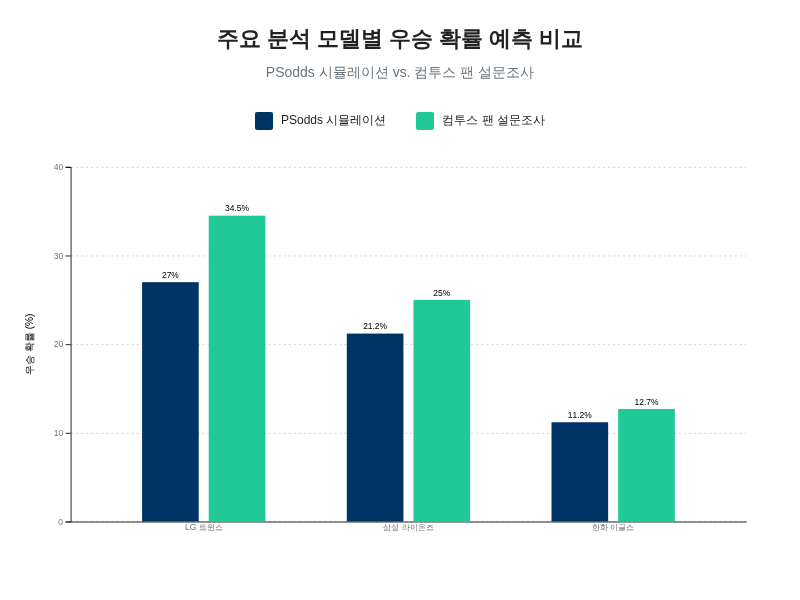
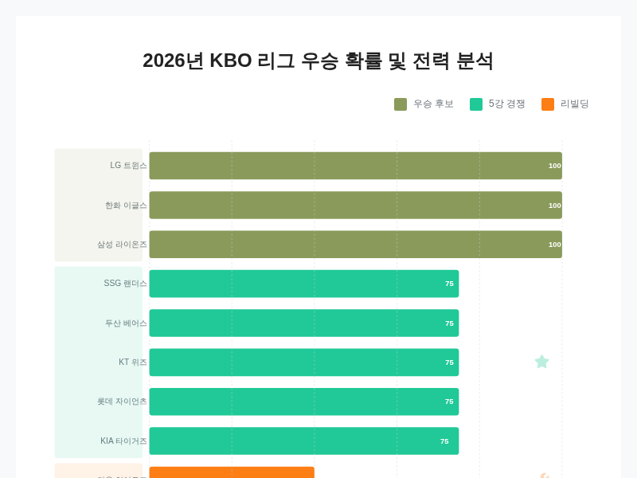
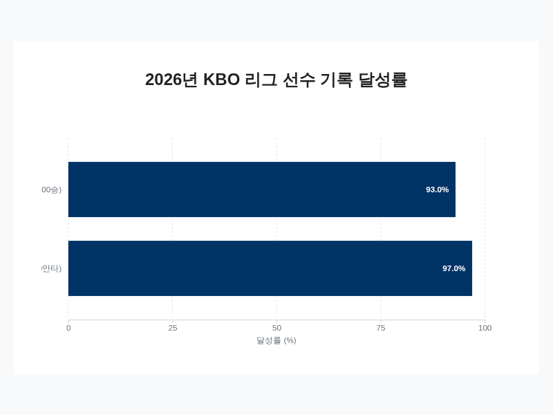
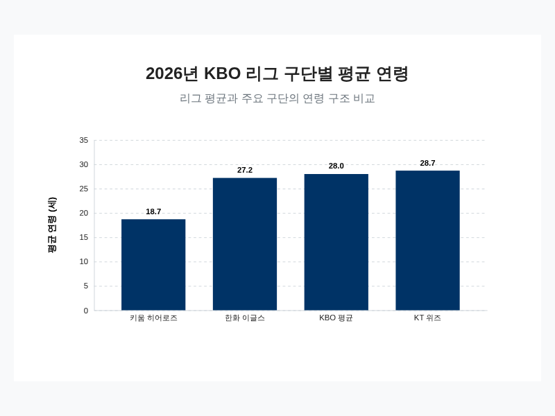
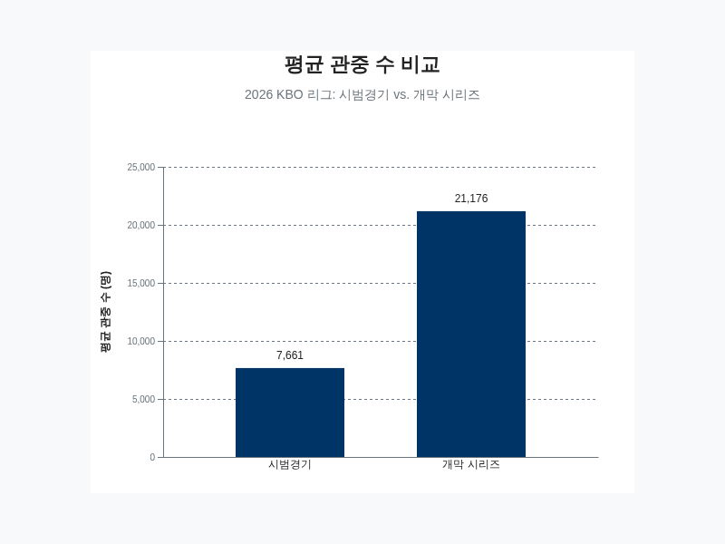

# 2026년 KBO 리그 우승 확률 및 전력 분석

## 2026년 KBO 리그 우승 후보 예측

2026년 KBO 리그는 시즌 개막 전부터 다양한 예측 모델과 전문가, 팬들의 분석을 통해 '3강-4중-3약' 또는 '3강-5중-2약'과 같은 특정 강팀들이 리그를 주도하는 구도가 형성될 것이라는 전망이 지배적이다 [[8](https://www.starnewskorea.com/sports/2026/01/02/2026010122113174569)][[13](https://mlbpark.donga.com/mp/b.php?b=kbotown&id=202601220112103586&m=view)]. 여러 분석에서 공통적으로 우승 경쟁의 선두 그룹, 즉 '3강'으로 지목되는 팀은 디펜딩 챔피언 LG 트윈스, 강력한 타선을 구축한 삼성 라이온즈, 그리고 대대적인 전력 보강에 성공한 한화 이글스이다 [[5](https://blog.naver.com/seorihana/224131023305)][[13](https://mlbpark.donga.com/mp/b.php?b=kbotown&id=202601220112103586&m=view)]. 이 세 팀은 각기 다른 강점을 바탕으로 올 시즌 가장 강력한 우승 후보로 거론되고 있다.

통계 기반 시뮬레이션 결과는 이러한 구도를 구체적인 수치로 뒷받침한다. 전 시즌 승률을 기반으로 한 'PSodds'의 시즌 전망 시뮬레이션에 따르면, LG 트윈스가 27.0%의 가장 높은 우승 확률을 기록하며 선두로 예측되었다 [[6](https://psodds.com/blog/2026/03/kbo-preseason-report-result.html)]. LG는 예상 승률 0.553과 포스트시즌 진출 확률 약 80%라는 안정적인 지표를 보이며 2년 연속 우승에 대한 기대를 높이고 있다 [[6](https://psodds.com/blog/2026/03/kbo-preseason-report-result.html)]. 그 뒤를 이어 삼성 라이온즈가 21.2%의 우승 확률과 0.542의 예상 승률로 2위를 차지했으며, 포스트시즌 진출 확률 역시 74.4%에 달해 LG와 강력한 라이벌 구도를 형성할 것으로 전망되었다 [[6](https://psodds.com/blog/2026/03/kbo-preseason-report-result.html)]. 한화 이글스는 11.2%의 우승 확률로 3위에 자리하며 상위권 경쟁에 합류할 것으로 분석되었다 [[6](https://psodds.com/blog/2026/03/kbo-preseason-report-result.html)].

팬들의 기대감 역시 상위 세 팀에 집중되는 양상을 보였다. 게임 개발사 컴투스가 '컴투스 프로야구' 시리즈 유저 약 45,000명을 대상으로 실시한 설문조사에서 LG 트윈스는 34.5%의 압도적인 지지를 얻어 우승 예상팀 1위로 선정되었다 [[4](https://www.newspic.kr/view.html?nid=2026033113293700423&pn=550)][[15](https://www.newsquest.co.kr/news/articleView.html?idxno=264001)]. 삼성 라이온즈는 25%의 지지율로 2위를 기록했으며, 한화 이글스가 12.7%로 그 뒤를 이었다 [[4](https://www.newspic.kr/view.html?nid=2026033113293700423&pn=550)][[7](http://www.spochoo.com/news/articleView.html?idxno=122412)][[15](https://www.newsquest.co.kr/news/articleView.html?idxno=264001)]. 갤럽이 실시한 전국 성인 1,000명 대상 여론조사에서도 LG 트윈스가 13%의 지지를 받아 1위를 차지했고, 한화 이글스(9%)와 KIA 타이거즈(7%) 순으로 나타나 전반적인 여론 또한 유사한 흐름을 보였다 [[9](https://elandmuseum.com/g2/bbs/board.php?bo_table=magazine&wr_id=4257)].

주요 분석 모델별 KBO 리그 상위 3개 팀 우승 확률 비교.

인공지능과 전문가들의 분석 역시 큰 틀에서 일치한다. 구글의 생성형 AI 제미니(Gemini)는 '3강-4중-3약' 구도를 예측하며 LG, 삼성, 한화를 우승에 가장 근접한 그룹으로 꼽았다 [[5](https://blog.naver.com/seorihana/224131023305)][[8](https://www.starnewskorea.com/sports/2026/01/02/2026010122113174569)]. 다만 일부 AI 분석에서는 류현진과 문동주가 이끄는 선발진과 FA로 영입된 강백호의 시너지를 높게 평가하며 한화 이글스를 가장 강력한 우승 후보로 지목하는 파격적인 예측을 내놓기도 했다 [[8](https://www.starnewskorea.com/sports/2026/01/02/2026010122113174569)][[53](https://www.mt.co.kr/sports/2026/01/02/2026010122113174569)]. 전문가 집단은 LG 트윈스의 두터운 선수층과 삼성 라이온즈의 강력한 타선을 높게 평가하며 두 팀을 '2강'으로 분류하기도 했으며, 해외 도박사들 역시 LG, 한화, 삼성이 우승을 놓고 경합할 것으로 전망하며 이들의 강세를 인정했다 [[12](https://sports.news.nate.com/view/20260213n00662)][[14](https://www.gamechosun.co.kr/webzine/article/view.php?no=221104)]. 이처럼 다양한 분석 지표들은 세부적인 순위와 확률에서 약간의 차이를 보이지만, 공통적으로 LG 트윈스, 삼성 라이온즈, 한화 이글스가 2026년 시즌 우승 트로피를 두고 가장 치열한 경쟁을 펼칠 최상위 그룹임을 명확히 시사하고 있다.

## 주요 팀별 전력 상세 분석

2025년 정규시즌과 한국시리즈 통합 우승을 달성한 디펜딩 챔피언 LG 트윈스는 2026년 시즌에도 가장 유력한 우승 후보로 꼽힌다. LG의 가장 큰 강점은 투타의 안정적인 균형에 있다 [[8](https://www.starnewskorea.com/sports/2026/01/02/2026010122113174569)][[9](https://elandmuseum.com/g2/bbs/board.php?bo_table=magazine&wr_id=4257)][[12](https://sports.news.nate.com/view/20260213n00662)][[13](https://mlbpark.donga.com/mp/b.php?b=kbotown&id=202601220112103586&m=view)]. 지난 시즌 팀 타율 리그 1위, 팀 평균자책점 3위를 기록한 지표가 이를 증명하며, 검증된 외국인 선수들과 두터운 선수층은 올 시즌에도 강력한 전력을 유지하는 원동력이 될 것으로 보인다 [[9](https://elandmuseum.com/g2/bbs/board.php?bo_table=magazine&wr_id=4257)][[11](https://seungbusa-sports.tistory.com/14)]. 비록 팀의 상징적인 타자였던 김현수가 FA로 이적하는 아쉬움이 있었지만, 문보경과 오스틴이 중심을 잡는 타선은 여전히 견고하며, 안정적인 선발진과 불펜 역시 리그 최상위권으로 평가받는다 [[8](https://www.starnewskorea.com/sports/2026/01/02/2026010122113174569)][[39](https://www.koreabaseball.com/MediaNews/Notice/View.aspx?bdSe=11790)]. 특히 2026년 시즌이 잠실야구장에서 치르는 마지막 정규시즌이라는 점은 선수단에 강력한 동기부여로 작용할 전망이다 [[8](https://www.starnewskorea.com/sports/2026/01/02/2026010122113174569)][[9](https://elandmuseum.com/g2/bbs/board.php?bo_table=magazine&wr_id=4257)][[12](https://sports.news.nate.com/view/20260213n00662)][[13](https://mlbpark.donga.com/mp/b.php?b=kbotown&id=202601220112103586&m=view)]. 다만 임창규, 케이시 켈리 등 주축 투수들의 건강 상태와 일부 핵심 선수들의 노쇠화 가능성은 2연패를 향한 여정의 주요 변수로 남아있다 [[51](https://www.aaro.kr/5370/)][[53](https://www.mt.co.kr/sports/2026/01/02/2026010122113174569)][[6](https://psodds.com/blog/2026/03/kbo-preseason-report-result.html)].

LG의 아성에 도전하는 가장 강력한 대항마로는 '슈퍼팀' 반열에 올랐다는 평가를 받는 한화 이글스가 지목된다 [[8](https://www.starnewskorea.com/sports/2026/01/02/2026010122113174569)][[53](https://www.mt.co.kr/sports/2026/01/02/2026010122113174569)]. 2025년 준우승에 그친 한화는 FA 시장에서 최대어 강백호를 영입하며 공격력을 극대화했다 [[4](https://www.newspic.kr/view.html?nid=2026033113293700423&pn=550)][[8](https://www.starnewskorea.com/sports/2026/01/02/2026010122113174569)][[13](https://mlbpark.donga.com/mp/b.php?b=kbotown&id=202601220112103586&m=view)][[14](https://www.gamechosun.co.kr/webzine/article/view.php?no=221104)]. 강백호, 노시환, 페라자로 이어지는 중심 타선은 리그 최강 수준의 파괴력을 자랑하며, 류현진과 문동주가 이끄는 선발진 역시 무게감에서 타 팀을 압도한다 [[9](https://elandmuseum.com/g2/bbs/board.php?bo_table=magazine&wr_id=4257)][[53](https://www.mt.co.kr/sports/2026/01/02/2026010122113174569)]. 시즌 초반부터 연일 두 자릿수 득점을 올리는 등 막강한 화력을 과시하며 우승에 대한 기대감을 높이고 있다 [[37](https://aromazsite.com/entry/%ED%94%84%EB%A1%9C%EC%95%BC%EA%B5%AC-KBO-2026-%EC%88%98%EB%B9%84%EC%8B%9C%ED%94%84%ED%8A%B8-%EC%A0%95%EB%A6%AC-%EA%B7%9C%EC%A0%95-%EB%B0%B0%EA%B2%BD-%EB%AF%B8%EB%9E%98)][[43](https://www.hani.co.kr/arti/sports/baseball/1251627.html)]. 하지만 강력한 전력에도 불구하고 불안 요소는 존재한다. 새롭게 합류한 외국인 투수가 KBO 리그에 얼마나 빨리 적응하느냐가 시즌 전체 성적을 좌우할 핵심 변수로 꼽히며, 안정적인 외야 수비와 테이블 세터 역할을 해줄 선수를 찾는 것 또한 팀의 과제로 남아있다 [[6](https://psodds.com/blog/2026/03/kbo-preseason-report-result.html)][[37](https://aromazsite.com/entry/%ED%94%84%EB%A1%9C%EC%95%BC%EA%B5%AC-KBO-2026-%EC%88%98%EB%B9%84%EC%8B%9C%ED%94%84%ED%8A%B8-%EC%A0%95%EB%A6%AC-%EA%B7%9C%EC%A0%95-%EB%B0%B0%EA%B2%BD-%EB%AF%B8%EB%9E%98)].

이들과 함께 강력한 '3강' 구도를 형성하는 삼성 라이온즈는 리그 최상위권으로 평가받는 공격력을 앞세워 우승에 도전한다 [[4](https://www.newspic.kr/view.html?nid=2026033113293700423&pn=550)][[9](https://elandmuseum.com/g2/bbs/board.php?bo_table=magazine&wr_id=4257)][[12](https://sports.news.nate.com/view/20260213n00662)][[13](https://mlbpark.donga.com/mp/b.php?b=kbotown&id=202601220112103586&m=view)]. 구자욱을 필두로 한 젊고 강력한 타자들에 더해, 베테랑 최형우의 영입으로 경험과 무게감을 더했다 [[1](https://brunch.co.kr/brunchbook/kbo2026)][[9](https://elandmuseum.com/g2/bbs/board.php?bo_table=magazine&wr_id=4257)]. 특히 타자 친화적인 홈구장을 사용한다는 이점은 삼성의 막강한 타선과 시너지를 일으킬 것으로 기대된다 [[42](https://www.koreadaily.com/article/20260330221148793)]. 그러나 우승으로 가는 길에 약점 또한 명확하다. 원태인을 비롯한 주축 투수들이 시즌 초반 부상으로 이탈했으며, 고질적인 문제로 지적되어 온 불펜의 과부하 문제는 시즌 내내 팀의 발목을 잡을 수 있는 가장 큰 변수로 지적된다 [[13](https://mlbpark.donga.com/mp/b.php?b=kbotown&id=202601220112103586&m=view)][[42](https://www.koreadaily.com/article/20260330221148793)][[51](https://www.aaro.kr/5370/)]. 그럼에도 불구하고 삼성은 2026년 우승을 공언하며 팀 전체의 사기가 높은 상태를 유지하고 있다 [[4](https://www.newspic.kr/view.html?nid=2026033113293700423&pn=550)][[9](https://elandmuseum.com/g2/bbs/board.php?bo_table=magazine&wr_id=4257)][[12](https://sports.news.nate.com/view/20260213n00662)][[13](https://mlbpark.donga.com/mp/b.php?b=kbotown&id=202601220112103586&m=view)].

우승 후보 그룹의 뒤를 이어 치열한 5강 경쟁을 펼칠 중위권 팀들의 전력도 만만치 않다. 지난 시즌 3위를 차지한 SSG 랜더스는 리그 1위 평균자책점을 기록한 강력한 불펜이 최대 강점이다 [[9](https://elandmuseum.com/g2/bbs/board.php?bo_table=magazine&wr_id=4257)]. 마무리 조병현을 중심으로 한 철벽 계투진과 새로 영입한 외국인 투수들이 마운드를 지키고, 김재현과 최정 등이 버티는 타선이 힘을 보탠다면 상위권 경쟁에 충분히 뛰어들 수 있는 저력을 갖추고 있다 [[8](https://www.starnewskorea.com/sports/2026/01/02/2026010122113174569)][[9](https://elandmuseum.com/g2/bbs/board.php?bo_table=magazine&wr_id=4257)][[13](https://mlbpark.donga.com/mp/b.php?b=kbotown&id=202601220112103586&m=view)]. 두산 베어스는 FA 시장에서 4년 총액 80억 원에 박찬호를 영입하며 내야 수비의 안정감을 크게 높였다 [[8](https://www.starnewskorea.com/sports/2026/01/02/2026010122113174569)][[12](https://sports.news.nate.com/view/20260213n00662)][[13](https://mlbpark.donga.com/mp/b.php?b=kbotown&id=202601220112103586&m=view)][[48](https://namda5.tistory.com/101)]. 이영하 등 주축 선수들을 잔류시키고 새로운 외국인 투수들을 수혈하며 전력을 보강했으며, 5강 경쟁의 주요 변수가 될 것으로 예상된다 [[53](https://www.mt.co.kr/sports/2026/01/02/2026010122113174569)]. 그 외에도 KT 위즈는 LG에서 이적한 김현수를 중심으로 타선을 강화했으며 [[48](https://namda5.tistory.com/101)], 롯데 자이언츠는 주축 선수 4명이 도박 혐의로 징계를 받는 악재에도 불구하고 잠재력 있는 투타 전력을 바탕으로 5강 후보로 꾸준히 거론된다 [[13](https://mlbpark.donga.com/mp/b.php?b=kbotown&id=202601220112103586&m=view)][[14](https://www.gamechosun.co.kr/webzine/article/view.php?no=221104)][[51](https://www.aaro.kr/5370/)]. 반면, KIA 타이거즈는 전력 보강이 미흡하고 주축 선수의 이탈이 있었다는 우려 속에서도 일부 전문가들로부터 우승권 후보로 평가받는 등 [[5](https://blog.naver.com/seorihana/224131023305)][[51](https://www.aaro.kr/5370/)], 상반된 전망이 공존하며 시즌 향방을 예측하기 어려운 팀으로 분류된다.

한편, 리빌딩 3년 차에 접어든 키움 히어로즈는 주축 선수들의 메이저리그 이적과 부상 여파로 인해 어려운 시즌을 보낼 것으로 예상된다 [[8](https://www.starnewskorea.com/sports/2026/01/02/2026010122113174569)][[11](https://seungbusa-sports.tistory.com/14)]. 여러 예측에서 최하위권을 포함한 하위권으로 분류되며, 당장의 성적보다는 장기적인 관점에서 유망주들의 성장을 지켜보는 시즌이 될 가능성이 높다 [[13](https://mlbpark.donga.com/mp/b.php?b=kbotown&id=202601220112103586&m=view)][[14](https://www.gamechosun.co.kr/webzine/article/view.php?no=221104)][[53](https://www.mt.co.kr/sports/2026/01/02/2026010122113174569)]. 이처럼 2026년 KBO 리그는 강력한 우승 후보 '3강'과 이들을 추격하는 탄탄한 중위권 그룹, 그리고 재건을 도모하는 팀들로 나뉘어 그 어느 때보다 치열한 순위 경쟁을 예고하고 있다.

2026년 KBO 리그 구단별 예상 전력 등급.

## 핵심 선수 분석 및 기대 성적 예측

팀의 거시적인 전력 구도와 더불어, 2026년 시즌의 향방을 결정할 또 다른 핵심 변수는 바로 개별 선수들의 활약과 컨디션이다. 특히 FA 시장의 대형 계약이나 핵심 선수의 이적은 리그 전체의 판도를 뒤흔들 수 있는 중요한 사건으로, 이들의 성적이 팀의 운명을 좌우하는 경우가 많다. 2026년 FA 시장에서 가장 주목받았던 유격수 박찬호는 대체 선수 대비 승리 기여도(WAR) 예측치에서 4.56이라는 높은 수치를 기록하며 A등급으로 평가받았다 [[21](https://m.fmkorea.com/index.php?mid=baseball&order_type=desc&category=1311232643&document_srl=9709123936)]. 이는 그가 공수 양면에서 팀 전력에 얼마나 큰 기여를 할 수 있는지를 보여주는 지표로, 두산 베어스는 그를 영입함으로써 내야 안정화와 공격력 강화를 동시에 꾀할 수 있게 되었다.

한화 이글스의 우승 도전 역시 FA로 영입된 강백호의 활약에 크게 의존하고 있다 [[53](https://www.mt.co.kr/sports/2026/01/02/2026010122113174569)][[59](https://funfunotter.com/entry/AI%EA%B0%80-%EC%98%88%EC%B8%A1%ED%95%9C-2026-KBO-%EB%8C%80%EC%9D%B4%EB%B3%80-%ED%95%9C%ED%99%94-1%EC%9C%84-%EB%8B%B9%EC%8B%A0-%ED%8C%80-%EC%9A%B0%EC%8A%B9-%ED%99%95%EB%A5%A0%EC%9D%80)]. 그의 합류는 기존의 노시환, 페라자와 함께 리그 최강의 중심 타선을 구축하는 마지막 퍼즐 조각으로 평가받는다. 강백호가 기대만큼의 파괴력을 보여준다면 한화는 시즌 내내 막강한 득점력을 유지하며 우승 경쟁에서 유리한 고지를 점할 수 있을 것이다. 그의 활약 여부는 한화가 '슈퍼팀'이라는 평가에 걸맞은 성적을 낼 수 있을지를 가늠하는 가장 중요한 척도가 될 전망이다.

반면, 개별 선수의 성적은 시즌 중에도 끊임없이 변동하며 팀에 예상치 못한 변수를 제공한다. 디펜딩 챔피언 LG 트윈스의 핵심 타자 홍창기는 2026년 4월 14일을 기준으로 5경기 연속 무안타에 그치며 시즌 타율이 0.156까지 떨어지는 극심한 부진을 겪었다 [[18](https://news.nate.com/view/20260414n25780?mid=n1101)]. 비록 그가 여전히 라인업의 한 축을 담당하고 있지만, 이러한 슬럼프가 장기화될 경우 팀 공격력에 적지 않은 타격이 될 수 있다. 이와 대조적으로 선발 투수 송승기는 시즌 초 두 경기에 등판하여 1승 무패, 평균자책점 0.96이라는 뛰어난 성적을 기록하며 팀 마운드에 새로운 활력소가 되고 있다 [[18](https://news.nate.com/view/20260414n25780?mid=n1101)]. 이처럼 주축 선수들의 컨디션 변화와 박동원의 체력 안배를 위한 교체 투입 등은 시즌 운영의 중요한 관리 요소로 작용한다 [[18](https://news.nate.com/view/20260414n25780?mid=n1101)].

2026년 시즌은 여러 베테랑 선수들이 KBO 리그 역사에 길이 남을 대기록에 도전하는 해이기도 하다. KIA 타이거즈의 양현종은 개인 통산 200승(현재 186승)과 최다 탈삼진 기록 경신을 눈앞에 두고 있으며, 한화 이글스의 손아섭은 KBO 역사상 최초의 2,700안타까지 82개만을 남겨두고 있다 [[22](https://sy1s.tistory.com/entry/2026-%ED%94%84%EB%A1%9C%EC%95%BC%EA%B5%AC%EC%88%9C%EC%9C%84-%EC%B4%9D%EC%A0%95%EB%A6%AC-KBO-%EB%A6%AC%EA%B7%B8-%ED%88%AC%EB%B3%84-%EC%88%9C%EC%9C%84-%ED%98%84%ED%99%A9%EA%B3%BC-%EC%8B%9C%EC%A6%8C-%EC%A0%84%EB%A7%9D)]. 또한 SSG 랜더스의 최정은 550홈런, 삼성 라이온즈의 강민호는 KBO 리그 최다 출장(2,500경기)이라는 금자탑을 쌓을 것으로 기대된다 [[22](https://sy1s.tistory.com/entry/2026-%ED%94%84%EB%A1%9C%EC%95%BC%EA%B5%AC%EC%88%9C%EC%9C%84-%EC%B4%9D%EC%A0%95%EB%A6%AC-KBO-%EB%A6%AC%EA%B7%B8-%ED%88%AC%EB%B3%84-%EC%88%9C%EC%9C%84-%ED%98%84%ED%99%A9%EA%B3%BC-%EC%8B%9C%EC%A6%8C-%EC%A0%84%EB%A7%9D)]. LG 트윈스의 박해민 역시 KBO 역대 4번째 500도루 달성을 향해 나아가고 있으며, 이 외에도 이진성의 홀드 기록, 정수빈의 3루타 기록 등 다양한 개인 기록들이 시즌 내내 팬들에게 또 다른 관전 포인트를 제공할 것이다 [[15](https://www.newsquest.co.kr/news/articleView.html?idxno=264001)][[22](https://sy1s.tistory.com/entry/2026-%ED%94%84%EB%A1%9C%EC%95%BC%EA%B5%AC%EC%88%9C%EC%9C%84-%EC%B4%9D%EC%A0%95%EB%A6%AC-KBO-%EB%A6%AC%EA%B7%B8-%ED%88%AC%EB%B3%84-%EC%88%9C%EC%9C%84-%ED%98%84%ED%99%A9%EA%B3%BC-%EC%8B%9C%EC%A6%8C-%EC%A0%84%EB%A7%9D)]. 이러한 대기록 도전은 선수 개인에게 강력한 동기부여가 되어 팀 성적에도 긍정적인 영향을 미칠 수 있다.

주요 베테랑 선수들의 개인 통산 대기록 달성률 비교.

궁극적으로 시즌 전의 선수 성적 예측은 여러 변수로 인해 한계를 가질 수밖에 없다. 시즌 초반 4~5경기의 성적만으로 전체 시즌을 판단하기에는 통계적 의미가 부족하며, 부상이라는 예측 불가능한 변수는 언제든 팀 전력에 심각한 공백을 초래할 수 있다 [[29](https://sy1s.tistory.com/entry/2026-%ED%94%84%EB%A1%9C%EC%95%BC%EA%B5%AC%EC%88%9C%EC%9C%84-%EC%B4%9D%EC%A0%95%EB%A6%AC-KBO-%EB%A6%AC%EA%B7%B8-%ED%8C%80%EB%B3%84-%EC%88%9C%EC%9C%84-%ED%98%84%ED%99%A9%EA%B3%BC-%EC%8B%9C%EC%A6%8C-%EC%A0%84%EB%A7%9D)]. 또한 두산의 엘리아스와 같이 새로 합류한 외국인 선수들이 리그에 얼마나 성공적으로 적응하는지, 그리고 157km/h의 강속구를 던지는 신인 박준현과 같은 새로운 얼굴들이 어떤 활약을 펼칠지는 각 팀의 성적을 좌우할 결정적인 요인이 될 것이다 [[6](https://psodds.com/blog/2026/03/kbo-preseason-report-result.html)][[11](https://seungbusa-sports.tistory.com/14)][[53](https://www.mt.co.kr/sports/2026/01/02/2026010122113174569)]. 따라서 핵심 선수들의 기대 성적과 더불어 이러한 잠재적 변수들을 종합적으로 고려하는 것이 시즌 전체의 흐름을 이해하는 데 필수적이다.

## 팀 내구성 및 핵심 전략 평가

팀의 장기적인 경쟁력을 평가하는 데 있어 선수단의 연령 분포는 핵심적인 지표로 작용한다. 2026년 KBO 리그에 등록된 621명 선수의 전체 평균 연령은 28.0세로 나타나, 리그 전반에 걸쳐 신구 조화가 이루어지고 있음을 시사한다 [[30](https://sports.news.nate.com/view/20260102n00085)][[33](https://cafe.daum.net/Duckgu/D49M/496768?svc=cafefavoritearticle)]. 각 팀의 상황은 상이하게 나타나는데, KT 위즈는 평균 연령 28.7세로 리그에서 비교적 노련한 선수층을 보유하고 있으며, 42세의 베테랑 투수 우규민이 팀의 구심점 역할을 하고 있다 [[33](https://cafe.daum.net/Duckgu/D49M/496768?svc=cafefavoritearticle)]. 반면 강력한 우승 후보로 부상한 한화 이글스는 평균 연령 27.2세로 상대적으로 젊은 편에 속하며, 40세의 류현진이 젊은 선수들을 이끌고 있다 [[33](https://cafe.daum.net/Duckgu/D49M/496768?svc=cafefavoritearticle)]. 가장 극단적인 사례는 키움 히어로즈로, 평균 연령이 18.7세에 불과하여 '소년 선발단'이라는 별칭으로 불릴 만큼 젊은 선수단을 운영하는 독특한 전략을 채택하고 있다 [[33](https://cafe.daum.net/Duckgu/D49M/496768?svc=cafefavoritearticle)]. 이처럼 팀별 연령 구조의 차이는 단기적인 성과와 장기적인 성장 가능성 사이에서 각 구단이 추구하는 방향성을 명확히 보여준다.

2026년 KBO 리그 주요 구단 및 리그 전체 평균 연령 비교.

선수단의 신진대사는 팀의 지속 가능한 강팀으로의 도약을 위해 필수적이다. 삼성 라이온즈의 최형우(만 42세)와 SSG 랜더스의 노경은(만 42세) 같은 최고령 선수들이 여전히 리그에서 중요한 역할을 수행하고 있지만 [[32](https://logistician.tistory.com/entry/KBO-2026-%ED%8C%80%EB%B3%84-%EC%84%A0%EC%88%98-%ED%94%84%EB%A1%9C%ED%95%84-%ED%86%B5%EA%B3%84-%EB%82%98%EC%9D%B4-%EC%8B%A0%EC%9E%A5-%EC%B2%B4%EC%A4%91-%EC%B6%9C%EC%8B%A0%EA%B3%A0)], 팀의 미래는 결국 젊은 선수들의 성장에 달려있다. 2025년 신인 드래프트에 1,197명이 지원하는 등 새로운 인재들이 꾸준히 유입되고 있으며, 삼성 라이온즈가 투수진 보강을 위해 지명 선수 중 9명을 투수로 채운 것처럼 각 팀은 드래프트를 통해 명확한 약점 보강 계획을 실행하고 있다 [[35](https://namu.wiki/w/KBO%20%EB%A6%AC%EA%B7%B8/%EC%97%AD%EB%8C%80%20FA/2026)]. 이러한 신인급 선수들의 가세는 팀에 새로운 활력을 불어넣는 동시에, 기존 주축 선수들과의 조화를 통해 전력의 안정성을 높이는 역할을 한다 [[34](https://m.blog.naver.com/sportsrix/224123671028)]. 한화 이글스가 강백호를 4년 100억 원이라는 대형 계약으로 영입한 것은 단순히 타선을 강화하는 것을 넘어, 젊은 주축 선수들과 경험 많은 베테랑 사이의 균형, 즉 '제니스-밸런스(Zenith-Balance)'를 맞추려는 전략적 움직임으로 분석된다 [[28](https://mlbpark.donga.com/mp/b.php?b=kbotown&id=202601050111843471&m=view)]. 반면 전년도 우승팀 LG 트윈스는 샐러리 캡 문제로 FA 선수 유지에 어려움을 겪는 등, 베테랑과 유망주의 조화를 이루는 것이 모든 팀에게 주어진 공통적인 과제임을 보여준다 [[28](https://mlbpark.donga.com/mp/b.php?b=kbotown&id=202601050111843471&m=view)].

선수 구성의 변화와 더불어, 2026년 시즌부터 도입된 새로운 규정들은 각 팀의 핵심 전략에 근본적인 변화를 요구하고 있다. 가장 큰 영향을 미칠 것으로 예상되는 변화는 수비 시프트의 전면적인 제한이다 [[37](https://aromazsite.com/entry/%ED%94%84%EB%A1%9C%EC%95%BC%EA%B5%AC-KBO-2026-%EC%88%98%EB%B9%84%EC%8B%9C%ED%94%84%ED%8A%B8-%EC%A0%95%EB%A6%AC-%EA%B7%9C%EC%A0%95-%EB%B0%B0%EA%B2%BD-%EB%AF%B8%EB%9E%98)]. 이전까지 데이터 분석에 기반한 극단적인 수비 시프트는 좌타자의 타율을 낮추는 효과적인 전략으로 널리 활용되었으나, 이제는 투수가 투구하는 시점에 4명의 내야수 모두가 내야 흙 안에 두 발을 두어야 하며, 2루를 기준으로 양쪽에 2명씩 위치해야만 한다 [[37](https://aromazsite.com/entry/%ED%94%84%EB%A1%9C%EC%95%BC%EA%B5%AC-KBO-2026-%EC%88%98%EB%B9%84%EC%8B%9C%ED%94%84%ED%8A%B8-%EC%A0%95%EB%A6%AC-%EA%B7%9C%EC%A0%95-%EB%B0%B0%EA%B2%BD-%EB%AF%B8%EB%9E%98)]. 이는 사실상 모든 형태의 극단적인 시프트를 금지하는 조치로, 2026년 3월 12일부터 시작된 시범경기를 통해 본격적으로 적용되었다 [[38](https://www.khan.co.kr/article/202603112107005)].

이러한 규정 변화의 파급력은 강력한 페널티 조항을 통해 더욱 강화된다. 만약 규정을 위반한 내야수가 타구에 처음으로 접촉할 경우, 공격팀은 해당 내야수에게 실책을 기록하게 하고 타자의 타석 기록에서 제외하는 선택권을 갖게 된다 [[37](https://aromazsite.com/entry/%ED%94%84%EB%A1%9C%EC%95%BC%EA%B5%AC-KBO-2026-%EC%88%98%EB%B9%84%EC%8B%9C%ED%94%84%ED%8A%B8-%EC%A0%95%EB%A6%AC-%EA%B7%9C%EC%A0%95-%EB%B0%B0%EA%B2%BD-%EB%AF%B8%EB%9E%98)]. 이는 수비팀에게 상당한 부담으로 작용하며, 시프트 활용을 강력하게 억제하는 효과를 낳을 것이다. 유사한 규정을 2023년 먼저 도입했던 메이저리그(MLB)의 경우, 리그 전체 타율이 0.243에서 0.248로 상승하고 안타 수가 증가하는 등 경기를 더욱 역동적으로 만드는 긍정적인 효과를 가져왔다 [[37](https://aromazsite.com/entry/%ED%94%84%EB%A1%9C%EC%95%BC%EA%B5%AC-KBO-2026-%EC%88%98%EB%B9%84%EC%8B%9C%ED%94%84%ED%8A%B8-%EC%A0%95%EB%A6%AC-%EA%B7%9C%EC%A0%95-%EB%B0%B0%EA%B2%BD-%EB%AF%B8%EB%9E%98)]. 따라서 KBO 리그 역시 이번 규정 변화로 인해 좌타자들의 성적이 전반적으로 향상되고, 인플레이 타구의 비중이 늘어나면서 수비력이 뛰어난 내야수들의 가치가 더욱 높아지는 전략적 전환이 이루어질 것으로 전망된다.

수비 시프트 제한 외에도 경기 운영에 직접적인 영향을 미치는 여러 규정들이 새롭게 도입되었다. 경기 시간 단축을 위해 주자가 없을 시 18초, 있을 시 23초로 단축된 피치 클락이 엄격하게 적용되며, 이를 위반할 경우 투수에게는 즉시 볼이, 타자에게는 스트라이크가 선언된다 [[17](https://rushonplay.com/kbo-league-2026/)][[38](https://www.khan.co.kr/article/202603112107005)][[47](https://www.koreabaseball.com/Kbo/League/GameManage2026.aspx)]. 또한, 자동 투구 판정 시스템(ABS)이 2.0 버전으로 업그레이드되어 타자 신장에 맞춰 개인화된 스트라이크 존을 적용함으로써 판정의 일관성을 높였다 [[17](https://rushonplay.com/kbo-league-2026/)][[47](https://www.koreabaseball.com/Kbo/League/GameManage2026.aspx)]. 여기에 더해 체크 스윙과 2, 3루에서의 슬라이딩 오버런에 대한 비디오 판독이 가능해지면서 감독의 경기 운영에 새로운 변수가 추가되었다 [[17](https://rushonplay.com/kbo-league-2026/)][[38](https://www.khan.co.kr/article/202603112107005)][[47](https://www.koreabaseball.com/Kbo/League/GameManage2026.aspx)]. 아시아 쿼터 제도의 도입으로 각 팀은 추가 외국인 선수 1명을 더 활용할 수 있게 되었으며, 이는 특히 마운드 보강에 큰 도움이 될 것으로 보인다 [[47](https://www.koreabaseball.com/Kbo/League/GameManage2026.aspx)][[48](https://namda5.tistory.com/101)]. 이처럼 다각적인 규정 변화는 2026년 시즌을 맞이하는 모든 팀에게 기존의 전략을 재검토하고 새로운 환경에 적응해야 하는 중요한 과제를 던져주고 있다.

## 시즌 전망 및 주요 관전 포인트

2026년 KBO 리그는 3월 12일부터 24일까지의 시범경기를 거쳐 3월 28일 정규 시즌의 막을 올렸으며, 10개 구단이 팀당 144경기의 대장정을 시작했다 [[39](https://www.koreabaseball.com/MediaNews/Notice/View.aspx?bdSe=11790)][[51](https://www.aaro.kr/5370/)]. 특히 이번 시즌은 1982년 개장 이래 한국 야구의 상징적인 장소로 자리매김해 온 잠실야구장에서 열리는 마지막 정규 시즌이라는 점에서 특별한 의미를 지닌다 [[10](https://keepmylifesimple.tistory.com/50)]. 44년의 역사를 뒤로하고 새로운 시대를 맞이하는 잠실야구장의 마지막 해라는 사실은 홈 구장으로 사용하는 LG 트윈스 선수단에게 강력한 동기부여로 작용할 수 있다 [[10](https://keepmylifesimple.tistory.com/50)]. 리그에 대한 팬들의 뜨거운 관심은 시범경기부터 증명되었는데, 역대 최다 관중인 32만 명 이상이 경기장을 찾았으며 경기당 평균 7,661명의 관중을 기록했다 [[38](https://www.khan.co.kr/article/202603112107005)]. 이러한 열기는 개막 시리즈에서도 이어져, 10개 구장에서 치러진 10경기가 2년 연속 전 경기 매진을 기록하며 총 211,756명의 관중을 동원하는 성공적인 출발을 알렸다 [[43](https://www.hani.co.kr/arti/sports/baseball/1251627.html)].

2026 KBO 리그 시범경기와 개막 시리즈의 경기당 평균 관중 수 비교.

이처럼 뜨거운 열기 속에서 개막한 시즌이지만, 그 이면에는 예측을 어렵게 만드는 여러 중대한 변수들이 존재한다. 가장 큰 파장을 일으키고 있는 이슈는 롯데 자이언츠를 휩쓴 도박 파문이다 [[13](https://mlbpark.donga.com/mp/b.php?b=kbotown&id=202601220112103586&m=view)]. 롯데는 시범경기에서 1위를 차지하며 막강한 전력을 과시했지만, 주축 선수들이 도박과 관련된 징계로 이탈하면서 시즌 초반 심각한 전력 누수가 예상된다 [[10](https://keepmylifesimple.tistory.com/50)][[13](https://mlbpark.donga.com/mp/b.php?b=kbotown&id=202601220112103586&m=view)]. 이는 시즌 전 전력 평가와 실제 성적 사이에 큰 괴리를 만들어낼 수 있는 결정적인 요인으로, 롯데의 시즌 초반 행보는 리그 전체 순위 경쟁 구도에 상당한 영향을 미칠 것으로 보인다.

롯데의 내부 문제 외에도 2026년 시즌의 향방을 가를 주요 관전 포인트는 여러 가지가 있다. 외국인 선수들의 활약 여부는 매 시즌 각 팀의 성적을 좌우하는 핵심 변수이며, 이들의 승리 기여도가 평균 26.7%에 달한다는 분석은 그 중요성을 뒷받침한다 [[14](https://www.gamechosun.co.kr/webzine/article/view.php?no=221104)][[6](https://psodds.com/blog/2026/03/kbo-preseason-report-result.html)]. 또한 강백호를 영입하며 '슈퍼팀'으로 거듭난 한화 이글스가 과연 기대에 부응하는 성적을 낼 수 있을지, 그리고 월드 베이스볼 클래식(WBC)에 참가했던 국가대표 선수들이 컨디션을 얼마나 성공적으로 회복하여 시즌을 치를 수 있을지도 중요한 관전 포인트로 꼽힌다 [[12](https://sports.news.nate.com/view/20260213n00662)][[13](https://mlbpark.donga.com/mp/b.php?b=kbotown&id=202601220112103586&m=view)]. 개막 시리즈에서는 강백호가 합류한 한화의 공격력이 강력한 인상을 남겼고, 롯데 역시 두 경기에서 7개의 홈런을 터뜨리는 파괴력을 선보였다 [[43](https://www.hani.co.kr/arti/sports/baseball/1251627.html)]. 반면 디펜딩 챔피언 LG와 2024년 우승팀 KIA가 나란히 패배를 기록하며 시즌 초반 판도가 결코 순탄치 않을 것임을 예고했다 [[43](https://www.hani.co.kr/arti/sports/baseball/1251627.html)].

궁극적으로 시즌 초반의 몇 경기 성적만으로 전체 시즌의 흐름을 단정하기는 어렵다 [[29](https://sy1s.tistory.com/entry/2026-%ED%94%84%EB%A1%9C%EC%95%BC%EA%B5%AC%EC%88%9C%EC%9C%84-%EC%B4%9D%EC%A0%95%EB%A6%AC-KBO-%EB%A6%AC%EA%B7%B8-%ED%8C%80%EB%B3%84-%EC%88%9C%EC%9C%84-%ED%98%84%ED%99%A9%EA%B3%BC-%EC%8B%9C%EC%A6%8C-%EC%A0%84%EB%A7%9D)]. 4~5경기의 표본은 통계적으로 유의미한 결론을 내리기에 턱없이 부족하며, 시즌이 진행됨에 따라 부상이라는 예측 불가능한 변수가 언제든 발생할 수 있기 때문이다. 157km/h의 강속구를 던지는 신인 박준현과 같은 새로운 얼굴들의 등장과 외국인 선수들의 리그 적응 여부 또한 각 팀의 운명을 가를 잠재적인 변수다 [[53](https://www.mt.co.kr/sports/2026/01/02/2026010122113174569)][[6](https://psodds.com/blog/2026/03/kbo-preseason-report-result.html)]. 따라서 2026년 시즌은 잠실야구장의 마지막 시즌이라는 상징적인 배경 속에서, 데이터 전쟁의 심화, 예상치 못한 외부 변수, 그리고 새로운 스타의 탄생 가능성이 복합적으로 작용하며 팬들에게 한층 더 흥미롭고 예측 불가능한 한 해를 선사할 것으로 전망된다 [[39](https://www.koreabaseball.com/MediaNews/Notice/View.aspx?bdSe=11790)].

## 출처

[1] [2026 KBO 전력 분석서 - 브런치북](https://brunch.co.kr/brunchbook/kbo2026)  
[2] [2026년 야구선수 인기순위와 우승 예상팀은? - 네이버 블로그](https://blog.naver.com/PostView.naver?blogId=etoday12&logNo=224239753499&redirect=Dlog)  
[3] [전문가 전망 "LG·삼성 2강…KT·한화·두산·롯데 5강 경쟁"\[2026 프로야구 개막②\]](https://v.daum.net/v/tzwUpKiPoM)  
[4] ["LG가 또 우승한다?" 유저들이 분석한 2026 KBO 우승 시나리오 - 뉴스픽](https://www.newspic.kr/view.html?nid=2026033113293700423&pn=550)  
[5] [4중-3약' AI가 분석한 2026 KBO 프로야구 예상 순위 : 네이버 블로그](https://blog.naver.com/seorihana/224131023305)  
[6] [2026 KBO Preseason Report - 결과편 - PSodds](https://psodds.com/blog/2026/03/kbo-preseason-report-result.html)  
[7] [“2026 KBO 우승 예상팀은 LG 트윈스”…‘컴프야’ 유저들의 선택 < 야구 < 스포츠 < 기사본문 - 더게이트(THE GATE)](http://www.spochoo.com/news/articleView.html?idxno=122412)  
[8] [‘LG가 1강 아니라니...' 2026 KBO 순위 판도 '3강-4중 - 스타뉴스](https://www.starnewskorea.com/sports/2026/01/02/2026010122113174569)  
[9] [2026 KBO리그 전망 ① - 이랜드 뮤지엄 스토리 게시판](https://elandmuseum.com/g2/bbs/board.php?bo_table=magazine&wr_id=4257)  
[10] [2026 프로야구 순위 예측 완전판 — 3강·4중·3약 구도 총정리](https://keepmylifesimple.tistory.com/50)  
[11] [2026 KBO 10개 구단 전력 분석 & 순위 예측 - 3강 5중 2약](https://seungbusa-sports.tistory.com/14)  
[12] ["LG·한화·삼성이 우승 놓고 경합→롯데 9위-키움 최하위" 해외 도박사 KBO 순위 예측 : 네이트 스포츠](https://sports.news.nate.com/view/20260213n00662)  
[13] [2026년 한화 전력 예상 (타 팀 순위 간략 예상) - MLBpark](https://mlbpark.donga.com/mp/b.php?b=kbotown&id=202601220112103586&m=view)  
[14] [‘컴투스프로야구’ 유저들이 꼽은 2026 KBO 리그 우승 예상팀은 'LG 트윈스' - 게임조선](https://www.gamechosun.co.kr/webzine/article/view.php?no=221104)  
[15] ['컴투스프로야구' 유저들이 꼽은 2026 KBO 리그 우승 예상팀은 'LG 트윈스'](https://www.newsquest.co.kr/news/articleView.html?idxno=264001)  
[16] [Instagram](https://www.instagram.com/p/DU0nykwD3bw/)  
[17] [2026 KBO 리그 완벽 분석: 오늘의 경기 일정, 피타고리안 승률](https://rushonplay.com/kbo-league-2026/)  
[18] [박동원이 빠진다, '5G 연속 무안타' 홍창기 여전히 7번 배치…'승승승승승승승' LG 라인업 \[MD잠실\] : 네이트 스포츠](https://news.nate.com/view/20260414n25780?mid=n1101)  
[19] [오늘 이기면 7년 만에 8연승인데...박동원이 쉰다, 홍창기 7번 - 조선일보](https://www.chosun.com/sports/baseball/2026/04/14/MM3TIN3CGBTDQM3GMJRWGZBVGI/)  
[20] [\[2026시즌 팀별 전력 분석\] 2026 KBO 10개 구단 전력 총정리 & 시즌 ...](https://www.youtube.com/watch?v=qtVtxmSXRtE)  
[21] [2026년 4월 15일 기준 KBO 리그 타자 WAR 팀별 순위 - 야구 - 에펨코리아](https://m.fmkorea.com/index.php?mid=baseball&order_type=desc&category=1311232643&document_srl=9709123936)  
[22] [2026 프로야구순위 총정리: KBO 리그 팀별 순위 현황과 시즌 전망](https://sy1s.tistory.com/entry/2026-%ED%94%84%EB%A1%9C%EC%95%BC%EA%B5%AC%EC%88%9C%EC%9C%84-%EC%B4%9D%EC%A0%95%EB%A6%AC-KBO-%EB%A6%AC%EA%B7%B8-%ED%88%AC%EB%B3%84-%EC%88%9C%EC%9C%84-%ED%98%84%ED%99%A9%EA%B3%BC-%EC%8B%9C%EC%A6%8C-%EC%A0%84%EB%A7%9D)  
[23] [2026 KBO: Players You Must Keep an Eye On from Each Team](https://www.youtube.com/watch?v=sUbs0678fW0)  
[24] [2026 KBO FA 타자 WAR 순위 TOP 12 전격 공개! 1위는 누구?](https://www.youtube.com/shorts/6c50IzFcPVo)  
[25] [2026년 팀별 예상WAR - 야구 - 에펨코리아](https://www.fmkorea.com/9499425652)  
[26] [제미나이가 보는 2026 kbo 순위 예측 + 우승확률](https://www.fmkorea.com/9116276401)  
[27] [컴투스 '컴투스프로야구', '2026 시즌 KBO 리그 우승팀 예측 설문 결과 ...](https://m.ruliweb.com/news/read/222960)  
[28] [AI 별 예측한 KBO 2026 예상순위 : MLBPARK](https://mlbpark.donga.com/mp/b.php?b=kbotown&id=202601050111843471&m=view)  
[29] [2026 프로야구순위 총정리: KBO 리그 팀별 순위 현황과 시즌 전망](https://sy1s.tistory.com/entry/2026-%ED%94%84%EB%A1%9C%EC%95%BC%EA%B5%AC%EC%88%9C%EC%9C%84-%EC%B4%9D%EC%A0%95%EB%A6%AC-KBO-%EB%A6%AC%EA%B7%B8-%ED%8C%80%EB%B3%84-%EC%88%9C%EC%9C%84-%ED%98%84%ED%99%A9%EA%B3%BC-%EC%8B%9C%EC%A6%8C-%EC%A0%84%EB%A7%9D)  
[30] ['LG 1위 아니면...' 2026 KBA... '3-4-3' 예상(AI) 분석했다 : 스포츠](https://sports.news.nate.com/view/20260102n00085)  
[31] [2026 한국프로야구, 올 시즌 10개 구단 순위 예측 체크! \[불타는 야구팬 불패\]](https://www.youtube.com/watch?v=_t0O3KiNW3Q)  
[32] [KBO 2026 팀별 선수 프로필 통계 (나이, 신장, 체중, 출신고)](https://logistician.tistory.com/entry/KBO-2026-%ED%8C%80%EB%B3%84-%EC%84%A0%EC%88%98-%ED%94%84%EB%A1%9C%ED%95%84-%ED%86%B5%EA%B3%84-%EB%82%98%EC%9D%B4-%EC%8B%A0%EC%9E%A5-%EC%B2%B4%EC%A4%91-%EC%B6%9C%EC%8B%A0%EA%B3%A0)  
[33] [2026 KBO 구단별 평균 신체 & 나이 - 이슈늬우스 - 방석 위로 모여라](https://cafe.daum.net/Duckgu/D49M/496768?svc=cafefavoritearticle)  
[34] [2026 KBO 구단별 예상 선발 로테이션 정리 분석! 1등팀은 어디? : 네이버 블로그](https://m.blog.naver.com/sportsrix/224123671028)  
[35] [KBO 리그/역대 FA/2026 - 나무위키](https://namu.wiki/w/KBO%20%EB%A6%AC%EA%B7%B8/%EC%97%AD%EB%8C%80%20FA/2026)  
[36] [2026년 선발 투수가 가장 강한 팀은 어디일까? (알고 보니 1위가 '그 팀 ...](https://www.youtube.com/watch?v=7W5aZgyCHjM)  
[37] [프로야구 KBO 2026 수비시프트 정리 (규정, 배경, 미래)](https://aromazsite.com/entry/%ED%94%84%EB%A1%9C%EC%95%BC%EA%B5%AC-KBO-2026-%EC%88%98%EB%B9%84%EC%8B%9C%ED%94%84%ED%8A%B8-%EC%A0%95%EB%A6%AC-%EA%B7%9C%EC%A0%95-%EB%B0%B0%EA%B2%BD-%EB%AF%B8%EB%9E%98)  
[38] [수비 시프트 제한·피치클락 단축…야구하는 봄이 온다 - 경향신문](https://www.khan.co.kr/article/202603112107005)  
[39] [KBO 보도자료 | 미디어/뉴스 | KBO](https://www.koreabaseball.com/MediaNews/Notice/View.aspx?bdSe=11790)  
[40] [KBO, 2026년부터 주루방해·수비 시프트 위반 규정 강화 : 네이트 스포츠](https://sports.news.nate.com/view/20251218n21334)  
[41] [KBO 보도자료 | 미디어/뉴스 | KBO](https://www.koreabaseball.com/MediaNews/Notice/View.aspx?bdSe=11854)  
[42] ['컴프야' 유저들이 꼽은 2026 KBO 3강, LG-삼성-한화 | 미주중앙일보](https://www.koreadaily.com/article/20260330221148793)  
[43] [‘개막 시리즈’에 21만 관중 열광…한화·롯데 웃고, LG·삼성 울었다](https://www.hani.co.kr/arti/sports/baseball/1251627.html)  
[44] [2026 신한 SOL KBO 리그 - 나무위키](https://namu.wiki/w/2026%20%EC%8B%A0%ED%95%9C%20SOL%20KBO%20%EB%A6%AC%EA%B7%B8)  
[45] [불펜 1대장은 팀은 무조건 여기입니다 2026년 10개 구단 불펜 점검](https://www.youtube.com/watch?v=IzCV0wKoHRI)  
[46] [韓 불펜 ‘볼넷 관리, 고민되네’ | 문화일보](https://www.munhwa.com/article/11571990)  
[47] [2026 규정∙규칙 변화 | KBO 리그 | KBO](https://www.koreabaseball.com/Kbo/League/GameManage2026.aspx)  
[48] [⚾ 2026 KBO 프로야구 변경 룰 총정리 + FA 이적·트레이드·새 용병(아시아쿼터) 최신 흐름](https://namda5.tistory.com/101)  
[49] [2026년 프로야구·축구, 확 달라진다...그래서 경쟁은 더 뜨겁다 < 야구 < 스포츠 < 기사본문 - 아이즈(ize)](https://www.ize.co.kr/news/articleView.html?idxno=73288)  
[50] [2026 KBO 리그 달라지는 사항](https://www.hksisaeconomy.com/news/article.html?no=1090345)  
[51] [2026 KBO 개막 D-5, 올 시즌 우승 후보는 어디... 10개 구단 전력 분석과 관전 포인트 완벽 정리](https://www.aaro.kr/5370/)  
[52] [1. KBO 포스트시즌 진출 확률 계산 - 개요](https://junkstorage.tistory.com/27)  
[53] ['LG가 1강 아니라니...' 2026 KBO 순위 판도 '3강-4중-3약'→인공지능(AI)이 직접 답했다](https://www.mt.co.kr/sports/2026/01/02/2026010122113174569)  
[54] [KBO PS Odds | KBO 리그 포스트시즌 진출 확률 분석](https://psodds.com/)  
[55] [⚾ 2026 KBO 우승 확률 계산기 - calc.kr](http://www.calc.kr/kbo/)  
[56] [AI 별 예측한 KBO 2026 예상순위 - MLBpark](https://mlbpark.donga.com/mp/b.php?b=kbotown&id=202601050111843471&m=view&ref=burning)  
[57] [2026 KBO PS Odds Graphs | 2026 시즌](https://psodds.com/2026.html)  
[58] [이전에 2026 KBO 리그 예상 포스트시즌 진출 확률을 계산해서 업로드 ...](https://www.facebook.com/groups/978747995496996/posts/26384352544509858/)  
[59] [AI가 예측한 2026 KBO 대이변! 한화 1위? 당신 팀 우승 확률은?](https://funfunotter.com/entry/AI%EA%B0%80-%EC%98%88%EC%B8%A1%ED%95%9C-2026-KBO-%EB%8C%80%EC%9D%B4%EB%B3%80-%ED%95%9C%ED%99%94-1%EC%9C%84-%EB%8B%B9%EC%8B%A0-%ED%8C%80-%EC%9A%B0%EC%8A%B9-%ED%99%95%EB%A5%A0%EC%9D%80)  
[60] [KBO PS Odds | Analysis of KBO League Postseason Odds](https://psodds.com/en/index_en.html)  