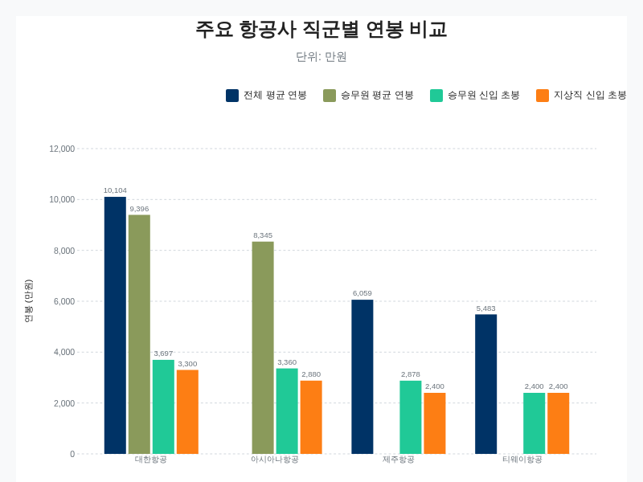
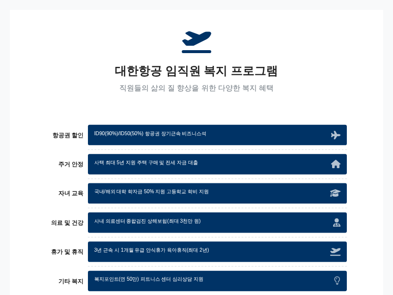
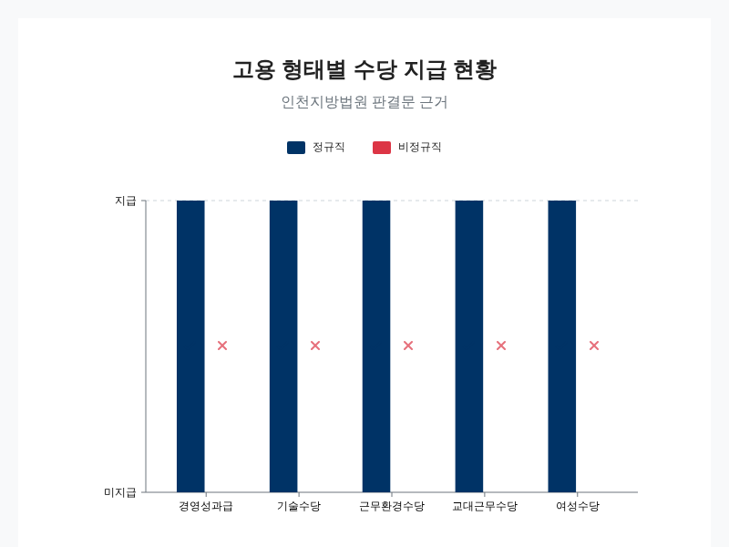
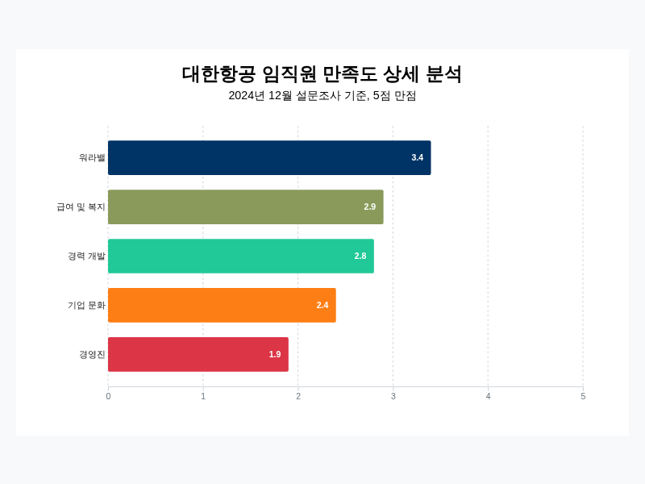
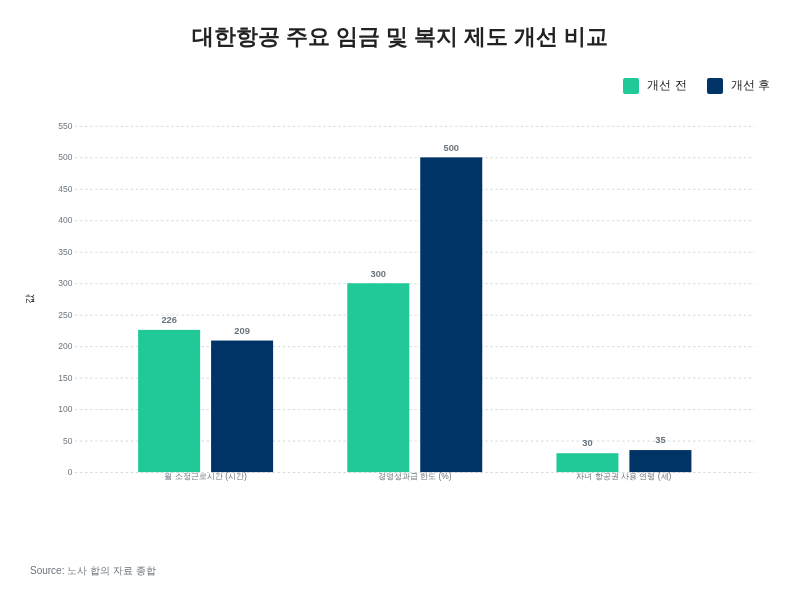

# 대한항공 임직원 복지 혜택 종합 분석

## 급여 체계 및 경쟁사 비교 분석

대한항공의 급여 체계는 국내 항공업계에서 최상위 수준을 유지하고 있으며, 이는 회사의 재무 성과와 긴밀하게 연동되어 있습니다. 2023년 기준으로 대한항공 직원의 평균 연봉은 1억 104만원을 기록하며 사상 처음으로 1억원을 돌파했습니다 [[1](https://myteatime.tistory.com/entry/%EB%8C%80%ED%95%9C%ED%95%AD%EA%B3%B5-%EC%A7%81%EC%9B%90-%EB%B3%B5%EC%A7%80-%EC%B4%9D%EC%A0%95%EB%A6%AC)]. 이는 전년 대비 12.8% 증가한 수치로, 팬데믹 이후 회복된 항공 수요와 실적 개선이 반영된 결과입니다 [[1](https://myteatime.tistory.com/entry/%EB%8C%80%ED%95%9C%ED%95%AD%EA%B3%B5-%EC%A7%81%EC%9B%90-%EB%B3%B5%EC%A7%80-%EC%B4%9D%EC%A0%95%EB%A6%AC)]. 다만, 이 평균 연봉은 조종사나 정비사와 같은 고소득 전문 직종에 의해 상향 조정된 측면이 있으며, 일반 사무직의 경우 대기업 평균의 60~70% 수준으로 평가되기도 합니다 [[8](https://researchking.tistory.com/1587)]. 그럼에도 불구하고 전반적인 급여 수준은 업계 최고를 자랑합니다.

직무별로 급여 수준을 살펴보면 상당한 편차를 보입니다. 객실 승무원의 경우, 신입 초봉은 연간 4,000만원에서 4,500만원 사이에서 형성되며, 평균 연봉은 5,000만원에서 7,000만원 수준에 이릅니다 [[2](https://m.blog.naver.com/78dydxo/223910742840), [7](https://community.linkareer.com/employment_data/3266949)]. 신입 승무원의 월 기본급은 약 160만~180만원이지만, 비행 수당, 해외 체류비 등 각종 수당이 더해지면 월 실수령액은 평균 350만~450만원 선에 달하며, 장거리 국제선 비행이 많을 경우 500만원을 넘기도 합니다 [[3](https://happyfunstory.tistory.com/entry/2025%EB%85%84-%EB%8C%80%ED%95%9C%ED%95%AD%EA%B3%B5%EA%B3%BC-%EC%95%84%EC%8B%9C%EC%95%84%EB%82%98-%EC%97%B0%EB%B4%89-%EC%B0%A8%EC%9D%B4-%EA%B8%B0%EB%B3%B8%EA%B8%89-%EB%B3%B4%EB%84%88%EC%8A%A4-%EA%B2%BD%EB%A0%A5%EB%B3%84-%EB%8C%80%ED%95%9C%ED%95%AD%EA%B3%B5-vs-%EC%95%84%EC%8B%9C%EC%95%84%EB%82%98-%EB%B3%B5%EC%A7%80-%EB%B9%84%EA%B5%90-%EA%B8%89%EC%97%AC-%EC%88%99%EC%86%8C-%EC%8B%9D%EC%82%AC)]. 경력이 쌓이면 급여는 꾸준히 상승하여 5년차에는 연봉 5,000만원, 10년차에는 6,000만원을 초과하며, 사무장(CP)이나 트레이너와 같은 관리직으로 승진하면 9,000만원 이상의 높은 연봉을 받게 됩니다 [[3](https://happyfunstory.tistory.com/entry/2025%EB%85%84-%EB%8C%80%ED%95%9C%ED%95%AD%EA%B3%B5%EA%B3%BC-%EC%95%84%EC%8B%9C%EC%95%84%EB%82%98-%EC%97%B0%EB%B4%89-%EC%B0%A8%EC%9D%B4-%EA%B8%B0%EB%B3%B8%EA%B8%89-%EB%B3%B4%EB%84%88%EC%8A%A4-%EA%B2%BD%EB%A0%A5%EB%B3%84-%EB%8C%80%ED%95%9C%ED%95%AD%EA%B3%B5-vs-%EC%95%84%EC%8B%9C%EC%95%84%EB%82%98-%EB%B3%B5%EC%A7%80-%EB%B9%84%EA%B5%90-%EA%B8%89%EC%97%AC-%EC%88%99%EC%86%8C-%EC%8B%9D%EC%82%AC), [5](https://biz.heraldcorp.com/article/10517008)].

지상직의 경우, 평균 연봉은 약 5,000만원대로 보고되었습니다 [[1](https://myteatime.tistory.com/entry/%EB%8C%80%ED%95%9C%ED%95%AD%EA%B3%B5-%EC%A7%81%EC%9B%90-%EB%B3%B5%EC%A7%80-%EC%B4%9D%EC%A0%95%EB%A6%AC)]. 신규 대리급 지상직은 3,500만~4,000만원 수준에서 연봉이 시작되며, 근속 연수에 따라 사원(3,500~3,800만원), 대리(4,400만원), 과장(5,300~5,500만원), 차장(7,000~7,500만원)을 거쳐 부장급에 이르면 약 9,000만원에서 1억원에 가까운 연봉을 받게 됩니다 [[6](https://researchking.tistory.com/1606), [8](https://researchking.tistory.com/1587)]. 특히 부장에서 임원으로 승진할 경우 연봉 상승률이 약 85%에 달하는 것으로 알려져 있습니다 [[10](https://rbys99.tistory.com/617)]. 항공 기술직인 정비사는 평균 6,000만원대의 급여를 받으며, 신입 항공정비사의 초봉은 4,000만원 이상에서 시작하여 10년차에는 8,200만~8,500만원 수준에 이르는 등 전문성을 인정받고 있습니다 [[1](https://myteatime.tistory.com/entry/%EB%8C%80%ED%95%9C%ED%95%AD%EA%B3%B5-%EC%A7%81%EC%9B%90-%EB%B3%B5%EC%A7%80-%EC%B4%9D%EC%A0%95%EB%A6%AC), [3](https://happyfunstory.tistory.com/entry/2025%EB%85%84-%EB%8C%80%ED%95%9C%ED%95%AD%EA%B3%B5%EA%B3%BC-%EC%95%84%EC%8B%9C%EC%95%84%EB%82%98-%EC%97%B0%EB%B4%89-%EC%B0%A8%EC%9D%B4-%EA%B8%B0%EB%B3%B8%EA%B8%89-%EB%B3%B4%EB%84%88%EC%8A%A4-%EA%B2%BD%EB%A0%A5%EB%B3%84-%EB%8C%80%ED%95%9C%ED%95%AD%EA%B3%B5-vs-%EC%95%84%EC%8B%9C%EC%95%84%EB%82%98-%EB%B3%B5%EC%A7%80-%EB%B9%84%EA%B5%90-%EA%B8%89%EC%97%AC-%EC%88%99%EC%86%8C-%EC%8B%9D%EC%82%AC)].

최근 대한항공은 임금 체계에도 중요한 변화를 주었습니다. 2025년부터 적용될 새로운 임금 체계는 아시아나항공과의 합병을 앞두고 약 20년 만에 개정된 것으로, 기준 근로시간을 기존 월 226시간에서 209시간으로 단축한 것이 핵심입니다 [[5](https://biz.heraldcorp.com/article/10517008)]. 이는 상여금의 850%를 통상임금에 포함하라는 대법원 판결을 반영한 조치로, 이로 인해 실질적인 시급이 약 8% 인상되는 효과가 있을 것으로 노조는 추정하고 있습니다 [[2](https://m.blog.naver.com/78dydxo/223910742840), [5](https://biz.heraldcorp.com/article/10517008)].

경쟁 항공사와 비교했을 때 대한항공의 급여 수준은 명확한 우위를 점하고 있습니다. 주요 경쟁사인 아시아나항공의 경우, 객실 승무원의 평균 연봉은 5,000만원~7,000만원으로 대한항공과 유사한 수준이지만, 신입 승무원의 월 기본급은 150만~170만원으로 다소 낮게 시작합니다 [[3](https://happyfunstory.tistory.com/entry/2025%EB%85%84-%EB%8C%80%ED%95%9C%ED%95%AD%EA%B3%B5%EA%B3%BC-%EC%95%84%EC%8B%9C%EC%95%84%EB%82%98-%EC%97%B0%EB%B4%89-%EC%B0%A8%EC%9D%B4-%EA%B8%B0%EB%B3%B8%EA%B8%89-%EB%B3%B4%EB%84%88%EC%8A%A4-%EA%B2%BD%EB%A0%A5%EB%B3%84-%EB%8C%80%ED%95%9C%ED%95%AD%EA%B3%B5-vs-%EC%95%84%EC%8B%9C%EC%95%84%EB%82%98-%EB%B3%B5%EC%A7%80-%EB%B9%84%EA%B5%90-%EA%B8%89%EC%97%AC-%EC%88%99%EC%86%8C-%EC%8B%9D%EC%82%AC), [5](https://biz.heraldcorp.com/article/10517008), [7](https://community.linkareer.com/employment_data/3266949)]. 비행 수당 등을 포함한 월 실수령액은 평균 300만~400만원 선으로, 단거리 노선 비중 등에 따라 차이가 발생합니다 [[3](https://happyfunstory.tistory.com/entry/2025%EB%85%84-%EB%8C%80%ED%95%9C%ED%95%AD%EA%B3%B5%EA%B3%BC-%EC%95%84%EC%8B%9C%EC%95%84%EB%82%98-%EC%97%B0%EB%B4%89-%EC%B0%A8%EC%9D%B4-%EA%B8%B0%EB%B3%B8%EA%B8%89-%EB%B3%B4%EB%84%88%EC%8A%A4-%EA%B2%BD%EB%A0%A5%EB%B3%84-%EB%8C%80%ED%95%9C%ED%95%AD%EA%B3%B5-vs-%EC%95%84%EC%8B%9C%EC%95%84%EB%82%98-%EB%B3%B5%EC%A7%80-%EB%B9%84%EA%B5%90-%EA%B8%89%EC%97%AC-%EC%88%99%EC%86%8C-%EC%8B%9D%EC%82%AC)]. 지상직 연봉은 3,000만원 중반대에서 시작하는 것으로 알려져 있습니다 [[3](https://happyfunstory.tistory.com/entry/2025%EB%85%84-%EB%8C%80%ED%95%9C%ED%95%AD%EA%B3%B5%EA%B3%BC-%EC%95%84%EC%8B%9C%EC%95%84%EB%82%98-%EC%97%B0%EB%B4%89-%EC%B0%A8%EC%9D%B4-%EA%B8%B0%EB%B3%B8%EA%B8%89-%EB%B3%B4%EB%84%88%EC%8A%A4-%EA%B2%BD%EB%A0%A5%EB%B3%84-%EB%8C%80%ED%95%9C%ED%95%AD%EA%B3%B5-vs-%EC%95%84%EC%8B%9C%EC%95%84%EB%82%98-%EB%B3%B5%EC%A7%80-%EB%B9%84%EA%B5%90-%EA%B8%89%EC%97%AC-%EC%88%99%EC%86%8C-%EC%8B%9D%EC%82%AC)].

저비용항공사(LCC)와의 격차는 더욱 뚜렷합니다. 국내 1위 LCC인 제주항공의 2023년 직원 평균 연봉은 약 6,059만원이며, 대졸 신입 초봉은 약 4,100만원 수준입니다 [[1](https://myteatime.tistory.com/entry/%EB%8C%80%ED%95%9C%ED%95%AD%EA%B3%B5-%EC%A7%81%EC%9B%90-%EB%B3%B5%EC%A7%80-%EC%B4%9D%EC%A0%95%EB%A6%AC)]. 이는 대한항공의 평균 연봉과 비교하면 상당한 차이가 있습니다. 티웨이항공의 경우 전체 평균 연봉은 약 5,483만원, 신입사원 초봉은 2,889만원~3,308만원 수준으로 형성되어 있습니다 [[6](https://researchking.tistory.com/1606)]. LCC 승무원의 평균 연봉은 3,000만원~4,000만원대로, 대한항공이나 아시아나항공과 같은 대형 항공사(FSC)와는 분명한 차이를 보입니다 [[7](https://community.linkareer.com/employment_data/3266949)]. 다만, 티웨이항공의 경우 대형 항공사에 비해 승진이 빠르고 수평적인 조직 문화를 장점으로 내세우며, 제주항공은 LCC 중에서는 상대적으로 높은 연봉 수준을 유지하고 있습니다 [[6](https://researchking.tistory.com/1606), [9](https://blog.naver.com/adng1740/223399442008?viewType=pc)].

아래 표는 주요 항공사의 급여 수준을 직관적으로 비교한 것입니다.

| 구분 | 대한항공 | 아시아나항공 | 제주항공 | 티웨이항공 |
|:---|:---:|:---:|:---:|:---:|
| **전체 평균 연봉** | 1억 104만원 [[1](https://myteatime.tistory.com/entry/%EB%8C%80%ED%95%9C%ED%95%AD%EA%B3%B5-%EC%A7%81%EC%9B%90-%EB%B3%B5%EC%A7%80-%EC%B4%9D%EC%A0%95%EB%A6%AC)] | (데이터 미제공) | 6,059만원 [[1](https://myteatime.tistory.com/entry/%EB%8C%80%ED%95%9C%ED%95%AD%EA%B3%B5-%EC%A7%81%EC%9B%90-%EB%B3%B5%EC%A7%80-%EC%B4%9D%EC%A0%95%EB%A6%AC)] | 5,483만원 [[6](https://researchking.tistory.com/1606)] |
| **승무원 평균 연봉** | 5,000만~7,000만원 [[2](https://m.blog.naver.com/78dydxo/223910742840)] | 5,000만~7,000만원 [[5](https://biz.heraldcorp.com/article/10517008)] | 6,300만원 [[9](https://blog.naver.com/adng1740/223399442008?viewType=pc)] | 3,000만~4,000만원대 [[7](https://community.linkareer.com/employment_data/3266949)] |
| **승무원 신입 초봉** | 4,000만~4,500만원 [[2](https://m.blog.naver.com/78dydxo/223910742840)] | 3,000만원대 후반 [[3](https://happyfunstory.tistory.com/entry/2025%EB%85%84-%EB%8C%80%ED%95%9C%ED%95%AD%EA%B3%B5%EA%B3%BC-%EC%95%84%EC%8B%9C%EC%95%84%EB%82%98-%EC%97%B0%EB%B4%89-%EC%B0%A8%EC%9D%B4-%EA%B8%B0%EB%B3%B8%EA%B8%89-%EB%B3%B4%EB%84%88%EC%8A%A4-%EA%B2%BD%EB%A0%A5%EB%B3%84-%EB%8C%80%ED%95%9C%ED%95%AD%EA%B3%B5-vs-%EC%95%84%EC%8B%9C%EC%95%84%EB%82%98-%EB%B3%B5%EC%A7%80-%EB%B9%84%EA%B5%90-%EA%B8%89%EC%97%AC-%EC%88%99%EC%86%8C-%EC%8B%9D%EC%82%AC)] | 3,628만원~4,100만원 [[1](https://myteatime.tistory.com/entry/%EB%8C%80%ED%95%9C%ED%95%AD%EA%B3%B5-%EC%A7%81%EC%9B%90-%EB%B3%B5%EC%A7%80-%EC%B4%9D%EC%A0%95%EB%A6%AC), [9](https://blog.naver.com/adng1740/223399442008?viewType=pc)] | 2,889만~3,308만원 [[6](https://researchking.tistory.com/1606)] |
| **지상직 신입 초봉** | 3,500만~4,000만원 (대리급) [[8](https://researchking.tistory.com/1587)] | 3,000만원대 중반 [[3](https://happyfunstory.tistory.com/entry/2025%EB%85%84-%EB%8C%80%ED%95%9C%ED%95%AD%EA%B3%B5%EA%B3%BC-%EC%95%84%EC%8B%9C%EC%95%84%EB%82%98-%EC%97%B0%EB%B4%89-%EC%B0%A8%EC%9D%B4-%EA%B8%B0%EB%B3%B8%EA%B8%89-%EB%B3%B4%EB%84%88%EC%8A%A4-%EA%B2%BD%EB%A0%A5%EB%B3%84-%EB%8C%80%ED%95%9C%ED%95%AD%EA%B3%B5-vs-%EC%95%84%EC%8B%9C%EC%95%84%EB%82%98-%EB%B3%B5%EC%A7%80-%EB%B9%84%EA%B5%90-%EA%B8%89%EC%97%AC-%EC%88%99%EC%86%8C-%EC%8B%9D%EC%82%AC)] | 약 4,100만원 (대졸) [[1](https://myteatime.tistory.com/entry/%EB%8C%80%ED%95%9C%ED%95%AD%EA%B3%B5-%EC%A7%81%EC%9B%90-%EB%B3%B5%EC%A7%80-%EC%B4%9D%EC%A0%95%EB%A6%AC)] | 2,300만~2,700만원 [[6](https://researchking.tistory.com/1606)] |

주요 국적 항공사의 직군별 연봉 수준 비교.

결론적으로 대한항공은 국내 항공업계에서 가장 높은 급여를 제공하는 기업으로서의 입지를 확고히 하고 있습니다. 특히 실적에 따른 성과급과 안전 장려금 제도는 직원들의 동기 부여에 긍정적인 영향을 미치고 있습니다 [[22](https://allaboutcabincrew.tistory.com/19)]. 최근의 임금 체계 개편은 실질적인 임금 인상 효과를 가져와 근무 만족도를 높이는 데 기여할 것으로 전망됩니다. 경쟁사 대비 높은 연봉은 우수 인재를 유치하고 유지하는 데 있어 강력한 경쟁력으로 작용하며, 이는 대한항공이 업계 리더의 자리를 공고히 하는 중요한 기반이 되고 있습니다.

## 주요 복지 제도 상세 내용

대한항공은 높은 급여 수준과 더불어 업계 최고 수준의 복지 제도를 운영하며 임직원의 만족도를 높이고 있습니다. 항공사의 특성을 살린 항공권 할인 혜택부터 주거, 자녀 학자금, 의료 및 휴가 제도에 이르기까지 다방면에 걸쳐 체계적인 지원이 이루어지고 있으며, 이는 대한항공이 우수 인재를 유치하고 유지하는 핵심 경쟁력으로 작용합니다.

대한항공의 주요 복지 제도 요약.

항공사 임직원에게 가장 매력적인 복지 혜택은 단연 항공권 할인 제도입니다. 대한항공은 3개월 이상 근무한 직원과 그 직계 가족(부모, 배우자, 배우자 부모, 자녀)에게 국내선 및 국제선 할인 항공권을 제공합니다 [[1](https://myteatime.tistory.com/entry/%EB%8C%80%ED%95%9C%ED%95%AD%EA%B3%B5-%EC%A7%81%EC%9B%90-%EB%B3%B5%EC%A7%80-%EC%B4%9D%EC%A0%95%EB%A6%AC), [30](https://www.threads.com/@_iamcrew/post/DOp2hiFEvCZ/9%EC%9B%94-%ED%99%95%EC%A0%95-%EB%8C%80%ED%95%9C%ED%95%AD%EA%B3%B5-%EC%8B%A0%EC%9E%85-%EC%8A%B9%EB%AC%B4%EC%9B%90-%EC%B1%84%EC%9A%A9-%EC%86%8C%EC%8B%9D%EB%93%9C%EB%94%94%EC%96%B4-%EA%B8%B0%EB%8B%A4%EB%A6%AC%EB%8D%98-%EA%B3%B5%EA%B3%A0%EA%B0%80-%EC%97%B4%EB%A0%B8%EC%8A%B5%EB%8B%88%EB%8B%A4%EB%AC%B4%EB%A0%A4-150%EB%AA%85-%EC%97%AD%EB%8C%80%EA%B8%89-%EA%B7%9C%EB%AA%A8-9%EC%9B%94-%EC%A4%91-%EB%B3%B8%EA%B2%A9-%EB%AA%A8%EC%A7%91-%EC%8B%9C%EC%9E%91-%EC%B1%84%EC%9A%A9-%EC%9D%BC%EC%A0%95%EC%A2%85%ED%95%A9%EC%A7%81%EA%B2%BD%EB%A0%A5)]. 이 제도는 통상 ID90과 ID50 티켓으로 나뉩니다. ID90 티켓은 정가에서 약 90% 할인된 가격으로 구매할 수 있지만, 일반 승객이 모두 탑승하고 남는 좌석이 있을 경우에만 이용 가능한 비확약 좌석(Stand-by)입니다 [[23](https://v.daum.net/v/0uMRCu8Cx5?vfrom_area=channel_ranking)]. 반면 ID50 티켓은 약 50% 할인율이 적용되지만 좌석이 확정되어 안정적인 여행 계획이 가능합니다 [[23](https://v.daum.net/v/0uMRCu8Cx5?vfrom_area=channel_ranking)]. 이러한 혜택 덕분에 직원들은 국내선 편도 4,000원, 미국 왕복 약 20만 원 등 매우 저렴한 비용으로 여행을 즐길 수 있습니다 [[22](https://allaboutcabincrew.tistory.com/19), [23](https://v.daum.net/v/0uMRCu8Cx5?vfrom_area=channel_ranking)]. 다만 ID90 티켓의 경우 좌석 확보의 불확실성 때문에 성수기나 인기 노선 이용에 어려움이 따르는 단점도 존재합니다 [[23](https://v.daum.net/v/0uMRCu8Cx5?vfrom_area=channel_ranking)]. 이 외에도 근속 10년 이상 직원에게는 2년에 한 번씩 비즈니스 클래스 항공권이 제공되며, 결혼 시에도 비즈니스석 항공권이 지급되는 등 장기 근속자를 위한 특별한 혜택이 마련되어 있습니다 [[1](https://myteatime.tistory.com/entry/%EB%8C%80%ED%95%9C%ED%95%AD%EA%B3%B5-%EC%A7%81%EC%9B%90-%EB%B3%B5%EC%A7%80-%EC%B4%9D%EC%A0%95%EB%A6%AC), [22](https://allaboutcabincrew.tistory.com/19)].

주거 안정은 임직원의 생활 만족도에 큰 영향을 미치는 요소로, 대한항공은 이 부분에서도 적극적인 지원을 아끼지 않고 있습니다. 인천 검단신도시에 700세대 규모의 사택 아파트를 운영하고 있으며, 직원들은 소정의 보증금만으로 월세 부담 없이 최대 5년간 거주할 수 있습니다 [[2](https://m.blog.naver.com/78dydxo/223910742840), [22](https://allaboutcabincrew.tistory.com/19)]. 또한 김포, 김해, 제주 등 주요 근무지 인근에 총 2,200세대 규모의 사택을 보유하여 매우 저렴한 비용으로 임대하고 있습니다 [[30](https://www.threads.com/@_iamcrew/post/DOp2hiFEvCZ/9%EC%9B%94-%ED%99%95%EC%A0%95-%EB%8C%80%ED%95%9C%ED%95%AD%EA%B3%B5-%EC%8B%A0%EC%9E%85-%EC%8A%B9%EB%AC%B4%EC%9B%90-%EC%B1%84%EC%9A%A9-%EC%86%8C%EC%8B%9D%EB%93%9C%EB%94%94%EC%96%B4-%EA%B8%B0%EB%8B%A4%EB%A6%AC%EB%8D%98-%EA%B3%B5%EA%B3%A0%EA%B0%80-%EC%97%B4%EB%A0%B8%EC%8A%B5%EB%8B%88%EB%8B%A4%EB%AC%B4%EB%A0%A4-150%EB%AA%85-%EC%97%AD%EB%8C%80%EA%B8%89-%EA%B7%9C%EB%AA%A8-9%EC%9B%94-%EC%A4%91-%EB%B3%B8%EA%B2%A9-%EB%AA%A8%EC%A7%91-%EC%8B%9C%EC%9E%91-%EC%B1%84%EC%9A%A9-%EC%9D%BC%EC%A0%95%EC%A2%85%ED%95%A9%EC%A7%81%EA%B2%BD%EB%A0%A5)]. 사택 입주 외에도 주택 마련이나 전세 자금에 대한 대출 지원 프로그램을 운영하여 직원들의 내 집 마련을 돕고 있습니다 [[1](https://myteatime.tistory.com/entry/%EB%8C%80%ED%95%9C%ED%95%AD%EA%B3%B5-%EC%A7%81%EC%9B%90-%EB%B3%B5%EC%A7%80-%EC%B4%9D%EC%A0%95%EB%A6%AC), [30](https://www.threads.com/@_iamcrew/post/DOp2hiFEvCZ/9%EC%9B%94-%ED%99%95%EC%A0%95-%EB%8C%80%ED%95%9C%ED%95%AD%EA%B3%B5-%EC%8B%A0%EC%9E%85-%EC%8A%B9%EB%AC%B4%EC%9B%90-%EC%B1%84%EC%9A%A9-%EC%86%8C%EC%8B%9D%EB%93%9C%EB%94%94%EC%96%B4-%EA%B8%B0%EB%8B%A4%EB%A6%AC%EB%8D%98-%EA%B3%B5%EA%B3%A0%EA%B0%80-%EC%97%B4%EB%A0%B8%EC%8A%B5%EB%8B%88%EB%8B%A4%EB%AC%B4%EB%A0%A4-150%EB%AA%85-%EC%97%AD%EB%8C%80%EA%B8%89-%EA%B7%9C%EB%AA%A8-9%EC%9B%94-%EC%A4%91-%EB%B3%B8%EA%B2%A9-%EB%AA%A8%EC%A7%91-%EC%8B%9C%EC%9E%91-%EC%B1%84%EC%9A%A9-%EC%9D%BC%EC%A0%95%EC%A2%85%ED%95%A9%EC%A7%81%EA%B2%BD%EB%A0%A5)].

자녀 교육에 대한 지원 역시 대한항공 복지 제도의 큰 강점 중 하나입니다. 국내 대학은 물론, 자녀가 해외 대학에 재학 중인 경우에도 학자금을 지원하는 파격적인 제도를 운영하고 있으며, 이는 연간 수천만 원에 달하는 실질적인 혜택으로 평가받습니다 [[22](https://allaboutcabincrew.tistory.com/19)]. 구체적으로는 자녀의 취학 전 보육비와 해외 대학 등록금의 50%를 지원하며, 국내 대학의 경우 직전 학기 평점 2.5 또는 3.0 이상이라는 최소한의 학업 기준을 충족해야 합니다 [[4](https://www.teamblind.com/kr/browse/%EB%8C%80%ED%95%9C%ED%95%AD%EA%B3%B5-%EB%B3%B5%EC%A7%80-10714), [22](https://allaboutcabincrew.tistory.com/19), [23](https://v.daum.net/v/0uMRCu8Cx5?vfrom_area=channel_ranking)]. 고등학교 학비 역시 분기당 약 40만 원씩 3년간 총 480만 원가량을 지원받을 수 있습니다 [[22](https://allaboutcabincrew.tistory.com/19)]. 이러한 교육 지원은 정규직뿐만 아니라 상근직으로 근무하는 비정규직 직원에게도 차별 없이 적용됩니다 [[2](https://m.blog.naver.com/78dydxo/223910742840)]. 더불어 직원 개인의 역량 강화를 위해 직무, 어학, 서비스 교육 등 다양한 온라인 및 오프라인 교육 과정을 제공하고, 자격증 취득 비용과 외국어 학습 장려금도 지원합니다 [[1](https://myteatime.tistory.com/entry/%EB%8C%80%ED%95%9C%ED%95%AD%EA%B3%B5-%EC%A7%81%EC%9B%90-%EB%B3%B5%EC%A7%80-%EC%B4%9D%EC%A0%95%EB%A6%AC)].

임직원의 건강 관리를 위한 의료 지원 시스템도 체계적으로 갖추어져 있습니다. 사내에 의사와 간호사가 상주하는 의료센터를 운영하여 기본적인 진료와 상담, 매년 독감 예방 접종을 무료로 제공합니다 [[22](https://allaboutcabincrew.tistory.com/19)]. 특히 김포공항 인근의 항공의료센터에는 50여 명의 전문 의료진이 근무하며 직원들의 건강검진, 체력 관리, 영양 상담까지 책임지고 있습니다 [[30](https://www.threads.com/@_iamcrew/post/DOp2hiFEvCZ/9%EC%9B%94-%ED%99%95%EC%A0%95-%EB%8C%80%ED%95%9C%ED%95%AD%EA%B3%B5-%EC%8B%A0%EC%9E%85-%EC%8A%B9%EB%AC%B4%EC%9B%90-%EC%B1%84%EC%9A%A9-%EC%86%8C%EC%8B%9D%EB%93%9C%EB%94%94%EC%96%B4-%EA%B8%B0%EB%8B%A4%EB%A6%AC%EB%8D%98-%EA%B3%B5%EA%B3%A0%EA%B0%80-%EC%97%B4%EB%A0%B8%EC%8A%B5%EB%8B%88%EB%8B%A4%EB%AC%B4%EB%A0%A4-150%EB%AA%85-%EC%97%AD%EB%8C%80%EA%B8%89-%EA%B7%9C%EB%AA%A8-9%EC%9B%94-%EC%A4%91-%EB%B3%B8%EA%B2%A9-%EB%AA%A8%EC%A7%91-%EC%8B%9C%EC%9E%91-%EC%B1%84%EC%9A%A9-%EC%9D%BC%EC%A0%95%EC%A2%85%ED%95%A9%EC%A7%81%EA%B2%BD%EB%A0%A5)]. 모든 임직원은 정기적으로 종합 건강검진을 받을 수 있으며, 가족을 포함하여 최대 3,000만 원까지 보장되는 상해보험에도 무료로 가입시켜 줍니다 [[1](https://myteatime.tistory.com/entry/%EB%8C%80%ED%95%9C%ED%95%AD%EA%B3%B5-%EC%A7%81%EC%9B%90-%EB%B3%B5%EC%A7%80-%EC%B4%9D%EC%A0%95%EB%A6%AC), [4](https://www.teamblind.com/kr/browse/%EB%8C%80%ED%95%9C%ED%95%AD%EA%B3%B5-%EB%B3%B5%EC%A7%80-10714)]. 최근에는 안전 운항과 직결되는 조종사 및 객실 승무원의 수면 건강을 위해 수면 무호흡증 평가 및 맞춤형 교육 프로그램을 도입하는 등 선진적인 건강 관리 제도를 확대하고 있습니다 [[39](https://www.chosun.com/economy/economy_general/2023/09/15/S4XH4HZFXNA6BMIQNUDRZ5ZLPQ/)].

휴가 및 휴식 제도는 재충전과 삶의 질 향상을 위해 매우 중요합니다. 대한항공의 가장 특징적인 제도는 3년 근속 시마다 1개월의 유급 안식 휴가와 휴가비 200만 원을 지급하는 '안식 유급휴가' 제도입니다 [[4](https://www.teamblind.com/kr/browse/%EB%8C%80%ED%95%9C%ED%95%AD%EA%B3%B5-%EB%B3%B5%EC%A7%80-10714)]. 이는 장기 근속을 장려하고 직원들에게 충분한 휴식 기회를 제공하기 위함입니다. 그러나 객실 승무원의 휴가 사용과 관련해서는 일부 논란도 존재합니다. 회사는 월 8일의 휴무를 보장한다고 명시하지만 실제로는 개인적인 사유로 사용할 수 있는 확정 휴무일은 하루에 불과하며, 나머지는 회사 스케줄에 따라 변경될 수 있다는 지적이 있습니다 [[24](https://www.livesnews.com/mobile/article.html?no=50439)]. 또한, 휴가 신청 시 포인트를 차감하는 '휴가 포인트 제도'를 도입하여 연말연시나 명절 등 성수기에 휴가를 사용하는 직원에게 불이익을 주는 방식으로 휴가 사용을 통제하려 한다는 비판도 제기되었습니다 [[26](https://news.kbs.co.kr/news/view.do?ncd=8463904), [27](https://www.e-science.co.kr/news/articleView.html?idxno=123006)]. 반면, 출산 및 육아와 관련해서는 매우 선진적인 제도를 운영하고 있습니다. 객실 승무원은 임신 인지 시점부터 최대 2년간 휴직이 가능하며, 법정 기준을 초과하는 육아휴직과 근무시간 단축제를 자유롭게 사용할 수 있습니다 [[46](https://www.khan.co.kr/article/202312211827001)]. 그 결과 3년 연속 산후휴가 복귀율 100%를 달성했으며, 남성 직원의 육아휴직 사용률도 꾸준히 증가하는 등 가족친화적 기업 문화를 성공적으로 정착시키고 있습니다 [[46](https://www.khan.co.kr/article/202312211827001)].

이 외에도 대한항공은 임직원의 생활 편의와 만족도 향상을 위해 다양한 복지 혜택을 제공합니다. 연간 50만 원 상당의 포인트를 자유롭게 사용할 수 있는 복지카드를 지급하며, 사내 식당과 최신 시설을 갖춘 피트니스 센터를 저렴하게 이용할 수 있습니다 [[1](https://myteatime.tistory.com/entry/%EB%8C%80%ED%95%9C%ED%95%AD%EA%B3%B5-%EC%A7%81%EC%9B%90-%EB%B3%B5%EC%A7%80-%EC%B4%9D%EC%A0%95%EB%A6%AC), [4](https://www.teamblind.com/kr/browse/%EB%8C%80%ED%95%9C%ED%95%AD%EA%B3%B5-%EB%B3%B5%EC%A7%80-10714), [38](https://biz.heraldcorp.com/article/3224336)]. 임직원 심리 상담소 '유클리닉(HyuClinic)'을 운영하여 스트레스 관리 및 정신 건강을 지원하고, 직원 간의 소통을 활성화하기 위해 월간 '해피 아워' 모임과 연간 '패밀리 데이' 행사를 개최합니다 [[38](https://biz.heraldcorp.com/article/3224336)]. 또한 2026년까지 현재의 퇴직금 제도를 아시아나항공과의 통합에 맞춰 퇴직연금 제도로 전환할 계획을 가지고 있어, 장기적인 고용 안정성 또한 강화될 전망입니다 [[4](https://www.teamblind.com/kr/browse/%EB%8C%80%ED%95%9C%ED%95%AD%EA%B3%B5-%EB%B3%B5%EC%A7%80-10714)]. 이처럼 대한항공의 복지 제도는 실질적인 경제적 지원과 함께 임직원의 건강, 가정생활, 개인의 성장까지 아우르는 종합적인 형태로 발전하고 있습니다.

## 계약직 및 비정규직 복지 지원 현황

대한항공이 정규직 임직원에게 제공하는 높은 수준의 복지 혜택은 기업의 긍정적인 이미지를 구성하는 중요한 요소이지만, 이러한 혜택이 모든 직원에게 동등하게 적용되는 것은 아닙니다. 계약직 및 비정규직, 특히 다단계 하청 구조 아래에 있는 노동자들의 경우 정규직과의 현저한 처우 차별 문제가 지속적으로 제기되고 있으며, 이는 법적 분쟁과 노사 갈등의 주요 원인이 되고 있습니다. 현행 '기간제 및 단시간근로자 보호 등에 관한 법률', 즉 비정규직 보호법은 사용자가 합리적인 이유 없이 비정규직 근로자를 임금 및 기타 근로조건에서 불리하게 처우하는 것을 명백히 금지하고 있습니다 [[12](https://5105egg11.tistory.com/entry/%EC%A0%9C%EC%A3%BC%ED%95%AD%EA%B3%B5-2025%EB%85%84-%EC%8B%A0%EC%9E%85%EC%82%AC%EC%9B%90-%EC%97%B0%EB%B4%89-%EB%8C%80%EC%A1%B8-%EC%B4%88%EB%B4%89-%EA%B8%89%EC%97%AC-%EC%8B%A4%EC%88%98%EB%A0%B9%EC%95%A1-%EC%B1%84%EC%9A%A9%EC%A0%95%EB%B3%B4)]. 또한 이 법은 비정규직 근로자의 고용 기간을 원칙적으로 2년으로 제한하여 무분별한 비정규직 사용을 억제하고 고용 안정을 도모합니다 [[14](https://www.jobplanet.co.kr/companies/56161/salaries/%EC%A0%9C%EC%A3%BC%ED%95%AD%EA%B3%B5)]. 차별적 처우가 발생했을 경우, 해당 근로자는 노동위원회를 통해 시정을 요구할 수 있으며, 차별 여부에 대한 입증 책임은 사용자에게 있습니다 [[12](https://5105egg11.tistory.com/entry/%EC%A0%9C%EC%A3%BC%ED%95%AD%EA%B3%B5-2025%EB%85%84-%EC%8B%A0%EC%9E%85%EC%82%AC%EC%9B%90-%EC%97%B0%EB%B4%89-%EB%8C%80%EC%A1%B8-%EC%B4%88%EB%B4%89-%EA%B8%89%EC%97%AC-%EC%8B%A4%EC%88%98%EB%A0%B9%EC%95%A1-%EC%B1%84%EC%9A%A9%EC%A0%95%EB%B3%B4)].

그러나 법적 보호 장치에도 불구하고 현실에서는 고용 형태에 따른 차별이 여전히 존재합니다. 대표적인 사례가 '무기계약직' 제도로, 2년 이상 근무하여 고용 안정성은 보장되지만 임금, 복지, 승진 기회 등 실질적인 근로조건은 정규직에 비해 현저히 열악한 경우가 많습니다 [[15](https://researchking.tistory.com/1590)]. 이러한 차별은 법적으로도 중요한 쟁점이 되어 왔으며, 2016년 한 법원 판결에서는 '고용 형태' 역시 근로기준법상 차별이 금지되는 '사회적 신분'에 해당한다고 판단하여, 고용 형태를 이유로 한 불합리한 차별이 위법임을 명확히 하였습니다 [[15](https://researchking.tistory.com/1590)].

대한항공의 경우에도 비정규직 근로자에 대한 차별적 처우가 법원의 판결을 통해 확인된 바 있습니다. 인천지방법원의 한 판결에 따르면, 대한항공은 정규직 근로자에게는 경영 실적에 따라 '경영성과급'을 지급하고, 직무 특성을 고려하여 '기술수당', '근무환경수당', '교대근무수당', '여성수당' 등 각종 수당을 지급하면서도 동일하거나 유사한 업무를 수행하는 비정규직 근로자들에게는 이를 전혀 지급하지 않았습니다 . 이는 합리적인 이유 없이 고용 형태만을 기준으로 임금 및 복리후생에서 차별을 둔 명백한 사례로, 비정규직 보호법의 취지에 정면으로 위배되는 행위입니다. 이러한 판례는 대한항공의 복지 제도가 정규직 중심으로 설계되어 있으며, 비정규직은 그 혜택의 사각지대에 놓여 있음을 보여줍니다.

대한항공의 고용 형태에 따른 주요 수당 지급 여부 비교.

차별 문제는 직접 고용된 비정규직뿐만 아니라, 하청업체를 통해 간접 고용된 노동자들에게서 더욱 심각하게 나타납니다. 대한항공의 지상조업 업무를 담당하는 하청업체 소속 노동자들은 원청인 대한항공이 실질적인 고용주로서의 역할을 하고 있음에도 불구하고, 열악한 처우와 고용 불안에 시달리고 있다며 직접 고용을 지속적으로 요구하고 있습니다 . 이는 인천국제공항 전체 노동력의 약 86%가 간접 고용 비정규직이라는 현실과 맞물려, 한국 사회의 다단계 하청 구조가 야기하는 노동 착취와 차별의 상징적인 문제로 지적됩니다 [[13](https://thinkanddoequalachieve.com/161)]. 전문가들은 단순히 자회사를 설립하거나 한정된 계약으로 고용 형태를 분리하는 방식의 부분적인 정규직화는 오히려 새로운 신분 격차를 만들 수 있다며, 차별 없는 통합적 조직 개편의 필요성을 강조하고 있습니다 [[13](https://thinkanddoequalachieve.com/161)].

이러한 구조적 문제는 2019년 대한항공 비행기 청소노동자들의 파업 사태에서 극명하게 드러났습니다. 대한항공의 기내 청소 및 세탁 업무는 대한항공에서 자회사인 한국공항서비스(KAS)로, 다시 하청업체인 EK맨파워로 이어지는 다단계 하청 구조로 운영됩니다 . 갈등은 EK맨파워 측이 최저임금 인상분을 무력화하기 위해 기존에 지급하던 각종 수당을 삭감하고 기본급에 포함시키는 방식으로 임금을 조정하면서 시작되었습니다 . 이에 반발한 노동자들은 2017년 노동조합을 결성하고 2018년 파업을 통해 임금 정상화에 합의했으나, 이후 사측이 복수노조를 이용해 기존 노조를 교섭에서 배제하고 새로 설립된 한국노총 소속 노조와만 임금협약을 체결하는 등 노조 와해 시도가 있었다는 주장이 제기되었습니다 . 심지어 원청의 자회사인 한국공항의 임원이 직접 조합원들에게 접촉하여 노조 이탈을 종용했다는 의혹까지 불거졌습니다 . 결국 EK맨파워가 파업을 주도한 노조 간부 12명을 상대로 1억 1천만 원의 손해배상 청구 소송을 제기하자, 노동자들은 2019년 7월 23일 전면 파업에 돌입했으며, 이 파업은 57일 만에 현장 복귀로 일단락되었습니다 . 이 사태는 원청인 대한항공이 직접적인 법적 책임을 회피하는 다단계 하청 구조 속에서 최말단 노동자들이 어떻게 기본적인 권익마저 위협받는지를 여실히 보여주는 사례라 할 수 있습니다.

## 직원 만족도 및 기업 문화 평가

대한항공 임직원들의 기업 만족도는 전반적으로 보통 수준에 머물러 있으며, 특히 기업 문화와 경영진에 대한 평가는 매우 낮은 것으로 나타납니다. 2024년 12월 기준 1,331명의 직원을 대상으로 실시한 설문조사에 따르면, 종합 만족도는 5점 만점에 3.1점을 기록했습니다 [[8](https://researchking.tistory.com/1587)]. 이는 다른 기업 평가 플랫폼인 잡플래닛의 데이터와도 유사한 경향을 보이는데, 조원태 회장 취임 이후 만족도가 3.05점에서 3.19점으로 소폭 상승한 것으로 집계되었습니다 [[36](https://www.bloter.net/news/articleView.html?idxno=38009)]. 항목별로 살펴보면, '워라밸(일과 삶의 균형)'이 3.4점으로 가장 높은 평가를 받았으나, '급여 및 복지'는 2.9점, '경력 개발'은 2.8점으로 보통 이하의 수준을 보였습니다. 특히 '기업 문화'는 2.4점, '경영진'은 1.9점이라는 매우 낮은 점수를 받아, 임직원들이 회사의 조직 문화와 리더십에 대해 상당한 불만을 가지고 있음을 시사합니다 [[8](https://researchking.tistory.com/1587)]. 다만 경영진에 대한 평가 역시 조원태 회장 취임 후 1.91점에서 2.16점으로 소폭 개선된 점은 주목할 만합니다 [[36](https://www.bloter.net/news/articleView.html?idxno=38009)].

대한항공의 항목별 임직원 만족도 점수 (5점 만점).

직원들이 평가하는 대한항공의 가장 큰 강점은 대한민국 대표 항공사라는 강력한 브랜드 파워와 그에 따른 직업적 자부심입니다. 많은 직원들이 '해외에서도 알아주는 글로벌 1위 기업이라 자부심을 가지고 일할 수 있다'는 점을 긍정적으로 평가했습니다 [[8](https://researchking.tistory.com/1587), [36](https://www.bloter.net/news/articleView.html?idxno=38009)]. 또한, 비교적 자유로운 연차 사용 분위기와 부담 없이 육아휴직을 사용할 수 있는 문화는 워라밸 측면에서 높은 점수를 받는 주요 요인입니다 [[8](https://researchking.tistory.com/1587)]. 항공사 고유의 복지 혜택인 항공권 할인 제도와 편리한 근무지, 그리고 대기업으로서의 직업적 안정성 역시 직원들이 꼽는 주요 장점으로 나타났습니다 [[8](https://researchking.tistory.com/1587)]. 이러한 요소들은 대한항공이 외부적으로 매력적인 직장으로 인식되는 데 중요한 역할을 합니다.

그러나 내부적으로 직원들이 체감하는 단점 역시 명확하게 존재합니다. 가장 빈번하게 지적되는 문제는 회사의 높은 명성에 비해 실질적인 연봉과 복지 수준이 기대에 미치지 못한다는 점입니다 [[8](https://researchking.tistory.com/1587)]. 실제로 일부 기업 평가에서는 대한항공이 주요 대기업 중 '3티어(Tier 3)'로 분류되기도 하며, 특히 경영 실적에 따른 성과급이 부재한 점에 대한 불만이 큰 것으로 파악됩니다 [[4](https://www.teamblind.com/kr/browse/%EB%8C%80%ED%95%9C%ED%95%AD%EA%B3%B5-%EB%B3%B5%EC%A7%80-10714), [8](https://researchking.tistory.com/1587)]. 또한, 앞서 언급된 핵심 복지 혜택인 항공권 할인 제도의 경우, 비확약 좌석(Stand-by)의 특성상 성수기나 인기 노선 이용이 어려워 실효성이 떨어진다는 비판도 제기됩니다 [[8](https://researchking.tistory.com/1587)]. 더불어, 객실 승무원과 같이 불규칙한 스케줄로 근무하는 직군에서는 누적된 피로로 인한 건강 문제가 심각한 우려 사항으로 지적되며, 이는 안전 운항에 잠재적 위험이 될 수 있다는 경고도 나오고 있습니다 [[8](https://researchking.tistory.com/1587), [24](https://www.livesnews.com/mobile/article.html?no=50439)].

특히 기업 문화는 직원 만족도를 저해하는 가장 근본적인 원인으로 지목됩니다. 다수의 직원들은 대한항공의 조직 문화를 '상명하복이 엄격하고 이의 제기를 용납하지 않는 전형적인 꼰대 한국 기업' 또는 '매우 보수적이며 군대 문화로 봐도 무방한 곳'으로 묘사합니다 [[4](https://www.teamblind.com/kr/browse/%EB%8C%80%ED%95%9C%ED%95%AD%EA%B3%B5-%EB%B3%B5%EC%A7%80-10714), [36](https://www.bloter.net/news/articleView.html?idxno=38009)]. 이러한 경직되고 수직적인 위계질서는 자유로운 소통을 저해하고 업무 효율성을 떨어뜨리는 요인으로 작용하며, 새로운 직원들이 적응하는 데 상당한 어려움을 겪게 만드는 것으로 분석됩니다 [[36](https://www.bloter.net/news/articleView.html?idxno=38009)]. 이와 더불어, 소위 '오너 리스크'에 대한 우려도 여전히 높게 나타나고 있습니다. 직원들 사이에서는 '오너의 한마디에 많은 것이 바뀌는 회사'라는 인식이 팽배하며, '오너 일가의 부끄러운 뉴스가 더 이상 나오지 않았으면 한다'거나 '전문경영인 체제로 전환하는 것이 바람직하다'는 의견이 꾸준히 제기되고 있습니다 [[36](https://www.bloter.net/news/articleView.html?idxno=38009)]. 이는 경영 투명성과 합리적인 의사결정 구조에 대한 직원들의 깊은 불신을 반영하는 부분입니다.

이러한 내부 비판을 인식한 듯, 대한항공은 최근 유연하고 창의적인 조직 문화를 조성하기 위한 제도적 변화를 시도하고 있습니다. 2026년 5월부터는 제복을 착용하는 직원을 제외한 모든 국내 직원을 대상으로 청바지와 반바지까지 허용하는 전면 복장 자율화를 시행할 예정입니다 [[67](https://www.youthdaily.co.kr/news/article.html?no=16698)]. 또한, 구글의 클라우드 기반 협업 도구인 'G Suite'를 도입하고, 점심시간을 11시 30분부터 1시 30분까지 탄력적으로 운영하는 등 유연한 근무 환경을 지원하고 있습니다 [[67](https://www.youthdaily.co.kr/news/article.html?no=16698)]. 이 외에도 정시 퇴근을 장려하는 사내 방송, 직원 선호도를 반영한 사무용 의자 교체, 객실 승무원의 스케줄 변경 최소화 및 야간 비행 휴식 조건 개선 등 실질적인 근무 환경 개선을 위한 조치들을 추진하고 있습니다 [[67](https://www.youthdaily.co.kr/news/article.html?no=16698)]. 이러한 변화들이 경직된 조직 문화를 실질적으로 개선하고 직원 만족도를 높이는 결과로 이어질 수 있을지는 앞으로 지켜봐야 할 과제입니다.

## 최신 노사 합의 및 복지 제도 개선 동향

최근 대한항공은 임직원들의 만족도 저하와 경직된 조직 문화에 대한 비판에 대응하여 노사 간의 긴밀한 협의를 통해 임금 체계와 복지 제도를 개선하는 데 주력하고 있습니다. 특히 지난 2~3년간의 노사 합의는 오랜 기간 유지되어 온 제도의 틀을 바꾸는 중요한 변화들을 포함하고 있어, 회사의 복지 정책이 새로운 국면으로 접어들고 있음을 보여줍니다. 이러한 변화의 핵심에는 20년 만에 이루어진 임금 체계 개편이 자리하고 있습니다. 2025년부터 적용되는 이 새로운 합의안은 월 소정근로시간을 기존 226시간에서 209시간으로 단축하는 내용을 담고 있습니다 [[49](https://casenote.kr/%EC%9D%B8%EC%B2%9C%EC%A7%80%EB%B0%A9%EB%B2%95%EC%9B%90/2018%EA%B0%80%ED%95%A950559)]. 이 조정만으로도 직원들의 시간당 급여는 약 8% 상승하는 효과를 가져오며, 연장 및 야간 근로 수당 등을 고려할 때 실질적인 임금 인상률은 7~8%에 달할 것으로 전망됩니다 [[49](https://casenote.kr/%EC%9D%B8%EC%B2%9C%EC%A7%80%EB%B0%A9%EB%B2%95%EC%9B%90/2018%EA%B0%80%ED%95%A950559)].

이번 임금 체계 개편의 또 다른 중요한 내용은 정기 상여금 600%와 비정기 상여금 250%를 합한 총 850%의 상여금을 통상임금에 포함하기로 한 결정입니다 . 이는 각종 수당 산정의 기준이 되는 통상임금 자체를 대폭 인상시키는 조치로, 노동조합 측에서는 이를 통해 실질적인 시급이 약 77% 인상되는 성과를 거두었다고 평가했습니다 . 이처럼 파격적인 개편안은 2025년 임금 협상에서 기본급 최대 2.7% 인상안과 함께 최종 타결되었으며, 전체 조합원 투표에서 59.8%의 찬성률로 가결되어 그 정당성을 확보했습니다 [[64](https://www.incheontoday.com/news/articleView.html?idxno=304539), [65](https://www.kyeonggi.com/article/20250626580171), [23](https://v.daum.net/v/0uMRCu8Cx5?vfrom_area=channel_ranking)]. 더불어 직원들의 소득 안정성을 높이기 위해 기존에 짝수 달에 100%씩 지급되던 정기상여금 600%를 2025년 7월부터 매월 50%씩 분할 지급하는 방식으로 변경하기로 합의했습니다 [[64](https://www.incheontoday.com/news/articleView.html?idxno=304539), [65](https://www.kyeonggi.com/article/20250626580171), [23](https://v.daum.net/v/0uMRCu8Cx5?vfrom_area=channel_ranking)].

이러한 임금 구조 개편과 더불어 실질적인 복지 혜택을 강화하기 위한 구체적인 조치들도 꾸준히 도입되고 있습니다. 2023년 노사 합의에서는 임금 총액 3.5% 인상과 함께, 직원들의 불만 사항 중 하나였던 성과급 부재 문제를 완화하기 위해 경영성과급의 최대 지급 한도를 기존 300%에서 500%로 상향 조정했습니다 [[68](https://www.yna.co.kr/view/AKR20230705121400003), [69](https://blog.naver.com/puding777777/223148495709)]. 또한 직원 개개인의 필요에 맞춰 복지 혜택을 선택할 수 있는 '선택적 복리후생제도'를 새롭게 도입했으며, 기존 생수 지원 비용을 복지포인트로 전환하고 2023년에는 전 직원에게 1인당 50만 원 상당의 복지포인트를 일회성으로 지급하여 실질적인 혜택을 제공했습니다 [[68](https://www.yna.co.kr/view/AKR20230705121400003)]. 이 외에도 장애 아동 특수교육비 지원 확대, 경조사비 증액, 임직원 자녀의 항공권 사용 연령을 미혼 30세에서 35세로 상향하는 등 생활 밀착형 복지를 강화하는 데 중점을 두었습니다 [[68](https://www.yna.co.kr/view/AKR20230705121400003)].

2025년 합의안에서도 복지 제도 개선은 계속되었습니다. 주택 매매 및 전세자금 대출에 대한 이자 지원 기준을 완화하여 직원들의 주거 안정 부담을 덜어주었고, 특정 자격증을 취득한 직원에게 수당을 지급하는 '자격 수당 제도'를 신설하여 자기 계발을 장려했습니다 [[64](https://www.incheontoday.com/news/articleView.html?idxno=304539), [65](https://www.kyeonggi.com/article/20250626580171), [23](https://v.daum.net/v/0uMRCu8Cx5?vfrom_area=channel_ranking)]. 또한 실효성 논란이 있었던 임직원 항공권 사용 정책을 보다 유연하게 개선하여 직원들의 이용 편의성을 높이는 조치도 포함되었습니다 [[64](https://www.incheontoday.com/news/articleView.html?idxno=304539), [65](https://www.kyeonggi.com/article/20250626580171), [23](https://v.daum.net/v/0uMRCu8Cx5?vfrom_area=channel_ranking)]. 이처럼 최근의 노사 합의는 임금의 실질적 가치를 높이는 동시에, 주거, 자녀 양육, 자기 계발 등 다양한 영역에서 직원들의 삶의 질을 향상시키는 방향으로 진행되고 있음을 알 수 있습니다.

대한항공의 주요 임금 및 복지 제도 개선 전후 비교.

그러나 이러한 긍정적인 변화 속에서도 노사 간의 갈등 요소는 여전히 남아있습니다. 아시아나항공과의 합병을 앞두고 조종사 직군 내에서 서열 정리를 둘러싼 갈등이 심화되면서, 대한항공조종사노동조합은 2026년 4월 파업 찬반 투표를 실시하여 80%의 압도적인 찬성률로 파업을 가결했습니다 . 노조 측은 조종사 서열 관리가 단체협약상 명시된 노사 합의 사항임에도 회사가 일방적으로 이를 추진하고 있다며, 이러한 갈등이 장기적으로 비행 안전에까지 영향을 미칠 수 있다고 경고하고 있습니다 . 한편, 정년 연장과 연계된 임금피크제와 관련하여 직원들이 제기한 손해배상 청구 소송에서는 대법원이 회사의 손을 들어주었습니다. 대법원은 정년을 56세에서 60세로 연장하는 대신 56세부터 임금을 단계적으로 삭감하는 조치가 연령 차별이 아닌 합리적인 조치라고 판단하여, 정년 연장에 따른 기업의 비용 부담을 완화하려는 제도의 정당성을 인정했습니다 [[46](https://www.khan.co.kr/article/202312211827001)]. 이처럼 대한항공의 노사 관계는 임금 및 복지 제도 개선이라는 협력의 흐름과 합병, 정년 연장 등 구조적 변화에 따른 갈등의 흐름이 공존하는 복합적인 양상을 보이고 있습니다.

## 출처

[1] [대한항공 직원 복지 총정리!!](https://myteatime.tistory.com/entry/%EB%8C%80%ED%95%9C%ED%95%AD%EA%B3%B5-%EC%A7%81%EC%9B%90-%EB%B3%B5%EC%A7%80-%EC%B4%9D%EC%A0%95%EB%A6%AC)  
[2] [대한항공 승무원 연봉 및 복지, 되는 법 상세 정리 : 네이버 블로그](https://m.blog.naver.com/78dydxo/223910742840)  
[3] [2025년 대한항공과 아시아나 연봉 차이 (기본급, 보너스, 경력별) & 대한항공 vs 아시아나 복지 비교 (급여, 숙소, 식사)](https://happyfunstory.tistory.com/entry/2025%EB%85%84-%EB%8C%80%ED%95%9C%ED%95%AD%EA%B3%B5%EA%B3%BC-%EC%95%84%EC%8B%9C%EC%95%84%EB%82%98-%EC%97%B0%EB%B4%89-%EC%B0%A8%EC%9D%B4-%EA%B8%B0%EB%B3%B8%EA%B8%89-%EB%B3%B4%EB%84%88%EC%8A%A4-%EA%B2%BD%EB%A0%A5%EB%B3%84-%EB%8C%80%ED%95%9C%ED%95%AD%EA%B3%B5-vs-%EC%95%84%EC%8B%9C%EC%95%84%EB%82%98-%EB%B3%B5%EC%A7%80-%EB%B9%84%EA%B5%90-%EA%B8%89%EC%97%AC-%EC%88%99%EC%86%8C-%EC%8B%9D%EC%82%AC)  
[4] [대한항공 복지 - 블라인드 - Blind](https://www.teamblind.com/kr/browse/%EB%8C%80%ED%95%9C%ED%95%AD%EA%B3%B5-%EB%B3%B5%EC%A7%80-10714)  
[5] [대한항공, 20년만의 임금체계 변경…대법원 판단 따른 결과 - 헤럴드경제](https://biz.heraldcorp.com/article/10517008)  
[6] [✈️ 티웨이항공 직급별 연봉 완전 공개! 지상직부터 승무원까지 2025년 최신 급여 정보와 숨겨진 보너스 혜택 총정리 💰](https://researchking.tistory.com/1606)  
[7] [대한항공부터 에미레이트항공까지 : 항공사별 승무원 연봉 비교 🛫 - 링커리어 커뮤니티](https://community.linkareer.com/employment_data/3266949)  
[8] [✈️ 대한항공 직급별 연봉은 얼마일까? 2025년 지상직부터 기내직까지 실제 월급과 보너스 완전 분석! (대한민국 1위 항공사의 숨겨진 연봉 실력) 💰](https://researchking.tistory.com/1587)  
[9] [대한항공연봉 1억? 아시아나,제주항공,티웨이항공,진에어 비교](https://blog.naver.com/adng1740/223399442008?viewType=pc)  
[10] [항공사 승무원 평균 연봉, 2025년 최신 정리! 🛫✈️](https://rbys99.tistory.com/617)  
[11] ["아파트에 항공권까지" 대한항공 vs 아시아나항공 지상직, 복지甲 어디](https://www.theguru.co.kr/news/article.html?no=4301)  
[12] [제주항공 2025년 신입사원 연봉, 대졸 초봉, 급여, 실수령액, 채용정보](https://5105egg11.tistory.com/entry/%EC%A0%9C%EC%A3%BC%ED%95%AD%EA%B3%B5-2025%EB%85%84-%EC%8B%A0%EC%9E%85%EC%82%AC%EC%9B%90-%EC%97%B0%EB%B4%89-%EB%8C%80%EC%A1%B8-%EC%B4%88%EB%B4%89-%EA%B8%89%EC%97%AC-%EC%8B%A4%EC%88%98%EB%A0%B9%EC%95%A1-%EC%B1%84%EC%9A%A9%EC%A0%95%EB%B3%B4)  
[13] [2025년 항공정비사 연봉 등급별 완전 분석 - 신입/5년차/10년차 실제 급여표 공개](https://thinkanddoequalachieve.com/161)  
[14] [(주)제주항공 2026년 상반기 채용 | 374건 연봉정보, 4,059만원 평균연봉](https://www.jobplanet.co.kr/companies/56161/salaries/%EC%A0%9C%EC%A3%BC%ED%95%AD%EA%B3%B5)  
[15] [✈️ 제주항공 직급별 연봉은 얼마일까? 2025년 지상직부터 기내직까지 실제 월급과 보너스 완전 분석! (LCC 1위 항공사의 숨겨진 연봉 실력) 💰](https://researchking.tistory.com/1590)  
[16] [지상직 승무원 연봉에 대하여 알아보자~! : 네이버 블로그](https://blog.naver.com/abccrew11/223033676076?viewType=pc)  
[17] [대한항공 연봉, 근무환경, 워라벨, 기업문화 리뷰](https://economic-love.tistory.com/entry/%EB%8C%80%ED%95%9C%ED%95%AD%EA%B3%B5-%EC%97%B0%EB%B4%89-%EA%B7%BC%EB%AC%B4%ED%99%98%EA%B2%BD-%EC%9B%8C%EB%9D%BC%EB%B2%A8-%EA%B8%B0%EC%97%85%EB%AC%B8%ED%99%94-%EB%A6%AC%EB%B7%B0)  
[18] [대한항공 연봉_우리나라 최고 항공사는 얼마를 벌까? : 네이버 블로그](https://blog.naver.com/divimani/223430840850)  
[19] [인천공항 비정규직 핵심 해결책은 차별 해소 < 주장 < 오피니언 < 기사본문 - 매일노동뉴스](https://www.labortoday.co.kr/news/articleView.html?idxno=144354)  
[20] [\[PPT\] 비정규직법의 이해](https://www.moel.go.kr/local/daejeon/common/downloadFile.do?file_seq=21171024553&bbs_seq=1245646673022&bbs_id=LOCAL5)  
[21] [노동위원회\] 비정규직 차별시정 - 기간제계약직, 단시간, (불법)파견 근로자가 차별을 받는 경우 구제 : 네이버 블로그\](](https://m)  
[22] [\[올캐 승무원\] 대한항공 복지 혜택](https://allaboutcabincrew.tistory.com/19)  
[23] ['무려 90% 할인' 다들 부러워한다는 승무원 복지 혜택의 진실 | 캐스트픽](https://v.daum.net/v/0uMRCu8Cx5?vfrom_area=channel_ranking)  
[24] [\[기획취재\] “우리는 기계가 아닙니다”… 쉼 없이 비행하는 대한항공 승무원들의 외침](https://www.livesnews.com/mobile/article.html?no=50439)  
[25] [대한항공 승무원 '휴가 점수제' 운영… 효율적 인력 운용과 휴식권 사이 ...](https://www.airnews.co.kr/news_gisa/gisa_view.htm?gisa_category=01000000&gisa_idx=133034&date_y=2026&date_m=2)  
[26] [KBS 뉴스](https://news.kbs.co.kr/news/view.do?ncd=8463904)  
[27] [“연차 쓰면 불리해진다?” 대한항공 휴가제도 개편에 노동부 조사 착수 < 테크놀로지 < Tech-Biz < 기사본문 - 이코노미사이언스](https://www.e-science.co.kr/news/articleView.html?idxno=123006)  
[28] [9시 ...](https://www.youtube.com/watch?v=T_aw0-udqZk)  
[29] [PDF\] 2023 대한항공 ESG 보고서 |](https://kr.img.news.koreanair.com/wp-content/uploads/2023/07/2023-%EB%8C%80%ED%95%9C%ED%95%AD%EA%B3%B5-ESG-%EB%B3%B4%EA%B3%A0%EC%84%9C.pdf)  
[30] [9월 확정! 대한항공 신입 승무원 채용 소식 - Threads |](https://www.threads.com/@_iamcrew/post/DOp2hiFEvCZ/9%EC%9B%94-%ED%99%95%EC%A0%95-%EB%8C%80%ED%95%9C%ED%95%AD%EA%B3%B5-%EC%8B%A0%EC%9E%85-%EC%8A%B9%EB%AC%B4%EC%9B%90-%EC%B1%84%EC%9A%A9-%EC%86%8C%EC%8B%9D%EB%93%9C%EB%94%94%EC%96%B4-%EA%B8%B0%EB%8B%A4%EB%A6%AC%EB%8D%98-%EA%B3%B5%EA%B3%A0%EA%B0%80-%EC%97%B4%EB%A0%B8%EC%8A%B5%EB%8B%88%EB%8B%A4%EB%AC%B4%EB%A0%A4-150%EB%AA%85-%EC%97%AD%EB%8C%80%EA%B8%89-%EA%B7%9C%EB%AA%A8-9%EC%9B%94-%EC%A4%91-%EB%B3%B8%EA%B2%A9-%EB%AA%A8%EC%A7%91-%EC%8B%9C%EC%9E%91-%EC%B1%84%EC%9A%A9-%EC%9D%BC%EC%A0%95%EC%A2%85%ED%95%A9%EC%A7%81%EA%B2%BD%EB%A0%A5)  
[31] [대한항공, 취학전 자녀 보육비·해외대 등록금 50% 지원 | 한국경제 |](https://www.hankyung.com/article/2012082098671)  
[32] [대한항공 자녀 등록금 지원 : 네이버 지식iN |](https://m.kin.naver.com/qna/dirs/110408/docs/454519605?qnaDetailTrackingCode=end_similar_list)  
[33] [2016년 대한항공 승무원 복지 혜택★ : 네이버 블로그 |](https://m.blog.naver.com/PostView.nhn?isHttpsRedirect=true&blogId=adng1740&logNo=220608134487&proxyReferer=)  
[34] [대한항공의 복리후생제도 빛 복지 레포트 |](https://www.happycampus.com/report-doc/14271976/)  
[35] [대한항공 복지 : 네이버 블로그 |](https://m.blog.naver.com/honorcrew/150184268907)  
[36] [블로터 - 대한항공 직원들의 리뷰…‘조원태 체제’ 만족도 변화는](https://www.bloter.net/news/articleView.html?idxno=38009)  
[37] [Jobplanet - 대한항공 복지](https://www.jobplanet.co.kr/companies/81661/benefits/%EB%8C%80%ED%95%9C%ED%95%AD%EA%B3%B5)  
[38] [헤럴드경제 - “직원 행복이 최우선” 대한항공, ‘일 하고 싶은 회사’ 만들기 총력](https://biz.heraldcorp.com/article/3224336)  
[39] [조선일보 - 몰라보게 젊어진 대한항공, 복지 챙기고 직원 간 소통 강화](https://www.chosun.com/economy/economy_general/2023/09/15/S4XH4HZFXNA6BMIQNUDRZ5ZLPQ/)  
[40] (제외: 공공부문 정규직 전환 사례집 - 특정 기업이 아닌 공공부문 일반적인 정책에 대한 내용으로 관련성 낮음)  
[41] (제외: KLI Repository - 비정규직 대책의 현황과 과제 - 특정 기업이 아닌 정책 연구서로 관련성 낮음)  
[42] (제외: 민주노총연구용역 - 대기업 비정규직 실태 연구 - 특정 기업이 아닌 일반적인 연구서로 관련성 낮음)  
[43] (제외: 고용노동部 HWP 파일 - 공공부문 비정규직 정책 관련으로 특정 기업 정보 아님)  
[44] (제외: 나무위키 - 비정규직 - 일반적인 정의 설명으로 특정 기업 정보 아님)  
[45] (제외: 해피캠퍼스 - 대한항공의 복리후생제도 - 유료 리포트로 구체적인 텍스트 내용 확인 불가)  
[46] [경향신문 - “출산·육아 부담 ‘제로’로”…가족친화 경영 힘주는 대한항공](https://www.khan.co.kr/article/202312211827001)  
[47] (제외: Instagram - 텍스트 정보 없음)  
[48] (제외: 대한항공 뉴스룸 - 최근 뉴스가 아님)  
[49] [인천지방법원 판결문 - 2018가합50559](https://casenote.kr/%EC%9D%B8%EC%B2%9C%EC%A7%80%EB%B0%A9%EB%B2%95%EC%9B%90/2018%EA%B0%80%ED%95%A950559)  
[50] (제외: 한국노동사회연구소 - 비정규직 차별시정 제도 - 특정 기업이 아닌 정책 연구서로 관련성 낮음)  
[51] (제외: 중앙일보 - 비정규직을 알려주마 - 특정 기업이 아닌 정책 설명 기사로 관련성 낮음)  
[52] (제외: 대한민국 정책브리핑 - 공공부문 비정규직 대책 - 특정 기업이 아닌 정책 브리핑으로 관련성 낮음)  
[53] (제외: KLI Repository - 비정규직 대책의 현황과 과제 - 중복 제외)  
[54] [노동과세계 - 대한항공조종사노조 11년 만에 파업, 잘못된 노무관리 비행안전까지 위협](http://worknworld.kctu.org/news/articleView.html?idxno=245336)  
[55] [매일노동뉴스 - 대한항공 비행기 청소노동자 파업 돌입](http://sonjabgo.org/content/1347)  
[56] [YTN - 대한항공 조종사 22일부터 파업...84편 결항](https://www.youtube.com/watch?v=yYrDJIPFq4Q)  
[57] [V.daum.net - '아시아나 합병 후 서열 갈등' 대한항공 조종사 노조, 파업 수순](https://v.daum.net/v/20260409163544214)  
[58] [랩버투데이 - 대한항공 청소노동자 파업 57일 만에 현장복귀](https://www.labortoday.co.kr/news/articleView.html?idxno=160476)  
[59] [GB Union - \[언론보도\]대한항공 하청 노동자들 처우개선·직고용 촉구](https://gbunion.org:51938/bbs/board.php?bo_table=news&wr_id=562&page=8)  
[60] [아시아경제 - \[단독\]대법, 대한항공 정년연장형 임금피크제 손배소 기각](https://www.asiae.co.kr/article/2025112408513713769)  
[61] [V.daum.net - \[단독\] 대한항공 노사, 20년만에 임금체계 개편합의…실질임금 오른다](https://v.daum.net/v/20250624092722254)  
[62] [뉴스1 - 대한항공, 임금교섭 최종 합의…일반직 실질 임금 평균 7% 인상 효과](https://www.news1.kr/industry/general-industry/5826672)  
[63] [뉴데일리 - 대한항공, 상여 통상임금 포함에 월 기준시간도 209시간으로 축소 ... 실질임금 8% 인상될듯](https://biz.newdaily.co.kr/site/data/html/2025/06/24/2025062400467.html)  
[64] [대한항공 최근 노사 합의 내역 중 복지 개선 관련 사항과 최근 3년간의 주요 복지 변화 (인천투데이/항공투데이)](https://www.incheontoday.com/news/articleView.html?idxno=304539)  
[65] [대한항공 최근 노사 합의 내역 중 복지 개선 관련 사항과 최근 3년간의 주요 복지 변화 (경기일보)](https://www.kyeonggi.com/article/20250626580171)  
[66] [대한항공 최근 노사 합의 내역 중 복지 개선 관련 사항과 최근 3년간의 주요 복지 변화 (이코노미사이언스)](https://www.e-science.co.kr/news/articleView.html?idxno=107292)  
[67] [대한항공 최근 노사 합의 내역 중 복지 개선 관련 사항과 최근 3년간의 주요 복지 변화 (유스데일리)](https://www.youthdaily.co.kr/news/article.html?no=16698)  
[68] [대한항공 최근 노사 합의 내역 중 복지 개선 관련 사항과 최근 3년간의 주요 복지 변화 (연합뉴스)](https://www.yna.co.kr/view/AKR20230705121400003)  
[69] [대한항공 최근 노사 합의 내역 중 복지 개선 관련 사항과 최근 3년간의 주요 복지 변화 (네이버 블로그)](https://blog.naver.com/puding777777/223148495709)  