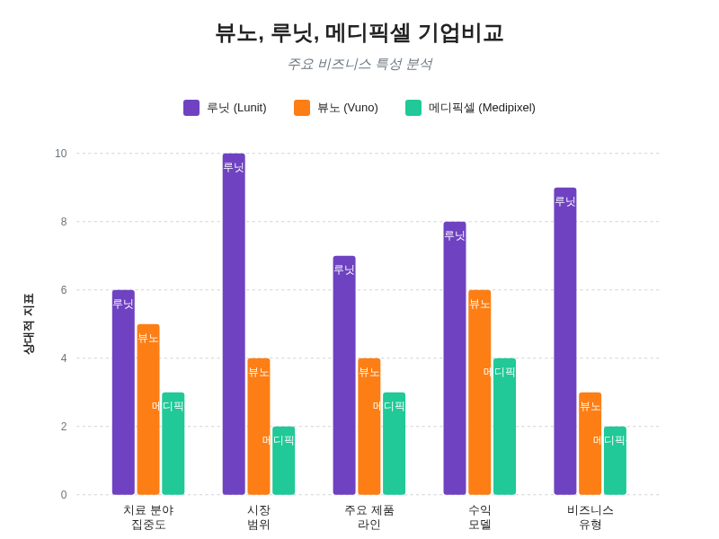
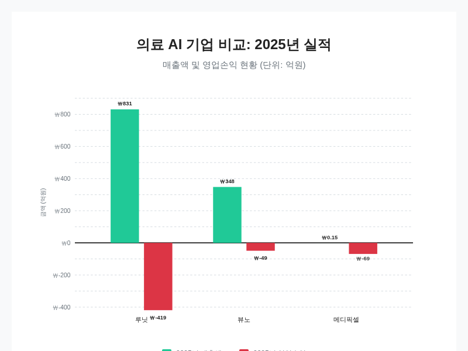
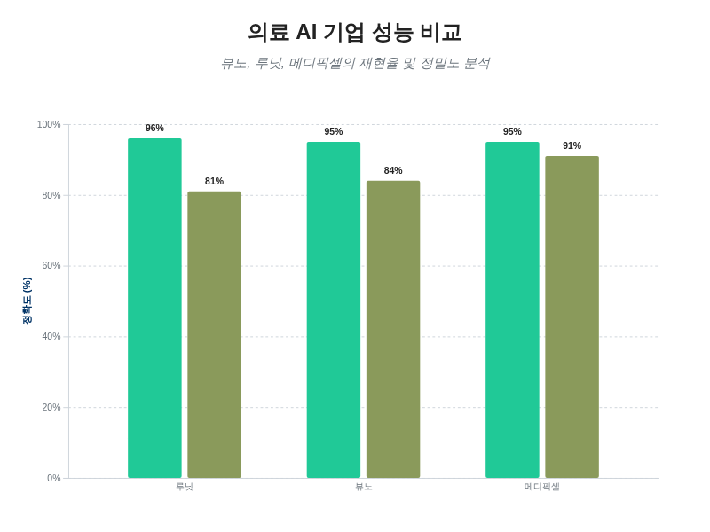
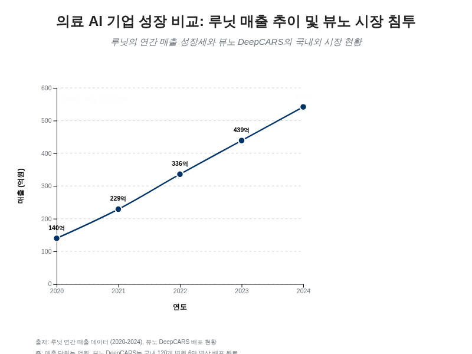
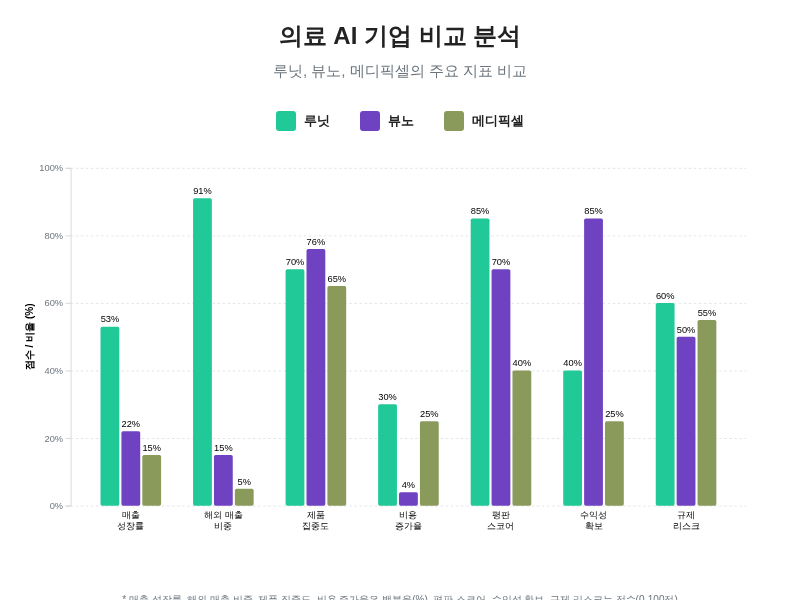

# 뷰노, 루닛, 메디픽셀 종합 기업 비교 분석 보고서

## 기업 개요 및 핵심 사업 모델 비교

뷰노, 루닛, 메디픽셀은 한국을 대표하는 의료 인공지능 기업들이지만, 각사의 설립 배경과 사업 모델, 그리고 핵심 제품군은 뚜렷한 차이를 보이며 시장 내에서 서로 다른 정체성을 구축해 왔습니다. 루닛은 2013년 8월 KAIST 동문 6인에 의해 설립되어 초기 의류 분야 인공지능에서 의료 인공지능으로 사업을 전환한 기업으로, GE 헬스케어와 필립스(Philips)와 같은 글로벌 의료기기 대기업과의 파트너십을 강화하며 공격적인 해외 확장 전략을 펼치고 있습니다. 루닛은 2023년 전체 매출의 88%를 해외에서 달성할 정도로 글로벌화에 성공했으며, [[2](https://dailypharm.com/user/news/6487)] 주로 암 진단 및 치료 솔루션에 특화되어 있습니다. 핵심 사업 부문은 암 검진과 종양학으로 나뉘는데, 암 검진 부문에서는 흉부 엑스레이(CXR)와 유방촬영술(MMG/DBT)을 지원하는 '루닛 인사이트(Lunit INSIGHT)'와 볼파라(Volpara) 제품군을 운영하고 있습니다. 2025년 1분기 기준으로 미국 내 200개 이상의 의료기관이 루닛 인사이트 MMG와 DBT를 도입하여 연간 100만 건 이상의 유방촬영술 분석을 지원하고 있으며, [[9](https://www.lunit.io/wp-content/uploads/2025/12/Lunit-IR-Letter-%E2%80%93-2025-Q2.pdf)] 종양학 부문에서는 바이오마커 분석에 특화된 '루닛 스코프(Lunit SCOPE)'를 통해 글로벌 제약 기업과의 파트너십을 확대하고 있습니다. 최근에는 120만 장 이상의 이미지를 분석하여 진단 정확도를 높인 업그레이드 제품인 '루닛 인사이트 CXR4'가 2025년 EU CE MDR 인증을 획득하는 등 기술 고도화를 지속하고 있습니다. 루닛의 사업 모델은 독일 최대 영상의학 네트워크인 스타비전(Starvision)과의 5년 공급 계약 체결, 국내 GC녹십자아이메드에 루닛 인사이트 CXR와 MMG를 공급하여 건강검진 센터에 적용하는 방식 등 다양한 B2B 공급 계약을 기반으로 합니다. 또한 2023년 사우디아라비아 하지 순례 기간 동안 사우디 정부가 선정하여 전염성 호흡기 질환의 신속 진단을 지원한 바 있어 공공 보건 분야에서의 입지도 넓히고 있습니다.

뷰노는 2014년 12월 삼성전자 출신 연구원들이 설립한 기업으로, 초기부터 국내 시장에 집중하며 병원 내 기반 의료기기 개발에 주력해 왔습니다. 뷰노는 영상 진단 지원을 넘어 중환자실에서의 예후 예측이라는 차별화된 사업 모델을 구축했으며, 대표 제품인 '뷰노메드-딥카스(VUNO Med-DeepCARS)'는 심정지 발생 위험을 예측하는 인공지능 기반 의료기기입니다. 이 제품은 2022년 한국 의료 AI 기업으로는 처음으로 비급여 시장에 진입했으며, [[1](https://www.sisajournal-e.com/news/articleView.html?idxno=414501)] 일반 병동에서 환자의 심정지 위험을 모니터링하는 데 사용됩니다. 딥카스는 뷰노의 매출을 견인하는 핵심 상품으로 2025년에 전년 대비 18% 성장한 257억 원의 매출을 기록했습니다. [[6](https://vuno.co/news/view/3358)] 이는 전체 매출의 상당 부분을 차지하는데, 2025년 3분기에는 전체 매출의 74%, 상반기에는 77%를 차지하며 6만 개 이상의 병상에서 활용되고 있습니다. [[7](https://skyupsu.tistory.com/939)][[16](https://www.sisajournal-e.com/news/curationView.html?idxno=414501)][[71](https://www.kndaily.co.kr/news/articleView.html?idxno=309199)] 뷰노의 최고재무책임자(CFO)는 다른 진단 지원 도구들이 의사의 '조력자' 역할에 그치는 것과 달리, 딥카스는 의사가 수행할 수 없는 심정지 예측을 수행하여 가치를 창출하고 수익을 발생시킨다고 강조했습니다. [[5](https://marketin.edaily.co.kr/News/ReadE?newsId=02171366645381680)] 또한 뷰노는 2018년 5월 국내에서 가장 먼저 규제 승인을 받은 AI 진단 제품인 골 연령 측정 솔루션 '뷰노메드-본에이지'와, [[5](https://marketin.edaily.co.kr/News/ReadE?newsId=02171366645381680)] 2025년 신규 라인업 확대로 19억 원의 매출을 기록한 심전도 측정 의료기기 'HATIV' 등을 보유하고 있습니다. [[6](https://vuno.co/news/view/3358)] '뷰노메드-체스트'와 같은 영상 진단 솔루션은 국내뿐만 아니라 유럽과 일본에서도 허가를 받았으며, 임상 연구에서 의사 2명을 대비해 최대 40%의 판독 시간 단축과 최대 14%의 판독 정확도 향상을 입증하는 등 기술적 우위를 점하고 있습니다. [[70](https://www.samsungpop.com/common.do?cmd=down&saveKey=research.pdf&fileName=2010/2021043010004350K_01_04.pdf&contentType=application/pdf)] 뷰노의 수익 구조는 예후 및 예측 솔루션이 71.3%, 진단 솔루션이 15.4%, 서버 및 관련 제품이 10.2%, 기술 이전 및 연구개발 서비스가 3.1%를 차지하여 [[5](https://marketin.edaily.co.kr/News/ReadE?newsId=02171366645381680)] 예후 예측 분야에 높은 편중도를 보이고 있으며, 최근 유럽 CE MDR과 영국 UKCA 인증 획득 및 유럽·중동 지역 기업과의 파트너십을 통해 해외 시장으로의 영역을 확장하고 있습니다.

메디픽셀은 2017년 4월에 설립된 헬스케어 스타트업으로, 심혈관 및 뇌혈관 질환 진단과 치료를 위한 인공지능 기반 의료 소프트웨어 및 기기 개발에 특화되어 있습니다. [[1](https://www.sisajournal-e.com/news/articleView.html?idxno=414501)][[3](https://www.medicaltimes.com/Mobile/News/NewsView.html?ID=1166050)] 메디픽셀은 의료기관과 의료기기 제조업체에 심혈관 및 뇌혈관 진단 AI 소프트웨어를 공급하는 B2B 비즈니스 모델을 운영하며, [[2](https://dailypharm.com/user/news/6487)][[3](https://www.medicaltimes.com/Mobile/News/NewsView.html?ID=1166050)] 주요 수익원은 소프트웨어 라이선스 판매입니다. [[2](https://dailypharm.com/user/news/6487)] 회사의 비용 구조는 마케팅 의존도가 낮고 인건비 비중이 높은 경량 구조를 가지고 있습니다. [[2](https://dailypharm.com/user/news/6487)] 핵심 제품군으로는 실시간 관상동맥 조영술 분석 소프트웨어인 'MPXA'와 기능적 평가 소프트웨어인 'MPFFR'이 있습니다. MPXA는 FDA 허가를 받은 제품으로 분석 결과를 평균 1.8초 만에 도출해내는 속도를 자랑하며, [[3](https://www.medicaltimes.com/Mobile/News/NewsView.html?ID=1166050)] MPFFR은 FDA와 한국 제약 허가를 모두 획득하여 제품의 안전성과 효능을 인정받았습니다. [[3](https://www.medicaltimes.com/Mobile/News/NewsView.html?ID=1166050)] 메디픽셀은 뷰노와 루닛과 달리 심혈관 질환 진단이라는 relatively niche한 시장을 공략하며 고도화된 의료용 AI 소프트웨어를 전문적으로 개발하고 있습니다.

세 기업의 사업 모델과 제품 포트폴리오를 종합해 볼 때, 루닛은 글로벌 제약 파트너십과 암 진단에 집중하여 규모의 경제를 추구하는 '글로벌 확장형', 뷰노는 국내 병원 시장을 기반으로 환자 모니터링과 예후 예측에 강점을 가진 '병원 내 특화형', 메디픽셀은 특정 질환 부위인 심혈관에 고도로 특화된 AI 소프트웨어를 B2B 라이선스로 공급하는 '니시 전문형'으로 구분할 수 있습니다. 이러한 차이는 각 기업의 수익 성격과 성장 궤적에도 결정적인 영향을 미치고 있습니다.

세 의료 AI 기업의 사업 모델과 시장 포지셔닝 비교 분석.

## 최근 재무 성과 및 밸류에이션 평가

뷰노, 루닛, 메디픽셀 세 기업의 재무 성과를 살펴보면, 매출 규모와 성장성, 그리고 수익성 측면에서 각기 다른 양상을 보이고 있음을 알 수 있습니다. 루닛은 가장 공격적인 성장세를 기록하며 매출액 기준으로 압도적인 1위를 차지하고 있으나, 높은 연구개발비와 인수합병(M&A) 비용 부담으로 인해 적자 폭이 큰 반면, 뷰노는 상대적으로 보수적인 비용 관리를 통해 영업이익 개선에 성공하고 흑자 전환을 앞두고 있어 대조적인 모습을 보입니다. 메디픽셀은 아직 초기 성장 단계로 매출이 미미하며 지속적인 운영 자본 확보에 주력하는 상황입니다.

루닛의 매출 성장은 괄목할 만한 수준입니다. 루닛은 2020년 140억 원이었던 매출이 2023년에는 2,510억 원으로 약 40배 급증하는 기염을 토했으며, [[2](https://dailypharm.com/user/news/6487)] 2023년 연결 기준 매출은 전년 대비 116% 증가한 542억 원을 기록했습니다. [[2](https://dailypharm.com/user/news/6487)] 이러한 성장세는 2024년과 2025년에도 가속화되어, 2024년 상반기에는 약 3,707억 7,000만 원의 매출을 기록하며 전년 동기 대비 두 배로 늘어났습니다. [[1](https://www.sisajournal-e.com/news/articleView.html?idxno=414501)] 특히 2025년 루닛은 연간 매출 831억 원을 달성하여 전년 대비 53% 성장하며 역대 최대 실적을 경신했으며, [[7](https://skyupsu.tistory.com/939)][[8](https://www.hankyung.com/article/202601304591P)] 1분기에만 192억 원의 매출을 올리며 273.6%의YoY(전년 동기 대비) 성장률을 보였습니다. [[9](https://www.lunit.io/wp-content/uploads/2025/12/Lunit-IR-Letter-%E2%80%93-2025-Q2.pdf)] 이러한 폭발적인 매출 증가는 주로 북미 기업 볼파라(Volpara) 인수를 통한 유방암 검진 솔루션 판매 확대와 글로벌 제약사와의 파트너십 확대에 기인합니다. 그러나 루닛의 매출 증가는 막대한 투자와 비용 지출을 수반했습니다. 2023년 루닛의 영업손실은 677억 원에 달했으며, [[2](https://dailypharm.com/user/news/6487)] 2024년 상반기에도 볼파라 인수에 따른 비용 충당, 글로벌 마케팅 확대, 그리고 연구개발비의 64.5% 급증으로 인해 영업손실이 전년 동기 대비 28% 넓게 늘어난 419억 원을 기록했습니다. [[1](https://www.sisajournal-e.com/news/articleView.html?idxno=414501)] 루닛은 원래 2026년 흑자 전환을 목표로 했으나, 공격적인 시장 확장 전략으로 인해 수익성 목표 시점을 2027년으로 연기했습니다. [[1](https://www.sisajournal-e.com/news/articleView.html?idxno=414501)][[3](https://www.medicaltimes.com/Mobile/News/NewsView.html?ID=1166050)] 비용 절감과 효율화를 위해 2026년 초에는 전체 인원의 10~15%에 해당하는 자발적 희망퇴직을 단행하며 구조조정을 단행하기도 했습니다. [[66](https://www.etnews.com/20251023000314)]

뷰노는 루닛에 비해 매출 규모는 작지만 매우 안정적인 성장세와 더불어 수익성 개선에 뚜렷한 성과를 보이고 있습니다. 뷰노의 매출은 2022년 83억 원에서 2024년 259억 원으로 급성장했으며, [[3](https://www.medicaltimes.com/Mobile/News/NewsView.html?ID=1166050)] 2025년에는 전년 대비 34.71% 증가한 약 348억 원의 매출을 달성했습니다. [[5](https://marketin.edaily.co.kr/News/ReadE?newsId=02171366645381680)][[6](https://vuno.co/news/view/3358)] 특히 2025년 3분기에는 누적 매출액이 전년 대비 66% 증가한 566억 5,000만 원을 기록하며 견조한 성장을 이어갔습니다. [[3](https://www.medicaltimes.com/Mobile/News/NewsView.html?ID=1166050)] 무엇보다 뷰노의 재무 성과에서 가장 주목할 점은 영업이익의 현저한 개선입니다. 뷰노는 2023년 124억 원의 영업손실을 기록했으나, [[2](https://dailypharm.com/user/news/6487)] 2024년 2분기에는 영업손실을 전년 대비 95% 감소시킨 1억 7,000만 원으로 축소했습니다. [[1](https://www.sisajournal-e.com/news/articleView.html?idxno=414501)] 이러한 흐름은 이어져 2025년에는 영업손실이 약 49억 원으로 전년 대비 60% 감소했으며, [[5](https://marketin.edaily.co.kr/News/ReadE?newsId=02171366645381680)][[6](https://vuno.co/news/view/3358)] 결국 2025년 3분기에 회사 역사상 처음으로 분기 영업이익 10억 원을 돌파하며 흑자 전환에 성공했습니다. [[3](https://www.medicaltimes.com/Mobile/News/NewsView.html?ID=1166050)] 뷰노는 2025년 전체 영업비용이 전년 대비 불과 4%만 증가하는 등 엄격한 비용 통제를 통해 비효율을 개선했고, [[71](https://www.kndaily.co.kr/news/articleView.html?idxno=309199)][[6](https://vuno.co/news/view/3358)] 이는 루닛과 뚜렷이 구분되는 뷰노만의 수익성 전략의 성과로 평가받습니다.

메디픽셀은 두 경쟁사인 루닛과 뷰노에 비해 매출 규모가 현저히 작고 현재는 매출 감소와 영업손실 지속이라는 재무적 어려움을 겪고 있습니다. 메디픽셀의 매출은 2024년 2억 4,900만 원에서 2025년에는 1억 4,700만 원으로 감소했습니다. [[1](https://www.sisajournal-e.com/news/articleView.html?idxno=414501)] 이에 반해 영업손실은 2025년에 약 69억 원을 기록하는 등 적자 폭이 큽니다. [[1](https://www.sisajournal-e.com/news/articleView.html?idxno=414501)] 다만 메디픽셀은 필립스(Philips) 같은 글로벌 의료기기 대기업으로부터 전략 투자를 유치하는 등 기술력을 인정받았으며, [[3](https://www.medicaltimes.com/Mobile/News/NewsView.html?ID=1166050)] 최근 170억 원 규모의 시리즈 B 투자 유치에 성공하는 등 향후 성장을 위한 자금 확보에는 주력하고 있습니다. [[1](https://www.sisajournal-e.com/news/articleView.html?idxno=414501)] 2023년 말 기준으로 메디픽셀의 자본금은 약 163억 8,000만 원이었으나 당해 순이익은 약 56억 1,700만 원의 적자를 기록하여 IPO(기업공개)를 앞두고 재무 안정성을 확보하는 것이 시급한 과제로 남아 있습니다. [[19](https://pharm.edaily.co.kr/news/read?newsId=01174246645385944)]

루닛, 뷰노, 메디픽셀의 2025년 매출액과 영업이익/손실 비교 (단위: 억 원).

주가 및 밸류에이션 측면에서도 두 기업 간의 시장 기대치는 큰 차이를 보입니다. 2025년 말 기준 루닛의 주가는 약 3만 원 수준으로, 3년 전 약 4만 원 대에 비해 하락세를 보였으나 시장에서는 여전히 높은 성장 잠재력을 반영하여 높은 밸류에이션을 부여하고 있습니다. [[10](https://econody.tistory.com/13)] 루닛의 PBR(주가순자산비율)은 약 6배, PSR(주가매출비율)은 20배를 상회하는 등 기업 가치가 높게 평가되고 있습니다. [[10](https://econody.tistory.com/13)] 2026년 4월 기준 루닛의 시가총액은 약 1조 5,700억 원으로, 뷰노 약 2,670억 원의 6배에 달하는 규모를 자랑합니다. [[2](https://dailypharm.com/user/news/6487)] 반면, 뷰노의 주가는 2025년 말 약 1만 원 수준으로 3년 전 2만 원 대 대비 절반 수준으로 하락했으나, [[10](https://econody.tistory.com/13)] 흑자 전환 실적으로 인해 투자자들의 관심이 다시 높아지는 조짐입니다. 2026년 3월 기준 뷰노의 주가는 1만 5,430원이었고 시가총액은 약 2,160억 원이었습니다. [[5](https://marketin.edaily.co.kr/News/ReadE?newsId=02171366645381680)] 뷰노의 PBR은 3~4배 수준, PSR은 10배 초반대로 루닛에 비해 상대적으로 낮게 평가되고 있으나, [[10](https://econody.tistory.com/13)] 흑자 전환이 확실시되는 상황에서 밸류에이션 재평가 가능성이 제기되고 있습니다. 메디픽셀의 경우 상장 이전 기업으로 공식적인 PER(주가수익비율)이나 PBR 지표는 산출되지 않지만, 지난 연구 개발 투자를 통해 확보한 특허와 기술력, 그리고 필립스 등의 투자를 바탕으로 IPO 시장에서의 기대감이 모아지고 있는 상황입니다.

| 평가 항목 | 루닛 (Lunit) | 뷰노 (VUNO) |
|----------|-------------|----------|
| **2025년 매출액** | 831억 원 (전년 대비 +53%) [[7](https://skyupsu.tistory.com/939)][[23](https://www.kmjournal.net/news/articleView.html?idxno=8590)] | 348억 원 (전년 대비 +35%) [[71](https://www.kndaily.co.kr/news/articleView.html?idxno=309199)][[6](https://vuno.co/news/view/3358)] |
| **2025년 영업이익** | 영업손실 지속 (H1 기준 -419억 원, +28% 악화), 2026년 EBITDA 흑자 목표 [[16](https://www.sisajournal-e.com/news/curationView.html?idxno=414501)][[23](https://www.kmjournal.net/news/articleView.html?idxno=8590)] | 분기 영업이익 흑자 달성 (Q3 70억 원), 연간 영업손실 -49억 원 (전년 대비 60% 감소) [[66](https://www.etnews.com/20251023000314)][[71](https://www.kndaily.co.kr/news/articleView.html?idxno=309199)] |
| **밸류에이션 (2025년 말 기준)** | PBR 약 6배, PSR 20배 이상 (고성장 기업 반영) [[10](https://econody.tistory.com/13)] | PBR 3~4배, PSR 10대 초반 (수익성 개선 반영) [[10](https://econody.tistory.com/13)] |
| **시가총액 (2026년 4월 기준)** | 약 1조 5,700억 원 (뷰노의 약 6배) [[2](https://dailypharm.com/user/news/6487)] | 약 2,670억 원 [[2](https://dailypharm.com/user/news/6487)] |
| **주가 추세** | 2024년 4월 일시 69,800원까지 급등했으나, 현재 30,000원대로 조정 [[9](https://www.lunit.io/wp-content/uploads/2025/12/Lunit-IR-Letter-%E2%80%93-2025-Q2.pdf)][[10](https://econody.tistory.com/13)] | 2024년 4월 24,100원까지 상승 후 하락, 흑자 전환 news로 반등 조짐 [[9](https://www.lunit.io/wp-content/uploads/2025/12/Lunit-IR-Letter-%E2%80%93-2025-Q2.pdf)][[10](https://econody.tistory.com/13)] |
| **시장의 평가** | **고성장·고투자**: 공격적 M&A와 R&D를 통한 글로벌 시장 지배력 확보에 베팅 | **수익성·안정성**: 실질적인 흑자 기반을 구축하고 안정적인 단위 경제 개선에 집중 |

종합적으로 볼 때 현재 시장은 루닛과 뷰노를 서로 다른 프레임으로 평가하고 있습니다. 루닛은 막대한 영업손실에도 불구하고 글로벌 암 진단 시장의 틈새를 파고들어 매출을 폭발적으로 늘리고 있는 '고성장·고투자' 기업으로서, 향후 시장 지배력을 확보했을 때 발생할 클로즈업(Close-up) 수익에 높은 프리미엄을 주고 있습니다. 루닛의 주주들은 연구개발과 인수합병에 대한 공격적인 투자가 결국엔 높은 진입 장벽과 수익성으로 이어질 것이라 기대하고 있습니다. 반면, 뷰노는 비교적 낮은 밸류에이션에 거래되고 있으나, 실질적인 흑자 전환이 가시화되고 있어 안정적인 수익 창출 능력을 갖춘 '수익성·안정성' 지향 기업으로서 재평가를 받고 있습니다. 뷰노의 투자자들은 높은 영업 레버리지와 기존 병원 시장에 대한 강력한 고착화 효과를 바탕으로 향후 이익의 꾸준한 확대를 기대하고 있습니다. 메디픽셀은 매출과 이익 측면에서는 두 기업에 비해 미미하나, 심혈관 AI라는 특화된 시장에서 독보적인 기술력을 가지고 있어 향후 IPO를 통해 모습을 드러낼 때 새로운 차별화된 투자 매력을 보여줄 지 주목됩니다.

## 기술적 우위 및 경쟁사와의 차별화 전략

글로벌 의료 인공지능 시장이 미국의 빅테크 기업들과의 경쟁으로 치열해지고 있는 가운데, 뷰노, 루닛, 메디픽셀은 각기 다른 기술적 특화와 차별화 전략을 통해 고유한 경쟁 우위를 구축하고 있습니다. 2026년 3월 현재, 마이크로소프트(Microsoft)와 구글(Google)과 같은 글로벌 빅테크 기업들은 방대한 데이터를 바탕으로 우수한 진단 정확도를 자랑하지만, 임상적 책임 부담과 의료기기 허가의 까다로움으로 인해 실제 병원 업무 통합에는 소극적인 모습을 보이고 있습니다. 반면 한국 의료 AI 기업들은 빅테크가 진입하기 힘든 니시 마켓과 심층적인 전문 분야에 집중하여 확고한 임상 근거와 규제 승인을 선점하고 있으며, [[19](https://pharm.edaily.co.kr/news/read?newsId=01174246645385944)] 오랜 기간 병 현장에서 축적해 온 신뢰와 임상적 책임감을 기반으로 빅테크 기업이 단기간에 모방하기 어려운 강력한 진입 장벽을 구축하고 있다는 평가를 받습니다. [[19](https://pharm.edaily.co.kr/news/read?newsId=01174246645385944)]

루닛은 암 진단 및 치료 분야에서의 기술적 우위를 바탕으로 글로벌 시장 확장을 주도하고 있습니다. 루닛의 핵심 강점은 폐 결절 감지 능력으로, 방사선학 분야의 권위 있는 저널인 'Radiology'에 게재된 연구에 따르면 7개사의 AI 소프트웨어를 대상으로 한 비교 평가에서 루닛은 폐 결절 감지에 있어 가장 높은 정확도와 민감도를 기록하며 기술력을 입증했습니다. [[40](https://www.mt.co.kr/thebio/2024/12/02/2024120213273351035)] 특히 부산가톨릭대학교 영상의학과 실증 연구에서 루닛은 폐렴 진단 시 96%라는 매우 높은 재현율(Recall, 민감도)을 기록하여 실제 질환 환자를 놓치지 않는 뛰어난 감지 역량을 보여주었습니다. 다만 이 과정에서 뷰노보다 높은 오탐(False Positive) 비율을 기록하는 등 정밀도 측면에서는 다소 아쉬운 모습을 보이기도 했습니다. [[6](https://vuno.co/news/view/3358)][[7](https://skyupsu.tistory.com/939)][[9](https://www.lunit.io/wp-content/uploads/2025/12/Lunit-IR-Letter-%E2%80%93-2025-Q2.pdf)] 루닛은 이러한 영상 진단 기술력을 넘어 제약사와의 동반 진단(Companion Diagnostics) 분야로 특화를 강화하고 있습니다. 루닛은 글로벌 빅파마 기업들과 협력하여 임상 시험에 AI 바이오마커 분석 기술을 통합하고 있으며, [[19](https://pharm.edaily.co.kr/news/read?newsId=01174246645385944)] 업계 관계자는 "AI 바이오마커 분석 기술 측면에서 한국이 결코 뒤처지지 않는다"며 루닛의 기술적 경쟁력을 강조하기도 했습니다. [[19](https://pharm.edaily.co.kr/news/read?newsId=01174246645385944)] 이러한 기술력은 LwF(Learning without Forgetting) 방식을 활용한 AI 지속 학습 방식에 대한 특허 획득으로 이어지고 있으며, [[43](https://www.hitnews.co.kr/news/articleView.html?idxno=46319)] 모델 훈련 시 '치명적인 망각(Catastrophic Forgetting)'을 최소화하여 AI의 성능을 지속적으로 유지·향상시키는 독자적인 기술을 보유하고 있습니다.

뷰노는 실시간 환자 생체 신호 모니터링과 뇌 정량화 분야에 집중하여 차별화를 꾀하고 있습니다. 뷰노의 대표 제품인 '뷰노메드-딥카스(VUNO Med-DeepCARS)'는 입원 환자의 생리적 신호를 실시간으로 분석하여 24시간 이내의 심정지 발생 위험을 예측하는 솔루션으로, [[1](https://www.sisajournal-e.com/news/articleView.html?idxno=414501)][[10](https://econody.tistory.com/13)][[11](https://www.jobkorea.co.kr/recruit/co_read/c/medipixel01)][[15](http://www.choicenews.co.kr/news/articleView.html?idxno=139554)] 환자당 하루 부과 청구 구조의 구독형 SaaS(Software as a Service) 모델을 통해 안정적인 수익을 창출하고 있습니다. [[19](https://pharm.edaily.co.kr/news/read?newsId=01174246645385944)] 뷰노는 영상 의학뿐만 아니라 중환자실과 일반 병동에서의 임상적 유용성을 극대화하는 방향으로 기술을 고도화하고 있으며, 현재 6만 개 이상의 병상에서 사용되며 시장 성과를 입증하고 있습니다. [[10](https://econody.tistory.com/13)][[11](https://www.jobkorea.co.kr/recruit/co_read/c/medipixel01)] 뷰노의 기술적 정확도는 폐렴 진단 분야에서 뚜렷하게 드러납니다. 부산가톨릭대학교 영상의학과의 연구에서 뷰노는 531개의 흉부 엑스레이 이미지를 분석한 결과, 경쟁사 대비 가장 높은 정확도(84%), 정밀도(81%), F1 점수(87%)를 기록했습니다. [[6](https://vuno.co/news/view/3358)][[7](https://skyupsu.tistory.com/939)][[9](https://www.lunit.io/wp-content/uploads/2025/12/Lunit-IR-Letter-%E2%80%93-2025-Q2.pdf)] 연구진은 뷰노가 "다양한 상황에서 균형 잡히고 안정적인 성능을 보인다"고 평가하며 높은 신뢰도를 입증했습니다. 또한 'Radiology'지에 게재된 연구를 통해 뼈 연령 측정 기술이 세계 최고 수준임을 확인받는 등 [[40](https://www.mt.co.kr/thebio/2024/12/02/2024120213273351035)] 특화 진단 분야에서의 압도적인 기술력을 보유하고 있습니다. 뷰노는 이러한 기술력을 바탕으로 2024년 4~6월에 미국 특허청으로부터 흉부 CT AI, 심정지 예측 AI, 안저 이미지 분석 AI 등 핵심 제품에 대한 3건의 주요 미국 특허를 취득하는 등 지식재산권 확보에도 공을 들이고 있습니다. [[7](https://skyupsu.tistory.com/939)][[11](https://www.jobkorea.co.kr/recruit/co_read/c/medipixel01)]

메디픽셀은 심혈관 및 뇌혈관 중재 시술 분야에 초점을 맞춘 고도로 전문화된 기술력으로 경쟁사들과 명확한 차별화를 이루고 있습니다. 메디픽셀의 플래그십 제품인 'MPXA'는 관상동맥 조영술 영상을 분석하여 혈관 협착을 1~2초 만에 감지하고 측정하는 소프트웨어로, [[16](https://www.sisajournal-e.com/news/curationView.html?idxno=414501)][[17](http://www.hitnews.co.kr/news/articleView.html?idxno=44711)] 딥 컨볼루션 신경망(Deep Convolutional Neural Networks)을 활용하여 혈관 분할 F1 점수 0.91의 높은 성능을 자랑합니다. [[2](https://dailypharm.com/user/news/6487)][[4](https://pharm.edaily.co.kr/News/Read?newsId=01400566638821024&mediaCodeNo=257)] 2023년 3월 미국 FDA의 허가를 받은 MPXA는 시술 중 중재적 결과를 개선하기 위해 의사에게 즉각적인 데이터를 제공하는 데 중점을 두고 있으며, [[17](http://www.hitnews.co.kr/news/articleView.html?idxno=44711)] 혈관 영상 추출 기술에 대한 미국 특허와 엄격한 FDA 심사를 통과하며 기술력을 인정받았습니다. [[17](http://www.hitnews.co.kr/news/articleView.html?idxno=44711)] 경쟁사인 하트플로우(HeartFlow)가 CT 영상을 사용하고 부분적으로 수동 분석이 필요한 반면, 메디픽셀의 MPXA는 완전 자동화된 엑스레이 분석을 제공하여 워크플로우 통합성과 속도 면에서 우위를 점하고 있습니다. [[17](http://www.hitnews.co.kr/news/articleView.html?idxno=44711)] 송교석 메디픽셀 대표는 "추가적인 단계 없이 시술 중 모든 결과를 실시간으로 표시할 수 있는 것은 전례 없는 일"이라며 기술적 차별점을 강조했습니다. [[18](https://www.biospectator.com/news/view/20765)] 또한 메디픽셀은 침습적인 방법 없이 영상만으로 혈류 예비력(FFR)을 측정하는 비침습 기술 'MPFFR-1000'을 개발하여 환자와 의사의 부담을 줄이고 있으며, [[16](https://www.sisajournal-e.com/news/curationView.html?idxno=414501)][[37](https://www.hanaw.com/download/research/FileServer/WEB/industry/industry/2025/03/17/250318_AI.pdf)] 뇌혈관 분석 소프트웨어인 'MPNeuro'를 통해 주요 측정값에서 평균 절대 백분율 오차 1% 미만의 전문가 수준 정량 정확도를 자랑하며 약 2초 만에 자동 단면 생성을 제공하는 등 뇌혈관 분야에서도 고도화된 기술력을 보유하고 있습니다. [[20](https://dailypharm.com/user/news/333759)] 이를 위해 메디픽셀은 국내 26건의 등록 특허와 미국, 유럽, 중국, 일본 등 30건의 해외 출원 중인 특허를 보유하여 심혈관 진단 및 분야에서 강력한 지식재산권 포트폴리오를 구축했습니다. [[6](https://vuno.co/news/view/3358)][[11](https://www.jobkorea.co.kr/recruit/co_read/c/medipixel01)]

종합적으로 볼 때 이들 기업은 글로벌 빅테크 기업과의 경쟁 속에서 각자의 전문 분야를 심층적으로 파고들며 기술적 우위를 점하고 있습니다. 루닛은 글로벌 제약바이오 시장과 연계된 암 진단 및 동반 진단 AI, 뷰노는 실시간 환자 모니터링과 뇌 정량화를 통한 병원 내 특화 진단 AI, 메디픽셀은 초고속 정밀도를 자랑하는 심혈관 중재 시술 지원 AI라는 각기 다른 영역에서 빅테크가 쉽게 넘볼 수 없는 임사적 고도화(Late-stage specialization)와 전문성을 무기로 시장을 선도하고 있습니다. 특히 각 기업이 보유한 임상 데이터와 규제 승인, 그리고 특허 포트폴리오는 향후 의료 AI 시장에서의 지속적인 경쟁력을 보장해 주는 핵심 자산으로 작용할 것입니다.

| 구분 | 루닛 (Lunit) | 뷰노 (VUNO) | 메디픽셀 (Medipixel) |
|----------|-------------|----------|-------------|
| **핵심 기술 분야** | 암 진단(폐, 유방), 동반 진단(CDx) 바이오마커 | 실시간 환자 모니터링(심정지 예측), 뇌 정량화 | 심혈관 및 뇌혈관 중재 시술 지원, 혈관 분석 |
| **대표 제품 및 성능** | 루닛 인사이트 CXR/MMG, 루닛 스코프 - 폐결절 감지 세계 최고 정확도 [[40](https://www.mt.co.kr/thebio/2024/12/02/2024120213273351035)] - 폐렴 진단 재현율 96% (오탐률 상대적 높음) [[6](https://vuno.co/news/view/3358)][[9](https://www.lunit.io/wp-content/uploads/2025/12/Lunit-IR-Letter-%E2%80%93-2025-Q2.pdf)] | 뷰노메드-딥카스, 뷰노메드-본에이지 - 6만 개 병상 도입 [[10](https://econody.tistory.com/13)][[11](https://www.jobkorea.co.kr/recruit/co_read/c/medipixel01)] - 폐렴 진단 정확도 84%, 정밀도 81% (경쟁사 대비 최고) [[6](https://vuno.co/news/view/3358)][[9](https://www.lunit.io/wp-content/uploads/2025/12/Lunit-IR-Letter-%E2%80%93-2025-Q2.pdf)] | MPXA, MPFFR, MPNeuro - 혈관 분석 1.8초, 혈관 분할 F1 0.91 [[2](https://dailypharm.com/user/news/6487)][[4](https://pharm.edaily.co.kr/News/Read?newsId=01400566638821024&mediaCodeNo=257)] - 뇌혈관 분석 오차율 1% 미만 [[20](https://dailypharm.com/user/news/333759)] |
| **차별화 전략** | 글로벌 Big Pharma와의 파트너십을 통한 임상 시험 통합 및 M&A 확장 | 구독형 SaaS 모델을 통한 실시간 예후 예측 및 병원 워크플로우 최적화 | CT가 아닌 X-ray 기반 실시간(real-time) 분석으로 시술 시간 단축 및 침습적 절차 최소화 |
| **특허 및 지식재산권** | AI 지속 학습(LwF) 방식 특허 [[43](https://www.hitnews.co.kr/news/articleView.html?idxno=46319)], 의료 영상 메타데이터 예측 등 | 흉부 CT, 심정지 예측, 안저 이미지 분석 등 미국 핵심 특허 3건 [[7](https://skyupsu.tistory.com/939)][[11](https://www.jobkorea.co.kr/recruit/co_read/c/medipixel01)] | 혈관 분할 및 병변 정량화 미국 특허, 국내 26건 및 해외 30건 특허 [[6](https://vuno.co/news/view/3358)][[11](https://www.jobkorea.co.kr/recruit/co_read/c/medipixel01)] |
| **경쟁사 대비 강점** | 폐암 진단 정확도와 글로벌 제약사 네트워크 | 다양한 상황에서 안정적인 진단 성능과 흑자 기반의 안정성 | 시술 중 실시간 결과 제공과 완전 자동화된 워크플로우 |

한국 의료 AI 기업 3사의 폐렴 및 혈관 분석 성능 지표(재현율과 정밀도) 비교.

## 글로벌 시장 진출 현황 및 규제 승인 동향

국내 의료 AI 시장의 성장 둔화와 낮은 수가 보수 체계로 인해 뷰노, 루닛, 메디픽셀 세 기업은 모두 생존과 성장을 위해 해외 시장, 특히 미국과 유럽으로의 진출을 본격화하고 있습니다. 국내 시장은 대형 병원을 중심으로 파일럿 도입이 진행되고는 있으나, 중소 병원이나 지방 의료기관으로의 확산은 더딘 실정입니다. 이에 반해 민간 의료 보험 체계 기반에 의료 건강보험 급여 수준이 높고 최근 규제 완화 움직임이 있는 미국 시장은 한국 의료 AI 기업들에게 매력적인 무대로 부상했습니다. [[20](https://dailypharm.com/user/news/333759)] 실제로 루닛의 경우 2024년 3분기 매출의 무려 99%가 해외에서 발생했을 정도로 해외 의존도가 급격히 높아지고 있으며, [[20](https://dailypharm.com/user/news/333759)] 이는 국내 기업들이 글로벌 경쟁력을 앞세워 시장의 판도를 바꾸고 있음을 시사합니다.

루닛은 가장 공격적인 글로벌 무대 확장 전략을 구사하고 있으며, 특히 유방암 진단 분야에서 압도적인 시장 점유율을 보여주고 있습니다. 루닛은 미국 매사추세츠주 케임브리지에 '루닛 USA'를 설립하고 약 80억 원을 투자하는 등 북미 시장을 공격적으로 공략하고 있습니다. [[20](https://dailypharm.com/user/news/333759)] 이러한 노력의 결실으로 2024년 기준 루닛의 매출은 2020년 140억 원에서 2024년 542억 원으로 급성장했습니다. [[20](https://dailypharm.com/user/news/333759)] 특히 북미 기업 볼파라(Volpara) 인수를 통해 미국 내 유방암 검진 네트워크를 통합한 루닛은, 인수 후 단 1년 만에 미국 내 200개 이상의 의료기관에 루닛 인사이트 MMG와 DBT를 도입하는 쾌거를 이뤄냈습니다. [[9](https://www.lunit.io/wp-content/uploads/2025/12/Lunit-IR-Letter-%E2%80%93-2025-Q2.pdf)] 이를 통해 연간 100만 건 이상의 유방촬영술 분석을 지원하며 북미 시장에서의 입지를 확고히 다졌습니다. 루닛은 유럽 시장에서도 두각을 나타내어 독일 최대 영상의학 네트워크인 스타비전(Starvision)과 5년 공급 계약을 체결하여 7개 주 79개 기관에 제품을 공급하고 있으며, [[9](https://www.lunit.io/wp-content/uploads/2025/12/Lunit-IR-Letter-%E2%80%93-2025-Q2.pdf)] 2023년 사우디아라비아 하즈 순례 기간 동안 감염성 호흡기 질환 선별을 위해 루닛 인사이트 CXR을 공급하는 등 중동 시장에서도 성과를 거두었습니다. [[9](https://www.lunit.io/wp-content/uploads/2025/12/Lunit-IR-Letter-%E2%80%93-2025-Q2.pdf)] 루닛의 글로벌 확장은 단순한 제품 공급을 넘어 글로벌 제약사와의 파트너십을 통한 동반 진단(Companion Diagnostics) 분야로까지 확장되고 있습니다. 루닛은 다이이찌산쿄(Daiichi Sankyo)와 전략적 제휴를 맺어 항암제 임상 시험에 루닛 스코프 플랫폼을 통합하고 있으며, [[24](https://www.koreabiomed.com/news/articleView.html?idxno=30678)] 미국의 진단 서비스 대기업 랩코프(Labcorp)와 협력하여 다양한 암 종에 대한 공동 연구개발을 진행하는 등 글로벌 제약 바이오 생태계 내에서의 위상을 높이고 있습니다. [[65](https://www.lunit.io/wp-content/uploads/2026/01/%EB%A3%A8%EB%8B%9B_IR%EB%A0%88%ED%84%B0_2025.4Q-KR.pdf)]

뷰노는 미국과 유럽 시장에서 임상 근거를 강화하며 규제 승인을 잇달아 달성하여 본격적인 글로벌화 단계에 진입했습니다. 뷰노는 2021년 보스턴에 미국 자회사인 '뷰노 메드(VUNO MED)'를 설립한 뒤 자본금을 10억 원에서 2024년에는 30억 원으로 증액하는 등 미국 시장 공략에 자금을 집중 투입하고 있습니다. [[20](https://dailypharm.com/user/news/333759)] 특히 2024년에는 미국의 컴패스 경로웨이스(Compass Pathways) 관련 투자 펀드로부터 약 700만 달러(약 100억 원) 규모의 전략적 투자를 유치하며 글로벌 확장을 위한 자금력을 확보했습니다. [[21](https://www.mobihealthnews.com/news/asia/vuno-continues-aggressive-global-expansion-7m-investment-and-more-briefs)] 뷰노의 규제 승인 성과는 매우 인상적입니다. 2024년 11월, 뷰노의 핵심 제품인 '뷰노 메드 흉부 엑스레이 트리아지(VUNO Med Chest X-ray Triage)'가 기흉(pneumothorax)과 흉막 삼출을 자동으로 감지하는 기능으로 미국 FDA의 510(k) 허가를 획득했으며, [[48](https://www.vuno.co/news/view/2564)] 2023년 10월에는 뇌 정량화 의료기기인 '뷰노 메드-딥브레인(VUNO Med-DeepBrain)' 역시 FDA 승인을 받아 미국 시장에서 적극적으로 마케팅을 전개하고 있습니다. [[48](https://www.vuno.co/news/view/2564)] 뷰노가 가장 주목하는 제품인 심정지 예측 AI '뷰노 메드-딥카스(VUNO Med-DeepCARS)'는 2023년 6월 FDA로부터 혁신 의료기기(Breakthrough Device) 지정을 받아 심사 우선권을 확보했으며, [[51](https://www.medipana.com/news/articleView.html?idxno=341318)] 2025년이나 2026년 3분기 중 승인을 목표로 심사가 진행 중입니다. [[16](https://www.sisajournal-e.com/news/curationView.html?idxno=414501)][[48](https://www.vuno.co/news/view/2564)][[51](https://www.medipana.com/news/articleView.html?idxno=341318)] 유럽 시장에서는 2024년 5월 EU 의료기기 규정(MDR) 인증을 획득한 직후 오스트리아와 독일 지역 병원들과 납품 계약을 체결하는 등 성과를 냈으며, AI 심전도 측정 기기 'HATIV P30'이 EU CE MDR 인증과 영국 UKCA 인증을 동시에 획득하여 유럽 27개국과 영국 시장 진출의 교두보를 마련했습니다. [[52](https://www.aitimes.com/news/articleView.html?idxno=169037)] 뷰노는 현재 미국 메이요 클리닉 플랫폼(Mayo Clinic Platform)과의 파트너십을 활용하여 미국 내 네트워크를 확장하고 있으며, 독일 병원에서는 파일럿 테스트를, 쿠웨이트에서는 데모를 진행하는 등 유럽 및 중동 시장 진입을 위한 구체적인 발걸음을 내디디고 있습니다. [[16](https://www.sisajournal-e.com/news/curationView.html?idxno=414501)]

메디픽셀은 미국 FDA의 허가를 기점으로 심혈관 분야의 글로벌 리더로 도약하기 위한 전략적 거점을 구축해 나가고 있습니다. 메디픽셀은 2023년 3월, 심혈관 진단 지원 AI 솔루션인 'MPXA'가 미국 FDA의 승인을 받음으로써 한국 의료 AI 기업 가운데 최초로 임상 카테터실에서의 실시간 사용을 허가받는 중요한 이정표를 세웠습니다. [[62](https://www.linkedin.com/posts/jay-jeonghun-jang_%EB%A9%94%EB%94%94%ED%94%BD%EC%85%80-ai-%EC%8B%AC%ED%98%88%EA%B4%80-%EC%A7%88%ED%99%98-%EC%A7%84%EB%8B%A8-%EB%B3%B4%EC%A1%B0-%EC%86%94%EB%A3%A8%EC%85%98-%E7%BE%8E-fda-%EC%8A%B9%EC%9D%B8-activity-7046016101196959744-6AZC)][[7](https://skyupsu.tistory.com/939)][[22](https://koreatechdesk.com/korea-medical-ai-first-profitable-listed-company)][[23](https://www.kmjournal.net/news/articleView.html?idxno=8590)][[24](https://www.koreabiomed.com/news/articleView.html?idxno=30678)] 이는 한국 의료기기가 미국 시장에서 기술력을 인정받은 사례로서 향후 라틴아메리카 및 동남아 등 여러 국가에서의 허가 절차를 간소화하는 촉매제가 되고 있습니다. [[63](https://www.medifonews.com/news/article.html?no=176968)][[53](https://medipixel.io/newsroom/%EB%A9%94%EB%94%94%ED%94%BD%EC%85%80-AI-%EC%8B%AC%ED%98%88%EA%B4%80-%EC%A7%88%ED%99%98-%EC%A7%84%EB%8B%A8-%EB%B3%B4%EC%A1%B0-%EC%86%94%EB%A3%A8%EC%85%98-%E7%BE%8E-FDA-%EC%8A%B9%EC%9D%B8)] 메디픽셀은 서울 본사와 미국 케임브리지에 거점을 두고 글로벌 의료기업들과의 협력을 확대하고 있습니다. [[20](https://dailypharm.com/user/news/333759)][[23](https://www.kmjournal.net/news/articleView.html?idxno=8590)] 특히 글로벌 심혈관 영상장비 시장의 리더인 필립스(Philips)로부터 2021년 350억 원 규모의 전략적 투자를 유치하고 파트너십을 맺은 것이 큰 강점입니다. [[18](https://www.biospectator.com/news/view/20765)] 필립스는 메디픽셀의 솔루션을 자사 장비에 통합하여 판매하는 방식으로 협력하고 있으며, 이는 메디픽셀이 가진 기술력의 신뢰도를 입증하는 동시에 글로벌 유통망 확장에 유리한 고지를 점하게 했습니다. [[18](https://www.biospectator.com/news/view/20765)] 아시아 시장에서도 메디픽셀은 적극적인 움직임을 보이고 있습니다. 인도의 의료기기 기업인 이노베이션 이미징 테크놀로지(IITPL)와 약 60억 원 규모의 유통 계약을 맺고 제품 공급을 시작했으며, [[18](https://www.biospectator.com/news/view/20765)] 또 다른 인도 기업인 인볼루션 헬스케어(Involution Healthcare)와 약 450만 달러(약 60억 원) 규모의 수출 계약을 체결하는 등 인도 시장 공략을 강화하고 있습니다. [[24](https://www.koreabiomed.com/news/articleView.html?idxno=30678)][[16](https://www.sisajournal-e.com/news/curationView.html?idxno=414501)] 이 밖에도 인도네시아, 말레이시아, 태국 등 동남아 주요 국가에서 의료기기 인증을 획득하여 동남아 시장 진입 속도를 높이고 있습니다. [[20](https://dailypharm.com/user/news/333759)]

| 기업 | 주요 진출 국가 | 글로벌 시장 점유율/성과 | 주요 규제 승인 (FDA, CE) | 주요 파트너십/협력 |
|------|--------------|----------------------|-------------------------|-------------------|
| **루닛 (Lunit)** | 미국, 유럽(독일), 중동(사우디) | - 북미 200개 이상 의료기관 이용 (연간 100만 건 분석) [[9](https://www.lunit.io/wp-content/uploads/2025/12/Lunit-IR-Letter-%E2%80%93-2025-Q2.pdf)] - 2024년 매출의 99%가 해외 [[20](https://dailypharm.com/user/news/333759)] | **FDA**: 유방암 진단 인사이트 MMG 허가 (정확도 97%) [[58](https://medigatenews.com/news/1823984218)], 인사이트 리스크 제출 및 혁신기기 지정 [[49](https://biz.chosun.com/science-chosun/bio/2025/12/08/R63DEDP6K5A25DNRHUX7FODRRI/)] **CE**: 인사이트 CXR4 (정확도 99.5%) [[9](https://www.lunit.io/wp-content/uploads/2025/12/Lunit-IR-Letter-%E2%80%93-2025-Q2.pdf)] | - 볼파라 인수 (북미 유방암 시장 통합) [[16](https://www.sisajournal-e.com/news/curationView.html?idxno=414501)] - 다이이찌산쿄, 아스트라제네카, 로슈 (동반 진단) [[65](https://www.lunit.io/wp-content/uploads/2026/01/%EB%A3%A8%EB%8B%9B_IR%EB%A0%88%ED%84%B0_2025.4Q-KR.pdf)] - 랩코프 (미국 진단 대기업) [[65](https://www.lunit.io/wp-content/uploads/2026/01/%EB%A3%A8%EB%8B%9B_IR%EB%A0%88%ED%84%B0_2025.4Q-KR.pdf)] - 독일 스타비전 (5년 공급 계약) [[9](https://www.lunit.io/wp-content/uploads/2025/12/Lunit-IR-Letter-%E2%80%93-2025-Q2.pdf)] |
| **뷰노 (VUNO)** | 미국, 유럽(독일, 오스트리아), 중동(쿠웨이트) | - 딥카스 6만 개 병상 도입 (국내 120개 병원) [[51](https://www.medipana.com/news/articleView.html?idxno=341318)][[56](http://m.yakup.com/news/index.html?mode=view&pmode=clist&cat=all&cat2=&cat3=&nid=322804&num_start=2470)] - 미국 시장 92만 개 병상이 잠재 고객 [[51](https://www.medipana.com/news/articleView.html?idxno=341318)] | **FDA**: 흉부 엑스레이 트리아지 허가 [[48](https://www.vuno.co/news/view/2564)], 딥브레인 허가 [[48](https://www.vuno.co/news/view/2564)], 딥카스 혁신기기 지정 및 심사 중 [[51](https://www.medipana.com/news/articleView.html?idxno=341318)] **CE**: HATIV P30 (심전도) [[52](https://www.aitimes.com/news/articleView.html?idxno=169037)] | - 메이요 클리닉 플랫폼 (미국 네트워크 확장) [[16](https://www.sisajournal-e.com/news/curationView.html?idxno=414501)] - 컴패스 경로웨이스 (100억 원 투자 유치) [[21](https://www.mobihealthnews.com/news/asia/vuno-continues-aggressive-global-expansion-7m-investment-and-more-briefs)] |
| **메디픽셀 (Medipixel)** | 미국, 인도, 동남아(인도네시아 등) | - 한국 최초 FDA 실시간 카테터실 사용 허가 [[63](https://www.medifonews.com/news/article.html?no=176968)] - 인도 IITPL, 인볼루션 헬스케어와 수출 계약 (약 120억 원 규모) [[18](https://www.biospectator.com/news/view/20765)][[24](https://www.koreabiomed.com/news/articleView.html?idxno=30678)] | **FDA**: MPXA (심혈관 분석 AI-QCA) 허가 [[62](https://www.linkedin.com/posts/jay-jeonghun-jang_%EB%A9%94%EB%94%94%ED%94%BD%EC%85%80-ai-%EC%8B%AC%ED%98%88%EA%B4%80-%EC%A7%88%ED%99%98-%EC%A7%84%EB%8B%A8-%EB%B3%B4%EC%A1%B0-%EC%86%94%EB%A3%A8%EC%85%98-%E7%BE%8E-fda-%EC%8A%B9%EC%9D%B8-activity-7046016101196959744-6AZC)][[22](https://koreatechdesk.com/korea-medical-ai-first-profitable-listed-company)][[23](https://www.kmjournal.net/news/articleView.html?idxno=8590)] | - 필립스 (전략적 투자 및 장비 통합) [[18](https://www.biospectator.com/news/view/20765)] |

세 기업의 글로벌 확장 성과는 각 기업의 역량에 따라 뚜렷한 양상을 보입니다. 루닛은 인수합병을 통한 공격적인 시장 장악력 확보와 제약사와의 동반 진단 협력을 통해 가장 광범위한 글로벌 생태계를 구축한 상태입니다. 반면 뷰노는 규제 당국의 승인을 하나씩 확실히 따내며 검증된 임상적 효용성을 바탕으로 북미와 유럽의 틈새 시장을 공략하는 '정공법'을 택하고 있습니다. 메디픽셀은 필립스라는 거대 파트너사를 등 업고 특화된 심혈관 시술 분야에서 높은 진입 장벽을 구축하며 점유율을 높여가는 추세입니다. 이러한 차별화된 글로벌 전략과 규제 승인 현황은 향후 각 기업의 실적과 시장 지배력을 결정짓는 중요한 변수로 작용할 것입니다.

루닛의 매출 성장 추세와 뷰노 딥카스의 시장 침투 현황.

## 향후 성장 동력 및 신사업 계획

한국 의료 AI 산업은 2025년부터 2026년에 걸쳐 연구개발 중심의 단계를 지나 실질적인 매출과 이익 창출의 시기로 전환하고 있습니다. 이 시기는 업계의 수익성 돌파구가 마련되는 중요한 시기로 평가받으며, 2026년에 시행을 앞두고 있는 한국의 'AI 기본법'은 AI 진단 지원 도구에 대한 유연한 규제를 허용하여 국내외 시장 확장을 촉진할 핵심적인 동력이 될 것으로 기대됩니다. 특히 미국 FDA의 혁신적인 디지털 헬스 규제 프레임워크 개편과 맞물려 시장의 성장 가능성을 한층 높이고 있습니다. 이러한 환경 변화 속에서 사업 모델 역시 일회성 의료기기 판매에서 SaaS(Software as a Service) 구독 모델로 대규모 전환되고 있어, 이는 기업들이 반복적인 수익을 창출하고 강력한 운영 레버리지를 확보하는 데 기여하고 있습니다. [[7](https://skyupsu.tistory.com/939)]

하지만 업계는 여전히 규제 장벽, 제한적인 수가 보상 체계, 그리고 높은 연구개발 비용으로 인한 수익성 지연이라는 과제를 직면해 있습니다. 대형 병원을 중심으로 파일럿 도입은 진행되고 있으나 전반적인 확산은 더딘 상황이므로, 높은 규제 비용 속에서 규모의 경제를 실현하기 위해서는 수출 전략이 필수적인 요소로 부상했습니다. 업계 전문가들은 대부분의 기업들이 향후 1~2년 내에 손익분기점을 넘어 2026년에서 2027년 사이에 흑자 전환을 목표로 하고 있다며, 의료 AI 산업이 급격한 시장 확장에서 수익성 확보로 중심축을 이동하고 있다고 분석합니다. [[16](https://www.sisajournal-e.com/news/curationView.html?idxno=414501)] 이러한 흐름 속에서 한국거래소는 반도체 설계 기업 파도의 과도한 공모 가액 논란 이후 상장 심사 기준을 강화하여, 기술 특례 상장을 희망하는 의료 AI 기업들에게 검증 가능하고 지속 가능한 매출 모델을 입증할 것을 요구하고 있습니다. 투자 전문가들은 견실한 매출 기반과 적자 폭의 감소가 성공적인 상장의 핵심이라고 강조하며, 기업들의 실질적인 성과가 중요해지고 있습니다. [[67](https://m.sedaily.com/amparticle/14036097)]

루닛은 공격적인 확장 전략과 글로벌 시장 장악을 통해 미래 성장 동력을 확보하고 있지만, 수익성 개선 과제 또한 안고 있습니다. 루닛은 연간 53% 이상의 높은 매출 성장률과 전체 매출의 91% 이상을 해외에서 달성하는 등 압도적인 글로벌 존재감을 과시하고 있으며, 글로벌 빅파마 기업들과의 강력한 파트너십과 진단 및 치료 분야에 걸친 다양한 제품 포트폴리오, 그리고 FDA 및 CE 등 선진 규제 승인을 확보한 점이 큰 강점입니다. [[16](https://www.sisajournal-e.com/news/curationView.html?idxno=414501)][[66](https://www.etnews.com/20251023000314)][[9](https://www.lunit.io/wp-content/uploads/2025/12/Lunit-IR-Letter-%E2%80%93-2025-Q2.pdf)][[5](https://marketin.edaily.co.kr/News/ReadE?newsId=02171366645381680)] 그러나 과감한 확장과 연구개발 투자로 인해 영업손실이 확대되고 있고, 해외 시장 의존도가 높아 환율 및 규제 리스크에 노출되어 있는 점은 해결해야 할 과제입니다. 최근 인력 감축 소식은 재정적 압박을 시사하는 대목이며, 대규모 자금 조달이 주주 가치 희석을 초래할 수 있다는 우려도 제기됩니다. 특히 미국 유방암 검진 시장을 장악하기 위해 인수한 볼파라(Volpara)는 루닛에게 북미 시장 진입의 교두보를 제공한 동시에 통합 비용 증가와 적자 폭 확대라는 양날의 검으로 작용하고 있습니다. [[16](https://www.sisajournal-e.com/news/curationView.html?idxno=414501)][[66](https://www.etnews.com/20251023000314)] 루닛은 약속한 대로 2026년 EBITDA 흑자 달성을 앞두고 있어, 성장과 비용 절감 간의 균형을 어떻게 맞추느냐가 관건이 될 것입니다.

뷰노는 수익성 개선과 미국 시장 진출을 통해 투자 매력도를 높이고 있습니다. 뷰노는 동종 기업 가운데 가장 먼저 2025년 3분기에 분기 영업이익 흑자를 달성하는 성과를 거두었으며, [[66](https://www.etnews.com/20251023000314)][[71](https://www.kndaily.co.kr/news/articleView.html?idxno=309199)][[5](https://marketin.edaily.co.kr/News/ReadE?newsId=02171366645381680)] 비용 증가율을 4% 수준으로 억제하는 등 탁월한 비용 통제 능력을 보여주었습니다. 핵심 제품인 딥카스(DeepCARS)는 높은 매출총이익률 잠재력을 지니고 있으며, 경쟁이 치열한 영상 진단 분야보다는 중환자실 등 중증 환자 케어 분야에서 확실한 차별화를 이루고 있습니다. 또한 FDA 승인 이후 미국 시장으로의 진출 경로가 비교적 명확하다는 점도 긍정적인 요소입니다. 하지만 루닛에 비해 매출 규모가 현저히 작고, 매출의 상당 부분(약 74~77%)을 단일 제품인 딥카스에 의존하고 있어 제품 집중도에 따른 리스크가 존재합니다. 또한 현재로서는 사업의 국내 시장 편중성이 높고, 핵심 성장 동력인 FDA 승인이 지연될 경우 성장 추세에 차질이 빚어질 우려가 있습니다. 뷰노는 '성장보다는 수익성'이라는 슬로건 아래 미국 시장에서의 딥카스 상용화 성공과 이에 따른 매출 확대, 그리고 미국의 의료 보험 청구 코드인 NTAP(New Technology Add-On Payment) 승인 진행 상황이 향후 주가 및 기업 가치를 결정하는 중요한 촉매제가 될 것입니다. [[7](https://skyupsu.tistory.com/939)][[16](https://www.sisajournal-e.com/news/curationView.html?idxno=414501)][[6](https://vuno.co/news/view/3358)]

한국 의료 AI 기업 3사(Lunit, Vuno, MediPixcel)의 주요 성과 지표 다차원 비교.

메디픽셀은 IPO 기대감과 특화된 시장 경쟁력을 바탕으로 주목받고 있습니다. 2025년 현재 한국 의료 AI 업계에서는 메디픽셀을 포함한 약 10여 개 기업이 기술 특례 상장을 위해 사전 심사를 신청하는 등 상장 준비에 열기를 보이고 있습니다. 메디픽셀은 뉴로핏, 웨이센, 딥바이오, 메디웨일 등과 함께 공모 자금 확보를 통한 사업 확장을 꾀하는 주요 기업으로 분류됩니다. [[67](https://m.sedaily.com/amparticle/14036097)] 하지만 루닛이나 뷰노와 달리 메디픽셀에 대해서는 상세한 재무 데이터나 매출 모델, 구체적인 사업 분석 보고서가 공개적으로 확인되지 않는 상황입니다. 수집된 정보에 따르면 메디픽셀은 의료 AI 산업의 매출 실현 추세 속에서 중요한 기업으로 평가받고 있으나, 상장된 경쟁사들과 비교할 때 재무 상세나 투자 위험 요소, 구체적인 밸류에이션 수치에 대한 검증 가능한 데이터가 부족한 실정입니다. [[67](https://m.sedaily.com/amparticle/14036097)] 이에 따라 투자자들은 메디픽셀이 단순한 산업 붐을 넘어 실제 '실현 가능한 매출'을 가지고 있는지를 입증하는 IPO 투자설명서를 면밀히 분석해야 할 필요가 있습니다. 규제 당국이 과대 평가를 방지하기 위해 기준을 강화하고 있는 만큼, 메디픽셀의 상장 과정에서 공개될 실적 규모와 성장 계획이 시장의 기대치를 충족시킬지 주목됩니다.

종합적으로 볼 때 한국 의료 AI 섹터는 루닛이 대표하는 '공격적 글로벌 확장형'과 뷰노가 보여주는 '효율적 수익 추구형'이라는 두 가지 투자 대표 전형으로 나뉘어 가고 있습니다. 루닛은 막대한 글로벌 발판과 제약사 파트너십을 통해 높은 상승 여력을 제공하지만, 높은 실행 리스크와 주가 희석 우려가 공존합니다. 반면 뷰노는 검증된 수익성과 명확한 비용 통제를 통해 안정적인 투자 척도를 제시하지만, 상대적으로 작은 규모와 제품 의존도에 대한 해결이 필요합니다. 이 두 기업의 향후 성공 여부는 메디픽셀과 같은 차기 상장 기업들의 밸류에이션과 퇴로를 결정짓는 중요한 바로미터가 될 것입니다. [[7](https://skyupsu.tistory.com/939)][[66](https://www.etnews.com/20251023000314)][[23](https://www.kmjournal.net/news/articleView.html?idxno=8590)]

## 출처

[1] [루닛 vs 뷰노, 수익성 희비 교차···하반기 승부처는 - 시사저널이코노미](https://www.sisajournal-e.com/news/articleView.html?idxno=414501)  
[2] ['매출 2배·시총 6배'...의료 AI업체 닮은꼴 상반된 행보 - 데일리팜](https://dailypharm.com/user/news/6487)  
[3] [매출 노선 확보하는 의료 AI 기업들…적자 수렁 벗어나나 - 메디칼타임즈](https://www.medicaltimes.com/Mobile/News/NewsView.html?ID=1166050)  
[4] [뷰노, 3조원대 美 심정지 예측 시장 정조준...경쟁사와 차별점은](https://pharm.edaily.co.kr/News/Read?newsId=01400566638821024&mediaCodeNo=257)  
[5] [루닛·뷰노·코어라인 상장 후 지속된 시장조달…자생력 갖추려면 - 마켓인](https://marketin.edaily.co.kr/News/ReadE?newsId=02171366645381680)  
[6] [뷰노, 2025년 매출 348억원으로 전년 대비 35% 성장 '역대 최고 실적'](https://vuno.co/news/view/3358)  
[7] [뷰노 흑자 전환 원년 완전 해부 — AI 진단 2026 실적·투자 포인트 총정리](https://skyupsu.tistory.com/939)  
[8] [루닛, 2025년 매출 831억원 역대 최대 실적… - 한국경제](https://www.hankyung.com/article/202601304591P)  
[9] [\[PDF\] 2025년 1분기 매출 192억원 달성 - Lunit](https://www.lunit.io/wp-content/uploads/2025/12/Lunit-IR-Letter-%E2%80%93-2025-Q2.pdf)  
[10] [루닛 뷰노 주가 비교 | 국산 AI 의료 진단 대표주 두 기업 분석](https://econody.tistory.com/13)  
[11] [메디픽셀 2026년 기업정보 - 직원수, 근무환경, 복리후생 등 | 잡코리아](https://www.jobkorea.co.kr/recruit/co_read/c/medipixel01)  
[12] [메디픽셀(심혈관질환 진단 및 시술도구 제어) | 매출, 전환사채 1건](https://thevc.kr/medipixel/financials)  
[13] [\[PDF\] Contents - 삼성증권](https://www.samsungpop.com/common.do?cmd=down&contentType=application/pdf&inlineYn=Y&saveKey=research.pdf&fileName=2010/2025081209271793K_02_07.pdf)  
[14] [뷰노 주가 - 실시간 차트 · 주가 전망 · 투자정보 - 알파스퀘어](https://alphasquare.co.kr/home/stock-summary?code=338220)  
[15] [루닛 · 뷰노 '장중 주가 껑충'...증권계 진단은? - 초이스경제](http://www.choicenews.co.kr/news/articleView.html?idxno=139554)  
[16] [루닛 vs 뷰노, 수익성 희비 교차···하반기 승부처는 - 시사저널이코노미](https://www.sisajournal-e.com/news/curationView.html?idxno=414501)  
[17] [FDA 허가받은 국산 의료AI… 현지 진출 전략은 - 히트뉴스](http://www.hitnews.co.kr/news/articleView.html?idxno=44711)  
[18] [메디픽셀, 심혈관 '실시간 진단' 올해 “해외시장 진출“ - 바이오스펙테이터](https://www.biospectator.com/news/view/20765)  
[19] [루닛·뷰노 등 K-의료AI기업 차별화 전략은\[빅테크 의료AI 잠식위기 下\]](https://pharm.edaily.co.kr/news/read?newsId=01174246645385944)  
[20] ['갈길 먼 한국 시장'...의료 AI, 생존형 미국 진출 속도 - 데일리팜](https://dailypharm.com/user/news/333759)  
[21] [Vuno continues 'aggressive' global expansion with $7M investment ...](https://www.mobihealthnews.com/news/asia/vuno-continues-aggressive-global-expansion-7m-investment-and-more-briefs)  
[22] [Medical AI Revenue Surge Brings Korea Its First Profitable Listed ...](https://koreatechdesk.com/korea-medical-ai-first-profitable-listed-company)  
[23] [Medical AI Enters Its Revenue Era as Lunit and VUNO Break ... - KMJ](https://www.kmjournal.net/news/articleView.html?idxno=8590)  
[24] [After years of losses, Korea's medical AI sector edges toward ... - KBR](https://www.koreabiomed.com/news/articleView.html?idxno=30678)  
[25] [Korean healthcare AI firms VUNO and Lunit target profitability amid ...](https://biz.chosun.com/en/en-science/2025/07/22/7KQWNITPUFB3ZDFGNKNHOU3ATY/)  
[26] [“해외진출 속도↑” 메디픽셀, IPO 준비 본격화∙∙∙주관사 KB증권](https://www.startuptoday.kr/news/articleView.html?idxno=48943)  
[27] [2026년 메디픽셀 채용 기업정보 - 인크루트](https://www.incruit.com/company/1682822787/)  
[28] [\[인증\] 메디픽셀, 인도네시아·말레이시아·태국 의료기기 ... - Medipixel](https://medipixel.io/newsroom/%EB%A9%94%EB%94%94%ED%94%BD%EC%85%80-%EC%9D%B8%EB%8F%84%EB%84%A4%EC%8B%9C%EC%95%84%C2%B7%EB%A7%90%EB%A0%88%EC%9D%B4%EC%8B%9C%EC%95%84%C2%B7%ED%83%9C%EA%B5%AD-%EC%9D%98%EB%A3%8C%EA%B8%B0%EA%B8%B0-%EC%9D%B8%EC%A6%9D-%ED%9A%8D%EB%93%9D%EB%8F%99%EB%82%98%EC%95%84-%EC%8B%9C%EC%9E%A5-%EC%A7%84%EC%B6%9C-%EB%B3%B8%EA%B2%A9%ED%99%94)  
[29] [송교석 메디픽셀 대표 “2초 만에 심혈관 진단…글로벌 리더 될 것”](https://pharm.edaily.co.kr/news/read?newsId=01446486638985680)  
[30] [메디픽셀, 글로벌 의료기기 업체로부터 35억원 전략적 투자 유치](https://medigatenews.com/news/1818266579)  
[31] [Medipixel secures $3 million from a global medical device company](https://medipixel.io/newsroom/Medipixel-secures-3-million-from-a-global-medical-device-company)  
[32] [Medipixel - 5 million US$ sales contract in India - Ascendo Ventures](https://www.ascendovc.com/home/medipixel-5-million-us-sales-contract-in-india)  
[33] [Medipixel Secures $13 Million in Series B Funding](https://medipixel.io/newsroom/Medipixel-Secures-17-Billion-Won-in-Series-B-Funding)  
[34] [메디픽셀, AI 기반 FFR 기술로 보건 신기술 인증 획득 - Medipixel](https://medipixel.io/newsroom/%EB%A9%94%EB%94%94%ED%94%BD%EC%85%80-AI-%EA%B8%B0%EB%B0%98-FFR-%EA%B8%B0%EC%88%A0%EB%A1%9C-%EB%B3%B4%EA%B1%B4-%EC%8B%A0%EA%B8%B0%EC%88%A0-%EC%9D%B8%EC%A6%9D-%ED%9A%8D%EB%93%9D)  
[35] ["혈관에 와이어 안 넣어도 된다"...메디픽셀 AI 심장검사 기술, 신의료 ...](https://medipixel.io/newsroom/%ED%98%88%EA%B4%80%EC%97%90-%EC%99%80%EC%9D%B4%EC%96%B4-%EC%95%88-%EB%84%A3%EC%96%B4%EB%8F%84-%EB%90%9C%EB%8B%A4%EB%A9%94%EB%94%94%ED%94%BD%EC%85%80-AI-%EC%8B%AC%EC%9E%A5%EA%B2%80%EC%82%AC-%EA%B8%B0%EC%88%A0-%EC%8B%A0%EC%9D%98%EB%A3%8C%EA%B8%B0%EC%88%A0-%EC%84%A0%EC%A0%95)  
[36] [\[인터뷰\] 메디픽셀 송교석 대표, "심혈관 중재시술 분야에서 전 세계 1등 ...](https://www.biotimes.co.kr/news/articleView.html?idxno=11375)  
[37] [\[PDF\] 의료AI - 하나증권](https://www.hanaw.com/download/research/FileServer/WEB/industry/industry/2025/03/17/250318_AI.pdf)  
[38] [AI 영상판독 국내 기술 세계 톱클래스 증명…골연령 측정은 뷰노](https://medigatenews.com/news/1385234888)  
[39] [2초만에 심혈관 질환 진단 및 치료법 제안하는 '메디픽셀'···AI 의료기기 ...](https://www.kglobaltimes.com/news/curationView.html?idxno=25664)  
[40] [뷰노 VS 루닛, '폐렴 분석' AI 성능 대결…승자는? - 머니투데이](https://www.mt.co.kr/thebio/2024/12/02/2024120213273351035)  
[41] [폐렴 및 정상군 판별을 위한 딥러닝 모델 성능 비교연구: CNN,VUNO ...](https://www.kci.go.kr/kciportal/ci/sereArticleSearch/ciSereArtiView.kci?sereArticleSearchBean.artiId=ART003123051)  
[42] [\[바이오 결산-④\] 루닛·뷰노·제이엘케이, 의료 AI 3사의 시장 공략법](https://www.sisajournal-e.com/news/articleView.html?idxno=306568)  
[43] [뷰노·루닛 등 특허로 글로벌 시장 선점 나서는 국산 AI - 히트뉴스](https://www.hitnews.co.kr/news/articleView.html?idxno=46319)  
[44] [메디픽셀, 심근 FFR AI 'MPFFR-1000' 식약처 허가 획득 - 팜이데일리](https://pharm.edaily.co.kr/News/Read?newsId=03362006642303400)  
[45] [국산 의료 AI, 美 특허 등록으로 글로벌 경쟁력 확보 - E-헬스통신](https://www.e-healthnews.com/bbs/board.php?bo_table=news&wr_id=200909)  
[46] [\[PDF\] AI로 촉발된 헬스케어 산업의 대전환](https://assets.kpmg.com/content/dam/kpmg/kr/pdf/2024/insight/kpmg-korea-ai-healthcare-20240625.pdf)  
[47] [\[CSI 리포트\] 루닛 vs 뷰노, 의료 AI 패권 다툼의 승자는 누구인가?](https://contents.premium.naver.com/a18382/prism/contents/260201182544290iy)  
[48] [뷰노, 뷰노메드 체스트 엑스레이™ 트리아지 미국 FDA 허가 획득](https://www.vuno.co/news/view/2564)  
[49] [루닛, 美 FDA에 유방암 위험 예측 솔루션 허가 신청 - 조선비즈](https://biz.chosun.com/science-chosun/bio/2025/12/08/R63DEDP6K5A25DNRHUX7FODRRI/)  
[50] [루닛, 美 FDA에 '루닛 인사이트 리스크' 허가 신청 - 팜뉴스](https://www.pharmnews.com/news/articleView.html?idxno=300096)  
[51] [매 분기가 매출 신기록인 뷰노…하반기 FDA 허가로 날개단다](https://www.medipana.com/news/articleView.html?idxno=341318)  
[52] [뷰노, AI 심전도 측정 의료기기 '유럽 CE MDR' 인증 획득 - AI타임스](https://www.aitimes.com/news/articleView.html?idxno=169037)  
[53] [메디픽셀, AI 심혈관 질환 진단 보조 솔루션 美 FDA 승인 - Medipixel](https://medipixel.io/newsroom/%EB%A9%94%EB%94%94%ED%94%BD%EC%85%80-AI-%EC%8B%AC%ED%98%88%EA%B4%80-%EC%A7%88%ED%99%98-%EC%A7%84%EB%8B%A8-%EB%B3%B4%EC%A1%B0-%EC%86%94%EB%A3%A8%EC%85%98-%E7%BE%8E-FDA-%EC%8A%B9%EC%9D%B8)  
[54] [루닛·딥노이드 등 식약처 인공지능 의료기기 허가 받은 110개 품목은](https://medigatenews.com/news/2431153014)  
[55] [뷰노, 'DeepCARS' 앞세워 2025년 역대 최고 실적 달성](http://www.kmdianews.com/news/articleView.html?idxno=68487)  
[56] [뷰노, 2025년 매출 348억원…전년 대비 35% 성장 - 약업신문](http://m.yakup.com/news/index.html?mode=view&pmode=clist&cat=all&cat2=&cat3=&nid=322804&num_start=2470)  
[57] [\[AI 스톡킹\] '적자의 늪' 의료 AI, 실적 개선 훈풍 예고 - 더에이아이](http://www.newstheai.com/news/articleView.html?idxno=20151)  
[58] [루닛, 루닛 인사이트 MMG 美 FDA 허가 - MEDI:GATE NEWS](https://medigatenews.com/news/1823984218)  
[59] [루닛, '루닛 인사이트 리크스' 美 FDA 501k 허가 신청 - 히트뉴스](https://www.hitnews.co.kr/news/articleView.html?idxno=71741)  
[60] [루닛, 美FDA에 유방암 위험 예측 AI 허가 신청 | DBR - 동아비즈니스리뷰](https://dbr.donga.com/kfocus/view/article_no/1189)  
[61] [메디픽셀, 심혈관 진단보조 AI 솔루션 미국 FDA 승인 - 메디게이트 뉴스](https://medigatenews.com/news/65868984)  
[62] [메디픽셀, AI 심혈관 질환 진단 보조 솔루션 美 FDA 승인 - LinkedIn](https://www.linkedin.com/posts/jay-jeonghun-jang_%EB%A9%94%EB%94%94%ED%94%BD%EC%85%80-ai-%EC%8B%AC%ED%98%88%EA%B4%80-%EC%A7%88%ED%99%98-%EC%A7%84%EB%8B%A8-%EB%B3%B4%EC%A1%B0-%EC%86%94%EB%A3%A8%EC%85%98-%E7%BE%8E-fda-%EC%8A%B9%EC%9D%B8-activity-7046016101196959744-6AZC)  
[63] [메디픽셀, 심혈관 진단보조 솔루션 'Medipixel XA' 미국 FDA 승인](https://www.medifonews.com/news/article.html?no=176968)  
[64] [메디픽셀, '심혈관 진단보조 솔루션' FDA 승인 - 데일리메디](https://www.dailymedi.com/news/news_view.php?wr_id=896033)  
[65] [\[PDF\] 4Q Highlights 1. 주요 활동사항 (1) 영업 2025년 3분기 누적 매출 567 ...](https://www.lunit.io/wp-content/uploads/2026/01/%EB%A3%A8%EB%8B%9B_IR%EB%A0%88%ED%84%B0_2025.4Q-KR.pdf)  
[66] [의료AI '수익성 갈림길'…뷰노 상승·루닛 하강 엇갈린 실적 - 전자신문](https://www.etnews.com/20251023000314)  
[67] [IPO 도전하는 의료 AI…'실현가능한 매출'이 성패 가른다 - 서울경제](https://m.sedaily.com/amparticle/14036097)  
[68] [包括Lunit、Vuno在内的国内医疗人工智能(AI)创业企业创下了快速的 ...](https://www.mk.co.kr/cn/business/11092962)  
[69] [医疗AI企业Lunit和VUNO齐头并进，下半年业绩值得期待 - 奋斗在韩国](https://www.icnkr.com/thread-8533928-1-1.html)  
[70] [\[PDF\] 뷰노 (338220) - 삼성증권](https://www.samsungpop.com/common.do?cmd=down&saveKey=research.pdf&fileName=2010/2021043010004350K_01_04.pdf&contentType=application/pdf)  
[71] ['매출 성장·손실 축소' 두 마리 토끼 잡았다…뷰노, 2025년 역대 최고 실적](https://www.kndaily.co.kr/news/articleView.html?idxno=309199)  
[72] [루닛, 2025년 매출 831억원...역대 최대 실적 기록 - 팜뉴스](https://www.pharmnews.com/news/articleView.html?idxno=301220)  