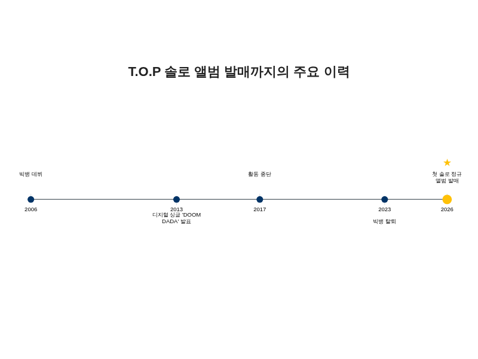
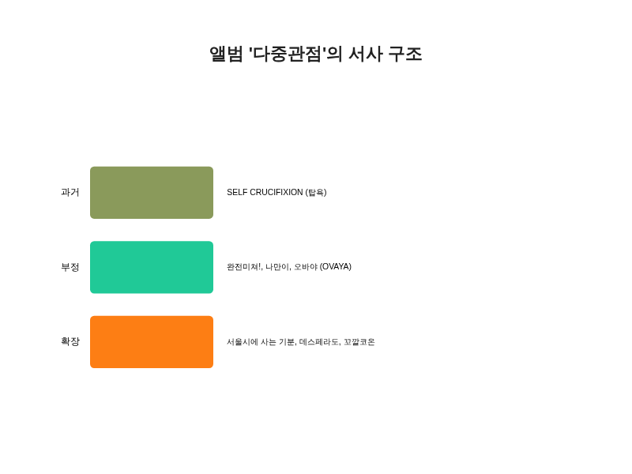
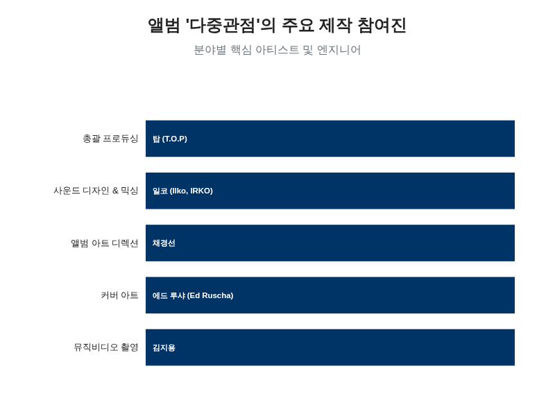
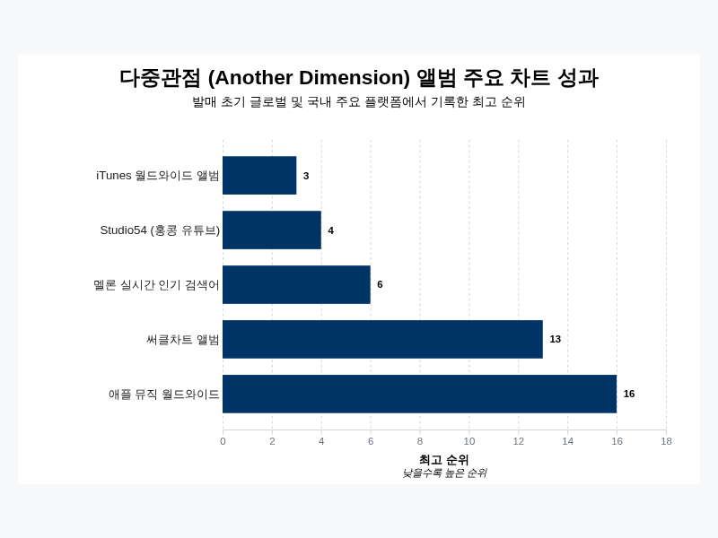

# 빅뱅 탑(T.O.P)의 최신 앨범 '다중관점 (Another Dimension)'에 대한 종합 보고서

## 앨범 개요 및 발매 정보

빅뱅의 전 멤버 탑(T.O.P, 최승현)은 2026년 4월 3일 오후 6시, 자신의 첫 번째 솔로 정규 앨범을 발매하며 가요계에 복귀했다 [[3](https://v.daum.net/v/20260320075625744), [4](https://www.hani.co.kr/arti/culture/music/1252486.html), [11](https://www.kpopstarz.com/articles/322923/20260327/top-drops-full-track-list-his-first-solo-album-another-dimension.htm), [14](https://en.yna.co.kr/view/AEN20260403004200315)]. 앨범의 공식 명칭은 국문으로 '다중관점', 영문으로는 'Another Dimension'으로 명명되었다 [[1](https://namu.wiki/w/%EB%8B%A4%EC%A4%91%EA%B4%80%EC%A0%90%20%28ANOTHER%20DIMENSION), [3](https://v.daum.net/v/20260320075625744), [4](https://www.hani.co.kr/arti/culture/music/1252486.html), [11](https://www.kpopstarz.com/articles/322923/20260327/top-drops-full-track-list-his-first-solo-album-another-dimension.htm), [12](https://v.daum.net/v/20260327074805244)]. 이번 앨범은 2013년 발표했던 디지털 싱글 'DOOM DADA' 이후 약 13년 만에 선보이는 솔로 활동이자 [[4](https://www.hani.co.kr/arti/culture/music/1252486.html), [16](https://www.mk.co.kr/news/hot-issues/12007938), [19](https://weekly.donga.com/List/article/all/11/6181786/1), [25](https://www.billboard.co.kr/editorial/music/article/top/), [29](https://cnalifestyle.channelnewsasia.com/entertainment/bigbang-rapper-top-new-album-apr-3-580131)], 2006년 빅뱅으로 데뷔한 이래 약 20년 만에 처음으로 발매하는 정규 솔로 앨범이라는 점에서 깊은 의미를 지닌다 [[13](https://www.starnewskorea.com/music/2026/04/04/2026040411275548939), [15](https://www.unionilbo.com/1904590), [49](https://www.asiaartistawards.com/index.php/news/detail/176242/all)]. 앨범 제작은 탑이 설립한 레이블 '탑스팟픽쳐스(TOPSPOT PICTURES)'가 주도했으며, 유통은 카카오엔터테인먼트가 담당했다 [[1](https://namu.wiki/w/%EB%8B%A4%EC%A4%91%EA%B4%80%EC%A0%90%20%28ANOTHER%20DIMENSION), [5](https://genius.com/albums/Top/Top-spot-another-dimension), [22](https://robotrobotyee.tistory.com/entry/%EB%B9%85%EB%B1%85%EC%9D%98-%EC%B9%B4%EB%A6%AC%EC%8A%A4%EB%A7%88-%EB%84%98%EC%B9%98%EB%8A%94-%EB%9E%98%ED%8D%BC%EC%97%90%EC%84%9C-%EC%84%B8%EA%B3%84%EC%A0%81-%EB%B0%B0%EC%9A%B0%EB%A1%9C-%ED%83%91TOP), [28](https://namu.wiki/w/BIGBANG%2020%EC%A3%BC%EB%85%84%20%EC%9D%8C%EB%B0%98), [81](https://v.daum.net/v/20260320095036899), [111](https://www.starnewskorea.com/music/2026/04/06/2026040606584234274)].

이번 앨범은 오랜 공백을 깨고 나온 결과물로, 탑은 2016년부터 스튜디오를 오가며 약 10년에 걸쳐 작업을 진행했다고 밝혔다 [[61](https://www.dispatch.co.kr/2341253), [117](https://x.com/mongbit/status/2042392158947459322)]. 그는 이 과정을 축적된 감정의 파편들을 기록하는 일기와 같았다고 설명하며, 앨범에 자신의 오랜 고뇌와 음악적 세계관을 온전히 담아냈음을 시사했다 [[61](https://www.dispatch.co.kr/2341253), [110](https://sports.khan.co.kr/article/202604021456003)]. 앨범 발매에 대한 첫 소식은 2026년 1월 1일, 탑이 자신의 소셜 미디어를 통해 "새 앨범이 발매된다(A NEW ALBUM IS ON THE WAY)"는 메시지를 올리면서 알려졌고 [[2](https://news.jtbc.co.kr/article/NB12278121), [12](https://v.daum.net/v/20260327074805244), [15](https://www.unionilbo.com/1904590)], 이후 3월 20일에 공식적으로 발매가 발표되었다 [[12](https://v.daum.net/v/20260327074805244), [81](https://v.daum.net/v/20260320095036899)]. 발매에 앞서 '완전미쳤어! (Studio54)'와 'DESPERADO' 등 수록곡의 분위기를 엿볼 수 있는 티저 영상들이 순차적으로 공개되며 팬들의 기대감을 높였다 [[3](https://v.daum.net/v/20260320075625744), [81](https://v.daum.net/v/20260320095036899)].

탑의 솔로 컴백은 그가 2023년 YG엔터테인먼트와의 전속 계약 종료와 함께 빅뱅에서 공식적으로 탈퇴한 이후 이루어진 첫 음악 활동이다 [[15](https://www.unionilbo.com/1904590), [16](https://www.mk.co.kr/news/hot-issues/12007938), [110](https://sports.khan.co.kr/article/202604021456003)]. 그는 2017년 대마초 흡연 혐의로 활동을 중단한 바 있으며 [[15](https://www.unionilbo.com/1904590), [60](https://news.nate.com/view/20260404n00039)], 이후 오랜 시간 대중 앞에 나서지 않았다. 최근 인터뷰에서는 과거의 실수로 인해 팀에 큰 피해를 주었기에 다시 돌아갈 면목이 없다고 심경을 밝히며 그룹 복귀 가능성을 일축했다 [[114](https://www.mk.co.kr/news/hot-issues/11218932), [115](https://www.news1.kr/entertain/interview/5661862)]. 실제로 그의 앨범 발매 시점에도 지드래곤, 태양, 대성 등 다른 빅뱅 멤버들은 2026년 4월 12일과 19일, 미국 코첼라 밸리 뮤직 앤드 아츠 페스티벌 무대에 오르는 등 그룹 활동을 이어가고 있었다 [[4](https://www.hani.co.kr/arti/culture/music/1252486.html), [11](https://www.kpopstarz.com/articles/322923/20260327/top-drops-full-track-list-his-first-solo-album-another-dimension.htm), [110](https://sports.khan.co.kr/article/202604021456003)]. 이처럼 그의 솔로 활동은 빅뱅의 20주년이라는 상징적인 해에 이루어졌음에도 불구하고, 그룹과는 명확히 선을 긋는 독자적인 행보라는 점에서 주목받았다 [[108](https://www.nocutnews.co.kr/news/6450537), [109](https://v.daum.net/v/20260402145836733), [110](https://sports.khan.co.kr/article/202604021456003)]. 앨범 발매에 앞서 그는 넷플릭스 시리즈 '오징어 게임 시즌 2'에 '타노스'라는 캐릭터로 출연하며 연기자로서 먼저 복귀 신호탄을 쏘아 올렸으나, 이를 두고 국내에서는 일부 비판적인 여론이 형성되기도 했다 [[14](https://en.yna.co.kr/view/AEN20260403004200315), [15](https://www.unionilbo.com/1904590), [60](https://news.nate.com/view/20260404n00039), [112](https://blog.naver.com/lsb3002/223726349126), [115](https://www.news1.kr/entertain/interview/5661862)].

탑(T.O.P)의 솔로 앨범 발매까지의 주요 활동 타임라인.

## 음악적 스타일 및 앨범 컨셉

앨범 '다중관점 (Another Dimension)'은 특정 장르에 국한되지 않고 랩과 힙합에 기반을 둔 아트 팝(Art Pop)의 방향성을 띠며, 몽환적이면서도 공간감이 느껴지는 사운드를 특징으로 한다 [[4](https://www.hani.co.kr/arti/culture/music/1252486.html), [24](https://m.blog.naver.com/designpress2016/220948169558), [28](https://namu.wiki/w/BIGBANG%2020%EC%A3%BC%EB%85%84%20%EC%9D%8C%EB%B0%98)]. 앨범 전반에 걸쳐 댄스 팝과 랩, 힙합 스타일이 혼재되어 있으며 [[28](https://namu.wiki/w/BIGBANG%2020%EC%A3%BC%EB%85%84%20%EC%9D%8C%EB%B0%98)], 특히 더블 타이틀곡 중 하나인 '완전미쳤어! (Studio54)'는 하우스 기반의 사운드에 1980년대 힙합의 분위기를 결합하여 혁신적인 사운드 구조와 강렬한 비트를 선보인다 [[4](https://www.hani.co.kr/arti/culture/music/1252486.html), [21](https://ko.wikipedia.org/wiki/%EB%B9%85%EB%B1%85_%28%EC%9D%8C%EC%95%85_%EA%B7%B8%EB%A3%B9), [28](https://namu.wiki/w/BIGBANG%2020%EC%A3%BC%EB%85%84%20%EC%9D%8C%EB%B0%98), [29](https://cnalifestyle.channelnewsasia.com/entertainment/bigbang-rapper-top-new-album-apr-3-580131)]. 또 다른 타이틀곡 'Desperado'는 절제된 영상미를 통해 감정선을 극대화하며 사랑의 순간을 직설적으로 표현하는 데 초점을 맞추었다 [[4](https://www.hani.co.kr/arti/culture/music/1252486.html), [52](https://www.instagram.com/reel/DWqfyg4E5dH/)]. 이처럼 탑은 앨범의 음악적 정체성을 강화하기 위해 전체 제작 과정에 적극적으로 참여하며 프로젝트를 직접 지휘했다 [[4](https://www.hani.co.kr/arti/culture/music/1252486.html), [29](https://cnalifestyle.channelnewsasia.com/entertainment/bigbang-rapper-top-new-album-apr-3-580131), [34](http://kostar.asia/ko/article/2647)].

앨범의 제목인 '다중관점'은 그 이름이 암시하듯, 음악을 통해 다양한 메시지를 전달하고 특정 화자의 시점에서 여러 차원을 바라보려는 탑의 의도를 담고 있다 [[4](https://www.hani.co.kr/arti/culture/music/1252486.html), [22](https://robotrobotyee.tistory.com/entry/%EB%B9%85%EB%B1%85%EC%9D%98-%EC%B9%B4%EB%A6%AC%EC%8A%A4%EB%A7%88-%EB%84%98%EC%B9%98%EB%8A%94-%EB%9E%98%ED%8D%BC%EC%97%90%EC%84%9C-%EC%84%B8%EA%B3%84%EC%A0%81-%EB%B0%B0%EC%9A%B0%EB%A1%9C-%ED%83%91TOP), [26](https://v.daum.net/v/QJBzAkWINk), [28](https://namu.wiki/w/BIGBANG%2020%EC%A3%BC%EB%85%84%20%EC%9D%8C%EB%B0%98)]. 이는 11개의 트랙을 통해 그가 구축한 독자적인 세계관을 풀어내는 과정으로, 과거의 고통스러운 사건에서 비롯된 자기혐오와 복잡한 감정들을 통과하는 그의 여정을 보여준다 [[24](https://m.blog.naver.com/designpress2016/220948169558), [61](https://www.dispatch.co.kr/2341253)]. 앨범의 서사는 크게 '과거', '부정', '확장'이라는 세 가지 관점을 중심으로 전개된다 [[61](https://www.dispatch.co.kr/2341253)]. 첫 번째 관점인 '과거'는 첫 트랙 'SELF CRUCIFIXION (탑욕)'에서 가장 직접적으로 드러나는데, 이 곡은 논란이 되었던 자신의 과거를 솔직하게 마주한다 [[61](https://www.dispatch.co.kr/2341253)]. 특히 곡에는 2017년 마약 사건 당시의 뉴스 음성과 팬들의 SNS 계정을 차단했던 사건을 언급하는 앵커의 목소리가 삽입되어 있어 충격을 안긴다 [[60](https://news.nate.com/view/20260404n00039), [62](https://v.daum.net/v/4ZnFIQWImv?f=p)]. '탑욕'이라는 제목은 '욕망(慾)'과 '치욕(辱)'이라는 이중적 의미를 담아, 스스로를 십자가에 못 박으려는 필사적인 선언을 상징한다 [[61](https://www.dispatch.co.kr/2341253)].

두 번째 관점인 '부정'은 과거의 자신과 빅뱅과의 관계를 되짚는다. '완전미쳐!'는 그의 초기 경력을 향한 향수를 담고 있으며, "갈기갈기 찢겨 상처많은 나의 FANS"와 "I'm so sorry but I loved 20대 BIG-BANG 'SAY LESS'"와 같은 가사를 통해 팬들과 빅뱅에 대한 미안함을 표현한다 [[60](https://news.nate.com/view/20260404n00039), [61](https://www.dispatch.co.kr/2341253), [62](https://v.daum.net/v/4ZnFIQWImv?f=p), [63](https://mydaily.co.kr/page/view/2026040717154016524)]. 또한 과거 히트곡 'Loser'를 재해석하고 발전시킨 '나만이'와 같은 트랙도 포함된다 [[61](https://www.dispatch.co.kr/2341253)]. 특히 수록곡 '오바야 (OVAYA)'는 "화려한 옛 역사로 남기고 새 각오 I'm so sorry but I loved '난 떠나 BIG-BANG!'"이라는 가사를 통해 그룹과의 공식적인 결별을 암시하며, 떠남과 동시에 남아있는 복잡한 감정을 전달한다 [[16](https://www.mk.co.kr/news/hot-issues/12007938), [61](https://www.dispatch.co.kr/2341253), [62](https://v.daum.net/v/4ZnFIQWImv?f=p), [94](https://v.daum.net/v/5nyAihd8m2?f=p)]. 마지막 관점인 '확장'은 개인의 서사를 넘어 사회적 주제로 넓어진다. '서울시에 사는 기분'은 도시의 혼돈과 외로움을 묘사하고, '데스페라도'는 강렬한 사랑의 감정을, '꼬깔코온'은 팬들을 향한 헌신을 표현하며 앨범의 주제 의식을 확장시킨다 [[61](https://www.dispatch.co.kr/2341253)].

앨범 '다중관점'의 세 가지 서사적 관점과 관련 대표 트랙.

이러한 음악적, 서사적 깊이는 시각 예술과의 긴밀한 협업을 통해 완성도를 높였다 [[24](https://m.blog.naver.com/designpress2016/220948169558)]. 앨범 커버 아트는 미국의 현대 미술가 에드 루샤(Ed Ruscha)가 작업했으며 [[4](https://www.hani.co.kr/arti/culture/music/1252486.html), [26](https://v.daum.net/v/QJBzAkWINk)], 넷플릭스 '오징어 게임'의 채경선 미술감독이 앨범 디자인과 뮤직비디오 아트 디렉션을 총괄하여 상징적인 공간 구성을 선보였다 [[4](https://www.hani.co.kr/arti/culture/music/1252486.html), [26](https://v.daum.net/v/QJBzAkWINk)]. 또한 '오징어 게임 시즌 2', '헤어질 결심' 등으로 유명한 김지용 촬영감독이 뮤직비디오 연출을 맡아 한 편의 예술 영화와 같은 영상미를 구현했다 [[26](https://v.daum.net/v/QJBzAkWINk)]. 피지컬 앨범 역시 '다중관점', '다른차원', '의식확장'이라는 세 가지 콘셉트 버전으로 출시되어, 각기 다른 패키징과 가사 일부를 담아 앨범의 핵심 주제를 시각적으로 구체화했다 [[26](https://v.daum.net/v/QJBzAkWINk)]. 탑은 과거 인터뷰에서 공백기 동안 "세상과 단절된 채 집과 음악 작업실만 오갔다"며, "음악을 만들 때, 마이크 앞에 설 때 유일하게 숨을 쉴 수 있었기 때문"이라고 고백한 바 있다 [[25](https://www.billboard.co.kr/editorial/music/article/top/)]. 그는 "내가 살기 위해 음악을 만들었다"며 "팬들에게 꼭 들려주고 싶다. 그것이 나의 책임감이기도 하다"고 덧붙여, 이번 앨범이 오랜 시간 축적해온 자신의 음악적 역량의 집대성이자 [[32](https://open.spotify.com/artist/4yiB30K5scGkjmAgHGIH8Y)], 생존을 위한 절박한 고백임을 분명히 했다 [[25](https://www.billboard.co.kr/editorial/music/article/top/)].

## 앨범 제작 및 트랙리스트

정규 1집 '다중관점 (Another Dimension)'은 총 11개의 트랙으로 구성되어 있으며, 전체 재생 시간은 37분 7초에 달한다 [[1](https://namu.wiki/w/%EB%8B%A4%EC%A4%91%EA%B4%80%EC%A0%90%20%28ANOTHER%20DIMENSION), [4](https://www.hani.co.kr/arti/culture/music/1252486.html)]. 앨범은 '완전미쳐! (Studio54)'와 '데스페라도 (DESPERADO)' 두 곡을 더블 타이틀곡으로 내세우고 있다 [[3](https://v.daum.net/v/20260320075625744), [4](https://www.hani.co.kr/arti/culture/music/1252486.html), [13](https://www.starnewskorea.com/music/2026/04/04/2026040411275548939), [20](https://www.news1.kr/entertain/music/6115762), [29](https://cnalifestyle.channelnewsasia.com/entertainment/bigbang-rapper-top-new-album-apr-3-580131)]. 첫 번째 타이틀곡 '완전미쳐! (Studio54)'는 하우스 장르의 사운드를 기반으로 1980년대 힙합의 분위기를 결합한 곡으로, 다양한 감정과 영감이 뒤엉켜 혼란 자체가 하나의 구조가 된 광기의 입체적 초상을 표현하고자 했다 [[4](https://www.hani.co.kr/arti/culture/music/1252486.html), [28](https://namu.wiki/w/BIGBANG%2020%EC%A3%BC%EB%85%84%20%EC%9D%8C%EB%B0%98)]. 두 번째 타이틀곡 '데스페라도 (DESPERADO)'는 사랑의 순간을 직설적으로 표현한 곡으로, 앨범과 동시에 공개된 뮤직비디오에는 배우 나나가 출연했으며 절제된 영상 연출을 통해 감정선을 극대화했다 [[4](https://www.hani.co.kr/arti/culture/music/1252486.html), [12](https://v.daum.net/v/20260327074805244), [13](https://www.starnewskorea.com/music/2026/04/04/2026040411275548939)].

앨범의 전체 트랙리스트에는 더블 타이틀곡 외에도 '탑욕 (SELF CRUCIFIXION)', '나만이 (THE GIANT)', '오바야 (OVAYA)', '서울시에 사는 기분 (SEOUL CHAOS)', '비 솔리드 (BE SOLID)', 'A SMALL, FILTHY SHOW', '연극이 끝나고 난 뒤' 등이 수록되었다 [[27](https://biz.chosun.com/entertainment/enter_general/2026/04/03/G4YWIYTFMM4GIZTDHFTDSOJSGA/), [29](https://cnalifestyle.channelnewsasia.com/entertainment/bigbang-rapper-top-new-album-apr-3-580131)]. 특히 아홉 번째 트랙인 '꼬깔코온 (FOR FANS)'은 제목에서 알 수 있듯 팬들을 위해 헌정된 곡으로, 오랜 시간 지지를 보내준 이들에 대한 감사의 마음을 담았다 [[12](https://v.daum.net/v/20260327074805244), [27](https://biz.chosun.com/entertainment/enter_general/2026/04/03/G4YWIYTFMM4GIZTDHFTDSOJSGA/), [29](https://cnalifestyle.channelnewsasia.com/entertainment/bigbang-rapper-top-new-album-apr-3-580131)]. 탑은 앨범의 음악적 색채를 풍부하게 하고 11개 트랙에 걸쳐 유기적인 서사를 완성하기 위해 앨범 제작 전반을 직접 지휘하며 프로듀서로서의 역량을 발휘했다 [[3](https://v.daum.net/v/20260320075625744), [4](https://www.hani.co.kr/arti/culture/music/1252486.html), [11](https://www.kpopstarz.com/articles/322923/20260327/top-drops-full-track-list-his-first-solo-album-another-dimension.htm), [12](https://v.daum.net/v/20260327074805244), [29](https://cnalifestyle.channelnewsasia.com/entertainment/bigbang-rapper-top-new-album-apr-3-580131)].

기술적인 측면에서도 높은 완성도를 추구했다. 앨범의 모든 트랙에 대한 사운드 디자인과 믹싱은 그래미상을 수상한 엔지니어 일코(Ilko, IRKO)가 담당했다 [[4](https://www.hani.co.kr/arti/culture/music/1252486.html), [12](https://v.daum.net/v/20260327074805244), [14](https://en.yna.co.kr/view/AEN20260403004200315), [19](https://weekly.donga.com/List/article/all/11/6181786/1)]. 그는 돌비 애트모스(Dolby Atmos) 기술을 적극적으로 활용하여 청취자가 몰입할 수 있는 3차원적인 공간 음향 경험을 구현해냈다 [[4](https://www.hani.co.kr/arti/culture/music/1252486.html), [12](https://v.daum.net/v/20260327074805244), [14](https://en.yna.co.kr/view/AEN20260403004200315), [52](https://www.instagram.com/reel/DWqfyg4E5dH/)]. 시각적인 요소 역시 세계적인 전문가들과의 협업으로 강화되었다. 앨범 커버 아트는 미국의 현대 미술가 에드 루샤(Ed Ruscha)가 작업했으며 [[4](https://www.hani.co.kr/arti/culture/music/1252486.html), [60](https://news.nate.com/view/20260404n00039), [61](https://www.dispatch.co.kr/2341253)], 넷플릭스 시리즈 '오징어 게임'의 채경선 미술감독이 앨범의 전반적인 디자인과 뮤직비디오 아트 디렉션을 총괄했다 [[4](https://www.hani.co.kr/arti/culture/music/1252486.html), [12](https://v.daum.net/v/20260327074805244), [19](https://weekly.donga.com/List/article/all/11/6181786/1), [61](https://www.dispatch.co.kr/2341253)]. 여기에 김지용 촬영감독이 합류하여 뮤직비디오의 영상미를 한층 더 끌어올렸다 [[4](https://www.hani.co.kr/arti/culture/music/1252486.html), [13](https://www.starnewskorea.com/music/2026/04/04/2026040411275548939), [19](https://weekly.donga.com/List/article/all/11/6181786/1), [52](https://www.instagram.com/reel/DWqfyg4E5dH/)]. 이처럼 탑은 음악뿐만 아니라 사운드와 시각 예술을 아우르는 총체적인 프로듀싱을 통해 앨범의 예술적 가치를 극대화하고자 했다.

앨범 '다중관점'의 음악, 사운드, 시각 분야별 주요 제작 참여진.

## 프로모션 및 관련 활동

앨범 발매 이후의 프로모션 활동은 시각적 콘텐츠 공개와 방송 활동 제약이라는 상반된 양상으로 전개되었다. 우선, 더블 타이틀곡 중 하나인 '데스페라도 (DESPERADO)'의 뮤직비디오에는 가수 겸 배우 나나가 출연하여 탑의 컴백을 지원했다 [[53](https://m.news.nate.com/view/20260209n10058?mid=e02&list=recent&cpcd=)]. 이는 앨범의 시각적 완성도를 높이는 동시에, 동료 아티스트의 지지를 통해 대중의 관심을 환기하는 효과를 가져왔다. 그러나 이러한 노력에도 불구하고, 전통적인 방송 매체를 통한 프로모션 활동에는 상당한 제약이 따를 것으로 예상된다.

가장 큰 걸림돌은 방송 심의 결과이다. KBS 음악 심의 위원회는 앨범 '다중관점 (Another Dimension)'에 대해 복수의 '부적격' 판정을 내렸다 [[4](https://www.hani.co.kr/arti/culture/music/1252486.html), [62](https://v.daum.net/v/4ZnFIQWImv?f=p)]. 이러한 판정은 탑의 음악 방송 출연 및 KBS 플랫폼을 통한 홍보 활동에 직접적인 영향을 미칠 것으로 보인다 [[4](https://www.hani.co.kr/arti/culture/music/1252486.html), [62](https://v.daum.net/v/4ZnFIQWImv?f=p)]. 공영 방송사의 심의 결과는 다른 방송사들의 결정에도 영향을 줄 수 있어, 그의 지상파 음악 방송 활동 전반이 불투명해진 상황이다. 이로 인해 앨범의 대중적 확산과 홍보에 있어 중요한 채널 중 하나인 TV 음악 프로그램 출연은 사실상 어려워졌다. 또한, 현재까지 앨범 발매를 기념하는 공식적인 쇼케이스나 팬 사인회와 같은 대면 행사 일정은 구체적으로 발표되지 않아, 프로모션은 주로 온라인 콘텐츠와 뮤직비디오 공개에 집중되고 있는 것으로 파악된다.

## 대중 및 평단의 반응

'다중관점 (Another Dimension)' 앨범은 평단과 대중으로부터 복합적인 반응을 얻고 있다. 음악 평론가 김도헌은 이번 앨범을 탑이 자신의 그룹 시절에 고하는 작별 인사로 해석하며, 현대 미술에서 영감을 받은 예술적 정교함과 세련된 프로덕션을 높이 평가했다 [[61](https://www.dispatch.co.kr/2341253)]. 그는 앨범이 전반적으로 높은 완성도를 지니고 있음을 인정하면서도, 일부 청자에게는 2000년대 스타일의 사운드가 다소 구식으로 느껴질 수 있으며, 가사의 의미를 완전히 이해하기 위해서는 여러 번의 감상이 필요할 것이라는 점을 지적했다 [[61](https://www.dispatch.co.kr/2341253)]. 김도헌 평론가는 "영원히 머무는 것도 좋지만, 변해야만 가치를 얻는 음악도 있다. 앞으로 탑이 어떤 음악을 만들어낼지 지켜봐야 한다"고 언급하며 그의 향후 음악적 행보에 대한 기대를 내비쳤다 [[60](https://news.nate.com/view/20260404n00039)].

대중과 팬들의 반응은 그의 개인적 서사와 맞물려 더욱 감정적으로 나타났다. 특히 빅뱅의 동료 멤버인 태양, 지드래곤, 대성은 각자의 소셜 미디어를 통해 앨범 커버 이미지나 음원 스트리밍 인증 사진을 공유하며 탑의 솔로 컴백을 공개적으로 응원했다 [[62](https://v.daum.net/v/4ZnFIQWImv?f=p), [64](https://biz.heraldcorp.com/article/10709933)]. 이러한 동료들의 지지는 오랜 시간 그룹 활동을 기다려온 팬들에게 큰 울림을 주었다. 한편, 일반 대중과 팬들은 앨범의 가사와 전반적인 분위기를 통해 탑이 과거 자신의 과오를 성찰하고 있으며, 이를 통해 빅뱅 활동과의 완전한 작별을 고하는 것이 아니냐는 해석을 내놓았다 [[60](https://news.nate.com/view/20260404n00039)]. 온라인 커뮤니티에서는 "자신의 과오를 노래에 담아냈다", "정말로 그룹을 떠나는 것 같다", "빅뱅 복귀에 선을 긋는 것인가"와 같은 반응들이 주를 이루었다 [[60](https://news.nate.com/view/20260404n00039)]. 또한 일부 가사("I'm so sorry but I loved 20대 BIG-BANG 'SAY LESS'")를 인용하며 그의 20대 시절과 빅뱅에 대한 애증이 섞인 복잡한 감정을 표현하는 것으로 받아들이는 등, 앨범은 그의 개인사와 맞물려 다양한 해석을 낳고 있다 [[60](https://news.nate.com/view/20260404n00039), [62](https://v.daum.net/v/4ZnFIQWImv?f=p)].

## 상업적 성과 및 차트 기록

'다중관점 (Another Dimension)' 앨범은 발매 직후 국내외 시장에서 주목할 만한 상업적 성과를 기록하며, 오랜 공백에도 불구하고 탑의 글로벌 영향력을 입증했다. 특히 해외 시장에서의 반응이 두드러졌는데, 앨범은 2026년 4월 4일 자로 아이튠즈 월드와이드 톱 앨범 차트에서 3위를 차지하는 기염을 토했다 [[60](https://news.nate.com/view/20260404n00039), [61](https://www.dispatch.co.kr/2341253), [111](https://www.starnewskorea.com/music/2026/04/06/2026040606584234274)]. 또한 인도네시아, 필리핀, 베트남을 포함한 전 세계 15개국의 아이튠즈 앨범 차트에서 1위에 오르며 동남아시아 지역에서의 강력한 팬덤을 다시 한번 확인시켜 주었다 [[60](https://news.nate.com/view/20260404n00039), [61](https://www.dispatch.co.kr/2341253), [111](https://www.starnewskorea.com/music/2026/04/06/2026040606584234274)]. 이러한 성과는 미국, 영국, 일본 등 주요 음악 시장에서도 상위권에 안착하며 더욱 의미를 더했다 [[111](https://www.starnewskorea.com/music/2026/04/06/2026040606584234274)].

스트리밍 플랫폼에서의 성과 역시 인상적이었다. 세계 최대 음원 플랫폼인 스포티파이에서 앨범은 발매 첫날 약 147만 건의 스트리밍을 기록했으며, 이는 2026년 K팝 솔로 아티스트 중 가장 높은 첫날 스트리밍 수치에 해당한다 [[111](https://www.starnewskorea.com/music/2026/04/06/2026040606584234274)]. 또한 올해 발매된 솔로 앨범 중 최초로 데뷔일에 100만 스트리밍을 돌파하는 기록을 세우며 화제성을 입증했다 [[111](https://www.starnewskorea.com/music/2026/04/06/2026040606584234274)]. 애플 뮤직 월드와이드 차트에서도 발매일 기준 16위로 데뷔하며 글로벌 팬들의 높은 관심을 증명했다 [[111](https://www.starnewskorea.com/music/2026/04/06/2026040606584234274)]. 이처럼 다양한 글로벌 플랫폼에서의 초기 성적은 앨범의 상업적 성공 가능성을 긍정적으로 시사했다.

국내 시장에서는 화제성에 비해 음원 차트 최상위권 진입은 다소 아쉬웠으나, 견고한 팬덤을 기반으로 한 성과가 나타났다. 국내 최대 음원 사이트인 멜론에서는 앨범 발매 직후 실시간 인기 검색어 순위 6위에 오르며 대중의 높은 관심을 반영했다 [[86](https://x.com/BIGBANGMusic_/status/2044251916352532505)]. 피지컬 앨범 판매량의 경우, 써클차트(구 가온차트) 기준 'TOP SPOT - 다중관점 (ANOTHER DIMENSION)' 앨범은 10,070장의 판매고를 기록하며 앨범 차트 13위에 올랐다 [[20](https://www.news1.kr/entertain/music/6115762)]. 이는 오랜 공백기를 가진 솔로 아티스트로서 의미 있는 판매량으로 평가된다.

다중관점 앨범의 발매 초기 국내외 주요 차트 최고 순위.

개별 곡들의 디지털 플랫폼 성적을 살펴보면, 더블 타이틀곡을 비롯한 수록곡들이 아시아 지역을 중심으로 다양한 차트에 진입했다. 'Studio54'는 홍콩 유튜브 차트 4위, 대만 아이튠즈 차트 9위에 올랐으며, 스포티파이, 애플 뮤직 등 여러 플랫폼에서 다수의 지역별 100위권 내에 이름을 올렸다 [[93](https://kworb.net/itunes/artist/top.html)]. 또 다른 타이틀곡 'DESPERADO'는 한국 유튜브 차트 17위, 싱가포르 샤잠 차트 41위를 기록하며 주로 애플 뮤직과 유튜브에서 강세를 보였다 [[93](https://kworb.net/itunes/artist/top.html)]. 앨범 전체로는 몽골 애플 뮤직 2위, 인도네시아 아이튠즈 3위를 차지하는 등 동아시아 및 동남아시아 지역의 앨범 차트에서 높은 순위를 기록했다 [[93](https://kworb.net/itunes/artist/top.html)]. 이 외에도 'SELF CRUCIFIXION', 'FOR FANS' 등의 수록곡들이 아이튠즈 차트를 중심으로 순위권에 진입하는 성과를 거두었다 [[93](https://kworb.net/itunes/artist/top.html)]. 다만, 빌보드 메인 차트인 '빌보드 200'에는 진입하지 못한 것으로 확인되었으며 [[97](https://x.com/_voteinpeace/status/1995057394825720223)], 한국음악콘텐츠협회(KMCA)나 일본레코드협회(RIAJ) 등으로부터 공식적인 판매량 인증을 획득한 기록은 현재까지 없는 것으로 파악된다.

## 출처

[1] [다중관점 (ANOTHER DIMENSION) - 나무위키](https://namu.wiki/w/%EB%8B%A4%EC%A4%91%EA%B4%80%EC%A0%90%20%28ANOTHER%20DIMENSION)  
[2] [탑, 빅뱅 20주년에 솔로 컴백 예고 "새 앨범 나온다" - JTBC 뉴스](https://news.jtbc.co.kr/article/NB12278121)  
[3] [\[공식입장\] 마침 빅뱅 20주년에…탑, 13년만 첫 솔로앨범 발표](https://v.daum.net/v/20260320075625744)  
[4] [빅뱅 탑, 첫 정규 앨범 내고 솔로 활동 재개](https://www.hani.co.kr/arti/culture/music/1252486.html)  
[5] [T.O.P - TOP SPOT - 다중관점 (ANOTHER DIMENSION) Lyrics and Tracklist | Genius](https://genius.com/albums/Top/Top-spot-another-dimension)  
[6] [T.O.P (r1294 판) - 나무위키](https://namu.wiki/w/T.O.P?uuid=221f45d8-0251-49a1-9521-d07a5c24ad8c)  
[7] [T.O.P/음반 목록 (r5 판) - 나무위키](https://namu.wiki/w/T.O.P/%EC%9D%8C%EB%B0%98%20%EB%AA%A9%EB%A1%9D?uuid=68921a73-7a23-4202-a528-da2b37abb1f4)  
[8] [T.O.P (r1701 판) - 나무위키](https://namu.wiki/w/T.O.P?uuid=84ec477c-6d06-421c-a10e-5f3062500b3d)  
[9] [T.O.P - 나무위키](https://namu.wiki/w/T.O.P)  
[10] [Top Spot - Another Dimension - Kpop Wiki](https://kpop.fandom.com/wiki/Top_Spot_-_Another_Dimension)  
[11] [T.O.P Drops Full Track List for His First Solo Album 'ANOTHER DIMENSION'](https://www.kpopstarz.com/articles/322923/20260327/top-drops-full-track-list-his-first-solo-album-another-dimension.htm)  
[12] ['은퇴 번복' 탑, 4월 3일 컴백…11곡 수록 '다중관점' 트랙리스트 공개](https://v.daum.net/v/20260327074805244)  
[13] [지드래곤, 빅뱅 데뷔일 맞춰 탑 신곡 홍보..재결합 기대감 \[스타이슈\] | 스타뉴스](https://www.starnewskorea.com/music/2026/04/04/2026040411275548939)  
[14] [T.O.P returns with 'Another Dimension,' his 1st solo studio album | Yonhap News Agency](https://en.yna.co.kr/view/AEN20260403004200315)  
[15] [빅뱅 출신 탑, 데뷔 20주년 맞아 솔로 앨범 발표…13년 만의 가수 복귀:검찰연합일보](https://www.unionilbo.com/1904590)  
[16] [탑 “빅뱅 떠난다” 선언에도…지드래곤·태양은 새 앨범 공개 응원 - 스타투데이](https://www.mk.co.kr/news/hot-issues/12007938)  
[17] [Instagram](https://www.instagram.com/p/DWsa76VE9Hy/)  
[18] [빅뱅 출신 탑, 가수 복귀 예고..."새 앨범 나온다" / YTN - YouTube](https://www.youtube.com/watch?v=1Ia876Ltsww)  
[19] [빅뱅 탑, 솔로 앨범 '다중관점'으로 복귀 - 주간동아](https://weekly.donga.com/List/article/all/11/6181786/1)  
[20] ['빅뱅 출신' 탑, 첫 솔로 정규 앨범 트랙리스트 공개…더블 타이틀곡 ...](https://www.news1.kr/entertain/music/6115762)  
[21] [빅뱅 (음악 그룹) - 위키백과, 우리 모두의 백과사전](https://ko.wikipedia.org/wiki/%EB%B9%85%EB%B1%85_%28%EC%9D%8C%EC%95%85_%EA%B7%B8%EB%A3%B9)  
[22] [빅뱅의 카리스마 넘치는 래퍼에서 세계적 배우로 "탑(T.O.P)"](https://robotrobotyee.tistory.com/entry/%EB%B9%85%EB%B1%85%EC%9D%98-%EC%B9%B4%EB%A6%AC%EC%8A%A4%EB%A7%88-%EB%84%98%EC%B9%98%EB%8A%94-%EB%9E%98%ED%8D%BC%EC%97%90%EC%84%9C-%EC%84%B8%EA%B3%84%EC%A0%81-%EB%B0%B0%EC%9A%B0%EB%A1%9C-%ED%83%91TOP)  
[23] [빌보드가 뽑은 빅뱅 T.O.P의 명곡 TOP 10 - 조선일보](https://www.chosun.com/site/data/html_dir/2017/02/17/2017021702479.html)  
[24] [트렌드를 선도하는 아이돌 빅뱅 : 네이버 블로그](https://m.blog.naver.com/designpress2016/220948169558)  
[25] [탑, 빅뱅 데뷔 20주년에 솔로 컴백 예고 | Billboard Korea](https://www.billboard.co.kr/editorial/music/article/top/)  
[26] [탑, 빅뱅 20주년 컴백 앞두고 역대급 컬래버레이션 발표](https://v.daum.net/v/QJBzAkWINk)  
[27] ['빅뱅 탈퇴' 탑, 첫 솔로 정규 앨범으로 화려한 귀환…'다중관점' 발매](https://biz.chosun.com/entertainment/enter_general/2026/04/03/G4YWIYTFMM4GIZTDHFTDSOJSGA/)  
[28] [BIGBANG 20주년 음반 - 나무위키](https://namu.wiki/w/BIGBANG%2020%EC%A3%BC%EB%85%84%20%EC%9D%8C%EB%B0%98)  
[29] [Former BigBang member TOP to release new album Another Dimension on Apr 3 - CNA Lifestyle](https://cnalifestyle.channelnewsasia.com/entertainment/bigbang-rapper-top-new-album-apr-3-580131)  
[30] [BIGBANG's G-Dragon and Taeyang show support to T.O.P and his ...](https://www.facebook.com/philippineconcerts/posts/bigbangs-g-dragon-and-taeyang-show-support-to-top-and-his-new-album-top-spot-ano/1504843401034767/)  
[31] [Former Big Bang member T.O.P to release first solo album on April 3](https://koreajoongangdaily.joins.com/news/2026-03-20/entertainment/kpop/Former-Big-Bang-member-TOP-to-release-first-solo-album-on-April-3/2549536)  
[32] [T.O.P | Spotify](https://open.spotify.com/artist/4yiB30K5scGkjmAgHGIH8Y)  
[33] [T.O.P will release his first full album ANOTHER DIMENSION on April 3](https://www.reddit.com/r/kpop/comments/1ryfo3y/top_will_release_his_first_full_album_another/)  
[34] [탑, 첫 정규 앨범 '다중관점' 3일 발매 - KOSTAR](http://kostar.asia/ko/article/2647)  
[35] [탑 "'다중관점', 제가 보낸 긴 시간·복잡한 감정 담은 앨범" - 뉴스1](https://www.news1.kr/entertain/celebrity-topic/6125358)  
[36] [Instagram](https://www.instagram.com/reel/DWqhxfOE-W7/)  
[37] [탑 (T.O.P) - TOP SPOT - 다중관점 (ANOTHER DIMENSION) | 리드머 - 대한민국 힙합/알앤비 미디어](http://m.rhythmer.net/src/magazine/review/view.php?n=21385)  
[38] [T.O.P - \[TOP SPOT - 다중관점 (ANOTHER DIMENSION)\] 1st Album 의식확장 Version – kpopalbums.com](https://www.kpopalbums.com/products/t-o-p-top-spot-another-dimension-1st-album-expansion-of-consciousness-version?srsltid=AfmBOop72c4QX7XxdNaN_TrQ4cneJ5xPhBOLDY-JgRyO0vr82PxGg74A)  
[39] [ktown4u.com : \[3CD SET\] T.O.P - 1st Album \[TOP SPOT - 다중관점 (ANOTHER DIMENSION)\]](https://www.ktown4u.com/iteminfo?goods_no=159241)  
[40] [Instagram](https://www.instagram.com/p/DWXeA-YgcRL/)  
[41] [TOP SPOT - 다중관점 (ANOTHER DIMENSION) - 벅스](https://music.bugs.co.kr/album/4144659?wl_ref=list_ab_01)  
[42] [탑, 첫 정규 ‘다중관점’ 트랙리스트 공개…타이틀 ‘완전 미쳤어!’ - 스타투데이](https://www.mk.co.kr/news/musics/11999930)  
[43] [탑 솔로 정규앨범 출격… 빅뱅 이후 완전히 달라진 방향성 : 네이버 블로그](https://blog.naver.com/PostView.naver?blogId=sabanamedia&logNo=224223746998&redirect=Dlog)  
[44] [탑승현이 빅뱅 20주년에 맞춰서 앨범 냈는데ㅠ - Threads](https://www.threads.net/@minseru_170/post/DWrBcSfEgEq/%ED%83%91%EC%8A%B9%ED%98%84%EC%9D%B4-%EB%B9%85%EB%B1%85-20%EC%A3%BC%EB%85%84%EC%97%90-%EB%A7%9E%EC%B6%B0%EC%84%9C-%EC%95%A8%EB%B2%94-%EB%83%88%EB%8A%94%EB%8D%B0%3C~%ED%83%91-%EC%9D%B4%EB%B2%88-%EC%95%A8%EB%B2%94-%EC%A0%84%EA%B3%A1%EC%9D%84-%EB%93%A3%EB%8A%94%EB%8D%B0-1%EB%B2%88-%ED%8A%B8%EB%9E%99-%ED%83%91%EC%9A%95-%EB%B6%80%ED%84%B0%EC%95%A8%EB%B2%94-%EC%A0%84%EC%B2%B4%EA%B0%80-%EA%B3%A0%ED%95%B4%EC%84%B1%EC%82%AC%EA%B5%AC%EB%82%98%EA%B0%80%EC%82%AC-%EB%8C%80%EB%B6%80%EB%B6%84%EC%9D%B4-%EA%B3%BC%EA%B1%B0%EB%A5%BC-%EB%89%98%EC%9A%B0%EC%B9%98)  
[45] [Instagram](https://www.instagram.com/p/DW5J-huj7K2/)  
[46] [빅뱅 출신 탑, 첫 정규앨범 ‘다중관점’으로 글로벌 차트 석권](https://v.daum.net/v/Yi2BQP5TiQ?f=p)  
[47] [T.O.P to Release First Solo Full Album Next Month, 20 ... - YouTube](https://www.youtube.com/watch?v=A7UXeKFC868)  
[48] [빅뱅 출신 탑, 데뷔 20주년에 가수 복귀…솔로 앨범 예고 - TJB](https://www.tjb.co.kr/news11/category/view/id/92021/version/1)  
[49] [논란의 탑·강인, 잊을만 하니 또 왔다..여론 벽 허물까 \[ FOCUS\]](https://www.asiaartistawards.com/index.php/news/detail/176242/all)  
[50] [BIGBANG/활동 (r411 판) - 나무위키](https://namu.wiki/w/BIGBANG/%ED%99%9C%EB%8F%99?uuid=0b46b434-2994-4e3b-8771-82c595058f81)  
[51] [BIGBANG/활동 - 나무위키](https://namu.wiki/w/BIGBANG/%ED%99%9C%EB%8F%99)  
[52] [Instagram (Base64 content)](https://www.instagram.com/reel/DWqfyg4E5dH/)  
[53] [나나, 빅뱅 탑 컴백 지원사격 "뮤직비디오 출연" \[공식입장\] : 네이트 연예](https://m.news.nate.com/view/20260209n10058?mid=e02&list=recent&cpcd=)  
[54] [Instagram (Base64 content)](https://www.instagram.com/p/DUh71hNkfvX/)  
[55] [\[SSTV\] 빅뱅(Big Bang) 태양 팬사인회, 아침부터 빛나는 눈코입 ... - YouTube](https://www.youtube.com/watch?v=oOWSuvIghTc)  
[56] [빅뱅(BIGBANG) 승리, 내일(28日) 생애 첫 솔로 팬사인회 개최 | 장재연 기자 | 톱스타뉴스](https://www.topstarnews.net/news/articleView.html?idxno=704)  
[57] [빅뱅 탑, 소집해제 후 깜짝 팬미팅 @본격연예 한밤 117회 20190709 - YouTube](https://www.youtube.com/watch?v=jem1040pKkQ)  
[58] [BIGBANG Fanclub V.I.P 열정만큼은 10대! 지드래곤(GD)의 열성 팬 ... - YouTube](https://www.youtube.com/watch?v=OLUFslSm8FA)  
[59] [VIP(BIGBANG) (r301 판) - 나무위키](https://namu.wiki/w/VIP%28BIGBANG)  
[60] [탑, 신곡에 마약·빅뱅 언급…"미안해"→"난 떠나" 의미심장 \[MD이슈\] : 네이트 뉴스](https://news.nate.com/view/20260404n00039)  
[61] ["빅뱅에 대한 작별 인사"…탑, 新세계관의 구축 | 디스패치 | 뉴스는 팩트다!](https://www.dispatch.co.kr/2341253)  
[62] [탑, 신곡서 "빅뱅 떠난다" 쐐기…GD·태양·대성 응원 물결 \[MD이슈\]](https://v.daum.net/v/4ZnFIQWImv?f=p)  
[63] [탑, 신곡서 "빅뱅 떠난다" 쐐기…GD·태양·대성 응원 물결 \[MD이슈\] - 마이데일리](https://mydaily.co.kr/page/view/2026040717154016524)  
[64] [빅뱅 의리도 역시 'TOP'!…GD·태양·대성 줄줄이 한목소리로 응원한 것은? - 헤럴드경제](https://biz.heraldcorp.com/article/10709933)  
[65] [탑, 건강한 모습으로 '쇼! 음악중심' 컴백 | 스타뉴스](https://www.starnewskorea.com/music/2008/11/08/2008110810343780660)  
[66] [Instagram (Base64 content)](https://www.instagram.com/p/DW3UoM2khiH/)  
[67] [ž, ù Ծٹ ߰ ۷ι Ʈ - տ ̴](https://m.newsen.com/news_view.php?uid=202604060701162410)  
[68] [빅뱅 출신 탑, 3일 컴백…첫 솔로 정규 '다중관점' 어떨까 - 뉴스1](https://www.news1.kr/entertain/music/6124069)  
[69] [탑, 정규 1집 '다중관점'…KBS 가요심의서 무더기 부적격 판정 : 네이트 연예](https://news.nate.com/view/20260408n19659)  
[70] [대성(DAESUNG) 한도초과 하이라이트 트레일러 | TikTok](https://www.tiktok.com/@daesung.official/video/7579618765336317202)  
[71] [Instagram (Base64 content)](https://www.instagram.com/reel/DWla6qokS6U/)  
[72] [팬싸정보 (@fansign_list) / Posts / X - Twitter](https://x.com/fansign_list)  
[73] [YG Entertainment](https://www.ygfamily.com/ko/news/notice/4885)  
[74] [이제 '덕질'도 메타버스에서…팬 참여형 서비스 인기 '활활'](https://m.ekn.kr/view.php?key=20230126010005697)  
[75] [엔하이픈 전원 행사 당일 취소 날벼락…회복 여부 "답변 불가" \[종합\] : 네이트 연예](https://news.nate.com/view/20260303n37543)  
[76] [남자가 보이 그룹 팬싸 가는 거 이상해? : r/kpophelp - Reddit](https://www.reddit.com/r/kpophelp/comments/1dqmxae/is_it_strange_for_a_male_to_go_to_a_boy_group/?tl=ko)  
[77] [\[ⓓ리뷰\] "빅뱅에 대한 작별 인사"…탑, 新세계관의 구축](https://v.daum.net/v/20260410162225499?f=p)  
[78] [빅뱅(BIGBANG), 음원 공개 9일째도 식지 않는 인기… '끝 없는 정상의 자리' | 김희경 기자 | 톱스타뉴스](https://www.topstarnews.net/news/articleView.html?idxno=127477)  
[79] ['다중관점' 빅뱅 응원받았는데…탑, 신곡 KBS 심의 부적격 판정 : 네이트 연예](https://news.nate.com/view/20260408n18296)  
[80] [Instagram (Base64 content)](https://www.instagram.com/p/DWqaC7Ek2h-/)  
[81] [탑, 빅뱅 20주년에 솔로 컴백…4월 첫 정규 앨범 발매\[공식\]](https://v.daum.net/v/20260320095036899)  
[82] [Instagram](https://www.instagram.com/p/DS9bKjRk9zn/)  
[83] [빅뱅 TOP 10 : 네이버 블로그](https://m.blog.naver.com/PostView.nhn?isHttpsRedirect=true&blogId=teruloved&logNo=220792088953)  
[84] [Instagram](https://www.instagram.com/p/DWQvXj5ktZE/)  
[85] [BIGBANG/기록 - 나무위키](https://namu.wiki/w/BIGBANG/%EA%B8%B0%EB%A1%9D)  
[86] [\[MelOn\] Real-time Top Trending Search #⃣6 T.O.P](https://x.com/BIGBANGMusic_/status/2044251916352532505)  
[87] [Melon Charts](https://www.melon.com/chart/)  
[88] [빅뱅 지드래곤의 "Übermensch" 앨범... - Reddit](https://www.reddit.com/r/kpop/comments/1ixx7c6/bigbang_gdragons_%C3%BCbermensch_is_his_first_album_to/?tl=ko)  
[89] [빅뱅, 6일째 음원차트 1위 석권 - OBS뉴스](http://www.obsnews.co.kr/news/articleView.html?idxno=907003)  
[90] [빅뱅, 상반기 음반-음원-공연 3박자 '꽉 잡았다' - 조선일보](https://www.chosun.com/site/data/html_dir/2012/07/20/2012072000988.html)  
[91] [\[Billboard Chart\] 완성도 높은 음악을 보여주는 MADE 앨범으로... : 네이버 블로그](https://m.blog.naver.com/nickykim156423/220890993545)  
[92] [2년 연속 역성장한 K팝 시장…BTS·빅뱅, 구원투수 될까 - 뉴스핌](https://www.newspim.com/news/view/20260123000679)  
[93] [T.O.P Chart Positions on Spotify, Apple Music and Other Streaming Services](https://kworb.net/itunes/artist/top.html)  
[94] [탑, 빅뱅 '손절'했지만…지드래곤·태양, 스트리밍 인증 '공개 응원' \[왓IS\]](https://v.daum.net/v/5nyAihd8m2?f=p)  
[95] [탑, 빅뱅 '손절'했지만…지드래곤·태양, 스트리밍 인증 '공개 응원' \[왓IS\] - 일간스포츠](https://isplus.com/article/view/isp202604040013)  
[96] [\[3주차\] 스트리밍 헬퍼 인증서 - 스트리밍 이벤트 - VIPWAVE(빅뱅음원총공팀)](https://m.cafe.daum.net/VIPWAVE/WdEj/3?svc=cafeapp)  
[97] [스트리밍 짤 인증 하는 방법 - X](https://x.com/_voteinpeace/status/1995057394825720223)  
[98] [써클차트 - CIRCLE CHART](https://circlechart.kr/page_chart/album.circle)  
[99] [빅뱅, 앨범 판매는 압도적 1위...'넘사벽' - SBS 연예뉴스](https://ent.sbs.co.kr/news/article.do?article_id=E10000852031)  
[100] [빅뱅, 한터차트 연간판매순위 1,2위 석권 - 동아일보](https://www.donga.com/news/amp/all/20080513/8577597/9)  
[101] [빅뱅, 새 앨범 판매 압도적 1위...'넘사벽' 입증 - 조선일보](https://www.chosun.com/site/data/html_dir/2012/06/07/2012060700906.html)  
[102] [빅뱅, 벅스차트 1위‥가요계 '가을의 전설' 남기려나:브레이크뉴스](https://www.breaknews.com/90777)  
[103] ["30만장→2만장, 오류 수정"…'한터', 빅뱅 앨범 판매량 정정 | 디스패치 | 뉴스는 팩트다!](https://www.dispatch.co.kr/631271)  
[104] [해외 음악 차트(빌보드, 아이튠즈 차트 보는 법) 및 음악 플랫폼 추천 정리 : 네이버 블로그](https://m.blog.naver.com/PostView.naver?blogId=sue0064&logNo=221919169129&proxyReferer=)  
[105] [Global Digital Artist Ranking](https://kworb.net/itunes/index.html)  
[106] [Top 200 Global Spotify - playlist by Top Lists | Spotify](https://open.spotify.com/playlist/4yNfFAuHcSgzbcSm6q5QDu)  
[107] [Billboard 200™](https://www.billboard.com/charts/billboard-200/)  
[108] [탑, '빅뱅 20주년'인 새해에 본업 컴백 예고…새 앨범 낸다 - 노컷뉴스](https://www.nocutnews.co.kr/news/6450537)  
[109] [태양X탑, 컴백…‘20주년’ 빅뱅이 달린다](https://v.daum.net/v/20260402145836733)  
[110] [태양X탑, 컴백…‘20주년’ 빅뱅이 달린다 - 스포츠경향](https://sports.khan.co.kr/article/202604021456003)  
[111] [돌아온 탑, 지드래곤·태양·대성 응원받으며 글로벌 차트 석권 | 스타뉴스](https://www.starnewskorea.com/music/2026/04/06/2026040606584234274)  
[112] [메디먼트뉴스 공식 블로그 : 네이버 블로그](https://blog.naver.com/lsb3002/223726349126)  
[113] [Instagram](https://www.instagram.com/p/DE4hOhMqntH/)  
[114] [\[인터뷰③\] ‘오겜2’ 탑 “은퇴 선언 경솔, 빅뱅에 면목없어 못 돌아가” - 스타투데이](https://www.mk.co.kr/news/hot-issues/11218932)  
[115] [탑 “빅뱅에 너무 큰 피해 줘 탈퇴…'마마' 무대, 정말 멋있더라” \[N인터뷰\]② - 뉴스1](https://www.news1.kr/entertain/interview/5661862)  
[116] [탑, 가수로 복귀한다…'ANOTHER DIMENSION'](https://www.sportsseoul.com/news/read/1575129)  
[117] [빅뱅 탑, 정규 앨범 '다중관점'(ANOTHER DIMENSION) 발매 한 인터뷰 ...](https://x.com/mongbit/status/2042392158947459322)  
[118] ['빅뱅 탈퇴' 탑, 4월 3일 첫 솔로 정규로 가요계 전격 컴백 - 뉴스1](https://www.news1.kr/entertain/music/6107758)  
[119] [ANOTHER DIMENSION ...](https://x.com/puTOPinamo/status/2034768725346595303)  
[120] [T.O.P(T.O.P), 은퇴 번복 끝 4월 3일 첫 정규앨범 복귀 확정 : 연예/스포츠 : 재경일보](https://news.jkn.co.kr/post/856816)  