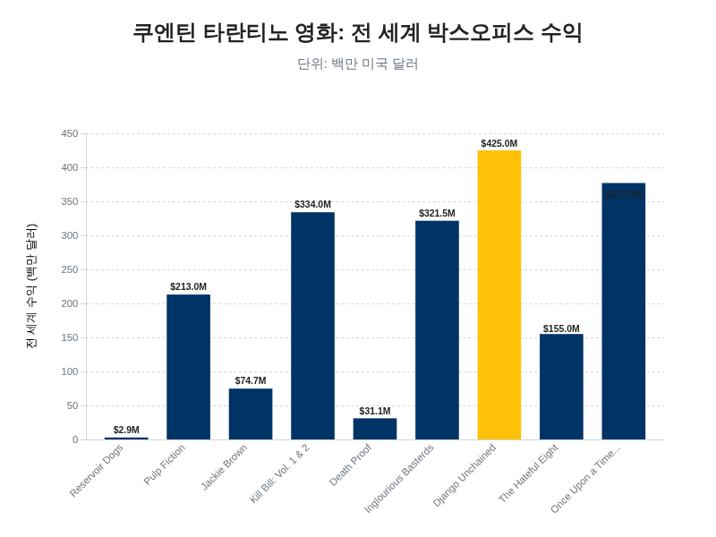
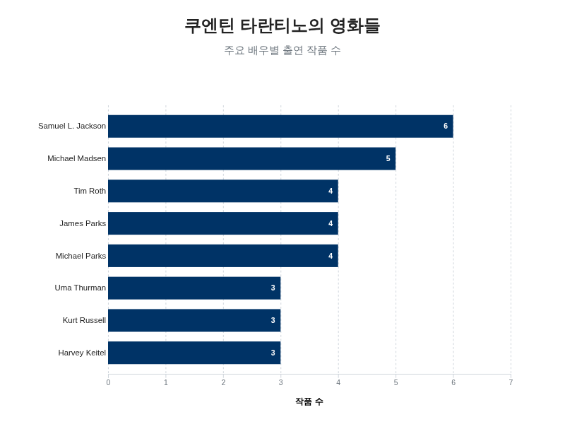
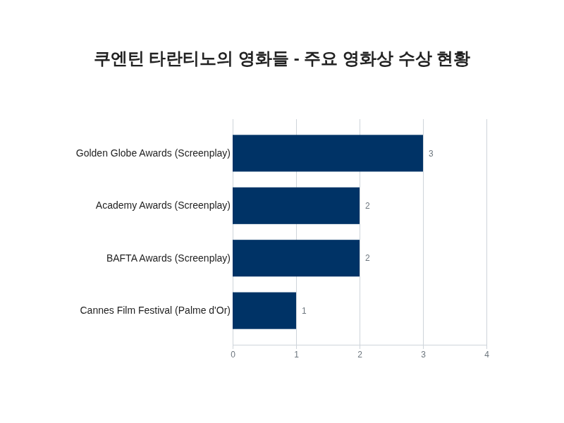

# 쿠엔틴 타란티노: 영화, 스타일, 영향력 분석

## 서론

1963년 3월 27일 미국 테네시주 녹스빌에서 태어난 쿠엔틴 타란티노는 현대 영화계에서 가장 독창적이고 영향력 있는 감독 중 한 명으로 확고히 자리매김했습니다 [[57](https://prezi.com/p/kyprf-u4awjk/how-quentin-tarantinos-influence-changed-modern-day-cinema/), [59](https://nofilmschool.com/quentin-tarantino-directing-tips)]. 그는 정규 영화 교육을 받지 않고, 대신 방대한 양의 영화를 섭렵하며 독학으로 자신만의 영화적 언어를 구축한 자수성가형 거장으로 평가받습니다 [[8](https://indiefilmhustle.com/ultimate-guide-to-quentin-tarantino-and-his-directing-techniques/)]. 그의 경력은 출신 배경이나 학력에 관계없이 오직 열정과 노력만으로 영화계에서 성공할 수 있다는 이상적인 신념을 상징적으로 보여줍니다 [[8](https://indiefilmhustle.com/ultimate-guide-to-quentin-tarantino-and-his-directing-techniques/)]. 그의 작품들은 전 세계적으로 30억 달러 이상의 수익을 올렸으며, 그의 독특한 스타일은 수많은 후배 영화 제작자들에게 영감의 원천이 되었습니다 [[58](https://medium.com/@groomproinstapro/how-quentin-tarantino-revolutionized-filmmaking-251247b11a6f)].

타란티노의 등장은 1992년 선댄스 영화제에서 그의 데뷔작인 '저수지의 개들'이 공개되면서 시작되었습니다 [[3](https://www.imdb.com/name/nm0000233/)]. 이 영화는 즉각적으로 독립 영화계에 큰 파장을 일으켰고, 오늘날까지도 역대 최고의 독립 영화 중 하나로 손꼽히고 있습니다 [[8](https://indiefilmhustle.com/ultimate-guide-to-quentin-tarantino-and-his-directing-techniques/)]. 그러나 그의 명성을 전 세계적으로 확고히 한 작품은 1994년에 개봉한 '펄프 픽션'이었습니다 [[58](https://medium.com/@groomproinstapro/how-quentin-tarantino-revolutionized-filmmaking-251247b11a6f)]. 이 영화는 연대기적 서사를 과감히 파괴하는 비선형적 구조를 통해 관객이 직접 시간 순서를 재구성하게 만들며, 서스펜스와 캐릭터에 대한 깊은 탐구를 유도했습니다 [[57](https://prezi.com/p/kyprf-u4awjk/how-quentin-tarantinos-influence-changed-modern-day-cinema/)]. '펄프 픽션'의 성공은 하나의 전환점이 되어, 영화에서 이야기를 전달하는 방식 자체를 바꾸어 놓았다는 평가를 받았습니다 [[58](https://medium.com/@groomproinstapro/how-quentin-tarantino-revolutionized-filmmaking-251247b11a6f)]. 이 두 편의 초기작을 통해 타란티노는 주류 시장에서도 독립 영화가 상업적으로 성공할 수 있음을 증명하며 독립 영화계에 새로운 활력을 불어넣었습니다 [[57](https://prezi.com/p/kyprf-u4awjk/how-quentin-tarantinos-influence-changed-modern-day-cinema/)]. 그의 성공은 큰 예산 없이도 창의적인 위험을 감수하며 영향력 있는 영화를 만들 수 있다는 사실을 입증하며 수많은 신진 감독들에게 용기를 주었습니다 [[58](https://medium.com/@groomproinstapro/how-quentin-tarantino-revolutionized-filmmaking-251247b11a6f)].

타란티노의 영화는 몇 가지 뚜렷한 특징으로 정의됩니다. 그의 작품들은 비선형적 서사 구조, 긴 테이크, 그리고 역동적인 카메라 움직임과 같은 독특한 영화 기법으로 가득합니다 [[57](https://prezi.com/p/kyprf-u4awjk/how-quentin-tarantinos-influence-changed-modern-day-cinema/)]. 또한, 대중문화에 대한 해박한 지식이 녹아있는 재치 있고 현실적인 대사는 캐릭터에 깊이를 더하고 극적 긴장감을 고조시키는 핵심 요소로 작용합니다 [[57](https://prezi.com/p/kyprf-u4awjk/how-quentin-tarantinos-influence-changed-modern-day-cinema/), [8](https://indiefilmhustle.com/ultimate-guide-to-quentin-tarantino-and-his-directing-techniques/)]. 그의 대사 작성 방식은 이후 영화 각본의 흐름을 바꾸어 놓았다는 평가를 받기도 했습니다 [[58](https://medium.com/@groomproinstapro/how-quentin-tarantino-revolutionized-filmmaking-251247b11a6f)]. 그의 영화에서 폭력은 단순한 충격 요법으로 사용되지 않고, 서사와 캐릭터 발전을 위해 세심하게 설계된 미학적 장치로 기능합니다 [[58](https://medium.com/@groomproinstapro/how-quentin-tarantino-revolutionized-filmmaking-251247b11a6f)]. 그는 쇼 브라더스 스튜디오의 쿵푸 영화, 스파게티 웨스턴 등 고전 장르에 대한 오마주를 현대적으로 재해석하며 액션, 드라마, 호러 등 다양한 장르를 혼합하는 혁신적인 서사를 창조합니다 [[57](https://prezi.com/p/kyprf-u4awjk/how-quentin-tarantinos-influence-changed-modern-day-cinema/), [6](https://www.cbr.com/quentin-tarantino-details-movies/)]. 뿐만 아니라, 전통적인 영화 음악 대신 직접 선곡한 다채로운 사운드트랙을 활용하여 장면의 감정과 분위기를 극대화하는 것으로도 유명합니다 [[6](https://www.cbr.com/quentin-tarantino-details-movies/), [5](https://www.tcm.com/articles/718920/reservoir-dogs)]. 이처럼 그의 영화는 단순한 오락을 넘어 창의성과 예술성에 대한 하나의 마스터클래스로 여겨지며 [[58](https://medium.com/@groomproinstapro/how-quentin-tarantino-revolutionized-filmmaking-251247b11a6f)], 그는 정형화된 유행에서 벗어나 독창성을 추구하는 현대 영화의 상징적인 인물로 평가받고 있습니다 [[57](https://prezi.com/p/kyprf-u4awjk/how-quentin-tarantinos-influence-changed-modern-day-cinema/)].

## 주요 작품 분석

쿠엔틴 타란티노는 공식적으로 9편의 장편 영화를 연출했으며, '킬 빌' 1부와 2부를 하나의 작품으로 간주할 경우 총 10편의 영화를 감독한 것으로 계산됩니다 [[2](https://www.quentintarantinofanclub.com/index.php?p=complete-filmography)]. 그는 오랫동안 10편의 영화를 만든 후 감독직에서 은퇴하겠다는 계획을 공공연히 밝혀왔습니다 [[2](https://www.quentintarantinofanclub.com/index.php?p=complete-filmography)]. 그의 필모그래피는 데뷔작부터 최근 작품에 이르기까지 일관된 주제 의식과 독창적인 스타일을 유지하며 점진적으로 발전해 온 과정을 명확하게 보여줍니다.

그의 공식적인 장편 데뷔작인 '저수지의 개들'(Reservoir Dogs, 1992)은 보석상 강도 사건이 실패로 돌아간 직후, 서로의 신원을 모르는 범죄자들이 은신처에 모여 벌어지는 이야기를 다룹니다 [[1](https://wiki.tarantino.info/index.php/Complete_Filmography)]. 영화는 강도 사건 자체를 직접 보여주는 대신, 사건 이후의 혼란과 인물들 간의 불신, 그리고 배신자를 색출하는 과정에 집중하며 비선형적 서사 구조를 통해 긴장감을 극대화합니다 [[5](https://www.tcm.com/articles/718920/reservoir-dogs)]. 하비 카이텔, 마이클 매드슨, 팀 로스, 스티브 부세미 등 쟁쟁한 배우들이 출연했으며, 타란티노 자신도 '미스터 브라운' 역으로 직접 등장했습니다 [[1](https://wiki.tarantino.info/index.php/Complete_Filmography), [5](https://www.tcm.com/articles/718920/reservoir-dogs)]. 처음 예산은 3만 달러에 불과했으나, 하비 카이텔이 공동 제작자로 참여하면서 120만 달러에서 150만 달러까지 예산이 증액될 수 있었습니다 [[5](https://www.tcm.com/articles/718920/reservoir-dogs), [1](https://wiki.tarantino.info/index.php/Complete_Filmography), [3](https://www.imdb.com/name/nm0000233/)]. 북미에서 280만 달러, 전 세계적으로 290만 달러의 흥행 수익을 기록하며 극장에서는 상업적으로 실패했지만, 이후 비디오와 DVD 시장을 통해 컬트적인 인기를 얻으며 그의 등장을 세상에 알렸습니다 [[1](https://wiki.tarantino.info/index.php/Complete_Filmography), [3](https://www.imdb.com/name/nm0000233/)].

1994년에 개봉한 '펄프 픽션'(Pulp Fiction)은 타란티노를 세계적인 거장의 반열에 올려놓은 작품입니다. 존 트라볼타, 사무엘 L. 잭슨, 우마 서먼, 브루스 윌리스 등이 출연한 이 영화는 여러 인물의 이야기가 독립적으로 전개되다가 교차하는 독특한 서사 구조를 선보였습니다 [[6](https://www.cbr.com/quentin-tarantino-details-movies/), [3](https://www.imdb.com/name/nm0000233/)]. 800만 달러의 제작비로 만들어져 전 세계적으로 2억 1,300만 달러 이상의 엄청난 흥행 수익을 기록했습니다 [[7](https://screenrant.com/quentin-tarantino-multiple-actor-films-been/), [8](https://indiefilmhustle.com/ultimate-guide-to-quentin-tarantino-and-his-directing-techniques/), [10](https://www.looper.com/2054052/quentin-tarantino-movies-ranked-box-office/), [12](https://screenrant.com/quentin-tarantinos-movies-ranked-by-box-office-gross-according-to-box-office-mojo/)]. 이 영화는 칸 영화제에서 황금종려상을 수상했으며, 아카데미 시상식에서 타란티노와 로저 에이버리가 각본상을 공동 수상하는 영예를 안았습니다 [[3](https://www.imdb.com/name/nm0000233/)]. 오늘날 '펄프 픽션'은 타란티노의 최고 걸작이자 영화사에 한 획을 그은 작품으로 평가받고 있습니다 [[12](https://screenrant.com/quentin-tarantinos-movies-ranked-by-box-office-gross-according-to-box-office-mojo/)].

그의 세 번째 작품인 '재키 브라운'(Jackie Brown, 1997)은 팸 그리어, 사무엘 L. 잭슨, 로버트 포스터가 주연을 맡았으며, 전 세계적으로 약 3,967만 달러에서 7,472만 달러 사이의 수익을 거두었습니다 [[12](https://screenrant.com/quentin-tarantinos-movies-ranked-by-box-office-gross-according-to-box-office-mojo/), [10](https://www.looper.com/2054052/quentin-tarantino-movies-ranked-box-office/)]. 이 영화는 그의 다른 작품들에 비해 상대적으로 덜 알려졌지만, 깊이 있는 캐릭터 묘사와 탄탄한 스토리로 타란티노의 가장 과소평가된 작품 중 하나로 꼽힙니다 [[12](https://screenrant.com/quentin-tarantinos-movies-ranked-by-box-office-gross-according-to-box-office-mojo/)].

2003년과 2004년에 각각 개봉한 '킬 빌 1부'(Kill Bill: Volume 1)와 '킬 빌 2부'(Kill Bill: Volume 2)는 본래 한 편의 영화로 기획되었으나 방대한 분량으로 인해 두 편으로 나뉘어 개봉되었습니다. 우마 서먼이 연기한 주인공 '브라이드'가 자신의 결혼식 날 자신을 배신하고 죽이려 했던 옛 동료들에게 처절한 복수를 감행하는 과정을 그립니다 [[15](https://www.filmink.com.au/reviews/kill-bill-vol-1-2/)]. 이 영화는 쿵푸, 사무라이 영화, 스파게티 웨스턴 등 다양한 장르에 대한 오마주로 가득하며, 비선형적 서사 구조를 통해 복수의 여정을 감각적으로 묘사합니다 [[15](https://www.filmink.com.au/reviews/kill-bill-vol-1-2/)]. 1부는 화려하고 과장된 액션, 특히 오렌 이시이(루시 리우)와의 일본식 정원 결투 장면으로 유명하며 [[14](https://takemetothevideostore.wordpress.com/2020/05/20/kill-bill-vols-1-2-2003-04/)], 2부는 파이 메이로부터 전수받은 무술의 정수와 빌(데이비드 캐러딘)과의 마지막 대결을 통해 더 깊은 감정적 서사를 풀어냅니다 [[13](https://en.wikipedia.org/wiki/Kill_Bill:_Volume_2), [14](https://takemetothevideostore.wordpress.com/2020/05/20/kill-bill-vols-1-2-2003-04/)]. '킬 빌' 시리즈는 전 세계적으로 총 3억 3,400만 달러의 수익을 올렸으며(1부 1억 8,090만 달러, 2부 1억 5,200만 달러) [[10](https://www.looper.com/2054052/quentin-tarantino-movies-ranked-box-office/), [11](https://www.reddit.com/r/boxoffice/comments/174y81p/directors_at_the_box_office_quentin_tarantino/), [12](https://screenrant.com/quentin-tarantinos-movies-ranked-by-box-office-gross-according-to-box-office-mojo/), [13](https://en.wikipedia.org/wiki/Kill_Bill:_Volume_2)], 타란티노의 가장 상징적이고 시각적으로 인상적인 작품으로 평가받고 있습니다 [[15](https://www.filmink.com.au/reviews/kill-bill-vol-1-2/)].

2007년에는 로버트 로드리게스 감독과 함께 '그라인드하우스'(Grindhouse)라는 이름의 더블 피처 프로젝트를 선보였는데, 이 중 타란티노가 연출한 작품이 '데쓰 프루프'(Death Proof)입니다. 이 영화는 3,000만 달러의 예산으로 제작되어 전 세계적으로 3,110만 달러의 수익을 거두는 데 그쳤으며, '그라인드하우스' 전체 프로젝트 역시 흥행에 실패하면서 타란티노의 유일한 상업적 실패작으로 기록되었습니다 [[9](https://www.therichest.com/quentin-tarantino-movies/), [10](https://www.looper.com/2054052/quentin-tarantino-movies-ranked-box-office/), [12](https://screenrant.com/quentin-tarantinos-movies-ranked-by-box-office-gross-according-to-box-office-mojo/)].

이후 그는 '바스터즈: 거친 녀석들'(Inglourious Basterds, 2009)을 통해 화려하게 부활했습니다. 제2차 세계대전을 배경으로 한 이 수정주의 역사 영화는 브래드 피트와 크리스토프 왈츠 등이 출연했으며, 전 세계적으로 3억 2,150만 달러의 흥행을 기록하며 그의 주류 영화 시장에서의 영향력을 다시 한번 입증했습니다 [[10](https://www.looper.com/2054052/quentin-tarantino-movies-ranked-box-office/), [12](https://screenrant.com/quentin-tarantinos-movies-ranked-by-box-office-gross-according-to-box-office-mojo/)]. 이 작품으로 그는 아카데미 감독상과 각본상 후보에 올랐습니다 [[4](https://en.wikipedia.org/wiki/Quentin_Tarantino_filmography)].

2012년에 개봉한 '장고: 분노의 추적자'(Django Unchained)는 제이미 폭스, 레오나르도 디카프리오, 크리스토프 왈츠가 주연을 맡아 노예 제도를 배경으로 한 복수극을 그렸습니다. 이 영화는 전 세계적으로 4억 2,500만 달러 이상의 수익을 올리며 타란티노의 필모그래피 사상 최고 흥행작이 되었습니다 [[4](https://en.wikipedia.org/wiki/Quentin_Tarantino_filmography), [10](https://www.looper.com/2054052/quentin-tarantino-movies-ranked-box-office/), [12](https://screenrant.com/quentin-tarantinos-movies-ranked-by-box-office-gross-according-to-box-office-mojo/)]. 또한, 흑인 주연 영화의 해외 흥행에 대한 편견을 깨뜨린 작품으로 평가받았으며, 타란티노에게 두 번째 아카데미 각본상을 안겨주었습니다 [[4](https://en.wikipedia.org/wiki/Quentin_Tarantino_filmography), [10](https://www.looper.com/2054052/quentin-tarantino-movies-ranked-box-office/)].

그의 다음 작품인 '헤이트풀 8'(The Hateful Eight, 2015)은 사무엘 L. 잭슨과 커트 러셀 등이 출연한 서부극으로, 눈보라 속에 갇힌 8명의 인물들이 벌이는 밀실 스릴러입니다. 전 세계적으로 1억 5,500만 달러의 수익을 기록하며 이전 작품들에는 미치지 못했지만, 골든 글로브와 BAFTA 등 주요 시상식 후보에 오르며 작품성을 인정받았습니다 [[4](https://en.wikipedia.org/wiki/Quentin_Tarantino_filmography), [9](https://www.therichest.com/quentin-tarantino-movies/), [12](https://screenrant.com/quentin-tarantinos-movies-ranked-by-box-office-gross-according-to-box-office-mojo/)].

가장 최근 작품인 '원스 어폰 어 타임... 인 할리우드'(Once Upon a Time in Hollywood, 2019)는 레오나르도 디카프리오, 브래드 피트, 마고 로비가 주연을 맡아 1960년대 할리우드의 풍경과 맨슨 패밀리 사건을 재구성했습니다. 이 영화는 전 세계적으로 3억 7,700만 달러 이상의 수익을 올렸으며, 아카데미 시상식에서 작품상을 포함해 10개 부문 후보에 오르는 기염을 토했습니다 [[4](https://en.wikipedia.org/wiki/Quentin_Tarantino_filmography), [10](https://www.looper.com/2054052/quentin-tarantino-movies-ranked-box-office/), [12](https://screenrant.com/quentin-tarantinos-movies-ranked-by-box-office-gross-according-to-box-office-mojo/)]. 배우들의 뛰어난 연기는 극찬을 받았으나, 일부에서는 서사가 다소 자기만족적이라는 비판을 받기도 했습니다 [[12](https://screenrant.com/quentin-tarantinos-movies-ranked-by-box-office-gross-according-to-box-office-mojo/)].

쿠엔틴 타란티노 감독의 영화별 전 세계 흥행 수익 비교.

## 타란티노의 독창적 연출 스타일

쿠엔틴 타란티노의 영화 세계를 정의하는 가장 핵심적인 특징은 그의 독창적인 연출 스타일에 있습니다. 그의 작품들은 단순히 이야기를 전달하는 것을 넘어, 서사 구조, 대사, 그리고 폭력 묘사에 대한 기존의 관습을 파괴하고 재창조함으로써 관객에게 독특한 영화적 경험을 선사합니다. 그의 영화에서 "시간은 단순히 유동적인 것이 아니라, 하나의 캐릭터"처럼 작용하며 [[16](https://aiinscreentrade.com/2023/10/11/quentin-tarantino-and-the-art-of-non-linear-storytelling/)], 이는 그의 대표적인 기법인 비선형적 서사 구조에서 가장 명확하게 드러납니다. 타란티노는 뒤섞인 시간 순서, 다중 시점에서 전개되는 이야기, 그리고 과거와 현재를 넘나드는 플래시백과 같은 기법을 통해 전통적인 시나리오 작법을 재정의합니다 [[16](https://aiinscreentrade.com/2023/10/11/quentin-tarantino-and-the-art-of-non-linear-storytelling/)]. 이러한 구조는 관객의 적극적인 참여를 유도하는 장치로 기능합니다. 관객은 흩어진 시간의 조각들을 직접 맞추며 이야기를 재구성해야 하며, 이 과정은 영화에 대한 몰입도를 높이고 복합적인 층위를 더해 긴장감 넘치는 경험을 만들어냅니다 [[16](https://aiinscreentrade.com/2023/10/11/quentin-tarantino-and-the-art-of-non-linear-storytelling/)]. 그는 복잡성이 이야기에 풍부함을 더할 수는 있지만, 결코 명확성을 해쳐서는 안 된다는 '복잡성보다 명확성'이라는 원칙을 고수합니다 [[16](https://aiinscreentrade.com/2023/10/11/quentin-tarantino-and-the-art-of-non-linear-storytelling/)]. 이로 인해 그의 서사는 마치 '조각난 타임라인'을 '직소 퍼즐처럼' 맞춰나가는 지적인 즐거움을 관객에게 선사합니다 [[18](https://thecinemafix.com/telling-stories-with-style-the-tropes-of-tarantino%EF%BB%BF/)]. 그는 '킬 빌'에서 "폴라 슐츠의 외로운 무덤"과 같은 '챕터 제목'을 삽입하여 장면, 시간, 장소, 그리고 인물의 변화를 명시적으로 알리면서 유머와 서스펜스를 동시에 자아내는 독특한 방식을 사용하기도 합니다 [[18](https://thecinemafix.com/telling-stories-with-style-the-tropes-of-tarantino%EF%BB%BF/)]. 또한 '저수지의 개들'의 팀 로스나 '헤이트풀 8'의 사무엘 L. 잭슨 캐릭터처럼 모호하거나 기만적인 서술을 제공하는 '신뢰할 수 없는 화자'를 등장시켜 관객의 감정적 반응을 계속해서 변화시키기도 합니다 [[18](https://thecinemafix.com/telling-stories-with-style-the-tropes-of-tarantino%EF%BB%BF/)]. 이러한 비선형적 서사는 '저수지의 개들', '펄프 픽션', '킬 빌', '헤이트풀 8', 그리고 '원스 어폰 어 타임... 인 할리우드' 등 그의 대표작들에서 일관되게 나타나는 핵심적인 특징입니다 [[16](https://aiinscreentrade.com/2023/10/11/quentin-tarantino-and-the-art-of-non-linear-storytelling/), [17](https://medium.com/@markmurphydirector/a-deep-dive-into-the-directorial-style-of-quentin-tarantino-fd1448dc4de2), [18](https://thecinemafix.com/telling-stories-with-style-the-tropes-of-tarantino%EF%BB%BF/)].

타란티노는 무엇보다도 그의 독보적인 대사 장면으로 가장 널리 알려져 있습니다 [[19](https://www.studiobinder.com/blog/kill-bill-analysis/)]. 그의 대사는 단순히 정보를 전달하는 기능을 넘어, 그 자체로 하나의 독립적인 서사를 구축하고 극의 긴장감을 조율하는 핵심적인 역할을 수행합니다. 그의 대표적인 기법은 킹콩이나 두개골 절개술과 같은 사소해 보이는 주제에 대한 장황한 대화를 통해 장면을 의도적으로 늘리는 것입니다 [[21](https://www.framerated.co.uk/tarantino-writes-scene/)]. 그는 이러한 방식에 대해 "그 밑바탕에 있는 서스펜스는 고무줄과 같다. 나는 그저 그것이 얼마나 멀리 늘어날 수 있는지 보려고 계속해서 잡아당기고, 또 잡아당길 뿐이다"라고 설명했습니다 [[21](https://www.framerated.co.uk/tarantino-writes-scene/)]. 일반적인 영화 제작이 장면을 압축하는 것을 목표로 하는 반면, 그는 "고무줄이 늘어날 수 있는 한, 장면이 길어질수록 서스펜스는 더욱 커진다"고 믿습니다 [[21](https://www.framerated.co.uk/tarantino-writes-scene/)]. 이러한 긴 대화 장면 속에서도 관객의 집중력을 유지하기 위해 그는 몇 가지 정교한 장치를 사용합니다. 그는 초반에 높은 이해관계를 설정하여 관객의 주의를 사로잡고, 긴 독백 안에서도 3막 구조를 만들어 서사적 추진력을 유지하며, 유머와 공감대를 형성하기 위해 개인적인 일화를 삽입합니다 [[19](https://www.studiobinder.com/blog/kill-bill-analysis/)]. 특히 두 명의 대립하는 인물이 테이블을 사이에 두고 마주 앉아 심리적 갈등을 벌이는 장면은 그의 영화에서 자주 등장하는 구도입니다 [[21](https://www.framerated.co.uk/tarantino-writes-scene/)]. 또한 그는 장면의 가장 중요한 단어나 대사가 마지막에 나오도록 전체 장면의 구조를 설계하는 '삼각형 장면' 기법을 활용하여 극적 효과를 극대화합니다 [[21](https://www.framerated.co.uk/tarantino-writes-scene/)]. '바스터즈: 거친 녀석들'의 오프닝 장면처럼 긴 대화가 필연적인 폭력적 클라이맥스로 이어지는 '롱 게임' 장면들은 관객으로 하여금 폭발의 순간을 예측하면서도 그 시점을 지연시켜 서스펜스를 최고조로 끌어올립니다 [[18](https://thecinemafix.com/telling-stories-with-style-the-tropes-of-tarantino%EF%BB%BF/), [21](https://www.framerated.co.uk/tarantino-writes-scene/)]. 이러한 대사들은 수많은 대중문화 레퍼런스와 창의적인 욕설의 사용으로도 유명하며, 그의 초기작부터 일관되게 나타나는 특징입니다 [[8](https://indiefilmhustle.com/ultimate-guide-to-quentin-tarantino-and-his-directing-techniques/)].

타란티노 영화에서 폭력은 단순한 자극이 아니라, 세심하게 설계된 미학적 장치로 기능합니다. 그의 폭력 묘사는 '양식화된 폭력' 혹은 '폭력의 미학화'로 정의되며 [[23](https://www.academia.edu/19806166/Tracing_Tarantino_Dark_Humor_Excess_and_the_Aestheticization_of_Violence)], 그는 이러한 '폭력 미학의 창시자'로 평가받기도 합니다 [[24](https://www.facebook.com/groups/retroreels/posts/2378493022184637/)]. 학술적 분석에 따르면, 그는 어두운 유머, 과잉, 그리고 폭력의 미학화라는 세 가지 주요 영화적 요소를 결합하여 '타란티노스러운' 스타일을 창조합니다 [[23](https://www.academia.edu/19806166/Tracing_Tarantino_Dark_Humor_Excess_and_the_Aestheticization_of_Violence)]. 첫째, 어두운 유머는 폭력을 오락적 장치로 활용하는 동시에, 현실 세계의 폭력에 둔감해진 사회에 대한 논평으로 작용합니다 [[23](https://www.academia.edu/19806166/Tracing_Tarantino_Dark_Humor_Excess_and_the_Aestheticization_of_Violence)]. 대표적인 예로 '저수지의 개들'에서 스틸러스 휠의 경쾌한 노래 "Stuck In The Middle With You"를 배경으로 귀를 자르는 장면은 극도의 불안감을 자아내는 부조화를 통해 강렬한 인상을 남깁니다 [[8](https://indiefilmhustle.com/ultimate-guide-to-quentin-tarantino-and-his-directing-techniques/)]. 둘째, 그의 폭력 묘사는 의도적으로 과장되어 인공적인 허구임을 스스로 드러냅니다 [[23](https://www.academia.edu/19806166/Tracing_Tarantino_Dark_Humor_Excess_and_the_Aestheticization_of_Violence)]. 셋째, 폭력의 이미지는 사실적인 묘사보다는 아이러니와 연기 자체를 우선시하는 하나의 스펙터클로 소비되며, 이는 폭력을 포스트모던 미학 전략으로 변모시킵니다 [[22](https://www.granthaalayahpublication.org/Arts-Journal/ShodhKosh/article/view/6529), [25](https://www.researchgate.net/publication/395975809_BLOOD_AS_SPECTACLE_THE_AESTHETICS_OF_VIOLENCE_IN_QUENTIN_TARANTINO'S_CINEMA)]. 타란티노 자신도 현실 세계의 폭력을 옹호하지는 않지만 "영화 속 폭력은 멋지다"고 말하며 영화적 표현과 현실을 구분하는 태도를 보였습니다 [[26](https://screenrant.com/quentin-tarantino-movies-signature-filmmaking-tricks/)]. 그의 영화들은 미디어의 영향에 대한 도덕적 공황에 도전하는 동시에, 폭력을 고도로 양식화된 상징적 언어로 사용하여 문화적 서사를 재구성하는 포스트모던 폭력의 역설을 탐구합니다 [[22](https://www.granthaalayahpublication.org/Arts-Journal/ShodhKosh/article/view/6529)]. 특히 '킬 빌', '바스터즈: 거친 녀석들', '장고: 분노의 추적자'와 같은 작품들은 그의 필모그래피에서 가장 높은 사망자 수를 기록하며 이러한 양식화된 폭력의 미학을 극명하게 보여주는 사례로 꼽힙니다 [[22](https://www.granthaalayahpublication.org/Arts-Journal/ShodhKosh/article/view/6529), [23](https://www.academia.edu/19806166/Tracing_Tarantino_Dark_Humor_Excess_and_the_Aestheticization_of_Violence), [26](https://screenrant.com/quentin-tarantino-movies-signature-filmmaking-tricks/)]. 이 외에도 자동차 트렁크 안에서 인물을 촬영하는 '트렁크 숏' [[26](https://screenrant.com/quentin-tarantino-movies-signature-filmmaking-tricks/), [27](https://www.studiobinder.com/blog/shot-lists-quentin-tarantino/)], 극적인 순간을 강조하는 익스트림 클로즈업과 크래시 줌 [[27](https://www.studiobinder.com/blog/shot-lists-quentin-tarantino/)], 그리고 특정 노래를 중심으로 각본을 구상할 정도로 중요한 역할을 하는 음악의 활용 등은 그의 독창적인 연출 스타일을 구성하는 또 다른 중요한 요소들입니다 [[27](https://www.studiobinder.com/blog/shot-lists-quentin-tarantino/)].

## 타란티노 유니버스: 영화 간의 연결성

쿠엔틴 타란티노의 영화들은 개별적인 작품으로 존재하면서도, 동시에 하나의 거대하고 복잡하게 얽힌 세계관, 즉 '타란티노 유니버스'를 형성합니다. 이 세계관은 그의 팬들과 비평가들 사이에서 오랫동안 논의되어 온 주제이며, 타란티노 감독 본인이 직접 그 구조를 설명함으로써 더욱 구체화되었습니다 [[33](https://movieweb.com/quentin-tarantino-shared-universe-easter-eggs/), [39](https://www.cbr.com/quentin-tarantino-movie-connections-explained/), [41](https://www.insidehook.com/film/quentin-tarantino-explains-movies-connected)]. 그에 따르면, 그의 영화들은 두 개의 서로 다른 차원의 우주, 즉 '현실보다 더 현실적인 세계(Realer-Than-Real World Universe)'와 그 현실 세계 속의 '영화 속 영화 세계(Movie Within a Movie Universe)'로 나뉩니다 [[33](https://movieweb.com/quentin-tarantino-shared-universe-easter-eggs/), [39](https://www.cbr.com/quentin-tarantino-movie-connections-explained/), [41](https://www.insidehook.com/film/quentin-tarantino-explains-movies-connected)]. '현실보다 더 현실적인 세계'는 '저수지의 개들', '펄프 픽션', '데쓰 프루프', '바스터즈: 거친 녀석들', '장고: 분노의 추적자', '헤이트풀 8'과 같은 작품들이 속한 주된 배경입니다 [[33](https://movieweb.com/quentin-tarantino-shared-universe-easter-eggs/), [39](https://www.cbr.com/quentin-tarantino-movie-connections-explained/), [41](https://www.insidehook.com/film/quentin-tarantino-explains-movies-connected)]. 이 세계의 인물들이 극장에 가서 관람하는 영화들이 바로 '영화 속 영화 세계'에 해당하는 '킬 빌', '황혼에서 새벽까지', '내츄럴 본 킬러'와 같은 작품들입니다 [[33](https://movieweb.com/quentin-tarantino-shared-universe-easter-eggs/), [39](https://www.cbr.com/quentin-tarantino-movie-connections-explained/), [41](https://www.insidehook.com/film/quentin-tarantino-explains-movies-connected), [42](https://littlebitsofgaming.com/2017/02/23/whats-in-a-name-the-character-connections-between-tarantino-movies/)]. 이러한 이중 구조는 '원스 어폰 어 타임... 인 할리우드'에서 더욱 복합적으로 나타나는데, 이 영화의 등장인물들은 현실 세계에 살면서 동시에 그들의 영화나 TV 작품을 통해 '영화 속 영화 세계'를 넘나드는 모습을 보여줍니다 [[39](https://www.cbr.com/quentin-tarantino-movie-connections-explained/)]. 다만 '재키 브라운'은 이 구조에서 예외적인 작품으로, 원작 소설가 엘모어 레너드의 세계관에 속하는 것으로 분류됩니다 [[39](https://www.cbr.com/quentin-tarantino-movie-connections-explained/)].

이 공유된 세계관을 더욱 공고히 하는 것은 반복적으로 출연하는 배우들과 그들이 연기하는 특징적인 캐릭터 유형입니다. 사무엘 L. 잭슨은 타란티노의 가장 빈번한 협력자로, '펄프 픽션', '재키 브라운', '킬 빌 2부', '헤이트풀 8', '장고: 분노의 추적자'에 출연했으며 '바스터즈: 거친 녀석들'에서는 내레이션을 맡는 등 총 6편의 작품에 참여했습니다 [[28](https://www.quentintarantinofanclub.com/?p=news&id=170&article=Recurring-actors-in-Quentin-Tarantino-Movies&srsltid=AfmBOopIDcBp-TeQ6xsiLyopztKwYbzV33xV48nZ0mF1ZzeGFz-KwZbc), [30](https://screenrant.com/best-recurring-actors-quentin-tarantino-movies/)]. 마이클 매드슨은 '저수지의 개들'의 '미스터 블론드'와 '킬 빌' 시리즈의 '버드' 역으로 강렬한 인상을 남기며 총 5편의 영화에 출연했습니다 [[28](https://www.quentintarantinofanclub.com/?p=news&id=170&article=Recurring-actors-in-Quentin-Tarantino-Movies&srsltid=AfmBOopIDcBp-TeQ6xsiLyopztKwYbzV33xV48nZ0mF1ZzeGFz-KwZbc), [30](https://screenrant.com/best-recurring-actors-quentin-tarantino-movies/)]. 이 외에도 팀 로스(4편), 제임스 파크스와 마이클 파크스 부자(각 4편), 우마 서먼(3편), 커트 러셀(3편), 하비 카이텔(3편) 등이 그의 페르소나를 구성하는 주요 배우들입니다 [[28](https://www.quentintarantinofanclub.com/?p=news&id=170&article=Recurring-actors-in-Quentin-Tarantino-Movies&srsltid=AfmBOopIDcBp-TeQ6xsiLyopztKwYbzV33xV48nZ0mF1ZzeGFz-KwZbc), [30](https://screenrant.com/best-recurring-actors-quentin-tarantino-movies/), [32](https://www.reddit.com/r/Tarantino/comments/ca07n1/for_actors_who_have_appeared_in_more_than_one/)]. 레오나르도 디카프리오, 브래드 피트, 크리스토프 왈츠 역시 그의 후기 작품들에서 핵심적인 역할을 수행하며 중요한 협력자로 자리매김했습니다 [[28](https://www.quentintarantinofanclub.com/?p=news&id=170&article=Recurring-actors-in-Quentin-Tarantino-Movies&srsltid=AfmBOopIDcBp-TeQ6xsiLyopztKwYbzV33xV48nZ0mF1ZzeGFz-KwZbc), [31](https://www.youtube.com/watch?v=ZYjKFaHZZ58)]. 배우들의 반복적인 등장은 단순히 캐스팅 패턴을 넘어, 특정 캐릭터 유형의 구축으로 이어집니다. '킬 빌'의 브라이드(우마 서먼)나 '재키 브라운'의 재키 브라운(팸 그리어)처럼 남성 캐릭터들을 압도하는 '강인한 여성 주인공' 유형이 대표적입니다 [[28](https://www.quentintarantinofanclub.com/?p=news&id=170&article=Recurring-actors-in-Quentin-Tarantino-Movies&srsltid=AfmBOopIDcBp-TeQ6xsiLyopztKwYbzV33xV48nZ0mF1ZzeGFz-KwZbc), [38](https://paas.org.pl/wp-content/uploads/2022/12/03-PJAS-16-martynuska.pdf)]. 또한 '저수지의 개들'에서 쾌락을 위해 고문을 자행하는 미스터 블론드나 '데쓰 프루프'에서 자동차를 이용해 여성을 살해하는 스턴트맨 마이크와 같은 '가학적인 악당' 유형도 반복적으로 등장합니다 [[30](https://screenrant.com/best-recurring-actors-quentin-tarantino-movies/), [31](https://www.youtube.com/watch?v=ZYjKFaHZZ58), [32](https://www.reddit.com/r/Tarantino/comments/ca07n1/for_actors_who_have_appeared_in_more_than_one/)]. 반면 '바스터즈: 거친 녀석들'의 한스 란다(크리스토프 왈츠)나 '킬 빌'의 빌(데이비드 캐러딘)처럼 다층적이고 매력적인 '복합적 악역' 역시 그의 영화를 특징짓는 중요한 축입니다 [[31](https://www.youtube.com/watch?v=ZYjKFaHZZ58), [32](https://www.reddit.com/r/Tarantino/comments/ca07n1/for_actors_who_have_appeared_in_more_than_one/)]. '장고: 분노의 추적자'의 캘빈 캔디(레오나르도 디카프리오)와 같은 '잔혹한 권력자' 역시 그의 세계관에 깊이를 더하는 주요 캐릭터 유형입니다 [[30](https://screenrant.com/best-recurring-actors-quentin-tarantino-movies/), [31](https://www.youtube.com/watch?v=ZYjKFaHZZ58)].

쿠엔틴 타란티노 감독과 자주 협업한 배우들의 작품 수.

타란티노 유니버스의 연결성은 단순히 배우나 캐릭터 유형의 반복을 넘어, 직접적인 인물 및 가족 관계로까지 확장됩니다. 가장 유명한 예는 베가 형제로, '저수지의 개들'에 등장하는 빅 베가(미스터 블론드)와 '펄프 픽션'의 빈센트 베가는 친형제 사이입니다 [[33](https://movieweb.com/quentin-tarantino-shared-universe-easter-eggs/), [39](https://www.cbr.com/quentin-tarantino-movie-connections-explained/)]. 타란티노는 심지어 이 두 형제가 암스테르담에서 한 여자를 두고 다투는 이야기를 다룬 프리퀄 영화 '베가 브라더스'를 구상하기도 했습니다 [[33](https://movieweb.com/quentin-tarantino-shared-universe-easter-eggs/), [39](https://www.cbr.com/quentin-tarantino-movie-connections-explained/)]. 도노위츠 가문은 '바스터즈: 거친 녀석들'의 도니 "유대인 곰" 도노위츠와 그가 각본을 쓴 '트루 로맨스'의 영화 제작자 리 도노위츠를 부자 관계로 연결합니다 [[33](https://movieweb.com/quentin-tarantino-shared-universe-easter-eggs/), [39](https://www.cbr.com/quentin-tarantino-movie-connections-explained/)]. 쿤스 가문은 '펄프 픽션'에서 금시계 일화를 전달하는 쿤스 대위와 '장고: 분노의 추적자'에서 추적당하는 범죄자 크레이지 크레이그 쿤스를 증조부와 증손자 관계로 설정함으로써 두 영화를 잇습니다 [[33](https://movieweb.com/quentin-tarantino-shared-universe-easter-eggs/), [39](https://www.cbr.com/quentin-tarantino-movie-connections-explained/)]. 맥그로 부자는 '황혼에서 새벽까지', '킬 빌', '데쓰 프루프' 등 여러 작품에 걸쳐 등장하며 세계관의 연속성을 보여주는 대표적인 사례입니다 [[39](https://www.cbr.com/quentin-tarantino-movie-connections-explained/), [42](https://littlebitsofgaming.com/2017/02/23/whats-in-a-name-the-character-connections-between-tarantino-movies/)]. 이 외에도 '펄프 픽션'의 지미 디믹과 '저수지의 개들'의 미스터 화이트(본명: 로렌스 디믹)의 성씨, '바스터즈: 거친 녀석들'의 아치 히콕스와 '헤이트풀 8'의 등장인물을 연결하는 히콕스 가문 등 다양한 가족 관계가 영화들 사이에 촘촘하게 설정되어 있습니다 [[39](https://www.cbr.com/quentin-tarantino-movie-connections-explained/), [42](https://littlebitsofgaming.com/2017/02/23/whats-in-a-name-the-character-connections-between-tarantino-movies/)].

이러한 인물 간의 연결고리 외에도, 타란티노는 가상의 브랜드와 상품을 반복적으로 등장시켜 그의 세계관이 하나의 일관된 현실임을 암시합니다. 가장 대표적인 브랜드는 '빅 카후나 버거'로, 서퍼와 거대한 햄버거 로고가 특징인 이 하와이안 테마의 패스트푸드점은 '저수지의 개들', '펄프 픽션', '황혼에서 새벽까지' 등 여러 작품에 등장합니다 [[33](https://movieweb.com/quentin-tarantino-shared-universe-easter-eggs/), [34](https://www.toptenz.net/10-clever-ways-quentin-tarantinos-films-are-connected.php), [35](https://www.reddit.com/r/movies/comments/1oj9lt9/what_are_some_fake_brands_associated_with/), [36](https://www.quora.com/What-are-all-the-connections-that-link-Quentin-Tarantino-s-movies-such-as-related-characters-and-brands), [37](https://www.youtube.com/shorts/Fk7ymSDlkLg)]. 또 다른 유명 브랜드는 '레드 애플' 담배로, 벌레가 나오는 빨간 사과 로고는 폐암에 대한 은유로 해석되며 '펄프 픽션', '킬 빌' 등 다수의 영화에서 배우들이 피우는 모습으로 나타납니다 [[33](https://movieweb.com/quentin-tarantino-shared-universe-easter-eggs/), [34](https://www.toptenz.net/10-clever-ways-quentin-tarantinos-films-are-connected.php), [35](https://www.reddit.com/r/movies/comments/1oj9lt9/what_are_some_fake_brands_associated_with/), [36](https://www.quora.com/What-are-all-the-connections-that-link-Quentin-Tarantino-s-movies-such-as-related-characters-and-brands), [37](https://www.youtube.com/shorts/Fk7ymSDlkLg)]. 이 외에도 '펄프 픽션'에 등장한 '잭 래빗 슬림스' 레스토랑, '배드 마더 퍼커' 지갑, '킬 빌'과 '데쓰 프루프'에 나온 'G.O. 주스' 등은 모두 타란티노 유니버스 내에만 존재하는 고유한 상징물로서 기능합니다 [[33](https://movieweb.com/quentin-tarantino-shared-universe-easter-eggs/), [34](https://www.toptenz.net/10-clever-ways-quentin-tarantinos-films-are-connected.php), [35](https://www.reddit.com/r/movies/comments/1oj9lt9/what_are_some_fake_brands_associated_with/)]. 이러한 가상의 제품들은 세계관에 현실감을 부여하는 동시에, 그의 작품들을 관통하는 일관된 시각적 서명을 남깁니다. 더 나아가 '펄프 픽션'에서 미아 월러스(우마 서먼)가 빈센트 베가에게 자신이 출연했던 TV 파일럿 '폭스 포스 파이브'에 대해 설명하는 장면은 타란티노 유니버스의 구조를 이해하는 핵심적인 단서가 됩니다. 그녀가 묘사하는 칼 전문가를 포함한 여성 암살단의 구성은 '킬 빌'의 '데들리 바이퍼 암살단'과 정확히 일치하며, 이는 '킬 빌'이 바로 미아 월러스가 살고 있는 '현실보다 더 현실적인 세계' 속의 영화임을 강력하게 시사합니다 [[33](https://movieweb.com/quentin-tarantino-shared-universe-easter-eggs/), [39](https://www.cbr.com/quentin-tarantino-movie-connections-explained/), [41](https://www.insidehook.com/film/quentin-tarantino-explains-movies-connected), [42](https://littlebitsofgaming.com/2017/02/23/whats-in-a-name-the-character-connections-between-tarantino-movies/)]. 이러한 다층적인 연결고리들은 타란티노의 영화들을 단순한 개별 작품의 총합을 넘어, 서로 유기적으로 호흡하는 하나의 거대한 서사적 세계로 완성시킵니다.

## 영화계에 미친 영향

쿠엔틴 타란티노는 현대 영화 산업과 대중문화에 지울 수 없는 족적을 남긴 인물로 평가받습니다 [[57](https://prezi.com/p/kyprf-u4awjk/how-quentin-tarantinos-influence-changed-modern-day-cinema/), [58](https://medium.com/@groomproinstapro/how-quentin-tarantino-revolutionized-filmmaking-251247b11a6f)]. 1963년 3월 27일 테네시주 녹스빌에서 태어난 이 미국인 영화감독은 [[57](https://prezi.com/p/kyprf-u4awjk/how-quentin-tarantinos-influence-changed-modern-day-cinema/), [59](https://nofilmschool.com/quentin-tarantino-directing-tips)] 전 세계적으로 30억 달러 이상의 수익을 올린 영화들을 통해 한 세대의 영화 제작자들에게 깊은 영감을 주었습니다 [[58](https://medium.com/@groomproinstapro/how-quentin-tarantino-revolutionized-filmmaking-251247b11a6f)]. 그의 영향력은 단순히 상업적 성공에 그치지 않고, 영화의 서사 방식, 장르의 관습, 그리고 독립 영화의 위상을 근본적으로 바꾸어 놓았다는 점에서 그 의의를 찾을 수 있습니다. 그는 공식적인 영화 학교 교육 대신 비디오 가게에서 일하며 방대한 양의 영화를 섭렵함으로써 자신만의 스타일을 구축한, 자수성가한 작가주의 감독의 가장 상징적인 사례로 꼽힙니다 [[8](https://indiefilmhustle.com/ultimate-guide-to-quentin-tarantino-and-his-directing-techniques/)]. 이는 배경이나 출신에 관계없이 충분한 열정과 노력만 있다면 누구나 영화계에서 성공할 수 있다는 영화 제작의 가장 근본적인 이상을 구현한 것으로 여겨집니다 [[8](https://indiefilmhustle.com/ultimate-guide-to-quentin-tarantino-and-his-directing-techniques/)].

그의 영향력은 1992년 '저수지의 개들'과 1994년 '펄프 픽션'의 등장과 함께 본격적으로 시작되었습니다. 이 두 편의 초기작들은 기존의 영화 서사 문법을 완전히 재정의했습니다 [[57](https://prezi.com/p/kyprf-u4awjk/how-quentin-tarantinos-influence-changed-modern-day-cinema/)]. 특히 '펄프 픽션'은 1994년 영화계의 분수령이 된 작품으로, 그에게 세계적인 명성을 안겨주었을 뿐만 아니라 영화에서 이야기를 전달하는 방식 자체를 바꾸어 놓았습니다 [[58](https://medium.com/@groomproinstapro/how-quentin-tarantino-revolutionized-filmmaking-251247b11a6f)]. 그의 트레이드마크인 비선형적 서사 구조는 시간 순서를 과감히 해체하고 재조립하여 서스펜스를 극대화하고 캐릭터에 대한 깊이 있는 탐구를 가능하게 했습니다 [[57](https://prezi.com/p/kyprf-u4awjk/how-quentin-tarantinos-influence-changed-modern-day-cinema/)]. 관객들은 흩어진 시간의 조각들을 직접 맞춰나가야 했으며, 이러한 능동적인 참여 과정은 영화적 경험을 더욱 풍부하게 만들었습니다 [[57](https://prezi.com/p/kyprf-u4awjk/how-quentin-tarantinos-influence-changed-modern-day-cinema/)]. 그의 날카롭고 현실적인 대사는 캐릭터에 생동감을 불어넣고 극적 긴장감을 고조시키는 데 핵심적인 역할을 했으며, 이후 수많은 영화의 각본 작성 방식에 영향을 미쳐 대화 장면을 더욱 현실감 있고 흥미롭게 만드는 기폭제가 되었습니다 [[58](https://medium.com/@groomproinstapro/how-quentin-tarantino-revolutionized-filmmaking-251247b11a6f)].

타란티노는 독립 영화계의 지형을 바꾼 혁신가이기도 합니다. 그의 성공은 거대한 예산 없이도 강력한 영향력을 지닌 영화를 만들 수 있다는 사실을 증명했으며, 이는 주류 시스템 밖에서 활동하는 수많은 영화감독 지망생들에게 창의적인 위험을 감수할 용기를 주었습니다 [[58](https://medium.com/@groomproinstapro/how-quentin-tarantino-revolutionized-filmmaking-251247b11a6f)]. '저수지의 개들'은 역사상 가장 위대한 독립 영화 중 하나로 꾸준히 손꼽히며 [[8](https://indiefilmhustle.com/ultimate-guide-to-quentin-tarantino-and-his-directing-techniques/)], 그의 작품들은 독립 영화가 주류 시장에서도 충분히 성공할 수 있다는 가능성을 열어주었습니다 [[57](https://prezi.com/p/kyprf-u4awjk/how-quentin-tarantinos-influence-changed-modern-day-cinema/)]. 또한 그는 액션, 드라마, 공포 등 다양한 장르를 창의적으로 혼합하는 '장르 매시업'을 대중화했으며 [[57](https://prezi.com/p/kyprf-u4awjk/how-quentin-tarantinos-influence-changed-modern-day-cinema/)], 이는 특히 독립 영화계에서 장르를 넘나드는 실험적인 시도를 일반화하는 데 크게 기여했습니다 [[60](https://www.filmd.co.uk/articles/the-influence-of-quentin-tarantino-on-independent-filmmakers/)]. 그의 양식화된 폭력 묘사는 단순히 충격을 주기 위한 장치가 아니라, 서사와 캐릭터 발전을 위해 세심하게 설계된 미학적 도구로 기능했으며 [[58](https://medium.com/@groomproinstapro/how-quentin-tarantino-revolutionized-filmmaking-251247b11a6f)], '트렁크 숏'과 같은 독특한 카메라 기법과 함께 그의 시각적 스타일은 널리 모방되고 분석되었습니다 [[58](https://medium.com/@groomproinstapro/how-quentin-tarantino-revolutionized-filmmaking-251247b11a6f)].

결론적으로 쿠엔틴 타란티노의 작품들은 단순한 오락을 넘어 "창의성과 예술성에 대한 마스터클래스"로 평가받으며 [[58](https://medium.com/@groomproinstapro/how-quentin-tarantino-revolutionized-filmmaking-251247b11a6f)], 현대 영화의 언어에 지대한 영향을 미쳤습니다. 가이 리치나 에드거 라이트와 같은 동시대 감독들이 그의 영향을 받은 대표적인 인물들로 거론되며 [[57](https://prezi.com/p/kyprf-u4awjk/how-quentin-tarantinos-influence-changed-modern-day-cinema/)], 그의 영화들은 수많은 영화 제작자, 예술가, 그리고 팬들에게 영감을 주는 하나의 문화적 시금석이 되었습니다 [[58](https://medium.com/@groomproinstapro/how-quentin-tarantino-revolutionized-filmmaking-251247b11a6f)]. 그는 정형화된 흥행 공식에서 벗어나 독창성과 창의성을 끊임없이 옹호함으로써, 미래의 영화가 나아가야 할 방향을 제시하고 있습니다 [[57](https://prezi.com/p/kyprf-u4awjk/how-quentin-tarantinos-influence-changed-modern-day-cinema/)].

## 주요 수상 내역 및 비평

쿠엔틴 타란티노의 경력은 화려한 수상 내역과 끊이지 않는 논란으로 점철되어 있으며, 이는 그의 작품이 지닌 도발적이고 양면적인 성격을 그대로 반영합니다. 그의 영화들은 전 세계 주요 영화제에서 최고의 영예를 안았지만, 동시에 그의 연출 방식, 폭력 묘사, 그리고 민감한 주제를 다루는 태도는 격렬한 비평과 사회적 논쟁을 불러일으켰습니다. 이러한 극단적인 평가는 그가 현대 영화계에서 차지하는 독보적이면서도 문제적인 위치를 명확하게 보여줍니다.

타란티노는 경력 전반에 걸쳐 수많은 상을 받으며 비평가들의 찬사를 받았습니다. 자료에 따라 수상 및 후보 지명 횟수에 차이가 있지만, 한 기록에 따르면 그는 총 172개의 상을 수상하고 288회 후보에 올랐습니다 [[3](https://www.imdb.com/name/nm0000233/), [57](https://prezi.com/p/kyprf-u4awjk/how-quentin-tarantinos-influence-changed-modern-day-cinema/), [67](https://grokipedia.com/page/List_of_awards_and_nominations_received_by_Quentin_Tarantino)]. 그의 가장 중요한 성과는 아카데미 시상식에서 두 차례 각본상을 수상한 것입니다. 그는 1994년 '펄프 픽션'과 2012년 '장고: 분노의 추적자'로 아카데미 최우수 각본상을 수상했으며 [[67](https://grokipedia.com/page/List_of_awards_and_nominations_received_by_Quentin_Tarantino), [70](https://en.wikipedia.org/wiki/List_of_awards_and_nominations_received_by_Quentin_Tarantino)], '펄프 픽션', '바스터즈: 거친 녀석들', '원스 어폰 어 타임... 인 할리우드'로 세 차례 감독상 후보에 오르기도 했습니다 [[67](https://grokipedia.com/page/List_of_awards_and_nominations_received_by_Quentin_Tarantino), [70](https://en.wikipedia.org/wiki/List_of_awards_and_nominations_received_by_Quentin_Tarantino)]. 특히 1994년 '펄프 픽션'이 칸 영화제에서 최고상인 황금종려상을 수상한 것은 그의 경력에 있어 결정적인 순간이었습니다 [[3](https://www.imdb.com/name/nm0000233/), [57](https://prezi.com/p/kyprf-u4awjk/how-quentin-tarantinos-influence-changed-modern-day-cinema/), [67](https://grokipedia.com/page/List_of_awards_and_nominations_received_by_Quentin_Tarantino), [70](https://en.wikipedia.org/wiki/List_of_awards_and_nominations_received_by_Quentin_Tarantino)]. 이 외에도 그는 골든 글로브 시상식에서 '펄프 픽션', '장고: 분노의 추적자', '원스 어폰 어 타임... 인 할리우드'로 세 번의 각본상을 수상했으며 [[57](https://prezi.com/p/kyprf-u4awjk/how-quentin-tarantinos-influence-changed-modern-day-cinema/), [67](https://grokipedia.com/page/List_of_awards_and_nominations_received_by_Quentin_Tarantino), [70](https://en.wikipedia.org/wiki/List_of_awards_and_nominations_received_by_Quentin_Tarantino)], 영국 아카데미 영화상(BAFTA)에서도 '펄프 픽션'과 '장고: 분노의 추적자'로 두 차례 각본상을 받았습니다 [[67](https://grokipedia.com/page/List_of_awards_and_nominations_received_by_Quentin_Tarantino), [70](https://en.wikipedia.org/wiki/List_of_awards_and_nominations_received_by_Quentin_Tarantino)]. 또한 2011년에는 프랑스 세자르 영화제에서 공로상을 수상하는 등 [[57](https://prezi.com/p/kyprf-u4awjk/how-quentin-tarantinos-influence-changed-modern-day-cinema/)] 전 세계적으로 그의 영화적 성취를 인정받았습니다. 그의 영향력은 영화를 넘어 텔레비전과 음악 분야로도 확장되어, 인기 드라마 'CSI: 과학수사대'의 한 에피소드를 연출하여 프라임타임 에미상 감독상 후보에 오르기도 했으며 [[67](https://grokipedia.com/page/List_of_awards_and_nominations_received_by_Quentin_Tarantino), [70](https://en.wikipedia.org/wiki/List_of_awards_and_nominations_received_by_Quentin_Tarantino)], 그의 영화 사운드트랙은 그래미상 후보에 다섯 차례 지명되었습니다 [[67](https://grokipedia.com/page/List_of_awards_and_nominations_received_by_Quentin_Tarantino), [70](https://en.wikipedia.org/wiki/List_of_awards_and_nominations_received_by_Quentin_Tarantino)].

쿠엔틴 타란티노의 주요 영화상 수상 내역.

그러나 이러한 화려한 수상 경력의 이면에는 그의 작품과 개인적인 행보를 둘러싼 심각한 비판과 논란이 존재합니다. 비평가들은 그가 폭력을 미화하고 인종차별적 요소를 사용하며 여성을 대상화한다고 꾸준히 비판해 왔습니다 [[61](https://www.ranker.com/list/quentin-tarantino-controversies/jim-rowley)]. 그의 영화에 빈번하게 등장하는 노골적이고 그래픽적인 폭력 묘사는 가장 지속적인 논쟁거리였습니다 [[63](https://uk.movies.yahoo.com/8-most-controversial-quentin-tarantino-moments-151543351.html)]. 샌디훅 총기 난사 사건 이후 영화 속 폭력과 현실 세계 폭력의 연관성에 대한 질문을 받았을 때, 그는 "나는 당신의 노예가 아니고 당신은 나의 주인이 아니다. 당신은 나를 당신의 곡에 맞춰 춤추게 할 수 없다"고 말하며 답변을 거부해 큰 파장을 일으켰습니다 [[63](https://uk.movies.yahoo.com/8-most-controversial-quentin-tarantino-moments-151543351.html), [66](https://www.nickiswift.com/454437/quentin-tarantinos-most-controversial-moments/)]. 또 다른 인터뷰에서는 같은 질문에 대해 "당신 입이나 닥치게 하겠다"는 식의 공격적인 반응을 보이기도 했습니다 [[63](https://uk.movies.yahoo.com/8-most-controversial-quentin-tarantino-moments-151543351.html)].

촬영 현장에서의 안전 문제와 관련된 논란 또한 그의 경력에 큰 오점을 남겼습니다. '킬 빌' 촬영 중 배우 우마 서먼이 위험한 자동차 스턴트 장면을 직접 연기하도록 타란티노가 강요했고, 이로 인해 서먼은 뇌진탕과 목, 무릎에 심각한 부상을 입는 사고를 당했습니다 [[63](https://uk.movies.yahoo.com/8-most-controversial-quentin-tarantino-moments-151543351.html), [66](https://www.nickiswift.com/454437/quentin-tarantinos-most-controversial-moments/)]. 서먼은 당시 상황에 대해 "쿠엔틴은 내 트레일러에 와서 '안 된다'는 말을 듣기 싫어했다, 다른 모든 감독들처럼 말이다"라고 회상했습니다 [[63](https://uk.movies.yahoo.com/8-most-controversial-quentin-tarantino-moments-151543351.html)]. 이 사고는 "범죄 수준에 가까운 과실"로 묘사되었지만, 서먼은 타란티노에게 악의는 없었다고 믿는다고 덧붙였습니다 [[64](https://www.avclub.com/uma-thurman-forgives-quentin-tarantino-but-not-harvey-w-1822745576), [66](https://www.nickiswift.com/454437/quentin-tarantinos-most-controversial-moments/)]. 타란티노는 훗날 이 사고를 "내 인생 최대의 후회"라고 불렀으며 [[65](https://www.theguardian.com/film/2019/jul/23/cancel-quentin-tarantino-once-upon-a-time-in-hollywood)], 촬영 중 서먼에게 직접 침을 뱉거나 목을 조르는 장면을 연기한 사실, 그리고 '바스터즈: 거친 녀석들'에서 다이앤 크루거의 목을 직접 조른 사실 등을 인정했습니다 [[65](https://www.theguardian.com/film/2019/jul/23/cancel-quentin-tarantino-once-upon-a-time-in-hollywood)]. 서먼은 훗날 타란티노가 "깊이 후회하고 있으며 여전히 뉘우치고 있다"고 언급하며 그를 용서했고, 타란티노는 수년 후 그녀에게 사고 당시의 촬영 영상을 전달했습니다 [[64](https://www.avclub.com/uma-thurman-forgives-quentin-tarantino-but-not-harvey-w-1822745576)].

이 외에도 그는 여러 사회적 논쟁의 중심에 섰습니다. 그는 하비 와인스틴의 성범죄에 대해 알고 있었음에도 불구하고 더 강력한 조치를 취하지 않은 것을 후회하며 "내가 했던 것보다 더 많은 것을 할 만큼 충분히 알고 있었다"고 시인했습니다 [[66](https://www.nickiswift.com/454437/quentin-tarantinos-most-controversial-moments/)]. 또한 2003년에는 로만 폴란스키 감독의 미성년자 성폭행 사건을 옹호하며 피해자가 "동의했다"는 취지의 발언을 해 엄청난 비난을 받았고, 15년이 지난 후에야 "내가 얼마나 틀렸는지 깨달았다"며 공개적으로 사과했습니다 [[63](https://uk.movies.yahoo.com/8-most-controversial-quentin-tarantino-moments-151543351.html), [64](https://www.avclub.com/uma-thurman-forgives-quentin-tarantino-but-not-harvey-w-1822745576), [65](https://www.theguardian.com/film/2019/jul/23/cancel-quentin-tarantino-once-upon-a-time-in-hollywood), [66](https://www.nickiswift.com/454437/quentin-tarantinos-most-controversial-moments/)]. 한편, 2015년 경찰의 과잉 진압에 반대하는 시위에 참여했다가 경찰 노조로부터 영화 보이콧 위협을 받기도 했으며 [[63](https://uk.movies.yahoo.com/8-most-controversial-quentin-tarantino-moments-151543351.html)], '장고: 분노의 추적자'는 인종 비하 발언의 과도한 사용과 노예제를 다루는 방식으로 인해 스파이크 리 감독으로부터 "미국의 노예제는 세르조 레오네의 스파게티 웨스턴이 아니었다. 그것은 홀로코스트였다"는 강한 비판을 받았습니다 [[66](https://www.nickiswift.com/454437/quentin-tarantinos-most-controversial-moments/)]. 이처럼 쿠엔틴 타란티노에 대한 평가는 최고의 찬사와 가장 날카로운 비판이 공존하며, 그의 작품과 인물 자체가 현대 영화사에서 가장 논쟁적이고 복합적인 유산 중 하나로 남아있음을 증명합니다.

## 출처

[1] [Complete Filmography - The Quentin Tarantino Archives](https://wiki.tarantino.info/index.php/Complete_Filmography)  
[2] [Complete filmography | Quentin Tarantino Fan Club](https://www.quentintarantinofanclub.com/index.php?p=complete-filmography)  
[3] [Quentin Tarantino - IMDb](https://www.imdb.com/name/nm0000233/)  
[4] [Quentin Tarantino filmography - Wikipedia](https://en.wikipedia.org/wiki/Quentin_Tarantino_filmography)  
[5] [Reservoir Dogs - Turner Classic Movies (TCM)](https://www.tcm.com/articles/718920/reservoir-dogs)  
[6] [Details Quentin Tarantino Includes in All His Movies (& Why)](https://www.cbr.com/quentin-tarantino-details-movies/)  
[7] [Every Actor Who's Been In Multiple Quentin Tarantino Films](https://screenrant.com/quentin-tarantino-multiple-actor-films-been/)  
[8] [Ultimate Guide To Quentin Tarantino And His Directing Techniques](https://indiefilmhustle.com/ultimate-guide-to-quentin-tarantino-and-his-directing-techniques/)  
[9] [Quentin Tarantino Movies, Ranked By Box Office Receipts](https://www.therichest.com/quentin-tarantino-movies/)  
[10] [All 9 Quentin Tarantino Movies, Ranked By Box Office](https://www.looper.com/2054052/quentin-tarantino-movies-ranked-box-office/)  
[11] [Directors at the Box Office: Quentin Tarantino : r/boxoffice - Reddit](https://www.reddit.com/r/boxoffice/comments/174y81p/directors_at_the_box_office_quentin_tarantino/)  
[12] [Quentin Tarantino's Movies Ranked By Gross (According To Box Office Mojo)](https://screenrant.com/quentin-tarantinos-movies-ranked-by-box-office-gross-according-to-box-office-mojo/)  
[13] [Kill Bill: Volume 2 - Wikipedia](https://en.wikipedia.org/wiki/Kill_Bill:_Volume_2)  
[14] [Kill Bill Vols. 1 & 2 (2003/04) « Take Me To The Video Store](https://takemetothevideostore.wordpress.com/2020/05/20/kill-bill-vols-1-2-2003-04/)  
[15] [Kill Bill: Vol 1 + 2 - FilmInk](https://www.filmink.com.au/reviews/kill-bill-vol-1-2/)  
[16] [Quentin Tarantino and the Art of Non-Linear Storytelling – A.I. in Screen Trade](https://aiinscreentrade.com/2023/10/11/quentin-tarantino-and-the-art-of-non-linear-storytelling/)  
[17] [A Deep Dive into the Directorial Style of Quentin Tarantino - Medium](https://medium.com/@markmurphydirector/a-deep-dive-into-the-directorial-style-of-quentin-tarantino-fd1448dc4de2)  
[18] [TELLING STORIES WITH STYLE: THE TROPES OF TARANTINO | The Cinema Fix presents](https://thecinemafix.com/telling-stories-with-style-the-tropes-of-tarantino%EF%BB%BF/)  
[19] [How to Write Dialogue Like Quentin Tarantino — Kill Bill Analysis](https://www.studiobinder.com/blog/kill-bill-analysis/)  
[20] [How to write dialogue like Tarantino - Quora](https://www.quora.com/How-do-I-write-dialogue-like-Tarantino)  
[21] [How Tarantino Writes a Scene • Frame Rated](https://www.framerated.co.uk/tarantino-writes-scene/)  
[22] [BLOOD AS SPECTACLE: THE AESTHETICS OF VIOLENCE IN QUENTIN TARANTINO'S CINEMA | ShodhKosh: Journal of Visual and Performing Arts](https://www.granthaalayahpublication.org/Arts-Journal/ShodhKosh/article/view/6529)  
[23] [Tracing Tarantino: Dark Humor, Excess and the Aestheticization of ...](https://www.academia.edu/19806166/Tracing_Tarantino_Dark_Humor_Excess_and_the_Aestheticization_of_Violence)  
[24] [The originator of violence aesthetics-Quentin Tarantino - Facebook](https://www.facebook.com/groups/retroreels/posts/2378493022184637/)  
[25] [blood as spectacle: the aesthetics of violence in quentin tarantino's ...](https://www.researchgate.net/publication/395975809_BLOOD_AS_SPECTACLE_THE_AESTHETICS_OF_VIOLENCE_IN_QUENTIN_TARANTINO'S_CINEMA)  
[26] [9 Tricks Quentin Tarantino Uses In Every Movie](https://screenrant.com/quentin-tarantino-movies-signature-filmmaking-tricks/)  
[27] [The Directing Style of Quentin Tarantino - StudioBinder](https://www.studiobinder.com/blog/shot-lists-quentin-tarantino/)  
[28] [Recurring actors in Quentin Tarantino Movies](https://www.quentintarantinofanclub.com/?p=news&id=170&article=Recurring-actors-in-Quentin-Tarantino-Movies&srsltid=AfmBOopIDcBp-TeQ6xsiLyopztKwYbzV33xV48nZ0mF1ZzeGFz-KwZbc)  
[29] [Frequent Collaborators of Quentin Tarantino - IMDb](https://www.imdb.com/list/ls527824183/)  
[30] [10 Best Recurring Actors In Quentin Tarantino Movies, Ranked](https://screenrant.com/best-recurring-actors-quentin-tarantino-movies/)  
[31] [Quentin Tarantino's INNER Circle: The Performers He Trusts With ...](https://www.youtube.com/watch?v=ZYjKFaHZZ58)  
[32] [For actors who have appeared in more than one Tarantino movie ...](https://www.reddit.com/r/Tarantino/comments/ca07n1/for_actors_who_have_appeared_in_more_than_one/)  
[33] [8 Easter Eggs in the Shared Quentin Tarantino Cinematic Universe](https://movieweb.com/quentin-tarantino-shared-universe-easter-eggs/)  
[34] [10 Clever Ways Quentin Tarantino's Films Are Connected](https://www.toptenz.net/10-clever-ways-quentin-tarantinos-films-are-connected.php)  
[35] [What are some fake brands associated with specific ...](https://www.reddit.com/r/movies/comments/1oj9lt9/what_are_some_fake_brands_associated_with/)  
[36] [What are all the connections that link Quentin Tarantino's ...](https://www.quora.com/What-are-all-the-connections-that-link-Quentin-Tarantino-s-movies-such-as-related-characters-and-brands)  
[37] [The Hidden Connections In Tarantinos Films](https://www.youtube.com/shorts/Fk7ymSDlkLg)  
[38] [Intertextuality in Quentin Tarantino's Jackie Brown](https://paas.org.pl/wp-content/uploads/2022/12/03-PJAS-16-martynuska.pdf)  
[39] [The Connections Between Quentin Tarantino's Movies, Explained](https://www.cbr.com/quentin-tarantino-movie-connections-explained/)  
[40] [Intertextuality in Quentin Tarantino's Jackie Brown](https://www.researchgate.net/publication/367117658_Intertextuality_in_Quentin_Tarantino's_Jackie_Brown)  
[41] [Quentin Tarantino Explains How All of His Movies Are Connected - InsideHook](https://www.insidehook.com/film/quentin-tarantino-explains-movies-connected)  
[42] [What’s In A Name? The Character Connections Between Tarantino Movies – Little Bits of Gaming & Movies](https://littlebitsofgaming.com/2017/02/23/whats-in-a-name-the-character-connections-between-tarantino-movies/)  
[43] [The 50 Greatest Quentin Tarantino Characters - IGN](https://www.ign.com/articles/2015/12/23/the-50-greatest-quentin-tarantino-characters)  
[44] [The Quentin Tarantino Villain/Hero Switch Cycle : r/FanTheories](https://www.reddit.com/r/FanTheories/comments/l1hlsq/the_quentin_tarantino_villainhero_switch_cycle/)  
[45] [Quentin Tarantino's 10 Most Evil Characters, Ranked](https://screenrant.com/quentin-tarantinos-best-bad-guys/)  
[46] [10 Best Quentin Tarantino Villains, Ranked](https://collider.com/best-quentin-tarantino-villains-ranked/)  
[47] [I Like the Way You Die, Boy: Tarantino's 8 Best Villains - The Credits](https://www.motionpictures.org/2016/01/i-way-you-die-boy-tarantinos-8-best-villains/)  
[48] [Category:Tarantino brands - The Quentin Tarantino Archives](https://wiki.tarantino.info/index.php/Category:Tarantino_brands)  
[49] [The Quentin Tarantino Brand | Isenberg Marketing](https://isenbergmarketing.wordpress.com/2014/09/30/the-quentin-tarantino-brand/)  
[50] [Category:Quentin Tarantino | Fictional Companies Wiki - Fandom](https://fictionalcompanies.fandom.com/wiki/Category:Quentin_Tarantino)  
[51] [The Top 5 Fictional Brands](https://www.ascento.co.uk/blog/the-top-5-fictional-brands)  
[52] [Quentin Tarantino is incorrectly referenced as this progressive ...](https://www.facebook.com/groups/728867693989500/posts/1942985322577725/)  
[53] [The Films That Inspired Every Quentin Tarantino Movie](https://screenrant.com/quentin-tarantino-movies-inspirations-references-homages-explained/)  
[54] [The Career and Influence of Quentin Tarantino: A Cinematic Homage to Leone, Kung Fu, and Cult Classi](https://www.kudosmemorabilia.com/blog/the-career-and-influence-of-quentin-tarantino-a-cinematic-homage-to-leone-kung-fu-and-cult-classics?srsltid=AfmBOoo6LDDLSz0Q7VfhAykFkh1FtM-xacZDzdptDikOjhJCUL_dFgeo)  
[55] [A Supercut of Some of the Best Visual Film References in Quentin Tarantino's Movies](https://laughingsquid.com/visual-film-references-in-quentin-tarantino-movies/)  
[56] [The Films That Inspired Quentin Tarantino’s Greatest Hits](https://www.yahoo.com/entertainment/films-inspired-quentin-tarantino-greatest-120018422.html)  
[57] [How Quentin Tarantino's Influence Changed Modern Day Cinema](https://prezi.com/p/kyprf-u4awjk/how-quentin-tarantinos-influence-changed-modern-day-cinema/)  
[58] [How Quentin Tarantino Revolutionized Filmmaking](https://medium.com/@groomproinstapro/how-quentin-tarantino-revolutionized-filmmaking-251247b11a6f)  
[59] [Directors! Get Inspired by Some of Quentin Tarantino's Directing ...](https://nofilmschool.com/quentin-tarantino-directing-tips)  
[60] [The Influence of Quentin Tarantino on Independent ...](https://www.filmd.co.uk/articles/the-influence-of-quentin-tarantino-on-independent-filmmakers/)  
[61] [The Most Controversial Quentin Tarantino Moments](https://www.ranker.com/list/quentin-tarantino-controversies/jim-rowley)  
[62] [Quentin Tarantino Addresses Career Controversies and ...](https://www.dailymotion.com/video/x82d7jt)  
[63] [The 8 most controversial Quentin Tarantino moments - Yahoo Movies UK](https://uk.movies.yahoo.com/8-most-controversial-quentin-tarantino-moments-151543351.html)  
[64] [Uma Thurman forgives Quentin Tarantino—but not Harvey Weinstein—for crash on Kill Bill set](https://www.avclub.com/uma-thurman-forgives-quentin-tarantino-but-not-harvey-w-1822745576)  
[65] [End of the affair: why it's time to cancel Quentin Tarantino | Quentin Tarantino | The Guardian](https://www.theguardian.com/film/2019/jul/23/cancel-quentin-tarantino-once-upon-a-time-in-hollywood)  
[66] [Quentin Tarantino's Most Controversial Moments](https://www.nickiswift.com/454437/quentin-tarantinos-most-controversial-moments/)  
[67] [List of awards and nominations received by Quentin Tarantino - Grokipedia](https://grokipedia.com/page/List_of_awards_and_nominations_received_by_Quentin_Tarantino)  
[68] [Awards - Quentin Tarantino - IMDb](https://www.imdb.com/name/nm0000233/awards/)  
[69] [Tarantino's film career and achievements - Facebook](https://www.facebook.com/groups/2002666590013487/posts/4367680903512032/)  
[70] [List of awards and nominations received by Quentin Tarantino - Wikipedia](https://en.wikipedia.org/wiki/List_of_awards_and_nominations_received_by_Quentin_Tarantino)  